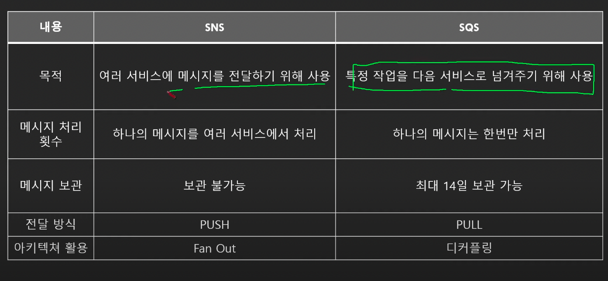

# AWS SNS & SQS

- 의문
- SNS vs SQS

## 의문

## SNS vs SQS

- SNS
  - 목적
    - 여러 서비스에 메시지를 전달하기 위해서 사용하는 notifier
  - 메시지 처리 횟수
    - 하나의 메시지를 여러 서비스에서 처리
  - 메시지 보관
    - 메시지 보관 불가능
  - 메시지 전달 방식
    - push
  - 활용
    - fan out
- SQS
  - 목적
    - 특정 작업을 다음 서비스에 넘겨주기 위해서 사용하는 큐
  - 메시지 처리 횟수
    - 하나의 메시지는 한 번만 처리(한번은 무조건 처리하게 보장 - standard queue)
  - 메시지 보관
    - 메시지 보관 가능
  - 전달 방식
    - pull
  - 활용
    - 서비스 간 디커플링
