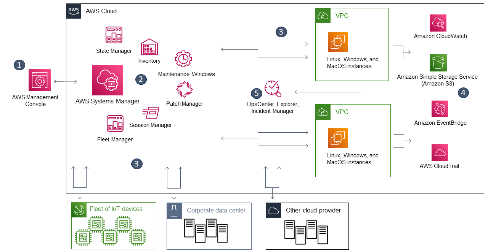

# AWS Systems Manager

## 의문

- *bastion은 어떤 경로로 rds에 접근하는 것인지?*
  - `nslookup`을 사용했을때에는, vpc내부의 private ip로 접근하는 것으로 보임
    - 해당 DNS는 어떻게 관리되는 것인지?
  - DNS resolution된 이후 해당 private ip(`172.31.18.66`)는 route table에 의하여 rds엔드 포인트와 연결됨
    - 해당 route table은 어떻게 관리되는 것인지?

## 개요

AWS Systems manager 프로세스 흐름



- 개요
  - AWS 클라우드에서 실행되는 애플리케이션 및 인프라를 관리하는 데 도움이 되는 기능 모음
- 위의 그림
  - 3
    - Systems manager가 IAM 유저, 그룹 또는 역할에 지정한 작업을 수행할 권한이 있는지 체크
    - 작업 대상이 관리형 노드인 경우, Systems(SSM) Agent가 작업을 수행
  - 4
    - 상태의 보고
  - 5
    - SSM의 운영 관리 기능(Explorer, OpsCenter), Incident Manager는 리소스의 이벤트나 오류에 대응하여 운영 데이터를 집계하거나 아티팩트를 생성
- SSM 기능
  - 애플리케이션 관리
    - 파라미터 스토어
  - 변경 관리
  - 노드 관리
    - session management
  - 운영 관리
    - cloudwatch dashboard
  - Quick Setup
  - 공유 리소스
    - documents
      - SSM가 수행하는 작업의 정의

### SSM Agent

- 개요
  - EC2 인스턴스, 엣지 디바이스, 온프레미스 서버 또는 가상 머신에 설치 및 구성할 수 있고, Systems Manager와 통신하며 리소스 업데이트, 관리 및 구성 가능한 소프트웨어
- 특징
  - AWS 클라우드에 있는 Systems Manager 서비스로부터 요청을 처리한 다음 이를 요청에서 지정한 것과 같이 실행함
    - 이후, SSM Agent에서 Amazon Message Delivery Service(`ec2messages`)를 사용하여 상태 및 실행 정보를 Systems Manager 서비스로 다시 보냄
  - 일부 AMI는 SSM Agent가 사전 설치된 인스턴스를 시작하도록 구성됨

## AWS Session Manager

- 개요
  - 종합 관리형 AWS Systems Manager의 기능으로, EC2 인스턴스, 엣지 디바이스, 온프레미스 서버 및 VM을 관리 가능
    - 브라우저 기반 셸 or AWS CLI 사용 가능
- 특징
  - 중앙 집중식 액세스 제어
    - 관리형 노드에 대한 액세스 권한을 부여하고 취소 가능
  - 인바운드 포트 열고, SSH키를 관리할 필요 없음
  - 보안성과 감시 가능성을 갖춘 노드 관리 가능
    - AWS CloudTrail
    - AWS S3
    - AWS CloudWatch Logs
    - AWS EventBridge, SNS
- c.f) Session
  - Session Manager를 사용한 관리형 노드 연결(양방향 통신 채널 기반)
  - 세션 연결 프로세스
    - 특정 유저가 세션을 시작하라는 첫 명령을 보냄
    - Session Manager 서비스에서 유저 ID를 인증하고, IAM 정책에 따라 유저에게 부여된 권한 확인, 후 SSM Agent에 양방향 연결을 열라는 메시지를 보냄
    - 연결이 설정되어 유저가 다음 명령을 입력하면, SSM Agent의 명령 출력이 이 통신 채널로 업로드되고, 다시 유저의 로컬 시스템으로 전송

### 사용 방법

- EC2의 생성
  - SSM Agent가 설치되어있음을 확인
  - Security group의 policy에서 아래의 egress 트래픽을 허용하여, SSM에 접근 가능하도록 해야 함
    - `ec2messages.region.amazonaws.com`
    - `ssm.region.amazonaws.com`
    - `ssmmessages.region.amazonaws.com`
  - IAM(`AmazonSSMManagedInstanceCore`) role 부여
    - 인스턴스에서 SSM 작업을 수행할 IAM role 부여
- 사용자나 그룹에 IAM role 부여
  - action `ssm:StartSession`, `ssm:TerminateSession`, `ec2-instance-connect:SendSSHPublicKey`(`aws-gate`를 쓰기 위함)
- aws cli및, aws-gate, 웹을 사용하여 접속

```sh
# ssh cluster
Host tada-prod-rds
  IdentityFile ~/.aws-gate/key
  IdentitiesOnly yes
  User ssm-user
  Port 22
  ProxyCommand sh -c "aws-vault exec prod --prompt=osascript -- aws-gate ssh-proxy -l ssm-user bastion"
  LocalForward 33306 prod-tada-rds.cluster-myauroracluster.ap-northeast-2.rds.amazonaws.com:3306
```

- c.f) aws-gate
  - CLI로부터 AWS SSM session을 열고, SSH ProxyCommand support를 함
- 위의 설정 해석
  - Proxy Server를 접근하기 위해서 현 local에서 ProxyCommand 실행
