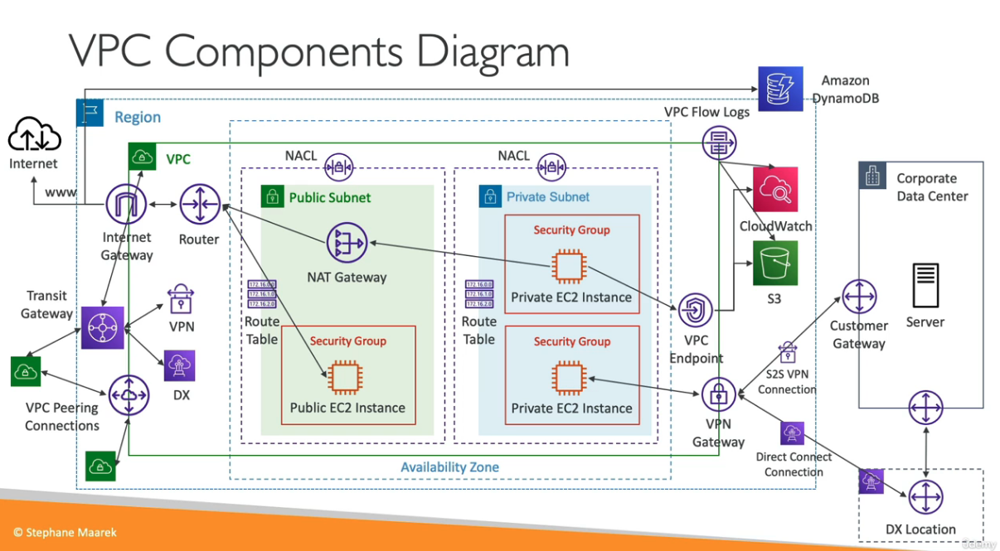
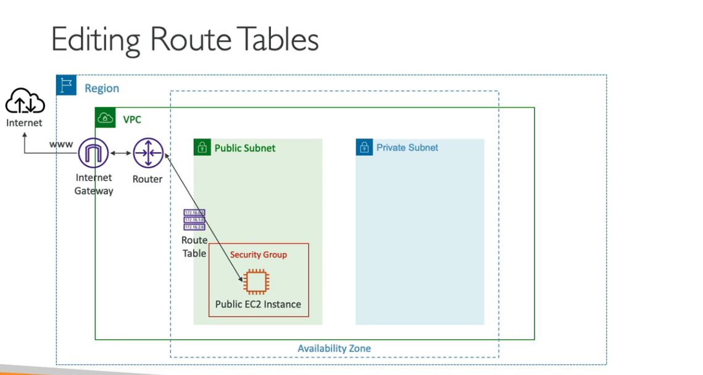
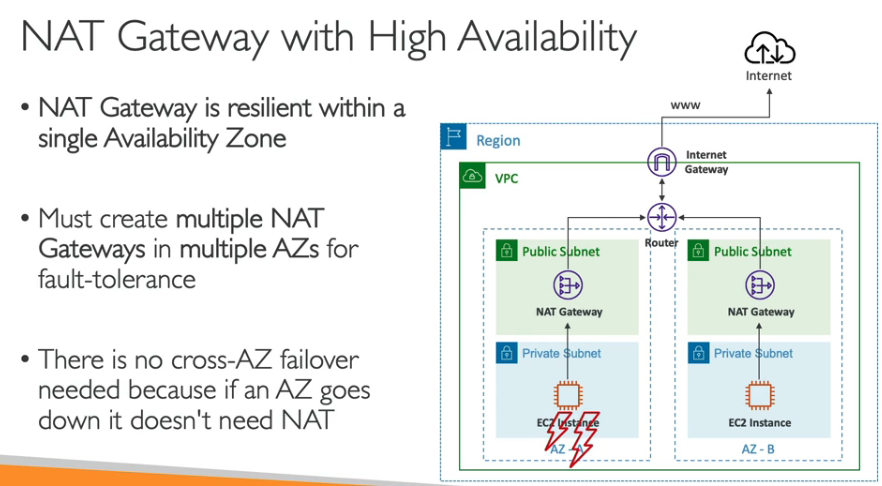

# AWS VPC

- 의문
- 개요
- VPC
  - Default VPC
- Subnet
- Internet Gateway
- Bastion hosts
- NAT Gateway

## 의문

## 개요

VPC 컴포넌트 다이어그램

- public IP
  - 아래 private IP제외하고 전부
- private IP
  - 10.0.0.0/8
    - 10.0.0.0 - 10.255.255.255
  - 172.16.0.0/12
    - 172.16.0.0 - 172.31.255.255
  - 192.168.0.0/16
    - 192.168.0.0 - 192.168.255.255

## VPC

- 개요
  - AWS내부의 서브넷의 클러스터
- 특징
  - region당 5개의 VPC를 갖을 수 있음
    - soft limit이어서 늘릴 수 있음
  - 하나의 VPC당 5개의 CIDR를 갖을 수 있음
    - CIDR 최소
      - /28
    - CIDR 최대
      - /16
  - VPC는 private이어서, IP range는 다음과 같음
    - 10.0.0.0/8
    - 172.16.0.0/12
    - 192.168.0.0/16

### Default VPC

- 개요
  - 모든 어카운트가 갖고 있는 기본 VPC
- 특징
  - EC2 인스턴스에서 subnet을 지정하지 않으면 default VPC로 설정됨
  - 인터넷과 연결되어있고, 해당 default VPC내부의 모든 EC2인스턴스는 퍼블릭 IPv4 주소를 갖음
  - public, private IPv4 DNS 이름도 갖음

## Subnet(IPv4)

- 개요
  - VPC에 존재하는 서브넷
- 특징
  - **각 서브넷에 5개(첫4개, 마지막1개)의 IP주소를 reserve해둠**
    - e.g) `10.0.0.0/24`의 경우
      - 10.0.0.0
        - 네트워크 주소
      - 10.0.0.1
        - VPC 라우터
      - 10.0.0.2
        - 아마존이 제공하는 DNS
      - 10.0.0.3
        - 미래 사용을 위해서 남겨둠
      - 10.0.0.255
        - Network broadcast address로, AWS는 VPC에서 boradcast를 사용하지는 않으므로, 일단 reserved

## Internet Gateway(IGW)

IGW와 Router의 관계

- 개요
  - VPC내부의 모든 리소스가 인터넷에 연결되도록 함
- 특징
  - 수평적 확장이 가능하고, 매우 available하고, redundant함
  - VPC와는 별개로 생성되어야 함
  - 하나의 VPC는 하나의 IGW를 부착할 수 있고, 하나의 IGW도 마찬가지로 하나의 VPC에만 적용 가능
  - IGW로만 인터넷이 가능하게 하주는게 아니라, Route table을 설정해줘야 함

## Bastion hosts

- 개요
  - private subnet에 존재하는 aws 자원에 접근하기 위한 public subnet에 존재하는 인스턴스
- 특징
  - 유저의 접속
    - Session manager를 통한 접속(추천)
    - ~port 22의 SSH 접속(비추)~
  - 다른 리소스에 접근
    - 각 리소스의 Security group은 bastion host의 Security Group의 접근을 허용해줘야 함

## NAT Gateway

NAT Gateway와 availability

- 개요
  - AWS가 관리하는 high bandwidth, high availability, 관리가 필요없는 NAT장치
- 특징
  - 과금은 사용량과 bandwidth로 결제됨
  - 특정 AZ에 생성되고, Elastic IP를 사용
  - 같은 subnet에서의 EC2 인스턴스는 사용 불가
  - IGW가 있어야 인터넷 통신 가능(Private Subnet => NATGW => IGW)
  - 5Gbps 밴드위스를 갖고, 45Gbps까지는 자동 스케일업
  - 프라이빗 서브넷에서 Route table의 룰을 설정해서 NAT GW로 트래픽을 전송 가능
