# AWS VPC

- 의문
- 개요
- VPC
  - Default VPC
- Subnet
- Internet Gateway
- Bastion hosts
- NAT Gateway
- Security Groups & NACL
- VPC Peering
- VPC Endpoints
- VPC Flow Logs
- Site to Site VPN, Virtual Private Gateway, Customer Gateway
- Direct Connect(DX)
- Transit Gateway
- Egress-only Internet Gateway
- 비용

## 의문

## 개요

VPC 컴포넌트 다이어그램

VPC 섹션 요약

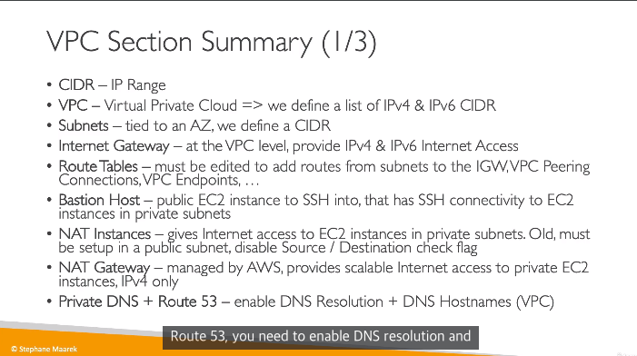

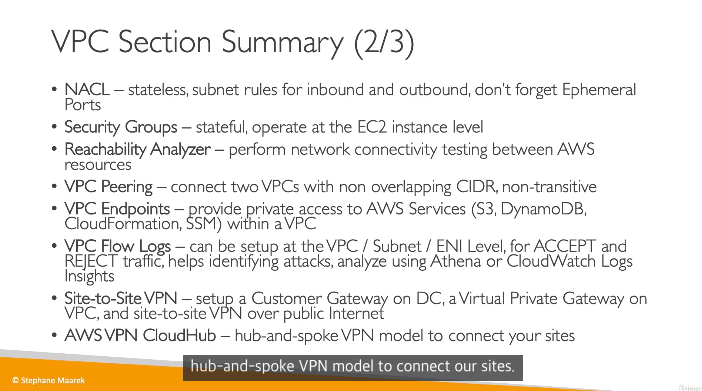

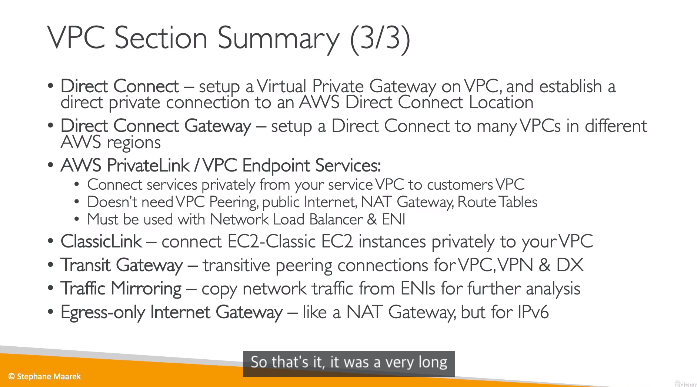

- public IP
  - 아래 private IP제외하고 전부
- private IP
  - 10.0.0.0/8
    - 10.0.0.0 - 10.255.255.255
  - 172.16.0.0/12
    - 172.16.0.0 - 172.31.255.255
  - 192.168.0.0/16
    - 192.168.0.0 - 192.168.255.255

## VPC

- 개요
  - AWS내부의 서브넷의 클러스터
- 특징
  - region당 5개의 VPC를 갖을 수 있음
    - soft limit이어서 늘릴 수 있음
  - 하나의 VPC당 5개의 CIDR를 갖을 수 있음
    - CIDR 최소
      - /28
    - CIDR 최대
      - /16
  - VPC는 private이어서, IP range는 다음과 같음
    - 10.0.0.0/8
    - 172.16.0.0/12
    - 192.168.0.0/16

### Default VPC

- 개요
  - 모든 어카운트가 갖고 있는 기본 VPC
- 특징
  - EC2 인스턴스에서 subnet을 지정하지 않으면 default VPC로 설정됨
  - 인터넷과 연결되어있고, 해당 default VPC내부의 모든 EC2인스턴스는 퍼블릭 IPv4 주소를 갖음
  - public, private IPv4 DNS 이름도 갖음

## Subnet(IPv4)

- 개요
  - VPC에 존재하는 서브넷
- 특징
  - **각 서브넷에 5개(첫4개, 마지막1개)의 IP주소를 reserve해둠**
    - e.g) `10.0.0.0/24`의 경우
      - 10.0.0.0
        - 네트워크 주소
      - 10.0.0.1
        - VPC 라우터
      - 10.0.0.2
        - 아마존이 제공하는 DNS
      - 10.0.0.3
        - 미래 사용을 위해서 남겨둠
      - 10.0.0.255
        - Network broadcast address로, AWS는 VPC에서 boradcast를 사용하지는 않으므로, 일단 reserved

## Internet Gateway(IGW)

IGW와 Router의 관계

- 개요
  - VPC내부의 모든 리소스가 인터넷에 연결되도록 함
- 특징
  - 수평적 확장이 가능하고, 매우 available하고, redundant함
  - VPC와는 별개로 생성되어야 함
  - 하나의 VPC는 하나의 IGW를 부착할 수 있고, 하나의 IGW도 마찬가지로 하나의 VPC에만 적용 가능
  - IGW로만 인터넷이 가능하게 하주는게 아니라, Route table을 설정해줘야 함

## Bastion hosts

- 개요
  - private subnet에 존재하는 aws 자원에 접근하기 위한 public subnet에 존재하는 인스턴스
- 특징
  - 유저의 접속
    - Session manager를 통한 접속(추천)
    - ~port 22의 SSH 접속(비추)~
  - 다른 리소스에 접근
    - 각 리소스의 Security group은 bastion host의 Security Group의 접근을 허용해줘야 함

## NAT Gateway

NAT Gateway와 availability

- 개요
  - AWS가 관리하는 high bandwidth, high availability, 관리가 필요없는 NAT장치
- 특징
  - 과금은 사용량과 bandwidth로 결제됨
  - 특정 AZ에 생성되고, Elastic IP를 사용
  - 같은 subnet에서의 EC2 인스턴스는 사용 불가
  - IGW가 있어야 인터넷 통신 가능(Private Subnet => NATGW => IGW)
  - 5Gbps 밴드위스를 갖고, 45Gbps까지는 자동 스케일업
  - 프라이빗 서브넷에서 Route table의 룰을 설정해서 NAT GW로 트래픽을 전송 가능

## Security Groups & NACL

*Statefulness는 무엇으로 판단하는 것인지? Application layer에서는 request, response가 구분되지만, Transport layer에서는 구분되지 않으므로, 즉 NACL은 Transport layer에서 동작하는 것인지?*

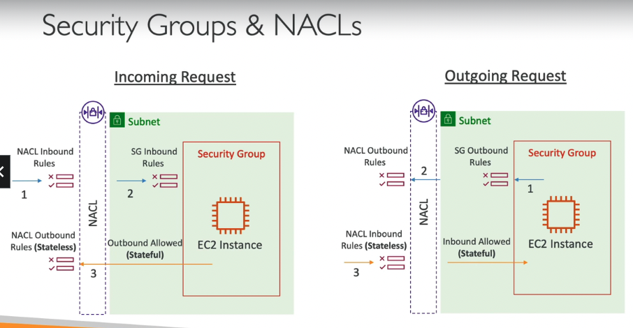

- NACL
  - 개요
    - 서브넷의 트래픽을 컨트롤하는 방화벽
  - 특징
    - stateless
    - Network layer
    - 하나의 서브넷당 NACL하나만 할당
    - 룰이 존재하며, 우선순위가 존재
      - `#100 ALLOW 10.0.0.10/32`이 `#200 DENY 10.0.0.10/32`보다 우선
    - 서브넷 레벨에서 IP 주소를 블로킹할 수 있음
    - 임시 포트를 사용하기 때문에 NACL에서 트래픽을 허용할 경우, 구간으로 함(1024 - 65535 등)
  - c.f) Default NACL
    - 모든 inboud/outbound를 연계한 서브넷 트래픽에 모두 받아들임
  - c.f) Ephemeral Ports(임시 포트)
    - 클라이언트는 서버의 defined port와 연결하고, 응답은 ephemeral port로 받는 것을 기대함
      - linux의 경우 32768 - 60999
- Security Groups
  - 개요
    - 인스턴스의 트래픽을 컨트롤하는 방화벽
  - 특징
    - stateful
      - request, response traffic을 트래킹해서 응답은 반드시 allow해줌
    - Transport layer

## VPC Peering

- 개요
  - 두개의 VPC를 AWS의 네트워크를 이용해서 사설 네트워크 망으로 연결하는 것
    - 마치 같은 네트워크인 것 처럼 사용 가능함
- 특징
  - CIDR가 겹치면 안됨
  - *transitive 하지 않음*
    - A <=> B 이고, B <=> C 이어도, A <=> C 하지 않음
  - 각 VPC의 서브넷의 route table을 업데이트 해줘야지 서로의 EC2 인스턴스들이 통신 가능
  - VPC 피어링을 다른 AWS 계정이나 리전과 맺을 수 있음
  - 피어링된 VPC에 있는 Security Group을 참조할 수 있음

## VPC Endpoints

VPC endpoint(option2)

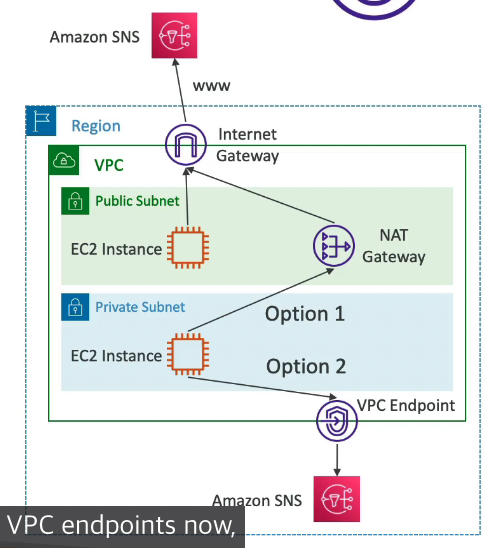

VPC endpoint types

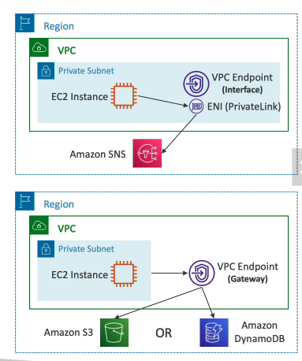

- 개요
  - 모든 AWS 서비스들은 public URL로 공개되어 있음
  - VPC Endpoints는 AWS 서비스를 private network를 사용해서 연결
    - IGW, NATGW 등이 필요 없음
  - redundant & scale horizontally
- 타입
  - interface endpoints
    - AWS 서비스에 ENI(private IP)를 provision함
      - security group을 반드시 부착해야 함
    - 비용
      - $ per hour + $ per GB of data processed
  - gateway endpoints
    - 게이트웨이를 provision하고, 해당 게이트웨이를 route table의 target으로 둬야 함
    - 서비스
      - S3, DynamoDB
    - 비용
      - 공짜

## VPC Flow Logs

VPC Flow Logs 문법

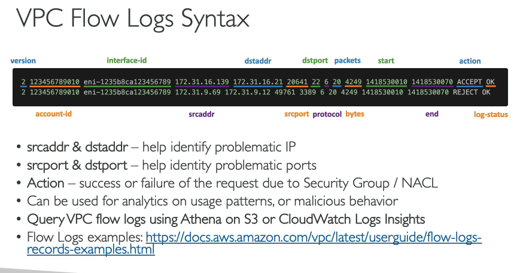

VPC Flow Logs 모니터링

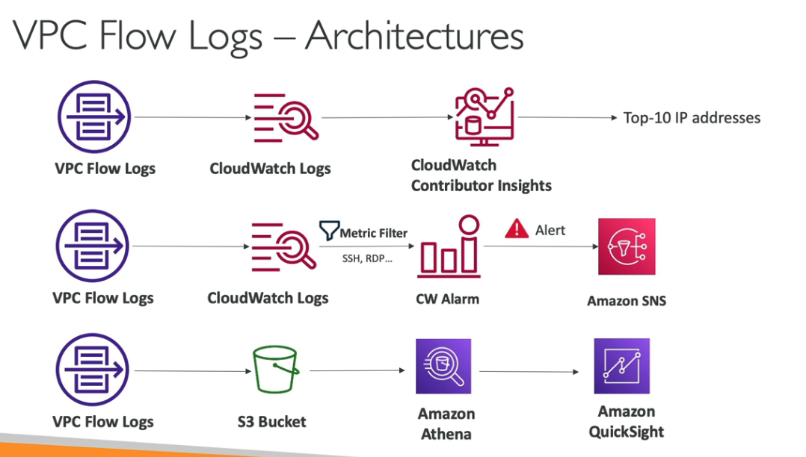

- 개요
  - 인터페이스로 들어가는 IP 트래픽을 캡쳐
    - VPC Flow Logs
    - Subnet Flow Logs
    - ENI Flow Logs
- 특징
  - 모니터링하거나 연결 이슈에 대한 트러블 슈팅할때 도움이 됨
  - Flow logs 데이터는 S3 혹은 CloudWatch 로그로 보내짐
  - AWS 매니지드 인터페이스로부터의 네트워크 정보도 캡쳐함
    - ELB, RDS, ElasticCache, NATGW 등
- 모니터링 방법
  - VPC Flow Logs -> CloudWatch Logs -> CloudWatch Contributor Insights
  - VPC Flow Logs -> CloudWatch Logs -> CloudWatch Alarm -> Amazon SNS
  - VPC Flow Logs -> S3 Bucket -> Amazon Athena(SQL) -> Amazon QuickSight

## Site to Site VPN, Virtual Private Gateway, Customer Gateway

Site to Site VPN connection

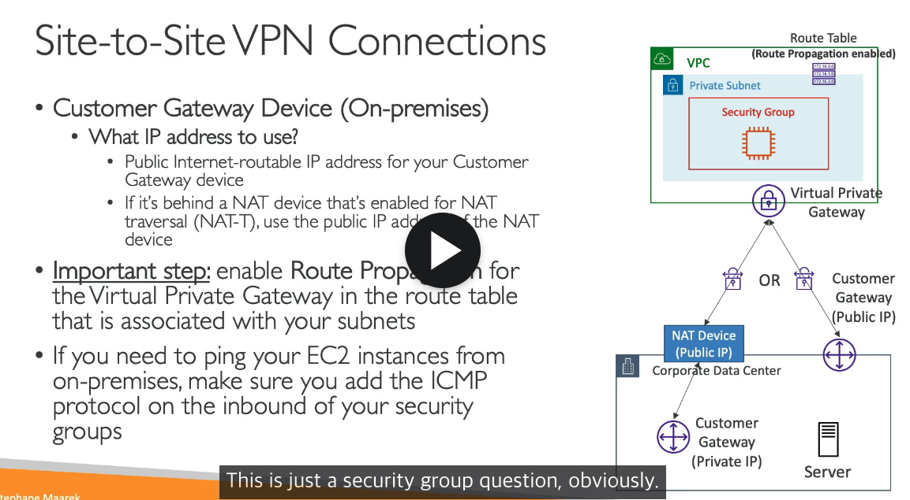

- 개요
  - AWS의 VPN Gateway와 사설 데이터센터의 Customer Gateway를 Site to Site VPN 커넥션으로 이어줄 수 있음
- 특징
  - internet을 사용하고, 암호화 되어있음
  - Virtual Private Gateway(AWS VPC쪽)
    - Route table 설정 해주기
    - Security group 설정 해주기
  - Customer Gateway Device(On-premises)
    - 인터넷에 연결된 IP 주소 할당해주기

## Direct Connect(DX)

Direct Connect

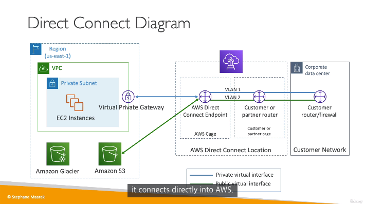

Multi Region Direct Connect

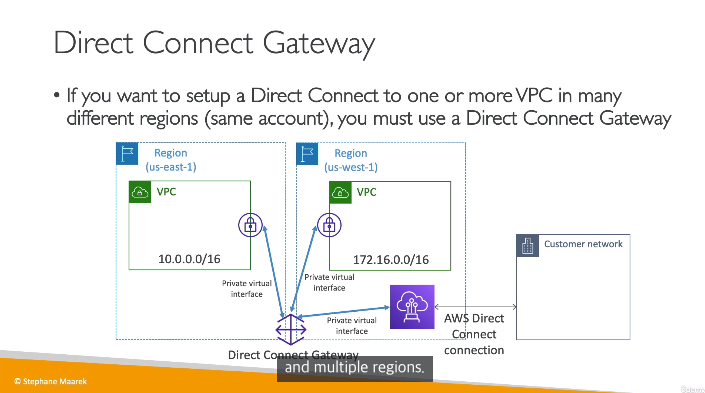

- 개요
  - 외부 네트워크에서 VPC로 사설 연결망을 제공 가능
    - DC와 AWS Direct Connect location을 연결
- 특징
  - VPC에 Virtual Private Gateway를 설정해야 함
  - bandwidth와 throughput에 유리함(large data)
  - consistent network(real time data)
  - 같은 계정의 여러 region에서 Direct Connect를 설정해야 하는 경우
    - Direct Connect Gateway를 반드시 이용해야 함
  - 설치하는데에 1달 이상이 걸릴 수도 있음
- 종류
  - Dedicated Connections
  - Hosted Connections
- 백업
  - DX를 사용하는 경우, DX연결이 실패하는 경우를 대비해서, site to site VPN을 backup으로 두는 경우도 존재함

## Transit Gateway

Transit Gateway의 예시

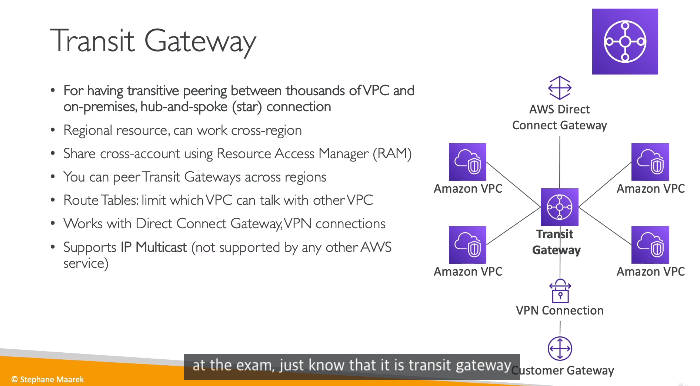

- 개요
  - 수천개의 VPC피어링과 on-remise gateway를 연결하기 위한 hub 게이트웨이
- 특징
  - regional 리소스여서, cross-region가능
  - cross account도 가능
  - route table로 VPC끼리의 커뮤니케이션을 정함
  - DX와 VPN연결 지원 가능
  - IP Multicast가능
- 활용
  - 1 수천개의 VPC피어링과 on-remise gateway를 연결하기 위한 hub 게이트웨이
  - 2 여러개의 VPN 성능 향상
  - 3 DX를 서로 다른 계정의 VPC와 연결하기 위함

## Egress-only Internet Gateway

VPC내부의 Egress Only Gateway의 설정 방식

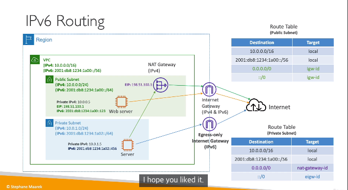

- 개요
  - VPC내부의 인스턴스가 IPv6 아웃바운드 커넥션만을(인바운드x) 맺을 수 있도록 하는 게이트웨이(IPv4의 NAT gateway와 유사)
    - Route table을 IPv4에서는 NAT Gateway로 보내듯이, egress-only Internet Gateway 업데이트가 필수

## 비용

NAT Gateway vs VPC Endpoint 비용 비교

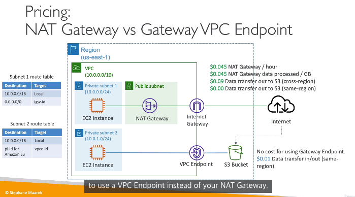

- VPC레벨에서 Inbound traffic은 일반적으로 무료, Outbound traffic을 줄이는 것이 효과적
  - 특히 같은 AZ로 두면 가격이 많이 줄어든다
- S3 비용
  - ingress
    - 무료
  - egress
    - $0.09/GB
    - Transfer Acceleration(50 - 500% 속도 향상)
      - egress기본료 + $0.04~0.08
  - S3 to CloudFront
    - 무료
  - CloudFront to Internet
    - $0.085
    - 캐싱 가능
  - Cross Region Replication
    - $0.02/GB
