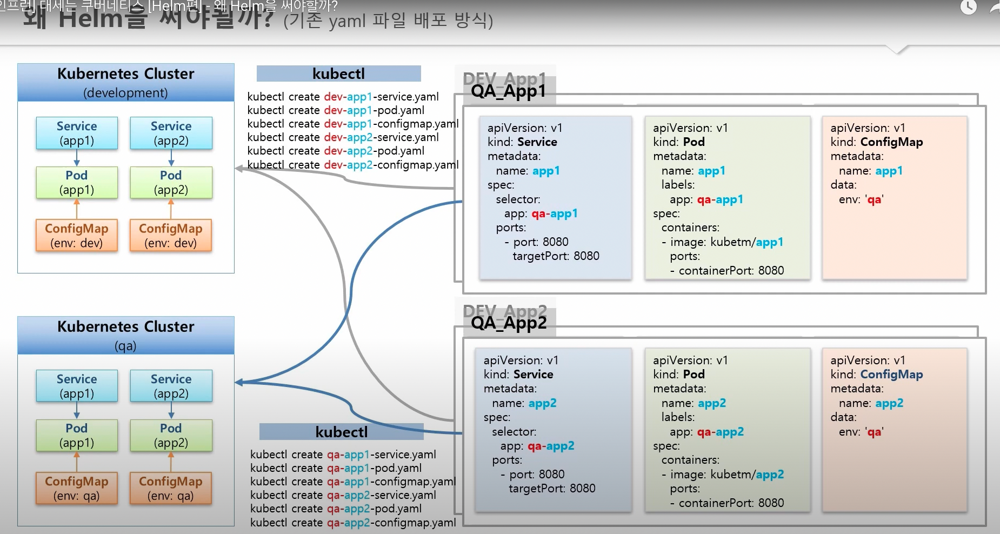
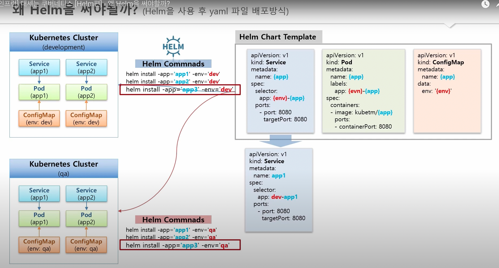
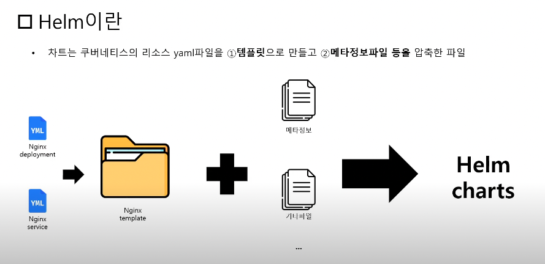

# Helm

- 의문
- 개요

## 의문

## 개요

헬름 차트를 사용해야하는 이유1: 앱별 / 환경별 yaml파일 관리가 쉬워짐





헬름 차트를 사용해야하는 이유2: 오픈소스(차트)들을 쉽게 쿠버네티스에 배포 가능


- 개요
  - 쿠버네티스 클러스터 패키지 관리 프로그램
  - 차트라는 패키징 포맷을 사용
- 장점
  - 앱별 / 환경별 yaml파일 관리가 쉬워짐
    - 단일 yaml템플릿을 만들어서, 변수 부분(앱별 / 환경별 다른 부분)만 명령어등으로 주입해주면 됨
  - 오픈소스들을 쉽게 쿠버네티스에 배포 가능
    - 제품별로 모듈을 나눠서 사용자가 필요한 모듈만 설치하게끔 함

### 차트

차트란



차트 파일 구조

```yaml
wordpress/
  Chart.yaml          # 차트에 대한 정보를 가진 YAML 파일
  LICENSE             # (옵션) 차트의 라이센스 정보를 가진 텍스트 파일
  README.md           # (옵션) README 파일
  values.yaml         # 차트에 대한 기본 환경설정 값들
  values.schema.json  # (옵션) values.yaml 파일의 구조를 제약하는 JSON 파일
  charts/             # 이 차트에 종속된 차트들을 포함하는 디렉터리
  crds/               # 커스텀 자원에 대한 정의
  templates/          # values와 결합될 때, 유효한 쿠버네티스 manifest 파일들이 생성될 템플릿들의 디렉터리
  templates/NOTES.txt # 옵션: 간단한 사용법을 포함하는 텍스트 파일
```

Chart.yaml 파일 내부

```yaml
# Chart.yaml
apiVersion: 차트 API 버전 (필수)
name: 차트명 (필수)
version: SemVer 2 버전 (필수)
kubeVersion: 호환되는 쿠버네티스 버전의 SemVer 범위 (선택)
description: 이 프로젝트에 대한 간략한 설명 (선택)
type: 차트 타입 (선택)
keywords:
  - 이 프로젝트에 대한 키워드 리스트 (선택)
home: 프로젝트 홈페이지의 URL (선택)
sources:
  - 이 프로젝트의 소스코드 URL 리스트 (선택)
dependencies: # 차트 필요조건들의 리스트 (optional)
  - name: 차트명 (nginx)
    version: 차트의 버전 ("1.2.3")
    repository: 저장소 URL ("https://example.com/charts") 또는 ("@repo-name")
    condition: (선택) 차트들의 활성/비활성을 결정하는 boolean 값을 만드는 yaml 경로 (예시: subchart1.enabled)
    tags: # (선택)
      - 활성화 / 비활성을 함께하기 위해 차트들을 그룹화 할 수 있는 태그들
    enabled: (선택) 차트가 로드될수 있는지 결정하는 boolean
    import-values: # (선택)
      - ImportValues 는 가져올 상위 키에 대한 소스 값의 맵핑을 보유한다. 각 항목은 문자열이거나 하위 / 상위 하위 목록 항목 쌍일 수 있다.
    alias: (선택) 차트에 대한 별명으로 사용된다. 같은 차트를 여러번 추가해야할때 유용하다.
maintainers: # (선택)
  - name: maintainer들의 이름 (각 maintainer마다 필수)
    email: maintainer들의 email (각 maintainer마다 선택)
    url: maintainer에 대한 URL (각 maintainer마다 선택)
icon: 아이콘으로 사용될 SVG나 PNG 이미지 URL (선택)
appVersion: 이 앱의 버전 (선택). SemVer인 필요는 없다.
deprecated: 차트의 deprecated 여부 (선택, boolean)
annotations:
  example: 키로 매핑된 주석들의 리스트 (선택).
```

- 개요
  - 쿠버네티스 패키지 매니저
  - 쿠버네티스의 오브젝트 yaml파일을 템플릿으로 만들고 메타정보파일 등을 압축한 파일
    - 특정한 디렉터리 구조 속 파일들의 컬렉션으로 구성됨
    - e.g) `wordpress/`
      - `Chart.yaml`
      - `values.yaml`
      - `templates/`
- 저장소
  - artifacthub(~ dockerhub)
- 명령어
  - `helm install [이름] [경로]`
    - 차트를 k8s로 배포

### 템플릿

- 개요
