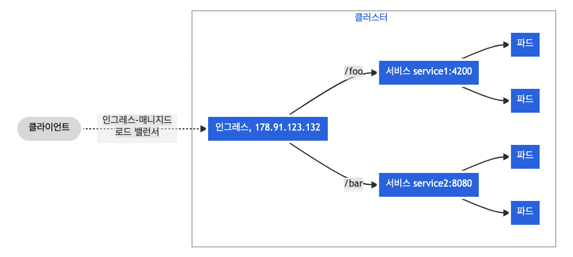

# Ingress

- 의문
- 개요
  - 인그레스 클래스

## 의문

## 개요

인그레스 팬아웃



위의 팬아웃 설정

```yaml
apiVersion: networking.k8s.io/v1
kind: Ingress
metadata:
  name: simple-fanout-example
spec:
  rules:
  - host: foo.bar.com
    http:
      paths:
      - path: /foo
        pathType: Prefix
        backend:
          service:
            name: service1
            port:
              number: 4200
      - path: /bar
        pathType: Prefix
        backend:
          service:
            name: service2
            port:
              number: 8080
```

- 개요
  - 클러스터 외부에서 클러스터 내부 서비스로 HTTP와 HTTPS 경로를 노출함
- 구성 오브젝트
  - 인그레스
    - 클러스터 외부에서 내부 서비스로 매핑하는 쿠버네티스 오브젝트
  - 인그레스 컨트롤러
    - 인그레스를 직접 동작시키는 구현체
  - 인그레스 클래스
    - 인그레스 컨트롤러를 이름으로 매핑시킨 쿠버네티스 오브젝트
      - 이 이름을 가지고, `ingressClassName`을 `Ingress` object spec에 명시해서 해당 컨트롤러를 사용하도록 함
        - `ingressClassName`이 ingress object spec에 지정되지 않으면 default를 사용하는데, 해당 ingress class 오브젝트에 `ingressclass.kubernetes.io/is-default-class: true`로 애노테이션이 설정되어있어야 함
        - `kubernetes.io/ingress.class` 애노테이션으로 ingress controller를 지정하는 것은 deprecated
- 특징
  - 일반적으로 애노테이션을 이용해서 컨트롤러에 따라서 옵션을 구성함
  - `pathType`
    - `ImplementationSpecific`
      - IngressClass의 구현체에 따라서 달라짐
        - `nginx-ingress`의 경우 `prefix`
    - `Exact`
      - URL 경로의 대소문자를 엄격하게 일치시킨다
    - `Prefix`
      - URL 경로의 접두사를 `/`기준으로 분리한 값과 일치시킨다.

### 인그레스 클래스

- 특징
  - 인그레스 컨트롤러의 종류에 따라, *클러스터 범위로 설정한 파라미터의 사용이 가능할 수도 있고, 또는 한 네임스페이에서만 사용 가능할 수 있음*
    - 정확히 무슨 의미인지?
