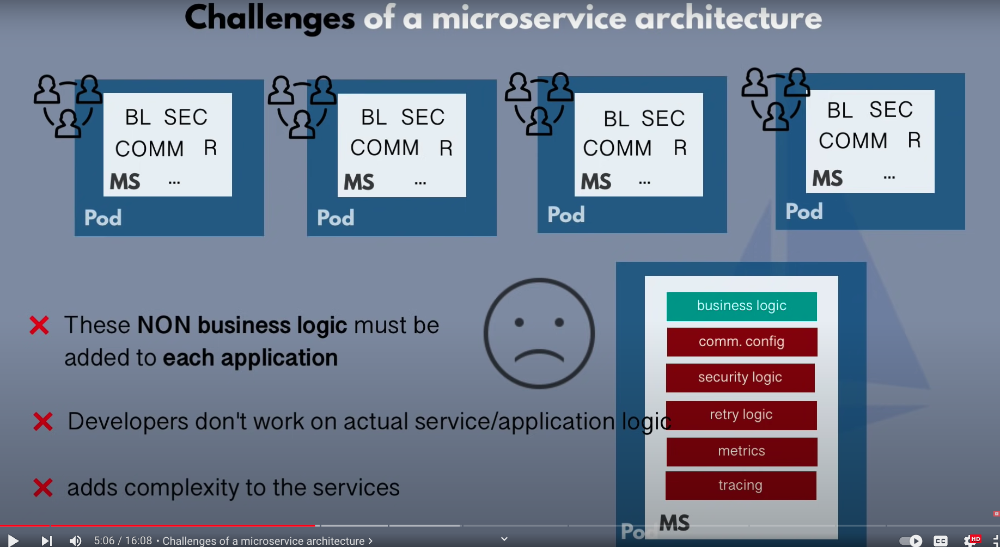
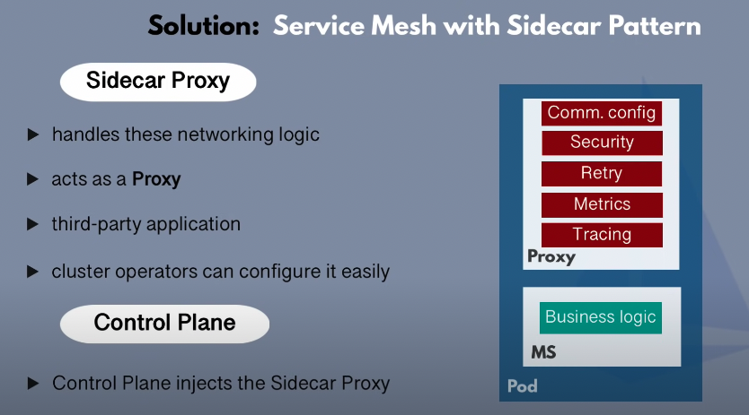
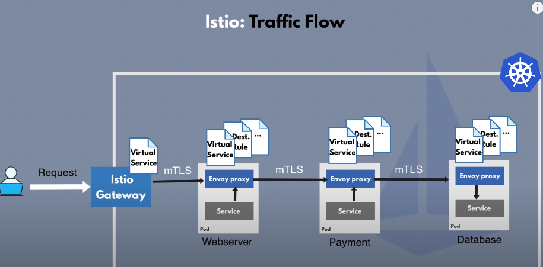
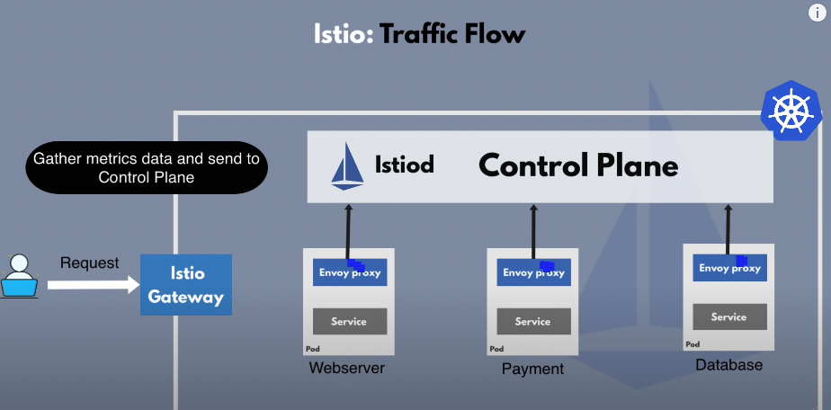
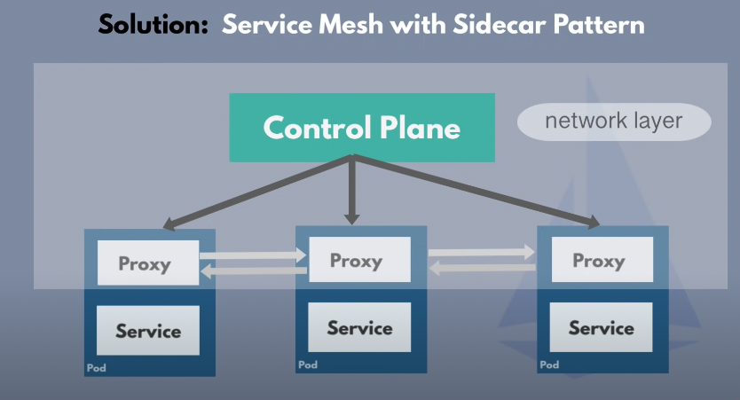
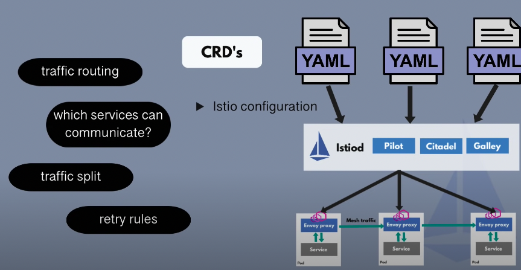
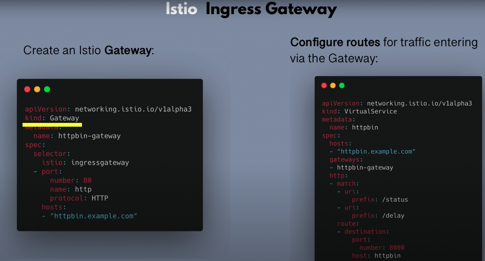

# Istio

- 의문
- 서비스메시
  - 마이크로서비스에서의 과제
  - 서비스메시
- Istio
  - Istio Gateway

## 의문

## 서비스메시

### 마이크로서비스에서의 과제

마이크로 서비스에서의 문제

- 과제
  - 서비스 디스커버리
  - 클러스터 내부의 보안
  - 리트라잉 로직
  - 메트릭 수집
  - 트레이싱
- 위와 같은 기능은 비즈니스로직이 아니지만 마이크로서비스 애플리케이션에 꼭 포함되어야 함
  - 마이크로서비스 애플리케이션이 복잡해짐

### 서비스메시

Istio 솔루션(sidecar 패턴)

- 개요
  - 마이크로서비스의 데이터를 공유하는 방식을 제어하는 패턴(패러다임)
    - istio는 구현체
- 서비스 메시의 솔루션(sidecar proxy)
  - side car 애플리케이션을 만들어서, 네트워킹 로직을 다루도록 함
  - 프록시로 동작하도록 함
  - 서드 파티 애플리케이션
  - 클러스터 오퍼레이터가 쉽게 설정할 수 있게 함
  - 개발자는 비즈니스로직에만 신경쓰게 함

## Istio

Istio의 전체적인 흐름: 서비스간 통신

Istio의 전체적인 흐름: 메트릭 수집

---

Istio의 구성

Istio의 아키텍처

- 구성
  - 컨트롤 플레인
    - proxy컨테이너를 각 팟에 주입
    - MS끼리는 proxy를 통해서 서로 상호작용 함
  - 데이터 플레인
- 기능
  - 트래픽 분할 & 설정
    - 카나리 배포를 가능하게 함
  - 서비스 디스커버리
    - 서비스와 그들의 엔드포인트의 내부 레지스트리가 됨
      - 새 마이크로서비스가 자동으로 등록됨
  - 보안
    - 마이크로 서비스 사이의 안전한 TLS 통신을 가능하게 함
  - 메트릭 & 트레이싱
    - 인보이 프록시로부터 메트릭 데이터를 규합함
- 아키텍처
  - 컨트롤 플레인
    - istiod
      - 설정, discovery, certificates
      - Pilot
        - 설정 discovery
      - Citadel
        - certificates
      - Galley
        - 설정
  - 데이터 플래인
    - envoy프록시의 집합
- 설정 방법
  - k8s의 다른 yaml파일을 건들 필요가 없고, 오직 istio CRD 설정만 수정하면 됨
    - CRD(Custom Resource Definition)
      - 다른 제3의 애플리케이션을 쿠버네티스로 제어가능하게 함. 즉, k8s api server나 kubectl을 통해서 제어가능
        - 쿠버네티스 yaml로 되어있음
      - e.g) Istio, Prometheus
  - 설정 종류
    - virtual service
      - 어떻게 트래픽을 destination으로 라우팅할 것인지
    - destination rule
      - *???*
  - 주의
    - istio는 고차원의 라우팅룰을 envoy-specific 설정으로 변환
    - 설정들은 프록시 사이드카로 전파됨
    - 각각의 proxy자체를 설정하는게 아니라, istiod를 설정함
      - 설정하면 프록시 사이드카로 전파함
      - 전파된 이후에는 컨트롤 플레인과 통신하지 않고, 설정된 룰을 가지고 프록시끼리 통신을 진행함

### Istio Gateway

Istio ingress gateway

- 개요
  - 클러스터의 엔드포인트 기능
    - 트래픽을 VirtualService를 사용해서 MS로 리다이렉트 시킴
