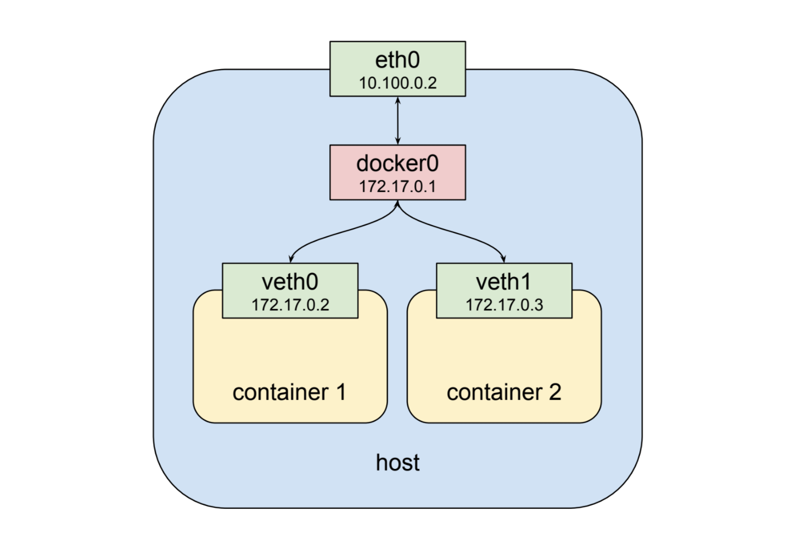
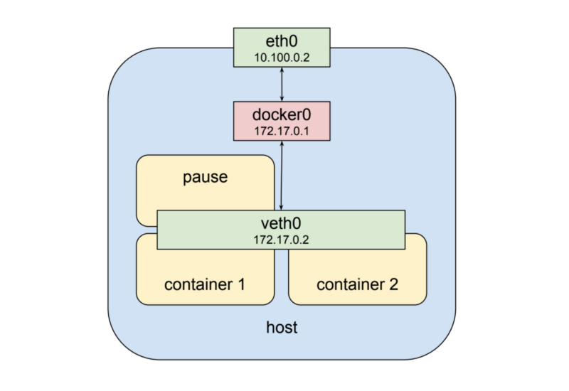
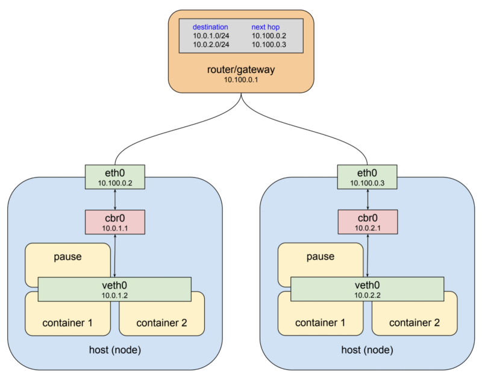
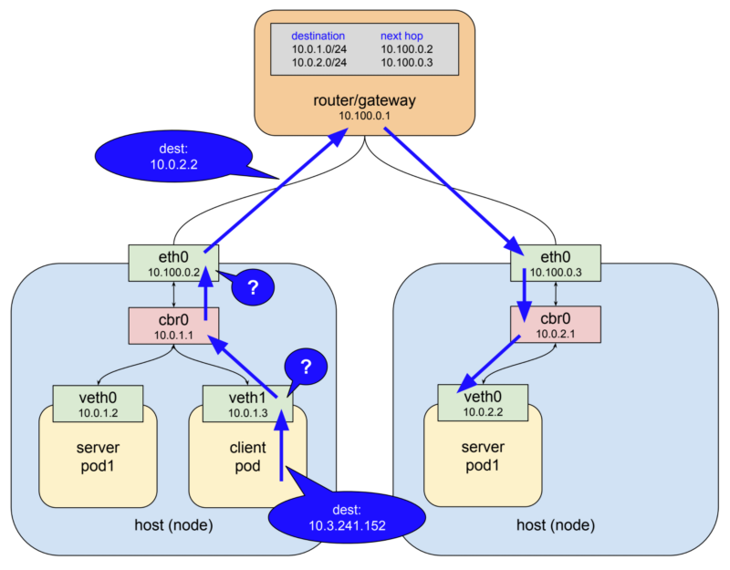

# 쿠버네티스 네트워킹 이해하기

- 의문
- 개요
- 1 팟 네트워킹 이해하기
  - 컨테이너와 네트워크
  - 컨테이너 사이의 가상 네트워크 공유(팟 네트워크)
  - 쿠버네티스의 팟 네트워크(다수의 노드)
- 2 서비스 네트워킹 이해하기
- 3 인그레스 네트워킹 이해하기

## 의문

## 참고

- [쿠버네티스 네트워킹 이해하기 시리즈](https://coffeewhale.com/k8s/network/2019/04/19/k8s-network-01/)
- [쿠버네티스 패킷의 삶](https://coffeewhale.com/packet-network1)

## 개요

- container, pod
- service
  - 팟들이 사용중에 다른 팟으로 교체되어도 문제 없게 만들어 줌
- ingress
  - 클러스터 외부에서 팟 안으로 트래픽이 어떻게 들어오는지

## 1. 팟 네트워킹 이해하기

### 컨테이너와 네트워크



- `eth0`
  - 호스트의 물리적 네트워크 인터페이스
    - NIC 이더넷 연결이라고 보면 됨(허브에 선이 꽂혀있는것을 상상하자)
- `docker0`
  - 컨테이너들의 네트워크를 연결하는 가상 브릿지
  - default gateway 역할을 수행
    - 별도의 라우트 명세가 없을 경우 호스트를 다른 네트워크로 포워딩 해주는 역할을 담당
    - 또 다른 네트워크로 연결해주는 역할을 담당하는 노드
- `veth0`
  - 컨테이너마다 할당되는 가상 네트워크
    - **컨테이너를 가상의 호스트라고 생각하면 자명하게 존재함**

### 컨테이너 사이의 가상 네트워크 공유(팟 네트워크)



- 설명
  - 같은 포트를 동시에 열 수 없음
  - 두개의 프로세스가 고립된 환경에서 독립되어있으나, 같은 네트워크 환경을 공유 가능
- `pause container`
  - 팟 내부의 서로 다른 컨테이너끼리, 바깥 네트워크와의 통신을 담당
  - 가상 이더넷을 생성하기 위한 컨테이너

### 쿠버네티스의 팟 네트워크(다수의 노드)



- 문제
  - 팟의 IP가 유일하지 않게 될 수도 있음
    - 그렇게되면, 하나의 팟에서 다른 팟으로 통신할 경우, 충돌이 일어날 수 있음
  - 팟으로 라우팅 하는 방법이 부재
- 해결
  - IP의 중앙 집권 관리
    - 각 호스트별로 subnet을 나눔
    - 즉, 각 노드 브릿지 IP가 서로 겹치지 않게 전체를 아우르는 주소 대역 할당
    - 각 브릿지에 실제 주소를 해당 주소 대역 안에서 할당
    - e.g)
      - 10.100.0.2호스트는 172.17.1.0/24 주소 대역만 사용
      - 10.100.0.3호스트는 172.17.2.0/24 주소 대역만 사용
  - 오버레이 네트워크(팟 네트워크) 설정
    - 가상 네트워크 인터페이스 + 브릿지 + 라우팅 룰의 조합
    - gateway에 어떤 패킷이 어떤 브릿지로 가야하는지 라우팅 테이블 설정
- 설명
  - `cbr`
    - k8s에서 사용하는 커스텀 브릿지(도커와는 다름)

## 2. 서비스 네트워킹 이해하기

- 팟 네트워킹의 문제
  - 팟의 IP를 알고 있으면 통신이 가능하나, 팟은 쉽게 대체될 수 있음
- 해결: 서비스
  - 리버스 프록시 도입
    - 서버 목록 관리
    - 살아있는 서버에 트래픽 전달
  - 리버스 프록시 요구사항
    - 프록시 서버 스스로 내구성 존재
    - 장애 대응가능
    - 트래픽 전달 서버 리스트 존재

### 서비스

Deployment 리소스에서 service를 정의

```yaml
kind: Deployment
apiVersion: extensions/v1beta1
metadata:
  name: service-test
spec:
  replicas: 2
  # 서비스의 selector
  # 레이블이 매칭되는 친구들을 프록시 해줌
  selector:
    matchLabels:
      app: service_test_pod
  template:
    metadata:
      labels:
        # 위의 service의 selector와 일치함
        app: service_test_pod
    spec:
      containers:
      - name: simple-http
        image: python:2.7
        imagePullPolicy: IfNotPresent
        command: ["/bin/bash"]
        args: ["-c", "echo \"<p>Hello from $(hostname)</p>\" > index.html; python -m SimpleHTTPServer 8080"]
        ports:
        - name: http
          containerPort: 8080
```

```
$ kubectl get service service-test**
NAME           CLUSTER-IP     EXTERNAL-IP   PORT(S)   AGE
service-test   10.3.241.152   <none>        80/TCP    11s
```

- 개요
  - 트래픽을 포워딩 해주는 프록시 역할을 하는 쿠버네티스 오브젝트
- 특징
  - `selector`라는 것을 이용하여 트래픽을 전달 받을 포드들을 결정함
    - 포드가 생성될 때, 레이블을 부여하여 선택할 수 있게 함
  - 서비스의 이름으로 DNS 이름으로 사용할 수 있음

### 서비스 네트워크 동작 예시



- 클라이언트 팟에서 다른 노드의 서버팟에 연결하는 경우(서비스 이용)
  - 클라이언트가 http request를 `service-test`라는 DNS이름으로 요청
  - kube-dns서버가 해당 이름을 service의 ip(e.g `10.3.241.152`)로 매핑
  - 클라이언트가 http request를 해당 ip로 요청
  - 가상 이더넷 인터페이스에서 IP를 봄
    - `10.3.241.152`에 대한 지식이 없어서 다음 게이트웨이로 넘김(`cbr0`)
  - `cbr0` 브릿지는 단순히 다음 네트워크 노드의 인터페이스로 전달
  - 노드의 eth0 대역대가 `10.100.0.0/24`이므로 `10.3.241.152`에 대한 지식이 없어서, 최상위 게이트웨이로 전달해야하나, 여기서는 그렇지 않고, kube-proxy에 의하여 server의 팟중 하나로 패킷이 전달되게 됨
    - service IP에 대한 인터페이스 디바이스가 존재하지 않음

### kube-proxy

- 개요
  - 리눅스 커널의 기능인 netfilter, 유저 스페이스에 존재하는 인터페이스인 iptables을 이용한 프록시
- c.f)
  - netfilter
    - 개요
      - 룰 베이스 패킷 처리 엔진
      - 커널 스페이스에 위치하며, 오고 가는 패킷의 생명주기를 관찰하고, 룰에 매칭되는 패킷을 발견하면 미리 정의된 액션 수행
      - destination 주소 변경 action도 가능

## 3. 인그레스 네트워킹 이해하기
