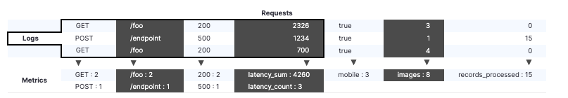

# Prometheus

- 의문
- 개요
  - 용어
  - 데이터 모델
  - 매트릭 타입
  - Job과 Instance
- 아키텍처
  - 프로메테우스 서버
    - DB
    - Data Retrieval worker
    - HTTP Server
  - 매트릭을 타겟으로부터 수집하는 법
- 모니터링 대상 & 매트릭
  - 매트릭
- 풀링 매커니즘
- 프로메테우스 설정
- Alert Manager
- PromQL

## 의문

## 모니터링

- 모니터링
  - 개요
    - 시스템의 내부에서 일어나는것을 아는 것
    - 모니터링 자체가 궁극적인 목표가 아니라 수단
      - 문제를 해결하고 디버깅하고 탐지하기 위함
      - 이러한 궁금적인 목표를 위하여, 로그와 매트릭을 수집
  - 예시
    - 얼마나 많은 트래픽을 받고 있는지
    - 어떤식으로 동작하는지
    - 에러가 얼마나 많은지 등

### c.f) 로그 / 매트릭 / 그래프

- 로그
  - 애플리케이션 로그
    - 주로 모니터링의 대상
    - 예시) 리퀘스트로그
      - 언제 엔드포인트가 호출되었고, 얼마나 처리하는데 걸렸고, 리턴 코드, IP주소
      - `127.0.0.1 - frank [10/Oct/2000:13:55:36 -0700] "GET /apache_pb.gif HTTP/1.0" 200 2326`
    - 중앙 ELK스택으로 모여지고 분석되고 aggregated됨
  - 시스템로그
    - `/var/log/syslog`
  - 바이너리 로그
    - `/var/log`
- 매트릭
  - 카운터
    - 우리가 탐지하고 싶은 이벤트가 생기면, 프로세스의 변수를 증가시키는 것
    - 예시) 수행되는 리퀘스트, 에러 발생 등
      - `api_http_request_total{method="post", code="200"} 5027`
      - `api_http_request_total{method="post", code="400"} 1023`
    - 일정한 시간마다 모든 매트릭의 현재의 값이 모니터링 시스템으로 축적
  - 게이지
- 그래프
  - 위의 두 수집 대상은 그래프를 생성할 수 있음

---

로그 vs 매트릭



- 로그
  - 장점
    - 개별 이벤트를 자세히 기록하여, 내용을 보다 정확히 파악 가능
  - 단점
    - 개별 이벤트가 포함되므로, 사용자나 기능이 증가함에 따라 처리해야 하는 로그의 양이 증가함
      - e.g) 초당 1000개의 요청마다 1KB씩 기록되는 10개의 서버가 100Mbit 연결의 대부분을 차지함
- 매트릭
  - 장점
    - 사용자가 가지고 있는 매트릭 수가 시스템 로드에 영향을 미침
      - 초당 요청의 양이 시스템 로드에 영향을 주지 않음
      - e.g) 한 서버마다 1,000,000 매트릭을 매 10초마다 보낼 수 있는 대역폭은 1리퀘스트마다 1KB로그 생성하는 매초 1000 리퀘스트를 100개의 매트릭으로 보내는 것의 대역폭과 같음
  - 단점
    - 이벤트 전반에 걸쳐서 aggreaged 상태를 유지하므로, 개별 요청을 자세히 파악 불가능
- **위의 두 수집대상은 서로 보완적으로 사용됨**
  - 매트릭은 시스템의 개괄적인 관점을 제공
    - 문제를 파악할때 가장 먼저 관찰할 대상
  - 로그는 좁지만 하나의 리퀘스트나 이벤트의 자세한 정보와 관점을 제공
    - 매트릭을 관찰하여 파악한 문제를 더 깊게 파고들때 로그 사용

## 개요

- 개요
  - 오픈소스 모니터링 & 얼럿팅 툴
    - 특히 컨테이너나 마이크로서비스 환경에서 주류가 됨
    - 쿠버네티스로부터 직접적으로 서포팅을 받음
- 장점
  - 시계열의 다차원 데이터 모델을 사용
  - HTTP Pulling으로 데이터를 쉽게 수집
    - 중개 게이트웨이를 사용해서 push방식도 서포트함
  - 데이터 수집 타겟이 서비스 디스커버리나 설정으로 발견될 수 있음
  - reliable
    - 다른 시스템이 잘 동작하지 않아도, 진단하기 쉬움
  - stand-alone and self-containing
    - 다른 서비스에 의존하지 않음
  - 구축이 쉬움
  - 쉽게 도커랑 쿠버네티스랑 연동 가능
- Pulling의 장점
  - 여분의 모니터링 인스턴스를 쉽게 만들 수 있음
    - 프로메테우스 서버를 어디서든 구축하고 풀링만 하면 되므로
  - 타겟이 다운 되었는지 쉽게 구분 가능
  - *웹 브라우저로 타겟으로 가서 직접 health를 알아볼 수 있음*
    - ???
- 단점
  - 스케일링 하기 힘듬
    - 아니다, 웬만하면 프로메테우스가 낫다
  - 매트릭을 저장해야하지, 로그는 저장하지 말라
    - Grafana loki를 사용하자

### 용어

- Alert
  - 프로메테우스가 firing하는 alerting rule의 결과
  - 프로메테우스 서버에서 Alertmanager로 쏴줌
- Alertmanager
  - Alert를 받아들여서, 취합하여 그루핑하고, 스로틀링해서 이메일이나 Pagerduty나 슬랙으로 보내주는 역할 담당
- Bridge
- Client library
- Collector
- Direct instrumentation
- Sample
  - 타임 시리즈의 특정 시간에서의 하나의 값
    - float64 & milisecond 타임스탬프
- Endpoint
- Exporter
  - 매트릭을 수집하기위한 대상 애플리케이션과 함께 실행되는 프로그램
  - non-prometheus format -> prometheus format 변환기 & 노출
- **Target**
  - 스크레이핑을 할 오브젝트의 정의(대상 + 방법)
    - 무슨 레이블을 적용할지
    - 연결하기 위한 인증
    - 스크레이핑을 어떻게 할지에 대한 정보
  - e.g)
    - `kube-state-metrics`
- Job
  - 같은 목적을 갖는 타겟의 집합
- Instance
  - 잡에서 타겟을 유니크하게 구별하는 레이블
- 쿠버네티스
  - Service
    - 타겟의 쿠버네티스 서비스
    - e.g)
      - `kube-prometheus-stack-kube-state-metrics`
      - `gryphon-server-api-driver`

### 데이터 모델

- 개요
  - 프로메테우스는 모든 데이터를 타임 시리즈(타임스탬프 + 매트릭의 스트림)로 저장
- 매트릭 이름과 레이블
  - 매트릭 이름
    - 모든 타임시리즈를 매트릭 이름 + 레이블로 식별함
    - 매트릭 이름은 아래의 regex를 만족해야 함
      - `[a-zA-Z_:][a-zA-Z0-9_:]*`
    - e.g)
      - `http_requests_total`
  - 레이블
    - 프로메테우스의 dimensional data model을 가능하게 함
      - 매트릭 이름 + 레이블 = 매트릭의 특정 차원의 데이터를 나타냄
    - 레이블 이름
      - `__`로 시작하고, 내부적인 사용으로 예약됨
    - e.g)
      - `<metric name>{<label name>=<labe value>, ...}`
      - `api_http_request_total{method="POST", handler="/messages"}`

### 매트릭 타입

프로메테우스 클라이언트 라이브러리가 제공하는 타입 -> 서버는 사용하지 않음(추후에 바뀔수도)

- 포맷
  - 사람이 읽을 수 있는 텍스트 데이터
- 구성
  - TYPE / HELP 속성
  - TYPE
    - 3가지 매트릭 타입
      - 카운터
        - 계속해서 증가하는 하나의 값
        - e.g)
          - 에러의 개수, 리퀘스트의 개수
      - 게이지
        - 증가하고 감소할 수 있는 하나의 값
        - e.g)
          - 현재 CPU 사용량, 현재 Disk 공간, 일정 기간의 동시 리퀘스트
      - 히스토그램(얼마나 길게 걸렸고, 얼마나 큰지?)
        - 관측값을 표본으로 추출하고 설정가능한 버킷에서 카운트함 & 관측된 모든 값의 함계 제공
          - 관측값의 누적 카운터
            - `<basename>_bucket{le="upper inclusive bound"}`
          - 관측값의 모든 값의 총합
            - `<basename>_sum`
          - 관찰된 이벤트의 수
            - `<basename>_count = <basename>_bucket{le="+Inf"}`
        - `histogram_quantile()`함수를 사용해서 quantile등을 구할 수 있음
        - e.g)
          - 리퀘스트 대기시간 or 응답 크기
      - 서머리
        - 히스토그램 + 타임 슬라이딩 윈도우
  - HELP
    - 그 매트릭이 무엇인지 기술

### Job과 Instance

```
job: api-server
  instance 1: 1.2.3.4:5670
  instance 2: 1.2.3.4:5671
  instance 3: 5.6.7.8:5670
  instance 4: 5.6.7.8:5671
```

- Instance
  - 스크래이핑 할 수 있는 엔드포인트
    - 일반적으로는 하나의 프로세스에 대응됨
- Job
  - 같은 목적을 갖는 인스턴스의 집합
    - e.g) 가용성과 확장성을 위해 복제된 프로세스들
- 자동 부여 레이블과 타임 시리즈
  - 프로메테우스가 타겟을 스크래이핑할 때, 스크래이핑 된 타임 시리즈에 몇몇 레이블을 구분할 목적으로 자동적으로 부착
    - `instance`
      - `<host>:<port>`
        - e.g) `172.31.46.26:8080`
    - `job`
      - 타겟이 속하는 설정된 잡 이름
        - e.g) `kube-state-metrics`
  - 프로메테우스는 각 스크래이프 인스턴스마다 다음 타임시리즈의 샘플을 저장
    - `up{job="<job-name>", instance="<instance-id>"} : 1 or 0`
      - 인스턴스의 가용성 모니터링에 유용
    - `scrape_duration_seconds{job="<job-name>", instance="<instance-id>"}`
    - `scrape_samples_post_metric_relabeling{job="<job-name>", instance="<instance-id>"}`
      - metric relabeling이 적용된 이후에 남은 샘플들의 수
    - `scrape_samples_scraped{job="<job-name>", instance="<instance-id>"}`
      - *타겟이 노출했던 샘플의 수*
    - `scrape_series_added{job="<job-name>", instance="<instance-id>"}`
      - *스크래이프에서 새 시리즈의 대략적인 숫자*

## 아키텍처

프로메테우스 아키텍처


- 프로메테우스 컴포넌트
  - 프로메테우스 서버
    - scrape / store
  - *클라이언트 라이브러리*
    - *애플리케이션 코드에 삽입(왜?)*
    - *알아서 pull해서 가져간다며?*
  - 푸시 게이트웨이
    - 짧은 기간동안 살아있는 job의 매트릭 수집을 위함
  - exporters
    - 매트릭을 서드파티 시스템으로부터 프로메테우스 매트릭으로 export해주는 프로그램들
      - 오피셜 / 논오피셜 존재
    - HAProxy, StatsD, Graphite, MySQL...
  - alertmanager
    - 얼럿을 통지함
  - 여러가지 다른 툴들

### 프로메테우스 서버

- Storage(DB)
  - local
  - remote(e.g RDB)
- Data Retrieval worker
  - pulling
  - save to storage
- HTTP Server
  - 쿼리를 받아서 데이터 돌려줌
  - PromQL 쿼리를 사용

### 매트릭을 타겟으로부터 수집하는 법

- 개요
  - 타겟으로부터 데이터를 풀링해옴(HTTP엔드 포인트)
- 엔드포인트
  - `hostaddress/metrics`
- 특징
  - 데이터는 반드시 올바른 형태여야 함
- exporter
  - 개요
    - 타겟으로 매트릭을 갖고 오고, 올바른 형태로 변경하고, `/metrics`엔드포인트로 expose하여 프로메테우스가 데이터를 갖고가게 함
    - 프로메테우스가 기본적으로 제공하는 여러 애플리케이션 exporter가 존재
      - e.g) `mysql`, `linux server`
      - 리눅스 서버의 경우
        - node exporter 다운로드
        - 실행
        - 서버의 매트릭을 변경하고
        - `/metrics`엔드포인트를 열어줌
        - 프로메테우스가 수집
      - 도커 이미지로 사용 가능
        - **사이드카 애플리케이션으로 배포 가능**

### 풀링 메커니즘(Data Retrieval worker)

프로메테우스 풀링 메커니즘


- c.f) 푸싱 모니터링 시스템
  - 예시
    - `Amazon Cloud Watch`
    - `New Relic`
  - 단점
    - 데이터 저장 서버에 큰 네트워크 부하를 일으킴
    - 모니터링이 보틀넥이 됨
    - 각 마이크로 서비스에 푸싱하기위한 소프트웨어를 설치하고 관리해야 함
- 풀링 모니터링 시스템
  - 장점
    - 다수의 프로메테우스 인스턴스가 매트릭을 풀링해갈 수 있음
    - 서비스가 동작하는지 더 잘 파악하고 인사이트를 얻을 수 있음

push gateway의 사용


- push gateway
  - 개요
    - 오직 짧은 시간동안에만 동작하는 애플리케이션의 경우 사용됨
      - e.g) 배치잡, 백업 등

## 모니터링 대상 & 매트릭

- 대상
  - 리눅스/윈도우 서버
  - 아파치 서버
  - 애플리케이션
  - 데이터베이스와 같은 미들웨어
- 대상의 매트릭
  - 서버
    - CPU
    - Memory/Disk Space Usage
    - Exception Count
    - Requests Count
    - Request Duration
  - 애플리케이션
    - 리퀘스트 개수
    - 익셉션 개수
    - 서버 리소스가 얼마나 사용됐는지
      - client 라이브러리를 이용해서 `/metrics` 엔드포인트를 열어줄 수 있음

## 프로메테우스 설정

프로메테우스 설정 예시

```yaml
global:
  scrape_interval: 15s
  evaluation_interval: 15s
rule_files:
  - "first.rules"
  - "second.rules"
scrape_configs:
  - job_name: prometheus
    static_configs:
      - targets: ['localhost:8080'] # localhost:8080/metrics
  - job_name: node_exporter
    scrape_interval: 1m
    scrape_timeout: 1m
    static_configs:
      - targets: ['localhost:9100']
```

- 언제 어떤 데이터를 스크레이핑 하는가?
- `prometheus.yaml`

## Alert Manager

Alert manager 구성


## PromQL

PromQL


- 개요
  - query target directly
  - or use grafana
    - 직접 PromQL을 사용해서 데이터를 보여줌
