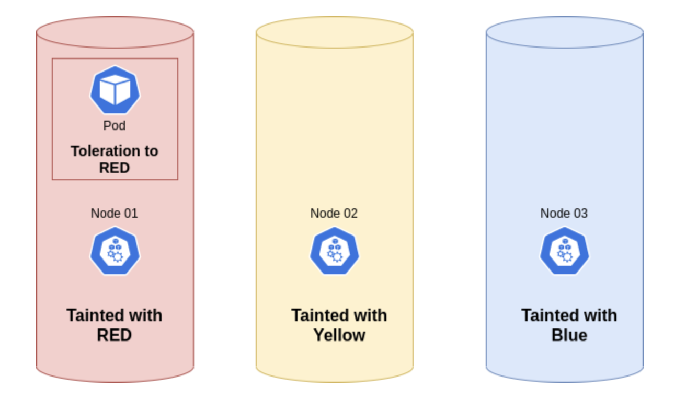

# 스케줄링, 선점(preemption), 축출(eviction)

- 의문
- 개요
- 테인트와 톨러레이션
  - 테인트 기반 축출
  - 컨디션을 기준으로 노드 테인트하기

## 의문

## 개요

## 테인트와 톨러레이션

테인트의 예시



톨러레이션 추가 예시

```yaml
# 일치하는 たいんt
apiVersion: v1
kind: Pod
metadata:
  name: nginx
  labels:
    env: test
spec:
  containers:
  - name: nginx
    image: nginx
    imagePullPolicy: IfNotPresent
  tolerations:
  - key: "key1"
    operator: "Equal"
    value: "value1"
    effect: "NoSchedule"
```

- 테인트
  - 개요
    - 노드에 설정하며, 노드가 팟을 제외할 수 있도록 함
    - 테인트를 설정한 노드는 팟을 스케줄링 하지 않고, 테인트를 설정한 노드에 팟을 스케줄링 하려면, 팟에 톨러레이션을 설정해야 함
      - 주로, 노드가 특정역할을 하도록 만들때 사용
  - 예시
    - GPU가 있는 노드에는 실제로 GPU 자원을 사용하는 팟들만 실행되도록 설정
  - 커맨드
    - 테인트 추가
      - `kubectl taint nodes node1 key1=value1:NoSchedule`
    - 테인트 제거
      - `kubectl taint nodes node1 key1=value1:NoSchedule-`
  - effect종류
    - `NoSchedule`
      - 톨러레이션 설정이 없으면 팟을 스케쥴링 하지 않음(기존 팟은 그대로 동작시킴)
    - `PreferNoSchedule`
      - 톨러레이션 설정이 없으면 팟을 스케쥴링 하지 않으나, 클러스터 자원이 부족하면 테인트를 설정한 노드에서도 팟을 스케쥴링 할 수 있음
    - `NoExecute`
      - 톨러레이션 설정이 없으면 팟을 스케쥴링 하지 않음(기존 팟도 톨러레이션 설정이 없으면 종료)
- 톨러레이션
  - 개요
    - 팟에 적용되며, 스케줄러는 일치하는 테인트가 있는 팟을 스케줄 가능하다고 판단
      - 스케줄을 허용하지만, 보장하지는 않음
  - 특징
    - 테인트를 용인하지 않는 팟은 즉시 축출
    - 톨러레이션 명세에 `tolerationSeconds`를 지정하지 않고 테인트를 용인하는 팟은 계속 바인딩
    - `tolerationSeconds`가 지정된 테인트를 용인하는 팟은 지정된 시간 동안 바인딩된 상태로 유지됨
    - 키와 이펙트가 동일한 경우에 테인트와 '일치'한다고 함
      - operator가 exists인 경우
        - 키만 같으면 됨
      - operator가 equal이고 value는 value로 같은 경우
    - 팟은 다수의 톨러레이션을 갖을 수 있고, 해당 톨러레이션들이 테인트를 필터링하지 못한게 있으면, 그 테인트가 적용됨
    - `tolerationSeconds`를 지정하면, 지정된 시간동안 바인딩된 상태가 되고, 그 이후에 축출됨

### 테인트 기반 축출

- 노드 컨트롤러는 노드의 특정 컨디션이 참일때 자동으로 노드를 테인트 시킴(`NoExecute`테인트 이펙트 활용)
  - `node.kubernetes.io/not-ready`
  - `node.kubernetes.io/unreachable`
  - `node.kubernetes.io/memory-pressure`
  - `node.kubernetes.io/disk-pressure`
  - `node.kubernetes.io/pid-pressure`
  - `node.kubernetes.io/network-unavailable`
  - `node.cloudprovider.kubernetes.io/uninitialized`
    - 외부 클라우드 공급자로 kubelet을 시작하면, 이 테인트가 노드에서 사용 불가능으로 표시되도록 설정됨
    - 클라우드 - 컨트롤러 - 관리자의 컨트롤러가 이 노드를 초기화하면, kubelet이 이 테인트를 제거
- 특징
  - 쿠버네티스는 사용자나 컨트롤러에서 명시적으로 설정하지 않으면, 자동으로 `node.kubernetes.io/not-ready`와 `node.kubernetes.io/unreachable`에 대해서 `tolerationSeconds=300`으로 톨러레이션을 추가함
    - 문제가 감지된 후 5분동안 팟이 노드에 바인딩된 상태 유지

### 컨디션을 기준으로 노드 테인트하기

- 개요
  - 컨트롤 플레인은 노드 컨트롤러를 이용하여 노드 컨디션에 대한 `NoSchedule`효과를 사용하여 자동으로 테인트 생성
    - 스케줄러는 스케줄링 결정을 내릴 때 노드 컨디션을 직접 확인하는것이 아닌, 테인트를 확인
      - e.g) `DiskPressure`노드 컨디션이 활성화 된 경우, 컨트롤 플레인은 `node.kubernetes.io/disk-pressure`테인트를 추가하고, 영향을 받는 노드에 새 팟을 할당하지 않음
  - 노드 컨디션을 무시하려면, `BestEffort`dldhldml QoS클래스를 갖는 팟에 `node.kubernetes.io/memory-pressure` 톨러레이션 추가
  - 데몬셋의 컨트롤러는 다음의 `NoSchedule`톨러레이션을 모든 데몬에 자동으로 추가하여 데몬셋이 중단되는것을 방해
    - `node.kubernetes.io/memory-pressure`
    - `node.kubernetes.io/disk-pressure`
    - `node.kubernetes.io/pid-pressure`
    - `node.kubernetes.io/unschedulable`
    - `node.kubernetes.io/network-unavailable`
