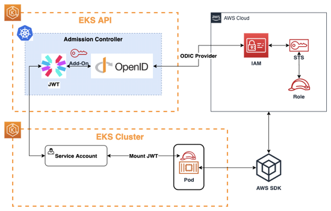

# 서비스 어카운트

- 의문
- 개요
  - IAM roles using service accounts(EKS)
  - 수동으로 생성

## 의문

- *IAM roles using service accounts(EKS)에서 projected volume mount된 토큰의 시간이 만료가되면 팟에 어떤 현상이 일어나는지?*
  - 재인증해주나?

## 개요

- 정의
  - 팟에서 실행되는 프로세스에게 컨트롤플레인의 API 서버를 사용할 수 있도록 id를 제공하는 오브젝트
    - 사람에게 부여하는 id는 유저 어카운트
- 특징
  - 각 namespace에는 반드시 `default` 서비스 어카운트가 존재
    - 명시하지 않으면 `default`서비스 어카운트 사용
  - `.spec.serviceAccountName`으로 서비스 어카운트 지정 가능
  - 생성시에만 지정 가능해서 이미 존재하는 팟에 업데이트 불가
  - `imagePullSecret`도 추가 가능
    - imagePullSecret을 생성(secret 오브젝트)
    - service account에 imagePullSecret을 추가
    - 새 팟에 imagePullSecret이 잘 붙었는지 체크
      - 팟에 설정된 `imagePullSecret`이 더 우선됨

### IAM roles using service accounts(EKS)

EKS에서 pod level IAM role을 service account로 사용하기 큰 그림



Role의 Trusted entities 예시

```json
{
    "Version": "2012-10-17",
    "Statement": [
        {
            "Sid": "",
            "Effect": "Allow",
            "Principal": {
                "Federated": "arn:aws:iam::451046188205:oidc-provider/oidc.eks.ap-northeast-2.amazonaws.com/id/07210EB908CE1106FFCA7206ADBE38D9"
            },
            "Action": "sts:AssumeRoleWithWebIdentity",
            "Condition": {
                "StringLike": {
                    "oidc.eks.ap-northeast-2.amazonaws.com/id/07210EB908CE1106FFCA7206ADBE38D9:sub": [
                        "system:serviceaccount:default:gryphon-server",
                        "system:serviceaccount:default:gryphon-server*"
                    ]
                }
            }
        }
    ]
}
# 해석
# 1. principal의 federated에서 지정된 provider에서 인증이 된 유저만 assume이 가능하다
# 2. 그 중에서도 "oidc.eks.ap-northeast-2.amazonaws.com/id/07210EB908CE1106FFCA7206ADBE38D9:sub" 가 다음과 같은 문자열 매칭 조건을 만족하는 경우에만 assume이 가능하다
```

- AWS의 기존의 인증 체계 대체
  - IAM role
    - EC2 node에만 부여 가능하므로 least privilege principle에 위배
  - `AWS_ACCESS_KEY_ID`, `AWS_SECRET_ACCESS_KEY` 환경변수를 k8s secret으로 마운팅
    - 키의 수명주기가 매우 김
    - 유출시 피해 발생
  - 새로운 방식의 인증이 필요함
- 개요
  - EKS클러스터를 OpenID인증 가능하게 해두고, IAM role을 OpenID를 이용해서 assume가능하게 설정하고, ServiceAccount과 팟을 연결시켜, 팟 레벨의 세분화되고 안전한 권한 부여를 하는 것
- 특징
    - 팟마다 별도 role 부여 가능
    - STS Token을 활용하여 키 관리 필요없음
    - 1~12시간 길이의 STS Token을 사용하여 키 노출 시에도 노출 범위 / 기간 최소화
- EKS의 팟에 적용하는 순서
  - 1 IAM <-> EKS Cluster 연결
    - *Create Provider*
      - *이게 뭐야?*
      - OpenID 연동하기
  - 2 IAM role 생성
    - web identity
    - trust relationship 수정
  - 3 k8s service account 생성 & IAM 정보 주입(IAM Role의 ARN)
    - `kind: ServiceAccount`
    - k8s의 service account는 자체적으로 secret을 생성해서 해당 secret의 내용(JWT)으로 EKS의 openID에 인증을 하고, 그 인증 결과로 인증의 증거인 JWT를 받아옴
    - 해당 JWT는 팟에 volume mount되어서 AWS cli나 AWS sdk가 자원을 접근하는데에 사용할 수 있게 함
  - 4 팟에 service account 연결(projected volume)
    - `serviceAccountName: ...`
  - 5 팟에 JWT가 연결된 것을 확인(볼륨 마운트)
  - 6 해당 JWT를 가지고 AWS cli나 sdk가 자원에 접근

### 수동으로 생성

```
k create token admin-user --duration ...
```
