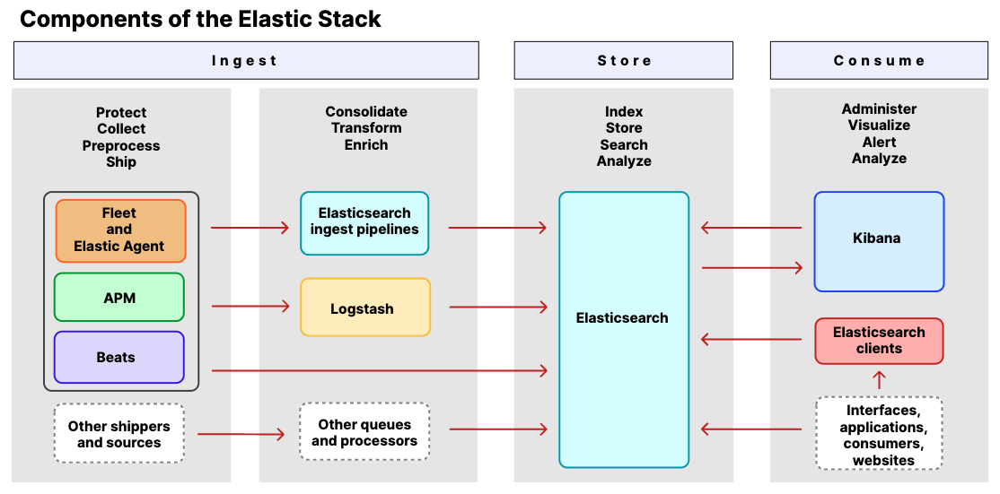

# Elastic Platform

- 의문
- ELK 스택
  - Ingest
  - Store
  - Consume
- 시스템 구조
  - 클러스터 구성
  - 인덱스와 샤드
  - 인덱스 용량 문제

## 의문

## ELK 스택

ELK 스택 아키텍처

- Ingest
- Store
- Consume

### Ingest

- 개요
  - Elastic Agent, Beats를 사용한 로그, 메트릭, 다른데이터의 수집후 전달하는 역할을 담당하는 컴포넌트
- 종류
  - Fleet and Elastic Agent
    - Elastic Agent
      - 로그, 메트릭, 다른 종류의 데이터를 호스트에 추가하는 통일된 방법
        - 호스트를 보안 위협으로부터 지키고, OS에서 데이터를 가져오기도 함
      - 각 에이전트는 정책을 갖음
        - 정책으로 새로운 데이터 소스와 연동할 수 있고, 보안성을 관리 가능
    - Fleet
      - Elastic Agent와 그것들의 정책을 중앙에서 관리하는 컴포넌트
        - 모든 Elastic Agent를 모니터링 하고, 정책을 관리하고, Elastic Agent 바이너리를 업그레이드 할 수 있음
  - APM
    - Elastic Stack에서 만들어진, 퍼포먼스 모니터링 시스템
      - 실시간으로 소프트웨어서비스와 애플리케이션을 모니터링 가능하게 함
        - 성능 이슈를 쉽게 고칠 수 있게 도와줌
      - 대상
        - response time, db 쿼리, 캐시 호출, 외부 HTTP 요청 등의 데이터 수집
  - Beats
    - Elastic search에 운영적인 데이터를 보내주기 위하여 서버에 에이전트로 설치되는 데이터 shipper
    - 대상
      - audit data, log files, journals, cloud data, availability, metrics, network traffic, Windows event logs
  - Elasticsearch ingest pipelines
    - 데이터를 ElasticSearch에 인덱싱하기 전에 변환해주는 역할
    - 하나 이상의 processor 태스크를 순차적으로 실행하도록 설정하여, Elasticsearch에 저장하기 전 documents에 변화를 가함
  - Logstash
    - 실시간 파이프라이닝을 할 수 있는 데이터 수집 엔진
    - 다양한 소스로부터 데이터를 동적으로 통합하고, 정규화할 수 있음

### Store

- Elasticsearch
  - 분산 검색 / 분석 엔진
- 특징
  - 준 실시간 검색 및 모든 타입의 데이터 분석 가능
    - structured, unstructured text, 수치 데이터, 지역 데이터 등의 데이터를 효율적으로 저장하고, 인덱스를 부여해서 빠른 검색 가능
  - REST API를 제공해서 데이터를 저장하고 뽑아올 수 있게 함

### Consume

- Kibana
  - es(elasticsearch)데이터를 이용해서 Elastic Stack을 매니징하기 위한 툴
    - analyze
    - visualize
- Elasticsearch client
  - API 리퀘스트와 리스폰스를 es로, 혹은 es로부터 쉽게 다룰 수 있도록 도와주는 클라이언트
    - Java, Ruby, Go, Python, ...

## 시스템 구조

### 클러스터 구성

클러스터 구성 예시

- 개요
  - 클러스터로 실행
    - 여러 노드로 클러스터 구성
      - `cluster.name`이 동일해야지 같은 클러스터로 실행됨
    - 포트
      - http
        - 9200 ~ 9299
      - tcp(노드간 데이터 교환)
        - 9300 ~ 9399
- 마스터 노드와 데이터 노드
  - 마스터 노드
    - 개요
      - 인덱스의 메타 데이터, 샤드의 위치와 같은 클러스터 상태정보를 관리하는 역할
    - 특징
      - 클러스터 내에 하나만 존재
      - 모든 노드가 마스터 후보 노드(`node.master: true`)
        - 마스터 노드 후보들도 마스터 노드의 정보들을 공유
        - 클러스터가 너무 커지면, 일부만 마스터 노드의 후보 노드로 해둘 수 있음
          - `node.master: false`로 두어서 마스터 노드의 역할을 하지 않도록 함
      - Split brain문제를 해소하기 위해서, 최소 3개이상 홀수개로 마스터 노드를 설정해야 함
  - 데이터 노드
    - 개요
      - 실제로 인덱싱된 데이터를 저장하고 있는 노드
    - 특징
      - 데이터 노드의 역할을 하지 않도록 하게
        - `node.data: false`

### 인덱스와 샤드

- 도큐먼트
  - 개요
    - 인덱싱될 수 있는 기본 데이터 단위
  - 특징
    - JSON형태
- 인덱스
  - 개요
    - 비슷한 특징을 지닌 도큐먼트를 모아놓은 집합
  - 특징
    - 인덱스가 갖고 있는 도큐먼트의 인덱싱, 조회, 업데이트, 삭제 연산을 시행
- 샤드
  - 개요
    - 자족적인 ES클러스터에서 다수의 노드로 분산되어서 저장되는 인덱스의 부분
      - 루씬의 단일 검색 인스턴스
  - 특징
    - 복제본은 replica라고 불림
    - 특정 노드가 다운되어도, 해당 노드가 가지고 있던 샤드를 새 노드에 다시 복사해서 넣어주고, 만약 새 노드가 뜨지 않으면 기존 노드에 나눠서 관리됨
      - 프라이머리 샤드가 유실된 경우에는, 남아있던 복제본이 프라이머리 샤드로 승격이 되고 다른 노드에 새로 복제본을 생성
    - 샤드의 개수는 처음 인덱스 생성시 설정 가능

#### 인덱스 용량 문제

- persistence volume 용량 문제
  - 직접 index rollover하기
    - `curl elasticsearch-master.monitoring:9200/_cat/aliases`
      - alias를 확인
    - `curl -X POST elasticsearch-master.monitoring:9200/apm-7.16.1-metric/_rollover`
      - index alias를 지정해서 rollover
    - elastic search에 들어가서 직접 인덱스 삭제
  - 자동으로 index rollover하기
    - 뭔가 잘 안되는 중(index policy를 지정해도..)
