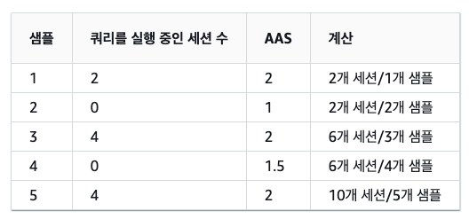
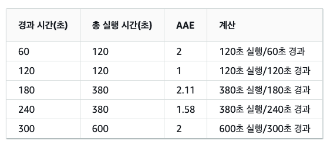
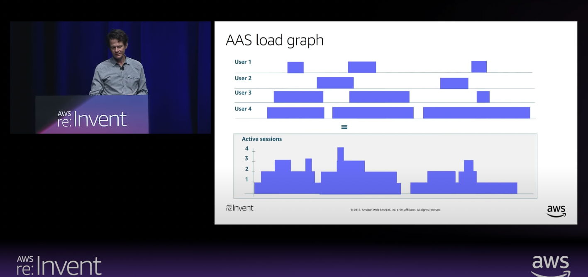
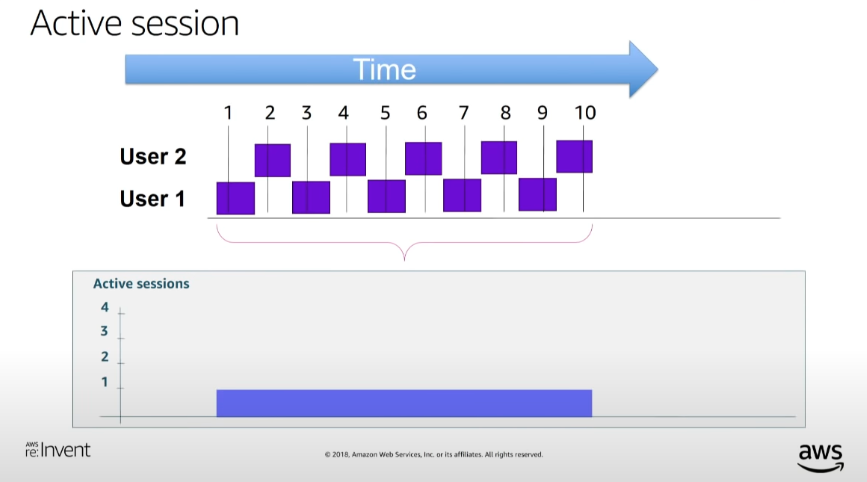
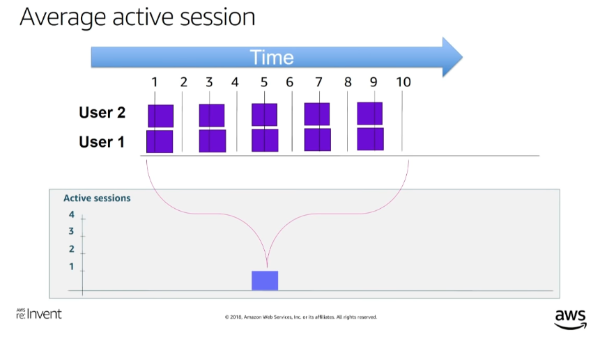
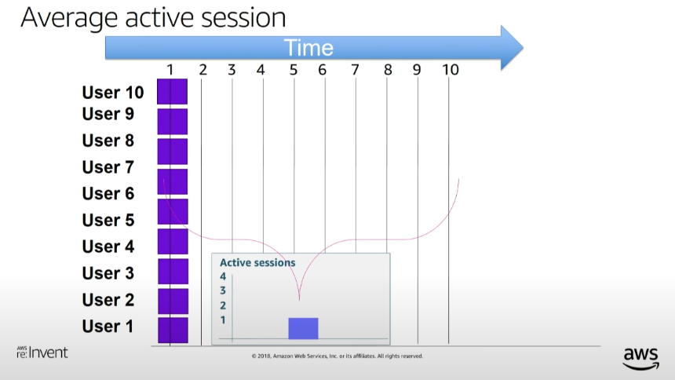
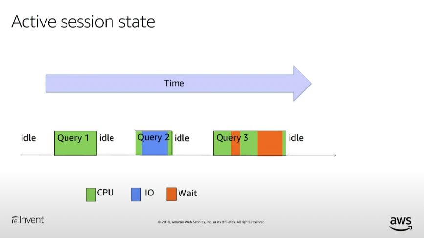

# AWS aurora performance insights

- 의문
- 개요
  - 데이터베이스 부하

## 의문

## 개요

### 데이터베이스 부하

평균 활성 세션(AAS)의 계산 예시

평균 활성 실행(AAE)의 계산 예시

AAS load graph

Active session

Average Active Session

Active Session State

- 활성 세션
  - 개요
    - DB 엔진에 작업을 제출하여 현재 응답 대기중인 연결 세션
    - CPU에서 실행중이거나, 리소스가 계속 진행될 수 있도록 대기중일때 활성화 됨
- 평균 활성 세션(AAS)
  - 개요
    - `일정 기간 동안(샘플링 시) 쿼리를 실행 중인 세션의 총 개수 / 쿼리를 동시에 실행하는 총 (세션의)샘플 횟수`
  - 특징
    - `DBLoad`에 대한 단위
- 평균 활성 실행(AAE)
  - 개요
    - `쿼리의 총 실행 시간 / 시간 간격`
- 측정기준
  - 대기 이벤트
    - 개요
      - 특정 이벤트가 발생할 때까지 기다리는 SQL 문
  - 상위 SQL
    - 개요
      - DB 로드에 가장 많이 기여하는 쿼리를 보여줌

### 대기 이벤트

- `cpu`
  - 이 이벤트는 스레드가 CPU에서 활성 상태이거나 CPU에 대해 대기 중일 때 발생합니다.
  - 원인
    - 분석 쿼리
    - 많은 동시 트랜잭션 수
    - 장기 실행 트랜잭션
    - 연결 수의 급격한 증가(로그인 스톰)
    - 컨텍스트 전환 증가
  - 최적화
    - `CALL mysql.rds_kill(processID);`
      - 너무 많은 자원 사용하는 세션 종료
    - `EXPLAIN`
      - 인덱스를 잘 타고 있는지 체크
    - `SHOW PROFILE`
    - `ANALYZE TABLE`
- `io`
  - `io/table/sql/handler`
    - 이 이벤트는 작업이 스토리지 엔진에 위임된 경우에 발생합니다.
      - I/O 워크로드 활동이 증가한 것을 나타냄
      - *스토리지 엔진이 CPU를 사용하는 경우에는 CPU가 아닌건지??*
        - *인덱스를 타지 않는 소팅 혹은 필터링 같은것인듯(그건 mysql engine에서 직접 처리하므로)*
  - `io/aurora_redo_log_flush`
    - 이 이벤트는 세션이 Aurora 스토리지에 영구 데이터를 쓸 때 발생합니다.
      - 데이터베이스가 너무 많은 커밋을 수행하는 경우 I/O 작업 대기 필요
      - batch로 insert하는것이, 하나하나 insert commit하는것 보다 훨씬 효율적
      - 줄이기 위한 방법
        - 쓰기 작업 그룹화
        - 자동 커밋 해제
        - 트랜잭션 사용
        - 배치 사용
          - `INSERT INTO ... VALUES (...), (...), (...)`
          - `UPDATE ... SET ... WHERE ...`
          - `DELETE FROM ... WHERE ...`
  - `io/aurora_respond_to_client`
    - 이 이벤트는 스레드가 결과 집합을 클라이언트에 반환하기 위해 대기 중일 때 발생합니다.
  - `io/file/innodb/innodb_data_file`
    - 이 이벤트는 스토리지의 I/O 작업에 대기 중인 스레드가 있을 때 발생합니다.
  - `io/socket/sql/client_connection`
    - 이 이벤트는 스레드가 새 연결을 처리하는 과정에 있을 때 발생합니다.
- `synch`
  - `synch/mutex/innodb/aurora_lock_thread_slot_futex`
    - 이 이벤트는 한 세션이 업데이트에 대해 행을 잠그고 다른 세션에서 동일한 행을 업데이트하려고 하는 경우 발생합니다.
    - 원인
      - 여러 DML 문이 동시에 동일한 행이나 행에 액세스 하고 있음
    - 최적화
      - optimistic lock을 사용하기
      - `innodb_lock_wait_timeout`값 설정하기
    - DEAD LOCK 원인 찾기
      - `SHOW ENGINE INNODB STATUS`
  - `synch/cond/mysys/my_thread_var::suspend`
    - 이 이벤트는 특정 조건에서 스레드가 대기 중이어서 해당 스레드가 일시 중지되는 경우 발생합니다.
  - `synch/cond/sql/MDL_context::COND_wait_status`
    - 이 이벤트는 테이블 메타데이터 잠금에 대기 중인 스레드가 있는 경우 발생합니다.
  - `synch/mutex/innodb/buf_pool_mutex`
    - 이 이벤트는 스레드가 메모리의 페이지에 액세스하기 위해 InnoDB 버퍼 풀에서 잠긴 경우 발생합니다.
  - `synch/mutex/innodb/fil_system_mutex`
    - 이 이벤트는 세션이 테이블스페이스 메모리 캐시에 액세스하기 위해 대기 중일 때 발생합니다.
  - `synch/mutex/innodb/trx_sys_mutex`
    - 이 이벤트는 트랜잭션 수가 많은 데이터베이스 작업이 많을 때 발생합니다.
  - `synch/rwlock/innodb/hash_table_locks`
    - 이 이벤트는 버퍼 캐시를 매핑하는 해시 테이블을 수정할 때 경합이 있는 경우 발생합니다.
  - `synch/sxlock/innodb/hash_table_locks`
    - 이 이벤트는 버퍼 풀에 없는 페이지를 파일에서 읽어야 할 때 발생합니다.
