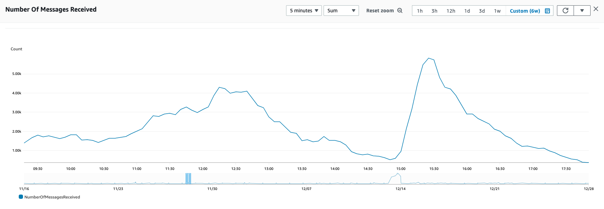

# SQS 지표

- 의문
- 개요

## 의문

## 개요

클라우드 워치의 모니터링 지표 예시(피크시)

클라우드 워치의 모니터링 지표 예시(NumberOfMessagesSent)

클라우드 워치의 모니터링 지표 예시(NumberOfMessagesReceived)

클라우드 워치의 모니터링 지표 예시(ApproximateNumberOfMessagesVisible)

클라우드 워치의 모니터링 지표 예시(ApproximateNumberOfMessagesDelayed)

- `ApproximateAgeOfOldestMessage`(초)
  - 개요
    - 대기열에서 가장 오래된 비삭제 메시지의 대략적인 사용 기간
      - 3회 이하로 수신한 두 번째로 오래된 메시지를 가리킴
  - 특징
    - 독약 메시지(여러 번 수신되었지만 삭제되지 않음)의 사용 기간은 포함되지 않음
    - 대기열에 리드라이브 정책이 있는 경우, 데드레터 큐로 이동한 시간이 표시됨
- `ApproximateNumberOfMessagesDelayed`
  - 개요
    - 지연되어 즉시 읽을 수 없는 메시지의 수
  - 특징
    - 애초에 지연 큐로 구성되었음
    - 지연 파라미터와 함께 전송되었을때 발생
- `ApproximateNumberOfMessagesNotVisible`
  - 개요
    - 이동중인 메시지의 수
  - 특징
    - 클라이언트에게 전송되었으나, 아직 삭제되지 않았음
    - visibility window의 끝에 도달하지 않은 메시지
    - USE method에서 Utilization을 나타냄
- `ApproximateNumberOfMessagesVisible`
  - 개요
    - 대기열에서 가져올 수 있는 메시지의 수
  - 특징
    - USE method에서 Saturation을 나타냄
- `NumberOfEmptyReceives`
  - 개요
    - 메시지를 반환하지 않은 `ReceiveMessage API` 호출의 수
      - 기본적으로, sqs는 롱폴링을 하는데, 해당 폴링의 결과로 메시지를 받지 않은 경우의 수를 일컬음
- `NumberOfMessagesDeleted`
  - 개요
    - 큐에서 삭제된 메시지의 개수
- `NumberOfMessagesReceived`
  - 개요
    - `ReceiveMessage`작업에 대한 호출로 반환된 메시지의 수
  - 특징 `NumberOfMessagesSent`보다 값이 클 수 있다(재시도로 인한)
    -
- `NumberOfMessagesSent`
  - 개요
    - 큐에 추가된 메시지의 수
- `SentMessageSize`
  - 개요
    - 큐에 추가된 메시지의 크기
