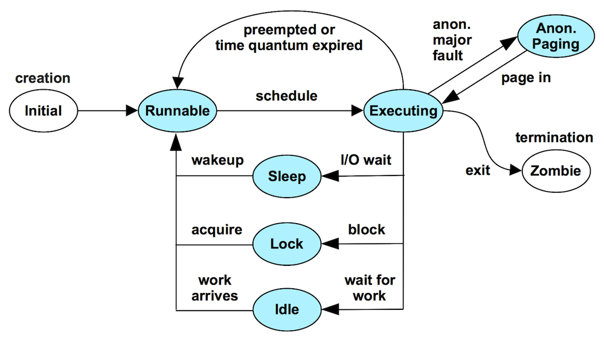

# TSA(Thread State Analysis) method

## 의문

## 개요

- 스레드란
  - OS의 실행가능한 엔티티(thread, task, process)
- TSA의 본질
  - 1 관심있는 스레드에 대해서, 각 스레드 상태에 존재하는 시간의 총합을 측정하고
  - 2 가장 많은 시간을 보내는 상태에서 적은 순으로 적절한 툴을 사용해서 조사한다

### 스레드의 상태

스레드의 라이프사이클

- Executing
  - on-CPU
    - user time
    - system time
- Runnable
  - waiting for a turn on-CPU
    - CPU saturation체크
- *Anonymous Paging(swapping)*
  - runnable, but blocked waiting for residency(swapping)
    - 메모리 saturation 체크
- Sleeping
  - I/O에 대기중
    - network
    - storage
    - other
      - data/text page-ins
      - syscall
- Lock
  - synchronization lock획득을 기다리는 중(다른 스레드 대기)
- Idle
  - 스레드가 실행할 일이 들어오길 기다리는 중
    - 파악하기가 힘들어서, TSA 메서드에서는 나머지 상태 중 가장 점유율이 높ㅇ느 상태를 계속해서 조사해나감

### c.f) 자바 스레드의 상태

c.f) 자바 스레드의 라이프사이클

- New
  - 스레드가 생성은 되었지만 동작이 시작되지는 않음
- Runnable
  - 실행 가능한 상태
    - 실행중인 경우
      - CPU를 wait하는중(wait queue에서 대기)
    - 실행중이 아닌 경우
      - 스레드 스케줄러(executor)가 아직 스케줄링을 하지 않은 경우
- Blocked
  - 스레드가 락을 획득하기위해서 일시 중지된 경우
- Waiting
  - 스레드가 다양한 이유로 대기중인 경우
  - e.g) `Thread.join`메서드를 timeout없이 호출
- Timed Waiting
  - Waiting이지만 timeout이 설정된 경우
  - e.g)
    - `Thread.join`메서드를 timeout을 설정해서 호출
    - `Thread.sleep`메서드 호출
- Terminated
  - 스레드가 실행이 완료된 경우, 제거되었을 때

### 사례 예시1

- 애플리케이션 퍼포먼스 이슈가 존재했음
- TSA 메서드를 따라서, 애플리케이션 스레드에 대해서 6개의 thread state time이 측정되었음
  - 대략 50%의 시간이 Runnable state였음(waiting for a turn on-CPU)
- 애플리케이션이 CPU limit으로 인해서 throttled 되었다는 것이 발견됨(cloud환경)
- CPU limit을 늘리고, 성능 이슈를 해결함

### 사례 예시2

- APM에서 time spent in MySQL이 큰 경우
- TSA를 따르면, MySQL의 스레드 상태가 중요함
  - 많은 시간을 Runnable상태에서 보내는 경우, MySQL 실행이 아닌, 다른 애플리케이션이나 tenant에 의해서 시간이 소모되는 것
