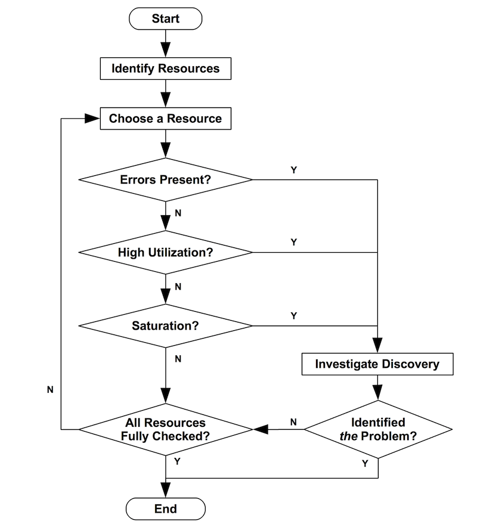
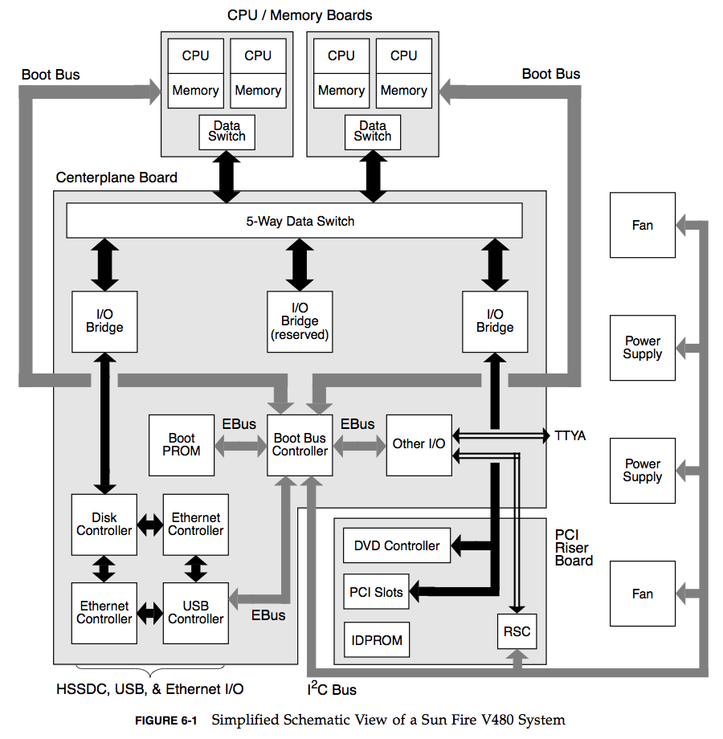

# USE(Utilization Saturation and Errors) Method

- 의문
- Use Method의 전략 플로우
- 개요
  - 리소스 리스트
    - 하드웨어 리소스에 대한 메트릭
    - 소프트웨어 리소스에 대한 메트릭
  - Functional Block Diagram

## 의문

## Use Method의 전략 플로우

Use Method 전략의 플로우

- functional block diagram을 그리자
- 보틀넥이 하나라는 생각을 버리자
- 각 discovery는 다른 방법론으로 더 깊게 파고 들어갈 수 있음

## 개요

- 정의
  - 빠르게 퍼포먼스 문제의 원인을 파악하기 위해서 모든 컴퓨팅 자원에 대해서 utilization, saturation, error를 체크하자는 방법론
    - resources
      - 물리적 서버의 기능적 컴포넌트(CPU, memory, disks, busses, ...)
    - utilization
      - 자원이 얼마나 사용되었는지 비율 or 일을 하는데에 바쁘게 사용된 평균 시간
        - 100%의 사용량은 보틀넥의 신호(saturation을 체크해야 함)
        - 높은 사용량(70%)도 문제가 될 수 있음
          - 사용량을 상대적으로 긴 기간동안 측정했다면, 평균은 70%여도, 짧은 시간에는 100% 사용량을 기록할 수도 있음
          - 하드 디스크와 같은 일부 시스템 리소스는 작업 중에 중단될 수 없으며, 우선순위가 높은 작업의 경우에도 사용량이 70%가 넘으면 대기열 지연이 더욱 빈번해지고 눈에 띄게 됨
      - e.g) 디스크가 90% 사용량을 기록하고 있다
    - saturation
      - 리소스가 처리할 수 없는(종종 큐잉되는) 정도
        - 값이 0 이상이면 문제가 됨
        - wait queue의 크기, 큐에서 대기하는 시간으로 측정됨
      - e.g) CPU의 평균 대기열 길이는 4이다
    - errors
      - 에러 이벤트의 개수
        - 값이 0 이상인경우 조사할 가치가 있음
      - e.g) 네트워크 인터페이스가 50회의 늦은 충돌이 있었다(late collisions)
- 개요
  - 시스템의 퍼포먼스 분석을 쉽게 하기 위한 방법론(퍼포먼스 문제가 생겼을시)
    - 저자에 따르면 대략 80%의 서버이슈를 5%의 노력을 들여서 해결 가능하다고 함
- 특징
  - 낮은 utilization이더라도, 짧은 시간간격에서는 saturation이 매우 높을 수도 있음
    - e.g) 5분 간격의 CPU 사용량은 80% 이상이 된 적이 없지만, 몇초 간격에서는 100%의 CPU 사용량을 기록하는 케이스

### 리소스 리스트

- 하드웨어
  - CPUs: sockets, cores, hardware threads (vCPUs)
  - Memory: capacity
  - Storage devices: I/O, capacity
  - Network interfaces
  - Controllers: storage, network cards
  - Interconnects: CPUs, memory, I/O
- 소프트웨어
  - mutex locks
  - thread pools
  - process/thread capacity
  - file descriptor capacity
- c.f) DB

#### 하드웨어 리소스에 대한 메트릭

- CPU
  - utilization
    - CPU 사용량(per CPU 혹은 시스템 전체에 대한)
  - saturation
    - run-queue의 길이, 스케쥴러의 레이턴시
- Memory
  - utilization
    - 사용가능한 free memory
  - saturation
    - major page fault(swapping)
- Storage device I/O
  - utilization
    - 디바이스의 busy percent
  - saturation
    - wait queue의 길이
  - errors
    - 디바이스 에러
- Network interface
  - utilization
    - rx/tx throughput
      - receive, transmit
  - saturation
    - dropped rx/tx 패킷 개수

#### 소프트웨어 리소스에 대한 메트릭

- mutex locks
  - utilization
    - 락이 잡힌 시간
  - saturation
    - 락을 기다리는 스레드의 개수
- thread pools
  - utilization
    - 일을 하는 스레드의 시간
  - saturation
    - 스레드 풀에서 작업되기를 기다리는 리퀘스트의 수
- process/thread capacity
  - utilization
    - 스레드나 프로세스의 현재 사용량
  - saturation
    - 할당을 기다리는 스레드의 개수
  - errors
    - 할당이 실패한 경우
- file descriptor capacity
  - utilization
  - saturation

### Functional Block Diagram

Functional Block Diagram의 예시

- 개요
  - 데이터 흐름을 따라서 시스템의 보틀넥을 찾기에 좋음
