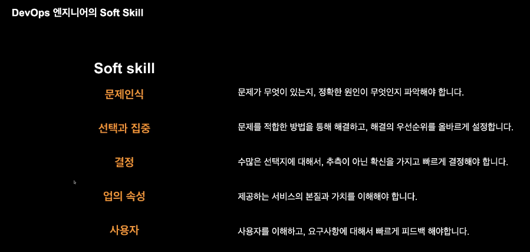
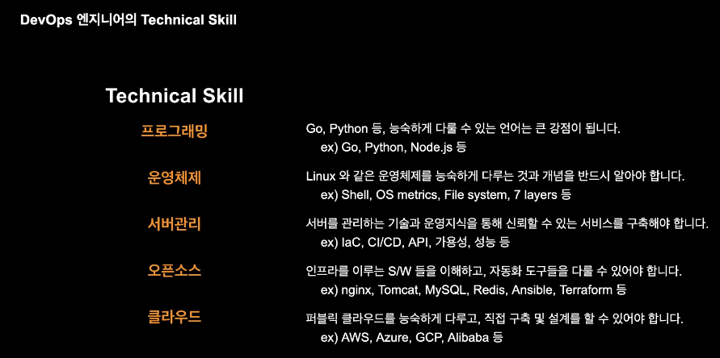
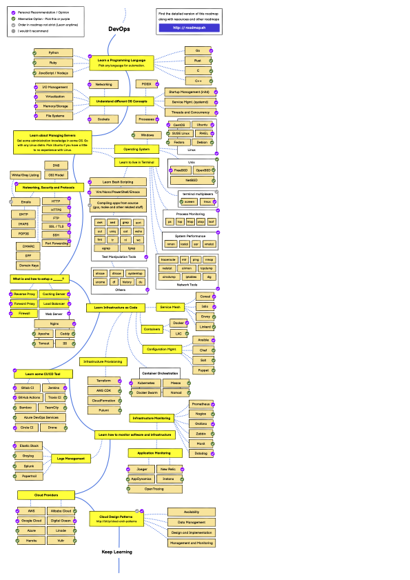

# DevOps

- 의문
- 1 DevOps의 기본적 이해
  - 5가지 철학(CAMSP)
  - Immutable infrastructure
- 2 DevOps 엔지니어의 역할
  - DevOps 엔지니어가 갖추어야할 스킬
  - IaaC(Infrastructure as Code)
  - 데브옵스 로드맵
- 3 테라폼 기본

## 의문

공부방법은, 지금 당장 설치하고 작성해서 무엇을 만드는게 최고다

## 1. DevOps의 기본적 이해

- 개요
  - **어떤 요구사항을 효율적(빠르게)으로 만족시키기 위하여, 일을 자동화하며 변경사항 지표들을 측정하고, 공유하고, 이 모든 결과물들을 지속적으로 축적해 나가아가는 문화를 만들어가는 철학, 방법론, 기술**
  - 문화 & 철학 & 방법론
  - 속도와 효율화
    - 복잡한 현대 서비스(S/W)를 DevOps철학과 방법론으로 풀어나가기

### 5가지 철학(CAMSP)

- 문화
  - 하나의 문화를 만들어 나갑니다
  - 구성요소
    - 사람(팀, 인원), 일(프로세스, 방법론), 서비스(서비스의 가치, 성격), 자원(H/W, S/W, 기술, 도구), 시간(일정, 변경 가능성, 회복탄력성, 예측)
- 자동화
  - 자동화를 통해 효율성과 빠른 속도를 지향합니다
  - 구성요소
    - 인프라 및 보안(클라우드, 네트워크, 접근제어, 암호화), 언어 및 도구, CI/CD, 모니터링
- 측정
  - 지표를 측정하여 지속적으로 개선해 나갑니다
    - 변경사항 발생시, 항상 측정(예측 불가능 -> 예측 가능)
    - 애플리케이션 성능, 개발속도 모니터링
    - 나아지고 있는지, 아닌지 측정
    - 의사결정 시 추측 배제
- 공유
  - 언제든 접근 가능한 투명한 데이터
  - 지식의 공유 OpenMind
    - 인턴이 CTO가 해결하지 못하는 문제도 해결 가능
  - 문제 발생시 함께 해결
  - 일의 가속도
- 축적
  - 기록을 축적하여 자산을 만들어 나갑니다
    - 효율적으로 1만 시간의 법칙을 이루어 내는 것
    - 루이비똥은 100년전의 디자이너의 생각도 기록해뒀음

### Immutable Infrastructure

- 개요
  - 배포이후에 수정이 불가능
    - 업데이트(x)
    - 패치(x)
    - 설정 변경(x)
  - 새로 이미지를 만들어서 다시 배포해야 함
- 장점
  - 버전 트래킹이 쉬움
  - 롤백이 쉬움
  - 일관적인 테스팅 프로세스

## 2. DevOps 엔지니어의 역할

- 개요
  - 올바른 DevOps 문화를 위해 서비스 혹은 S/W 라이프 사이클에서 반복적인 일들을 자동화하고, 기술적 문제 혹은 팀의 차이를 기술적으로 예방하고, 해소시키는 사람
- 특징
  - 기획팀 / 마케팅팀의 업무를 자동화 하는것도 DevOps의 역할이라고 할 수도 있음
  - 공통된 기술들을 다양한 곳에 접목시키는 것

### DevOps 엔지니어가 갖추어야할 스킬

소프트 스킬



기술적 스킬



### IaaC(Infrastructure as Code)

- 개요
  - 인프라를 이루는 서버, 미들웨어 그리고 서비스 등, 인프라 구성요소들을 코드를 통해 구축하는 것
- (코드로서의) 장점
  - 작성용이성
  - 재사용성
  - 유지보수
  - 생산성
- 대표적으로 Terraform이 있음

### 데브옵스 로드맵



위의 선형구조가 순서는 아니고, 전체가 다 중요함

## 3. 테라폼 기본

### 테라폼 구성요소

- provider
  - 테라폼으로 생성할 인프라의 종류를 의미
- resource
  - 테라폼으로 실제로 생성할 인프라 자원
- state
  - 테라폼을 통해 생성한 자원의 상태
    - 테라폼 명령어 실행 결과
    - 실제 상태는 아니지만, 이렇게 상태를 만들도록 유지하려 함
- output
  - 테라폼으로 만든 자원을 변수 형태로 state 에 저장하는 것
- module
  - 공통적으로 활용할 수 있는 코드를 모듈 형태로 정의하는 것
- remote
  - 다른 경로의 state를 참조하는 것. output 변수를 불러올 때 주로 사용

### 테라폼 기본 명령어

- init
  - 테라폼 명령어 사용을 위해 각종 설정을 진행
- plan
  - 테라폼으로 작성한 코드가 실제로 어떻게 만들어질지에 대한 예측 결과를 보여줌
- apply
  - 테라폼 코드로 실제 인프라를 생성하는 명령어
- import
  - 이미 만들어진 자원을 테라폼 state 파일로 옮겨주는 명령어
- state
  - 테라폼 state를 다루는 명령어. 하위 명령어로 mv, push와 같은 명령어가 존재
- destroy
  - 생성된 자원들 state 파일 모두 삭제하는 명령어

### 예시

```tf
# provider
provider "aws" {
  region = "ap-northeast-2"
  version = "~> 3.0"
}

---

# resource
resource "aws_vpc" "example" {
  cidr_block = "10.0.0.0/16"
}

---

# state
{
  "version": 4,
  "terraform_version": "0.12.24",
  ...
}

---

# output
resource "aws_vpc" "example" {
  cidr_block = "10.0.0.0/16"
}

output "vpc_id" {
  value = aws_vpc.default.id
}

output "cidr_block" {
  value = aws_vpc.default.cidr_block
}

---

# module
module "vpc" {
  source = "../_modules/vpc"

  cidr_block = "10.0.0.0/16"
}

---

# remote
data "terraform_remote_state" "vpc" {
  backend = "remote"

  config = {
    bucket = "terraform-s3-bucket"
    region = "ap-northeast-2"
    key = "terraform/vpc/terraform.tfstate"
  }
}
```
