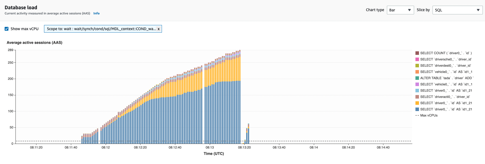
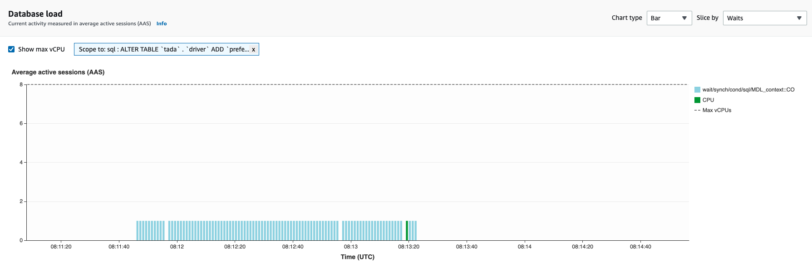
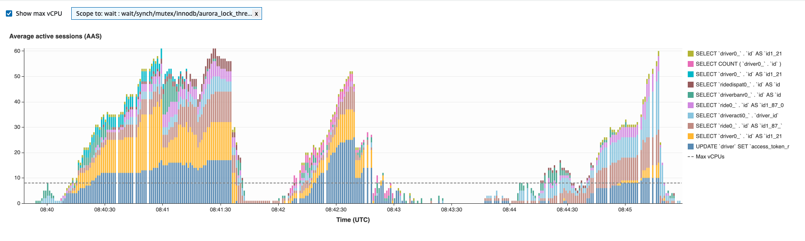
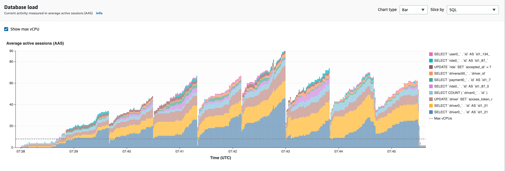

# 서버 장애문서

- 1 online ddl시, 메타데이터 락으로 인한 서비스 다운 이슈
- 2 너무 넓은 범위의 lock을 잡는 쿼리로 인한 서비스 다운 이슈
- 3 foreign key 제약 추가시 table level lock으로 인한 서비스 다운 이슈

## 1. online ddl시, 메타데이터 락으로 인한 서비스 다운 이슈

- 현상
  - 2022-11-14 15:56 ~ 16:01 Online ddl을 실행하는 동안 rideReservation관련 쿼리가 동작하지 않는 문제가 발생하였습니다.
  - AWS performance insights를 보아하니 rideReservation 테이블에 인덱스를 추가하는 DDL쿼리가 Meta Data Lock(MDL)에 걸려있었습니다.
  - 그리고 해당 online DDL쿼리가 MDL로 인해서 waiting함으로 인하여 다른 rideReservation 테이블을 조회하는 쿼리들도 전부 blocking되어있었습니다.
- 대응
  - 원래는 쿼리를 kill했어야 하는데, ddl 쿼리가 알아서 끝나서 문제는 일단락되었습니다
    - *사실 애초에 왜 ddl쿼리가 알아서 끝났는지 원인이 불명입니다*
- 원인
  - 다음과 같은 사항이 원인이라고 추정됨
  - tx1에서 rideReservation에 대한 plain 혹은 S-lock select를 실행
  - tx2(liquibase)에서 rideReservation에 인덱스를 추가
  - tx3에서 다른 어떠한 테이블에 s-lock이나 x-lock을 걸음
  - tx1에서 tx3이 락을 건 다른 테이블에 s-lock이나 x-lock을 걸어서 뭔가를 행하려고 했는데, tx3이 이미 락을 가지고 있으므로 waiting
  - tx3에서 rideReservation에 대한 plain select나 s-lock이나 x-lock을 걸어서 뭔가 하려고 했는데, tx2에 의해서 rideReservation에 어떠한 조작을 가할 수 없지만 데드락은 아닌 상태가 됨
  - tx1, tx2, tx3이 꼬이고, rideReservation테이블은 접근이 불가능한채로 되어서 다른 rideReservation에 접근하는 쿼리들도 블로킹됨
- 조치
  - (대응) online-ddl을 사용할시에는, 반드시 모니터링을 진행하여서, 테이블이 블로킹되는 현상을 목격한다면, 즉각적으로 ddl을 진행하는 쿼리를 kill해주고 다시 시도합니다.

현상2

DB의 전반적인 양상

DB의 Online DDL 쿼리 양상

- 현상
  - 2022-11-25 17:10 ~ 17:14 Driver테이블에 Online DDL을 실행하는 동안 해당 Online DDL이 MDL(Metadata Lock)으로 블로킹되어서, 다른 쿼리를 동작하지 못하게 만든 문제
    - mysql의 `innodb_lock_wait_timeout`(default 50초)에의한 timeout 없이 계속해서 MDL로 인한 블로킹을 하고 있다
    - MDL의 타임아웃 설정인 `lock_wait_timeout`(default 31536000초 = 1년)에 의한 timeout은 있을 수 있으나, 사실상 1년동안 MDL을 기다릴 가능성은 희박하다
    - 그래서 계속해서 Average Active Sessions가 쌓여가는 양상을 띔
- 원인
  - 위의 원인과 같다고 사료됨

## 2. 락 웨이팅으로 인한 서비스 다운 이슈

DB의 전반적인 양상

- 현상
  - 2022-11-25 17:14 ~ 17:50 까지 Driver테이블에 광범위한 row lock이 걸림으로 인해서, 드라이버 서비스가 마비되는 이슈
- 대응
  - 블로킹되고있는 쿼리를 죽여준다
- 원인
  - 패턴1
    - 한 명의 driver를 업데이트 / 쿼리 하는 쿼리가 락을 기다리기 시작
    - 해당 쿼리를 기점으로 많은 드라이버에게 X락을 기다리기 시작(`innodb_lock_wait_timeout`(default 50초) 동안 웨이팅)
    - 해당 드라이버들이 수시로 보내는 리퀘스트들(`/d/LogEvent`, `/d/GetDriverStatus`)등의 API가 계속해서 쿼리를 블로킹함
    - hikariCP의 모든 DB 커넥션이 소진
      - hikariCP는 jdbc 커넥션을 가져오는 로직의 타임아웃이 5000ms이므로 타임아웃 에러가 나기 시작함
    - 여타 드라이버들이 서버로직에 접근할 수가 없어짐
      - `auth.driver().checkAccess()`함수에서 막힘
    - 서블릿 스레드의 모든 스레드 소진
    - 리퀘스트 핸들링 불가능
    - 애플리케이션 다운(liveness probe의 실패로인한 컨테이너 리스타트)
  - 패턴2
    - driver_ban_record테이블에 로우락이 걸리기 시작
      - driver_status_controller에 관련된 entity들의 테이블에 row락이 걸림
    - driver_activity테이블에 로우락이 걸리기 시작
    - 패턴1의 반복
- 조치
  - 1 락을 거는 API에서 최소한으로 락을 걸 수 있도록 하고, 필요없는 경우 락을 걸지 않도록 변경
    - 근본적으로 락이 될 여지를 줄임
    - 커넥션 소진을 막음
  - 2 `innodb_lock_wait_timeout`을 10초로 낮게 설정
    - 락이 일시적으로 걸리더라도 빠르게 해소 가능

## 3. foreign key 제약 추가시 table level lock으로 인한 서비스 다운 이슈

- 현상
  - 2022-10-19 12:07 ~ 12:52 동안 드라이버 서버의 startWorking, dropOff 등이 동작하지 않는 문제가 발생하였습니다.
    - 동작하여도 레이턴시가 매우 컸음
- 대응
  - 일단 데드락을 발생시키는 mysql connection 스레드를 kill하고, 팟도 삭제하였습니다.
- 원인
  - 원인은 liquibase로 인한 이미 존재하는 테이블(`taxi_settlement_info`, `tmoney_settlement_record`)에 foreign key 제약 추가로 인한 table level lock 때문입니다. (즉 driver_api_server 때문이 아닙니다)
  - 장애가 크게 두번으로 나뉘는데요
    - [12:07 ~ 12:15] taxi_settlement_info에 liquibase 작업으로 인한 테이블 락이걸렸고, taxi_settlement_info를 insert할때 테이블락이 풀리길 기다리고, 그럼 정산 관련 트랜잭션에서 driver에 s-lock을 걸어놓으므로 해당 드라이버는 state변경이 불가능해집니다 (출근도 안됨)
    - [12:25 ~ 12:52] 리퀴베이스 팟이 CI abortion와는 별개로 계속 살아있어서 컨테이너가 죽지 않은 상태로 taxi_settlement_info테이블락을 계속 잡고 있었습니다. 해당 작업이 끝나고 이번에는taxi_settlement_record에 liquibase 작업으로 인한 테이블 락이걸렸고, (나머지는 위의 시나리오와 동일)
- 조치
  - (예방) 데이터 사이즈가 큰 테이블인 경우(100만 row 이상), 외래키 제약을 걸지 않습니다.
  - (예방) DB 스키마 추가나 변경에 대한 PR은 꼼꼼하게 리뷰합니다
