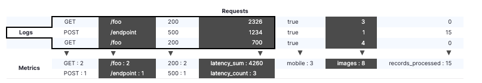
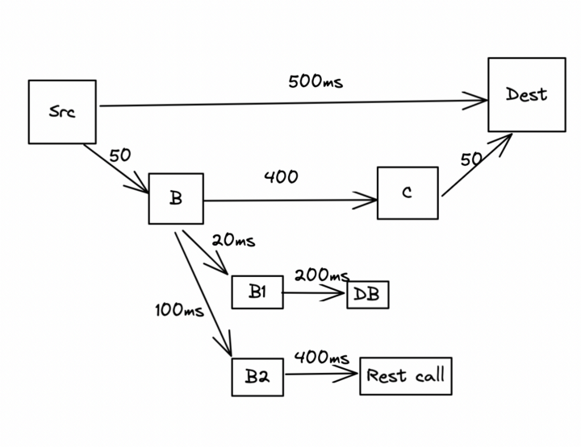

# 로그 vs 메트릭 vs 트레이스

- 의문
- 개요
  - 로그
  - 메트릭
  - 트레이스
  - 결론

## 의문

## 개요

로그와 메트릭

트레이스

### 로그

- 개요
  - 특정 시점에 있어서 서비스 내부의 하나의 이벤트의 기록
    - 시스템 현상의 구체적인 디테일
- 장점
  - 개별 이벤트를 자세히 기록하여, 내용을 보다 정확히 파악 가능
- 단점
  - 개별 이벤트가 포함되므로, 사용자나 기능이 증가함에 따라 처리해야 하는 로그의 양이 증가함
    - e.g) 초당 1000개의 요청마다 1KB씩 기록되는 10개의 서버가 100Mbit 연결의 대부분을 차지함

### 메트릭

- 개요
  - 일정 기간 동안 한 서비스를 측정하거나 설명하기 위해서 사용되는 통계
    - 시스템 현상의 개괄
- 장점
  - 사용자가 가지고 있는 메트릭 수가 시스템 로드에 영향을 미침
    - 초당 요청의 양이 시스템 로드에 영향을 주지 않음
    - e.g) 한 서버마다 1,000,000 메트릭을 매 10초마다 보낼 수 있는 대역폭은 1리퀘스트마다 1KB로그 생성하는 매초 1000 리퀘스트를 100개의 메트릭으로 보내는 것의 대역폭과 같음
- 단점
  - 이벤트 전반에 걸쳐서 aggreaged 상태를 유지하므로, 개별 요청을 자세히 파악 불가능

### 트레이스

- 개요
  - 하나의 life cycle(e.g HTTP request)을 처리하는 동안 전체 시스템 내부의 다수의 서비스에서 얻을 수 있는 통계나 로그를 취합한 것

### 결론

- 트레이스
  - 다수의 서비스로 이루어진 시스템에서 하나의 라이프사이클의 전반적인 측정을 가능케함
- 메트릭
  - 서비스의 개괄적인 관점을 제공
    - 문제를 파악할때 가장 먼저 관찰할 대상
- 로그
  - 서비스 내부의 구체적인 리퀘스트나 이벤트의 자세한 정보와 관점을 제공
    - 메트릭을 관찰하여 파악한 문제를 더 깊게 파고들때 로그 사용
- 위의 모든 수집대상은 서로 보완적으로 사용됨
