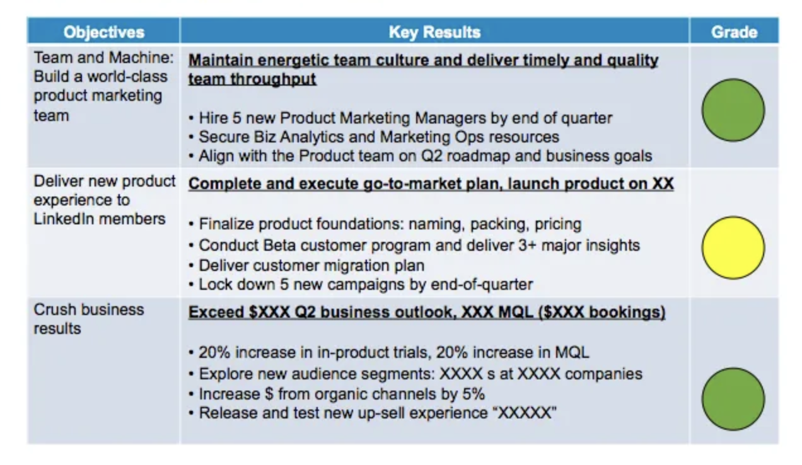

# 개발팀 매니지먼트에 대한 정보

- OKR

## 반드시 있으면 좋은 것들

1. 개발팀 구성원이 서로의 기술에 대해서 깨달은 점, 혹은 자랑할만한 내용을 공유하는 자리(e.g 슈퍼테크K)
2. Agile Scrum(2주 단위 or 1주 단위)
3. 각 구성원이 자신의 능력을 맘껏 발휘할 수 있도록 판을 깔아줘야 함
4. 처음 들어온 경력이 적은 사람들이 적응을 잘 할 수 있도록, main tech stack에 대해서 공부할 수 있는 자료 준비(+ 1달 멘토, 밥값 지원)
5. 누군가에게 일을 시킬때에는 왜 해야하며, 이것이 그에게 어떤 커리상의 도움이 되는지 명확히 해주자

## OKR(Objective and Key Results)

### 구조

- 본질
  - 직원들이 전사적으로 중요하다고 합의된 목표들을 책임감 있게 집중해서 진행하자
    - 성공 확률을 높임
- OKR
  - Objective
    - 최종적으로 이루고자 하는 목표(What)
    - e.g)
      - 한화 이글스를 최고 명문 구단으로 만들기
  - KeyResults
    - 목표 달성 여부를 가리기 위한 잣대로, **계량적이고 구체적인 성과** 들로 표현(How to measure)
      - KPI와 비슷한 느낌
    - e.g)
      - 5년내 2번 이상 우승하기
      - 10만명 이상 팬 보유하기
      - 올스타급 선수 3명 영입하기
- 이점
  - Focus
    - 진정 중요한 핵심 업무에 집중 가능하게 함
      - 하지 않을 것을 정의 가능함
  - Alignment
    - OKR을 통하여, 팀의 중요한 목표를 논의
    - 각각의 팀들이 다른 팀에게 미치는 영향이나 의존도를 파악하여 전사적으로 목표를 조율하고 정의 가능
  - Accountability
    - 구체적이고 계량화된 기준으로 목표 달성 여부를 평가할 수 있으므로, 객관적으로 책임 추궁 가능
      - 비난이 아닌, 달성하지 못한 이유를 회고해서 발전
- 방법론
  - OKR의 순서 및 정렬
    - 회사의 OKR(우선순위)
    - 팀 OKR(우선순위)
    - 개인 OKR(우선순위)

## 좋은 개발팀 문화 요소

- DevOps 철학
  - CAMSP
    - Culture
    - Automatic
    - Measure
    - Share
    - Pile up
- 리뷰데이
  - 화 / 목 16:00 ~ 17:00 리뷰만 하는 시간 + 이야기도 함
- 코드 리뷰
- 기술 발표회
- 공유
