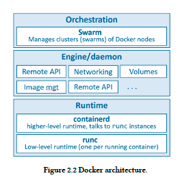
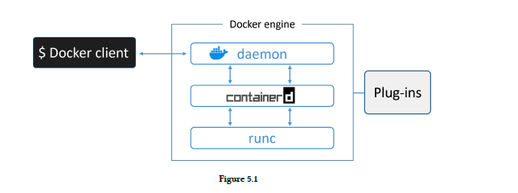
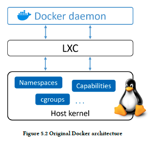
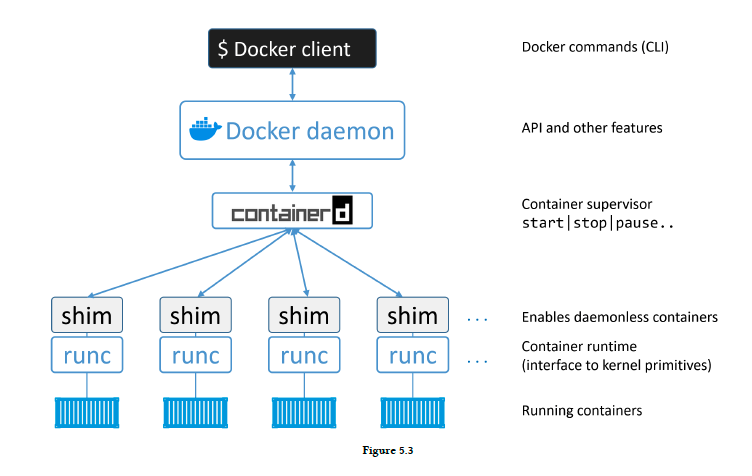
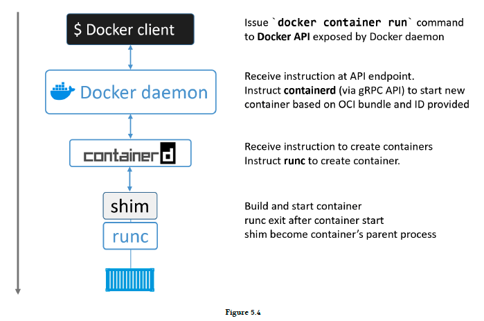
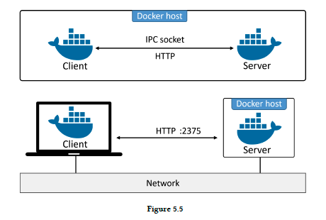
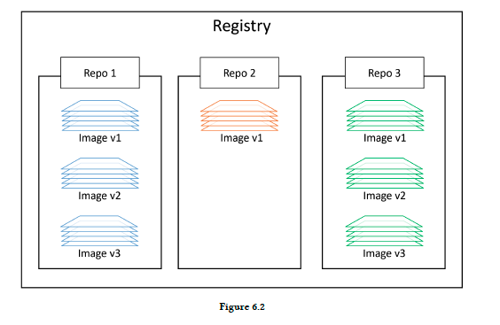
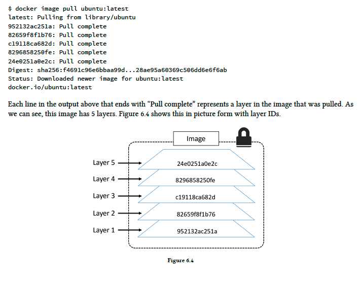
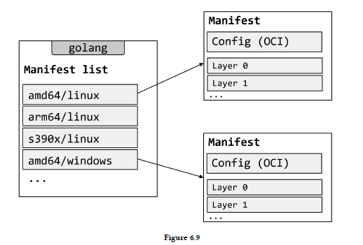

# Docker Deep Dive

- 의문
- 깨달음
- 1 개요
  - 개요
  - Docker technology
  - OCI(Open Container Initiative)
- 2 The technical stuff
  - 2.1 The Docker Engine
  - 2.2 Images

## 의문

- *OS agnostic을 지원하는 도커의 툴 이름이 뭔가?*
  - `runc?`, `containerd?`, `libcontainer?`
- `docker exec`을 하면 무슨 일이 일어나는지? 매커니즘?
- `libcontainer`는 정확히 무엇인가? `containerd`나 `runc`와 다른것?

## 깨달음

- Kubernetes는 container orchestration을 담당하는 기술인데, 이 친구는 어차피 container만 담당하면 되므로, docker daemon과는 완전 별개일 것이다.
  - 따라서 docker daemon을 패싱하고, 바로 containerd와 통신하는듯?

## 1. 개요

### 배경

- 역사
  - 1서버 1애플리케이션
    - 컴퓨터의 스펙을 얼마나 좋은걸 사야하는가?
    - 남는 자원은?
  - VM
    - 한 머신에서 여러 애플리케이션 동작하도록 함
    - OS overhead가 심함
  - Container
    - VM보다 효율적
    - 대중화 하기는 힘듬
  - Docker
    - Container의 대중화
      - 사용성
      - ecosystem

### 개요

- 도커 컨테이너 기술의 근간
  - Linux
    - Linux container
  - Windows
    - Windows container
    - WSL을 이용한 Linux container
  - MacOS
    - lightweight Linux VM을 이용한 Linux container
      - MACOS에서 Linux container를 개발하고 테스팅 가능
- 도커의 컨테이너들은 host OS의 kernel을 공유
  - 컨테이너화된 windows앱은 linux-based docker host에서는 동작하지 않음(서로 마찬가지)
    - Windows docker desktop에 "Linux containers"모드를 사용해서 Linux container를 실행할 수 있음

### Docker technology

Docker architecture



- daemon(engine)
  - runtime
    - `runc`
      - 개요
        - low-level
        - OS와의 인터페이스 담당, 컨테이너 start, stop 담당
          - namespaces, cgroup의 생성 등
      - 특징
        - OCI(Open Containers Initiative)의 runtime-spec을 맞춤
        - Docker node에서 동작하는 모든 컨테이너는 자신을 관리하는 `runc` 인스턴스를 갖음
    - `containerd`
      - 개요
        - high-level
        - 모든 컨테이너 라이프 사이클 관리
          - managing lower level runc instances
        - 그 외 추가 기능(orchestration에 필요한 기능이라고 생각하면 쉬워짐)
          - pulling images
          - creating network interfaces
      - 특징
        - 일반적인 도커의 설치는, 하나의 containerd process(docker-containerd)를 설치하는 것
          - `containered`는 각각의 컨테이너와 연관되는, 여러개의 `runc(docker-runc)`인스턴스를 관리
  - daemon
    - `dockerd`
      - 개요
        - lower level을 추상화하여, 일관적이고 쉬운 인터페이스 제공
        - `containerd`위에 존재하여, 보다 높은 추상도의 일을 행함
          - Docker remote API를 노출
          - image관리
          - volumes의 관리
          - networks의 관리
          - ...
- client
  - 개요
    - Linux에서는 IPC/Unix socket(`/var/run/docker.sock`), Windows에서는 named Pipe(`npipe:////./pipe/docker_engine`)를 이용해서, docker daemon과 상호작용 함
- orchestrator
  - `swarm`
    - 개요
      - 도커가 실행하는 노드의 클러스터를 관리하도록 하는 native support

### OCI(Open Container Initiative)

- 개요
  - low-level 기반 컨테이너 인프라의 components를 표준화하는 관리 기구
    - **image format**
    - **container runtime**
  - 과거 docker에 불만을 품어서, 컨테이너 표준에 대한 분쟁이 있었음
    - 표준은 무조건 합의하는게 좋다

## 2. The technical stuff

### 2.1 The Docker Engine

최신 Docker architecture



초기 Docker architecture



#### 1. 초기 docker

- Docker daemon
  - 개요
    - 하나의 바이너리
  - 구성
    - Docker cliient, API, container runtime, image builds, ...
- LXC
  - 개요
    - 리눅스 커널에 존재하는 fundamental container building blocks에 daemon이 접근할 수 있도록 함
      - e.g)
        - namespaces
        - control groups(cgroups)

#### 2. LXC의 제거

- 문제
  - LXC는 Linux-specific
    - multi-platform 불가능
  - 프로젝트의 코어 로직을 외부의 툴에 의존하는 것은 개발함에 있어서 매우 큰 리스크
- 해결
  - `libcontainer`의 개발
    - host OS 환경에 구애받지 않고, host kernel에 존재하는 fundamental container building blocks에 도커가 접근 할 수 있도록 함
      - *`jvm`같은 거라고 생각하면 될까?*
    - Docker 0.9에서 LXC를 대신해서 기본 execution driver로 지정됨

#### 3. monolithic Docker daemon의 제거

Docker의 모듈화와 아키텍처



- 문제
  - 모든 기능이 하나의 monolithic binary에 있어서 다음과 같은 문제가 생김
    - 새로 기능 개발하기 힘듬
    - 점점 느려짐
    - ecosystem이 원하는 방식이 아님
- 해결
  - monolithic daemon을 분리하고, 작게 모듈화 함
    - daemon에서 분리해서 교체, 재사용할 수 있는 외부 모듈로 만듬

#### 4. OCI의 spec도입

- Docker 1.11 이후, Docker engine은 OCI 스펙을 따름
  - 예시
    - daemon은 container runtime code를 포함하지 않음
      - 다른 OCI-compliant layer에 구현됨
      - default로 `runc`사용
  - `runc`
    - OCI container-runtime-spec의 참조 구현
  - `containerd`
    - 도커 이미지가 유의미한 OCI bundle로 `runc`로 제공될 수 있도록 함

#### runc

runc의 커맨드 예시

```sh
# run as root
cd /mycontainer
runc create mycontainerid

# view the container is created and in the "created" state
runc list

# start the process inside the container
runc start mycontainerid

# after 5 seconds view that the container has exited and is now in the stopped state
runc list

# now delete the container
runc delete mycontainerid
```

- `runc`
  - 개요
    - **OCI 스펙에 compatible한 create container가 메인 목적**
      - 잘하고, 빠름
      - *OCI 스펙에 따른 다는 것이 무엇을 의미하는것인가?*
        - *라이프 사이클 같은 걸까?*
    - `libcontainer`의 작고, 가벼운 CLI wrapper
      - host OS에 구애받지 않고, 커널에 존재하는 fundamental container building blocks에 도커가 접근할 수 있도록 하는 소프트웨어
    - OCI container-runtime-spec의 참조 구현체
      - OCI layer에서 동작한다고 표현 함

#### containerd

containerd 코드 예시

```go
import (
  "github.com/containerd/containerd"
  "github.com/containerd/containerd/cio"
)

// checkpoint the task then push it to a registry
checkpoint, err := task.Checkpoint(context)

err := client.Push(context, "myregistry/checkpoints/redis:master", checkpoint)

// on a new machine pull the checkpoint and restore the redis container
checkpoint, err := client.Pull(context, "myregistry/checkpoints/redis:master")

redis, err = client.NewContainer(context, "redis-master", containerd.WithNewSnapshot("redis-rootfs", checkpoint))
defer container.Delete(context)

task, err = redis.NewTask(context, cio.NewCreator(cio.WithStdio), containerd.WithTaskCheckpoint(checkpoint))
defer task.Delete(context)

err := task.Start(context)
```

- `containerd`
  - 개요
    - **container lifecycle관리**
      - main
      - start | stop | pause | rm ...
    - **image pull, volumes, networks 부착**
  - 특징
    - 도커 데몬으로부터 컨테이너 실행 로직이 분리된 것
    - Linux, Windows 두 환경에서 daemon으로서 사용가능
      - 1.11 release부터 Linux에 도입
    - **`daemon`과 `runc`사이의 OCI 레이어에 존재함**
    - 기존에는 container lifecycle관리 기능만 존재했으나, image pull, volumes, networks등의 기능도 맡게 됨
      - Kubernetes같은 다른 프로젝트에서 사용하기 쉽도록 하기 위해서 기능이 추가됨
        - Kubernetes에서 가장 잘 사용되는 container runtime
      - 대신 optional이며, 모듈화가 잘 되어있음
    - Docker회사에서 개발되었으나, CNCF에 기증됨
    - **OCI compatible container runtime에 의존해서 container를 생성가능**
      - 일반적으로 Docker에서는 `runc` 사용

#### docker daemon에 남은 기능

- 점점 더 기능이 모듈화 되는 추세
- 남은 기능
  - image management
  - image builds
  - REST API
  - authentication
  - security
  - core networking
  - orchestration
  - ...

#### `docker run ...`을 실행하면 일어나는 일들

Docker run 커맨드를 실행하면 일어나는 일들



- shim
  - 개요
    - daemonless container를 가능하게 하는 구현체
  - 컨테이너 생성 과정과 shim 존재 이유
    - `containerd`가 `runc`를 이용해서 새 컨테이너를 만듬
    - 만들 때 마다 `runc`의 새 인스턴스를 포크
    - 컨테이너가 완전히 생성되면, parent process인 `runc` 프로세스는 종료
    - 해당 컨테이너와 관련된 `containerd-shim` 프로세스가 container의 parent process가 됨
  - 역할
    - STDIN, STDOUT 스트림을 열어둬서, daemon이 재시작되어도 pipe가 닫히는 것 등으로 인한 termination을 막아줌
    - container의 exit status를 daemon으로 알려줌

#### 위와 같은 구조의 장점

- **전체 container runtime이 Docker daemon과 decouple된 상태 유지 가능**
  - `daemonless container`
  - 실행중인 container에 영향없이 Docker daemon을 upgrade하거나 maintenance가능
    - 기존에는 daemon을 시작하고 멈출 때 마다 어쩔 수 없이 모든 container들을 kill할 수 밖에 없었음
    - production 환경에서는 큰 문제

#### 리눅스에서의 구현

- `dockerd`
- `docker-containerd`
- `docker-containerd-shim`
- `docker-runc`

#### 도커 클라이언트와 데몬 사이의 커뮤니케이션

Docker client server communication



- standalone(IPC)
  - Linux
    - `/var/run/docker.sock`
  - Windows
    - `//./pipe/docker_engine`
  - 그럼 standalone일 경우에는, HTTP를 사용하지 않는것인가?
    - [코드를 보아하니, 사용하는 것 같음](https://github.com/docker/cli/blob/beab92999ad3aeba9da197b8e29b1dcb3a1345f2/vendor/github.com/docker/docker/client/image_build.go#L20)
- network
  - default: HTTP
    - 2375/tcp
  - **HTTPS를 기본으로 설정해서 통신하게 할 수 있음**

### 2.2 Images

#### 개요

- 도커 이미지
  - 정의
    - application이 실행하기 위해서 필요한 모든것이 들어가있는 패키징
      - *이거는 너무 추상화된 정의 같은데...*
      - 멈춰진 container라고 생각해도 됨
  - 구성
    - application code
    - application dependencies
    - **OS construct**
      - *정확히 OS construct가 뭐지?*
  - 특징
    - 레이어가 stack되는 구조
- image vs container
  - image
    - build-time constructs
  - container
    - run-time constructs
  - image와 container는 서로 dependent함

#### Image는 작다

- shell없이도 구동 가능
  - 필요없는 것은 없이 동작시키는게 맞음
- kernel이 포함되지 않음
  - host의 커널 접근을 공유함
    - *kernel이 없는 OS는 무엇이 남는것인지?*
- OS별 도커 이미지
  - Linux
    - Alpine Linux 이미지
      - 5MB
    - Ubuntu
      - 40MB
  - Windows
    - 수GB

#### Image pulling

- local image repository
  - OS별 장소
    - Linux
      - `/var/lib/docker/<storage-driver>`
    - Windows
      - `C:\ProgramData\docker\windowsfilter`
    - MacOS
      - VM속에서 일어남
  - 역할
    - Docker host의 repository에, docker registry로부터 pull한 이미지를 저장함

#### Image registries

docker image registries



- 개요
  - 중앙 이미지 저장 장소
- 예시
  - Docker hub
    - https://hub.docker.com
    - docker client는 default로 dockerhub를 이용
  - 3rd party registries
  - secure on-premise registries
- 구성
  - 하나 이상의 image repositories
    - image repositories는 하나 이상의 image를 갖음
- repositories
  - 종류
    - official
      - Docker에 의해서 관리되고 보증되는 리포지토리
      - high quality
      - e.g)
        - https://hub.docker.com/_/nginx/
    - unofficial
      - Docker에 의해서 관리되고 보증되지 않음
      - e.g)
        - https://hub.docker.com/r/nigelpoulton/pluralsight-docker-ci/

#### Image naming and tagging

- image pulling
  - official repository
    - `docker image pull <repository>:<tag>`
      - e.g)
        - `docker image pull mongo:4.2.6`
      - 참고
        - latest이미지는 그냥 태그 이름이 latest일 뿐이지, 진짜 latest가 아닐 수 있음
  - unofficial repository
    - `docker image pull <account_name>/<repository>:<tag>`
      - e.g)
        - `docker image pull nigelpoulton/tu-demo:v2`
  - 3rd party repository
    - `docker image pull <DNS name of registry>/<repository>:<tag>`
    - `docker image pull gcr.io/google-containers/git-sync:v3.1.5`

#### 각종 편리한 커맨드

- `docker images --filter dangling=true`
  - dangling image만 찾음
- `docker search alpine --filter "is-official=true" --limit 100`
  - alpine으로 시작하는 공식 이미지를 최대 100개까지 찾음

#### 도커 이미지와 레이어

도커 이미지와 레이어



- 이미지
  - read-only layer의 스택
- layer
  - 파일로 이루어져 있음
  - 캐시됨
    - *그런데, 레이어캐싱은 어떻게 가능한가? 그냥 단순히 command를 비교하는 것인가?*
- 이미지 조사
  - `docker image inspect ubuntu:latest`
  - `docker history <repository>:<tag>`
- Docker storage driver
  - *Union FS*
    - Linux
        - AUFS, overlay2, devicemapper, btrfs, zfs
    - Windows
      - windowsfilter
        - NTFS위의 CoW를 가능케하는 fs 구현체

#### Image와 digest

- image digest
  - image의 컨텐츠의 hash값
    - 내용이 바뀌면 무조건 해시값이 바뀌게 되어있음
    - *image id 와 digest의 차이는? 왜 따로 두었는가?*
      - 이미지 ID는 이미지의 내용물이 변해도 변하면 안됨
  - digest기반 pull이 가능
    - `docker image pull alpine@sha256:9a839e63da...9ea4fb9a54`
- layer
  - 각 레이어는 독립적
  - 레이어 마다 content hash가 존재
    - content에 대한 해시함수의 digest
  - 복잡해지는 경우
    - push, pull
      - 각 레이어를 compress함
      - compress된 content는 uncompress된 content와 다름
        - push, pull 연산 뒤에는 content hash가 매칭되지 않음
        - HMAC으로 내용물의 integrity를 담보하는 로직 적용이 불가능
    - **distribution hash** 의 도입
      - compressed된 레이어의 digest를 push, pull할때 같이 보냄
        - HMAC 매커니즘 사용 가능
      - ID collision도 막아줌

#### Multi-architecture images

Manifest and manifest list



- 개요
  - **하나의 이미지 태그 => multiple platform / architecture 서포트**
- 원리
  - manifest lists
    - 개요
      - 특정 이미지 태그에의해서 지원되는 architecture의 리스트
  - manifests
    - 개요
      - 각 arhictecture가 갖고있는 생성할 layer의 디테일
      - *위의 설명이 구체적으로 무엇인지?*
- 예시
  - Raspberry Pi 에서 도커가 실행되고 있다고 가정
  - 이미지를 pull
  - docker cliient가 Dockerhub에 의해서 노출된 Docker registry API로 호출
    - 자신의 architecture를 알고 있음
  - ARM entry가 manifest list에 존재 => 해당 이미지의 manifest가 가져와지고 파싱되어, 레이어들의 digest값을 파악
  - 각 layer가 Docker hub로부터 pull됨
- 관련 커맨드
  - `docker manifest inspect golang`
    - image의 지원하는 manifest를 보여줌
  - `docker buildx build --platform linux/arm/v7 -t myimage:arm-v7`
    - 다른 플랫폼이나 아키텍처에 대한 이미지 빌드가 가능
    - ARMv7 도커 노드가 아니어도 빌드가능
