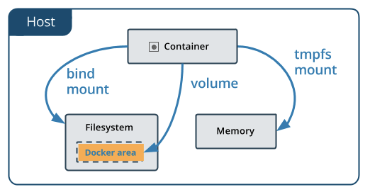
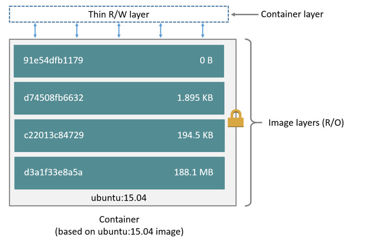

# Docker in depth

- 의문
- Dockerfile
  - image
  - container
- Persist application data
  - Volume
  - Storage drivers
- Orchestration

## 의문

## Dockerfile

- 정의
  - 이미지를 만들기 위해 필요한 모든 커맨드를 포함하는 텍스트 파일
  - c.f) image
    - 정의
      - **하나의 도커 컨테이너를 제작하기 위한 read-only instruction template**
  - c.f) container
    - 정의
      - **한 이미지의 실행 가능한 instance**
      - *순환 논법?*

## Persist application data

### Volume

volume vs bind mount vs tmpfs mount



- 개요
  - 도커 컨테이너에 의해서 생성되고, 사용되는 데이터를 persisting하는데에 가장 preferred된 매커니즘
- volume vs bind mounts
  - volume
    - Docker에 의해서 완전히 관리됨
    - 백업, migrate하기 쉬움
    - volume을 docker cli command로 매니징 가능
    - Linux / Windows 컨테이너에서 둘다 사용 가능
    - *volume driver는 volumes을 remote hosts나 cloud provider위에 저장할 수 있게 해서, volume의 컨텐츠를 암호화하거나, 다른 기능을 사용할 수 있도록 함*
      - *구체적으로 어떻게?*
    - 새 volume은 컨테이너에의해서 컨텐츠를 pre-populated하게 할 수 있음
      - *구체적으로 어떤 것을 의미?*
  - bind mounts
    - host machine의 디렉터리 구조에 의존
- volume vs container's writable layer
  - volume
    - 컨테이너의 사이즈를 증가시키지 않음
    - container의 lifecycle과는 별도로 존재

### tmpfs mount

- 개요
  - Linux에서 docker를 사용할 경우, 사용 가능
  - `tmpfs` mount와 함께 컨테이너를 생성하면, 컨테이너의 writable layer 바깥에 파일 생성 가능
- 장점
  - 일시적으로 민감한 파일들을 저장하는데에 유용
- 특징
  - 일시적
    - 컨테이너가 stop되면, `tmpfs` mount는 제거되고, 그곳에 작성된 파일은 persist하지 않음
    - host memory에서만 persistent
  - 컨테이너 사이에 공유가 안됨

예시 커맨드

```
docker run -d \
  -it \
  --name tmptest \
  --tmpfs /app \
  nginx:latest
```

### Storage drivers

- 정의
  - 컨테이너의 writable 레이어에 데이터를 생성할 수 있도록 함
  - image layer, container layer의 상호작용을 처리함
- 특징
  - 컨테이너가 삭제되면 해당 레이어의 데이터도 삭제
  - native fs 퍼포먼스에 비해서 read/write 더 느림
    - write-intensive database storage에 있어서 문제가 됨
  - 다양한 종류의 storage driver가 존재하고, 각자 장단점이 존재
    - 차이
      - 각 storage driver마다 layer들의 상호작용 대한 구현은 각자 다름
    - 공통
      - **모든 드라이버는 stackable image layer를 사용**
      - **CoW(Copy-on-Write) 전략 사용**

#### images and layers

*애초에 레이어의 정의는 무엇인가?*

example of Image, container and thin R/W layer

```docker
FROM ubuntu:18.04
COPY . /app
RUN make /app
CMD python /app/app.py
```



- layer
  - 개요
    - 각 레이어는 이전 레이어와의 fs상의 차이의 집합이며, 레이어 자체도 하나의 file system
    - 레이어는 스택으로 쌓임
  - 종류
    - image layer
      - Read only layer
    - container layer
      - 컨테이너를 생성할 때 추가됨
      - writable layer
        - 컨테이너를 동작시키는 동안 일어난 모든 변화(파일 추가, 파일 수정, 파일 삭제 등)은 모두 이 레이어에 기록됨

#### Container and layers

- container vs image
  - container
    - layer stack의 가장위에 writable layer가 존재
    - container가 삭제되면, writable layer 역시 삭제되나, 원래 존재하던 image는 그대로 남아있음

#### Container size on disk

- `docker ps -s` 커맨드로 확인 가능
  - `size`
    - 각 컨테이너의 writable layer에 사용된 data(disk)의 크기
  - `virtual size`
    - read-only image data를 위해 사용된 데이터의 양 + 컨테이너의 writable layer `size`
    - 주의
      - 임의의 두 컨테이너는 read-only image layer를 공유할 수 있으므로, 단순히 `virtual size`를 더하기만 해서는 용량을 과도하게 추정하는 것일 뿐
- 그외 고려해야할 것들
  - `json-file` logging driver를 사용할 경우, 해당 파일이 디스크에 차지하는 공간
    - 일반적으로 rotation이 설정되지 않음
  - 컨테이너가 사용하는 `Volumes` and `bind mount`
  - 컨테이너의 configuration 파일들에 의해서 사용되는 디스크 공간
    - 일반적으로 작음
  - 디스크에 작성된 메모리
    - swapping이 enabled된 경우
  - checkpoint들
    - experimental checkpoint/restore 기능을 사용할 경우
    - *애초에 cehckpoint가 무엇인지?*

#### The copy-on-write (CoW) strategy

- CoW 전략
  - 최대한의 효율을 위한 파일 공유와 복사 전략
  - I/O 최소화 및 연속된 레이어들의 사이즈 최소화
- 예시
  - lower layer에 파일이나 디렉터리가 존재한 경우
    - 다른 레이어에서 read access가 필요한 경우
      - 그냥 기존에 존재하던 파일을 사용
    - 다른 레이어에서 write access가 필요한 경우
      - 기존에 있던 파일을 복사한 뒤에, 수정함

#### Sharing promotes smaller images

- `docker pull`
  - 로컬에 이미지가 존재하지 않으면, 각 레이어가 분리되어 local에 pulled down되어, 도커의 로컬 저장 장소에 저장됨
    - `/var/lib/docker`
  - 파일 시스템의 레이어를 조서하기 위해서는 `/var/lib/docker/<storage-driver>`에 들어가서 확인
    - 이 예시에서는 `overlay2` storage driver를 사용중

```
$ docker pull ubuntu:18.04
18.04: Pulling from library/ubuntu
f476d66f5408: Pull complete
8882c27f669e: Pull complete
d9af21273955: Pull complete
f5029279ec12: Pull complete
Digest: sha256:ab6cb8de3ad7bb33e2534677f865008535427390b117d7939193f8d1a6613e34
Status: Downloaded newer image for ubuntu:18.04
```

```
$ ls /var/lib/docker/overlay2
16802227a96c24dcbeab5b37821e2b67a9f921749cd9a2e386d5a6d5bc6fc6d3
377d73dbb466e0bc7c9ee23166771b35ebdbe02ef17753d79fd3571d4ce659d7
3f02d96212b03e3383160d31d7c6aeca750d2d8a1879965b89fe8146594c453d
ec1ec45792908e90484f7e629330666e7eee599f08729c93890a7205a6ba35f5
```

- directory name은 layer ID와 일치하지 않음
- `docker history <image_id>`
  - 이미지의 각 레이어 별 커맨드와 사이즈 확인 가능

#### Copying makes container efficient

- `aufs`, `overlay`, `overlay2`에서의 CoW 순서
  - 1 업데이트 할 파일이 존재하는 image layer를 찾음
    - 최신 레이어부터 base layer 마다 순차적으로 찾음
    - 찾으면 빠른 속도를 위해서 캐싱
  - 2 `copy_up` operation을 행하여, 컨테이너의 writable 레이어에 복사함
    - `copy_up` operation은 성능 오버헤드를 발생시킴
      - 오버헤드 정도는 storage driver 마다 차이가 남
      - 파일이 클 수록, 많은 레이어가 존재할 수록, 깊은 디렉터리 트리 구조를 가질 수록 오버헤드가 큼
    - 파일이 처음 수정될 때 처음에만 `copy_up` 연산을 행하므로 그나마 오버헤드가 경감됨
  - 3 변경은 복사된 파일에만 진행됨
    - 컨테이너는 복사 및 변경 이후에 아래 레이어에 존재하는 read-only 파일의 복제본을 볼 수 없음
- `Btrfs`, `ZFS`와 다른 드라이버는 CoW를 다른식으로 핸들링함
- 주의
  - 데이터를 많이 consume하는 컨테이너는 그렇지 않은 컨테이너보다 많은 디스크 공간을 차지함
    - 대부분의 write operation이 컨테이너의 writable top layer의 새 디스크공간을 차지하기 때문
  - **write-heavy 애플리케이션의 경우, 데이터를 컨테이너에 저장하지말고, volume을 사용하라**
    - 동작하는 container와는 독립적이며, efficient I/O를 위해서 고안됨
    - 컨테이너 끼리 공유 가능
    - container의 writable layer의 크기를 증가시키지 않음

## Orchestration

- orchestrator
  - **컨테이너화된 애플리케이션을 scale, maintain, manage하는 툴**
  - 종류
    - Kubernetes
    - Docker Swarm
- 배경
  - container화 된 process의 **portability** 와 **reproducibility**
    - container화 된 application을 클라우드나 데이터센터로 옮기고 스케일링 가능하게 함
  - 배포와 스케일링툴, 관리의 자동화가 필요함(e.g 실패한 컨테이너를 자동으로 교체)
