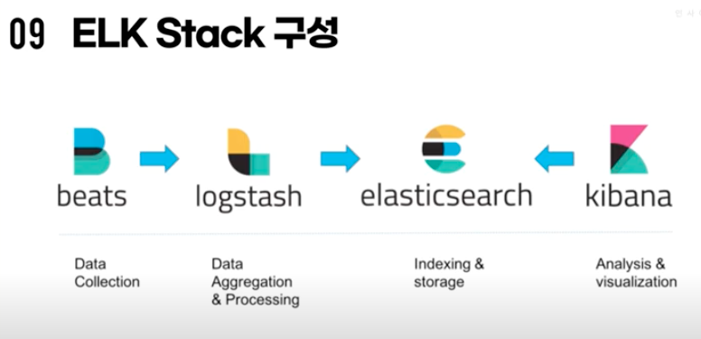

# Elastic Platform

- 의문
- ELK 스택

## 의문

## ELK 스택

ELK 스택 다이어그램

- Elastic Search
- Logstash
- Kibana
- Beats

### Elastic Search

- 개요
  - 루씬기반 검색엔진 + 데이터 저장소(Logstash) + Restful 분산형 검색엔진

### Logstash

- 개요
  - 데이터 처리 파이프라인
    - 동시 데이터 수집
    - 수집로그 선정

### Kibana

- 개요
  - 데이터 시각화, HTML + JS엔진

### Beats

- 개요
  - 서버 에이전트 설치
  - 일라스틱 서치, 로그스테시에 데이터 전송
- 종류
  - Filebeat
    - 로그파일 등 전송
  - Metricbeat
    - 다양한 시스템 서비스 통계 전송
  - Packetbeat
    - 패킷 데이터 전송
  - Winlogbeat
    - 윈도우 이벤트로그 전송
  - Auditbeat
    - 리눅스 audit 프레임워크 데이터 실시간 전송
  - Heartbeat
    - 활성상태 감지 & 서비스 가능성 모니터링
  - Functionbeat
    - FaaS 데이터 수집 전송 모니터링
