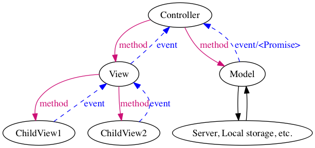

# UI 設計指針

UI と言っても JavaScript (TypeScript) による実装部分です。
デザインについてはここでは話にあげません

## 目指すところ

- 枝葉をみなくても全体が把握できること
  - どこでなにをやっているか、どこをいじればいいかがわかる
- ある場所の変更の影響範囲が限られていること
  - いじってない場所が壊れたりしない
- テストしやすいこと
- 小さいものを作るときに大変じゃなく、それでいてある程度大きいものでも破綻しないこと
  - SPA は目指さないかわりに、ちょっとした UI はさらりと書ける
- 全体としてシンプルであること
  - 書きやすさよりコードの把握しやすさを優先

## 基本戦略

- コードの責務を適切に分離しましょう、カプセル化大事
  - 「ユーザーとの入出力 (View)」と「それ以外の入出力 (Model)」を分離します
    - View は View 以外を参照しないことで、コードの責任範囲を狭めます
    - Model は Model 以外を参照しないことで、コードの責任範囲を狭めます
  - View/Model のインターフェースは不必要に公開しないようにしましょう
- 分離したコード間のやり取りは Pub/Sub モデルで行いましょう、疎結合大事
  - Controller は View/Model を参照して良いです
    - View はイベントを発行することで Controller に状態を伝えます
    - Model はイベントの発行、または Promise で Controller に状態を伝えます
  - View と Model のやり取りは Controller を介して行います
  - View と View のやり取りは
    - View 間に親子関係がなければ Controller を介して行います
    - View 間に親子関係があれば、View に親子関係を持たせます

最高に簡単に説明すると、 DOM と XHR(など) を分離したメディエーターパターンです



図から見て取れるように、View と Model は直接参照せずに Controller を介してやり取りするようになっています。

## 登場人物(Model/View/Controller)と実装方針

上述の通り、三つの登場人物がいます

- ユーザーとやり取りをする View
- サーバーやストレージとやりとりをする Model
- それらの仲介をする Controller

Model という概念にはデータモデルを操作する処理が含まれていますが、Web アプリのクライアントでは大部分がサーバー上で実装されており、クライアントで行うのはサーバーとの通信がほとんどです。
それに対し、実際に UI を構築する View は複雑になりやすいです。したがって実装方針については主に View について詳しく書きます

### View

表示の更新やユーザーの入力のハンドリングなど、ユーザーとの input/output を行います。
サーバーとの通信やストレージへのアクセスは行いません。

#### 実装

```
【基本戦略】
- View は View 以外を直接参照せず、View の外に情報を伝えるにはイベントを発行します
- ユーザーとの入出力以外の処理は行わないようにします
- 不必要にインターフェースを公開しないようにしましょう
```

- View は DOM を抽象化したものとし、DOM のインターフェースを参考に実装しましょう。View の外からは高級な DOM に見えるようにすると良さそうです
  - イベントを購読する API
  - 状態を変更する API
  - 値を取得する API など
  - DOM がしないようなこと（サーバーやストレージとの通信など）はしない
    - img タグはサーバーと通信するじゃん？確かに。ただ View が個別にサーバーとの IO をしだすと簡単にパフォーマンス悪くなるので、そこは目をつぶってもらえませんか・・・
- DOM のレンダリング実装はプロジェクトにマッチするものを選ぶとよさそうです (react/jquery など)
  - 2017/02 時点、Boston Mantle ではテンプレートエンジンのみ使っています
- View が発行するイベント
  - Controller はイベントを経由して View の変更を知るわけですが「DOM のここが click された」というような詳細を知りたくありません。
  - Controller が知りたいのはその View がとりうる動きのうち、View として(アプリケーションとして?)意味のある動き
- View のインターフェース
  - 「Controller は View を知っていて良い」と言っていますが、View オブジェクトを経由して Controller が DOM をいじりだすと責務が分離できません
  - 適切に private にするなどして、公開するインターフェースを制御しましょう

**トグルするビューのコード例**

コンストラクタに渡された DOM に `.is-toggle-on` と `.is-toggle-off` クラスを付け替えるビュー

```javascript
export class ToggleView extends EventEmitter {
    private _elm: HTMLElement;
    private _status: ToggleStatus;
    private _locked: boolean;

    constructor(elm: HTMLElement) {

        this._elm = elm;
        this._elm.addEventListener('click', this._onClick);
    }

    private _onClick = (e: Event): void => {
        const event = new ToggleEvent(this);
        this.lock()
        this.isOn
            ? this.emit(ToggleEventName.ON, event)
            : this.emit(ToggleEventName.OFF, event);
        if (!event.defaultPrevented) {
            this.toggle()
            this.unlock()
        }
    }

    get isOn(): boolean { return this._status === ToggleStatus.ON }
    get isLocked(): boolean { return this._locked }

    toggle(): void {
        this.isOn ? this.toggleOn() : this.toggleOff()
    }

    toggleOn(): void {
        this._status = ToggleStatus.ON
        this._elm.classList.add('is-toggle-on')
        this._elm.classList.remove('is-toggle-off')
    }

    toggleOff(): void {
        this._status = ToggleStatus.OFF
        this._elm.classList.remove('is-toggle-on')
        this._elm.classList.add('is-toggle-off')
    }

    lock(): void {
        this._locked = true;
        this._elm.classList.add('is-locked')
    }

    unlock(): void {
        this._locked = false;
        this._elm.classList.remove('is-locked')
    }
}
```

公開しているのは、

- 状態の取得 `isOn`, `isLocked`
- 状態の変更 `toggle`, `toggleOn`, `toggleOff`, `lock`, `unlock`
- イベント購読 `on` (EventEmitter から継承)

となっている

### Model

サーバーとの通信やローカルストレージへのアクセスなど、「ユーザー以外」との input/output を担当します

#### 実装

実装は状況に応じて考えてもらうと良いと思います (View と比べてやることが明確なため、実装を制限しなくても破綻しにくい、という判断です)

- 例1) publisher にして Controller に購読してもらう
  - 複数の Controller に変更を通知したいとき
```javascript
class HogeModel extends EventEmitter {
    constructor() { ... }
    getHoge() {
        ....
        this.emit('hoge:fetched', ...);
    }
}
```

- 例2) Promise を返して、Controller で then 時に処理してもらう
  - 実装が簡単
```javascript
class HogeModel extends EventEmitter {
    constructor() { ... }
    getHoge() {
        ....
        return new Promise((ok, ng) => {
            ....
            ok(....)
        })
    }
}
```

### Controller

Model/View が相互にやりとりするためのメディエーター

#### 実装

Model と View を購読できれば実装はあまり制限しなくて大丈夫だと思っています。
テストがしやすいように、View と Model はコンストラクタで受け取るのが良さそうです

- コード例
```javascript
class HogeController {
    constructor(view, model) {
        this.view = view;
        this.model = model;
        view.on('panel:open', this.onPanelOpen)
    }
    onPanelOpen = (....) => {
        ....
        this.model.hogehoge
    }
}

new HogeController(
    new HogeView(....)
    new HogeModel(....)
)
```

コントローラーの生成を見ると、アプリケーションの全体感が掴めるようになっていると理想的だと思います。
例えば上記の例では、HogeView と HogeModel の間にやり取りがあることがわかります。
もしコントローラーが二つのビューを持っていれば、その二つのビューの間にやり取りがあることがわかる、という感じです。

## ケーススタディ

<details>
<summary>ビューとモデルがやり取りする</summary>

```javascript
class とあるビュー extends EventEmitter {
    ...
    // ユーザーからの入力を拾ってイベントを発行する
    クリックされた = (event) => {
        ...
        // 必要に応じて view 自身を変更
        this.描画(...);
        ...
        // コントローラーに知らせたいことがあればイベントを発行
        this.emit('ほげイベント', param)
    }
    // Dom を操作する
    描画(...) { ... }
}
class とあるモデル extends EventEmitter {
    ...
    Promiseを返す更新処理(param) { ...; return somePromise; }
}
class とあるコントローラー {
    constructor(view, model) {
        this.view = view;
        this.model = model;

        view.on('ほげイベント', this.ほげイベントハンドラ)
        model.on('', this.someEventHanlder)
    }
    ほげイベントハンドラ = (event) => {
        const param = event...;
        this.model.Promiseを返す更新処理(param).then(value => {
            this.view.描画(value)
        })
    }
}

// コントローラーの生成を見れば `とあるビュー` と `とあるモデル` の間にやり取りがあることがわかる
new とあるコントローラー(
    new とあるビュー(...),
    new とあるモデル(...),
)
```
</details>

<details>
<summary>複数の View がやり取りをする</summary>

それぞれの View が管理する DOM に親子関係がない場合

```javascript
class とあるビュー extends EventEmitter {
    ...
    クリックされた = (event) => {
        ...
        // 必要に応じて view 自身を変更
        this.描画(...);
        ...
        // コントローラーに知らせたいことがあればイベントを発行
        this.emit('ほげイベント', param)
    }
    描画(...) { ... }
}
class 別のビュー extends EventEmitter {
    ...
    描画(...) { ... }
}
class とあるコントローラー {
    constructor(view, anotherView) {
        this.view = view;
        this.anotherView = anotherView;

        view.on('ほげイベント', this.ほげイベントハンドラ)
    }
    ほげイベントハンドラ = (event) => {
        ...
        this.別のビュー.描画(...)
    }
}

// コントローラーの生成を見れば `とあるビュー` と `別のビュー` の間にやり取りがあることがわかる
new とあるコントローラー(
    new とあるビュー(...),
    new 別のビュー(...),
)
```
</details>

<details>
<summary>複数の View がやり取りをする</summary>

それぞれの View が管理する DOM に親子関係がある場合

```javascript
class 親ビュー extends EventEmitter {
    ...
    constructor(childView) {
        childView.on('子のイベント', this.子のイベントハンドラ)
    }
    子のイベントハンドラ = () => {
        // 他の子を操作したり、などする
        this.emit('親としてのイベント', param)
    }
}
class 子ビュー extends EventEmitter {
    ...
    クリックされた = (event) => {
        ...
        // 必要に応じて view 自身を変更
        this.描画(...);
        ...
        // コントローラーに知らせたいことがあればイベントを発行
        this.emit('子のイベント', param)
    }
    描画(...) { ... }
}
class とあるコントローラー {
    ...
}
// とあるコントローラーは親ビューだけ管理すればよい。子ビューの管理は親ビューに任せることで、責任範囲を明確にする
new とあるコントローラー(
    new 親ビュー(
        ...,
        new 子ビュー(...)
    ),
    new とあるモデル(...)
)
```
</details>


- View が Model とやりとりする必要のない場合は、Controller はなく View のみでよいです

### 気をつけるところ

- Pub/Sub ベースになっているので、イベントの発行/購読関係が整理されていれば理解しやすいはずです。
- 逆に言えば闇雲にイベント発行して云々すると大変なことになる。
- イベントの設計は慎重にしましょう
- 設計するときに絵を描くとよいです。描いた絵をとっておけるともっとよい
