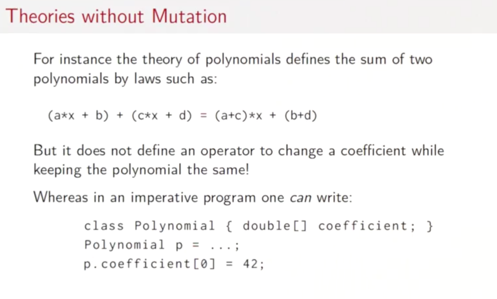
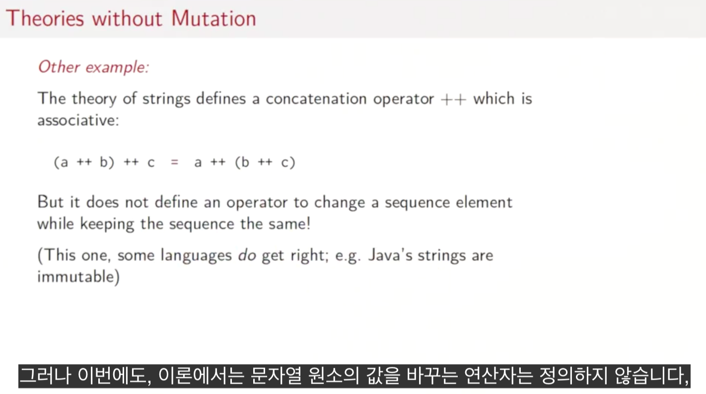
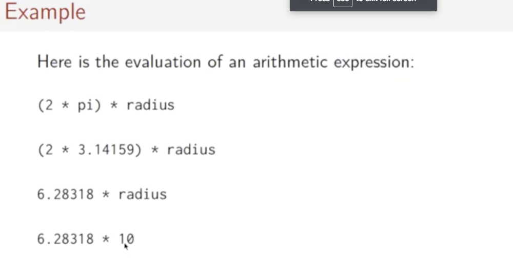
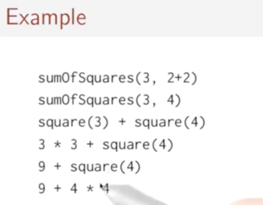
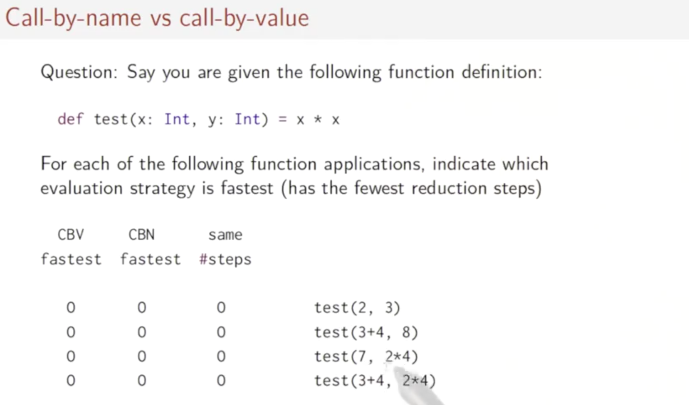
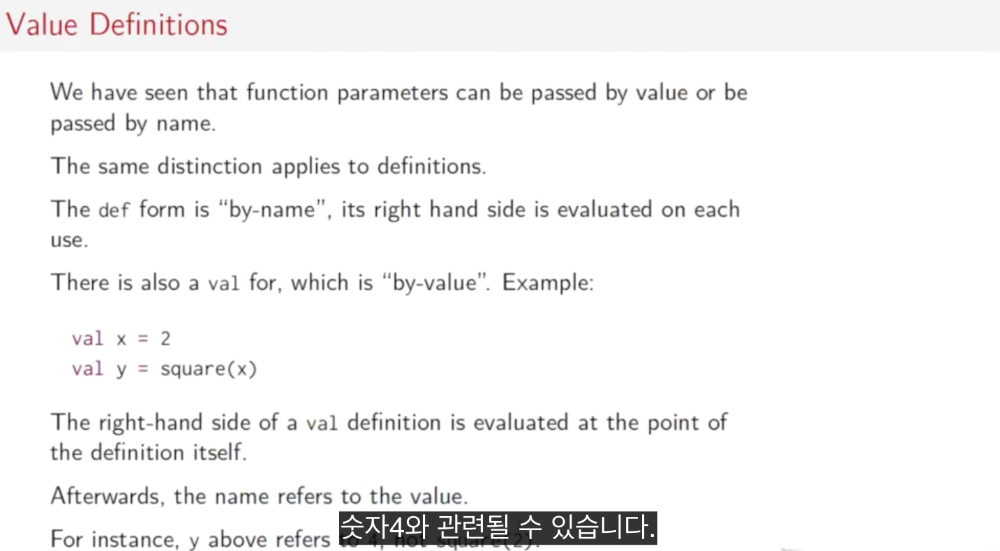
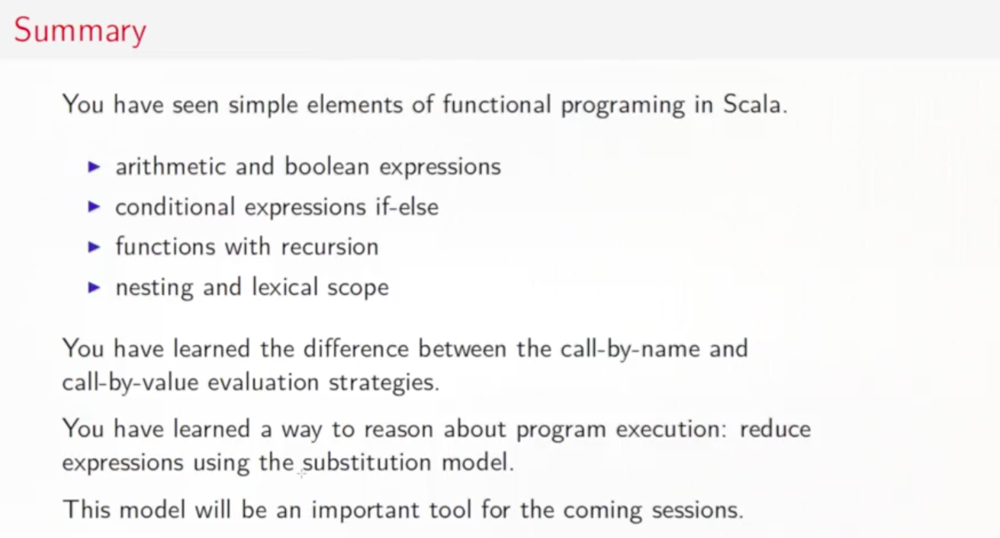
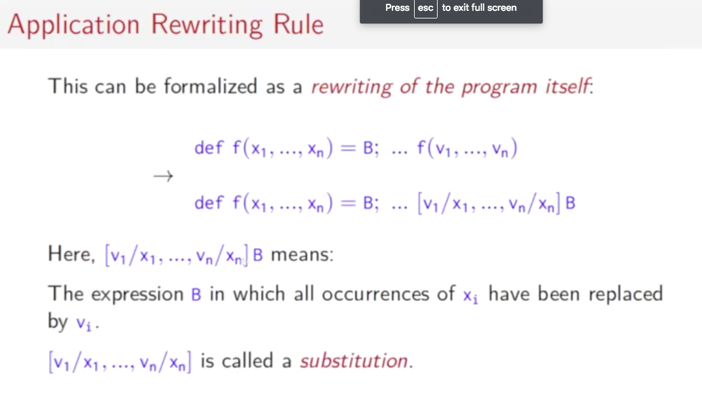

# 1. Function & Evaluations

## 1.1 Programming Paradigms

### 패러다임

- 과학에서, 과학적으로 단련된 서로다른 개념이나 사고 방식(thought pattern)
- 주요한 프로그래밍 패러다임
  - 명령형 프로그래밍
  - 함수형 프로그래밍
  - 논리적 프로그래밍
- 직교하는 것
  - 오브젝트 지향 프로그래밍

### 명령형 프로그래밍

- 변경가능한 변수를 변경
- 할당을 사용
- `if-then-else, loops, break, continue, return`을 사용한 제어 구조
- 예시
  - 폰노이만 컴퓨터
    - 프로세서, 메모리
  - 비유
    - 변경 가능한 변수 ~ 메모리 공간
    - 변수 역참조(dereference) ~ load 명령
    - 변수 할당 ~ store 명령
    - 제어 구조 ~ jumps
- 문제
  - 스케일 업(규모 확장)되었을 때
    - 어떻게 프로그램을 단어 하나하나와의 매칭에서 벗어날 수 있는가?(보다 큰 사고를 하고 싶어함)
  - Can programming be liberated from the von. Neumann Style?
    - 폰 노이만 병목지점(bottleneck)
      - 데이터 구조를 단어와 단어의 매칭으로 개념화 하려고 함
    - 규모를 늘리려면은 보다 더 높은 추상화가 가능해야 함
      - collections
      - polynomials
      - geometric shapes
      - strings
      - documents
      - 새로 theory를 개발할 수 있도록 해야함
    - e.g
      - 절차 지향 프로그래밍 패러다임에서는 데이터 구조와 이름이 1:1 매칭이기 때문에, 그 행위는 별개며, 데이터 구조 사이의 관계를 정의하기가 어려움
      - 오브젝트 지향 프로그래밍 패러다임에서는 오브젝트가 이름과 1:1 매칭이기 때문에, 다양한 오브젝트 사이의 관계를 기술할 수 있으며(상속) 오브젝트를 사용해서 다형성과 코드 재사용화를 가능하게 함

#### 이론(theory) 이란





- 하나나 그 이상의 데이터 타입
- 이러한 타입들에 대한 동작(operations)들
- 값과 동작들에 대한 관계의 묘사
- theory 자체가 가변(mutation)을 묘사하지 않음
- mutation
  - 상태를 변경하였으나, 정체성은 동일하게 유지하는 것
- 프로그래밍에서의 영향
  - 수학적 이론을 따르는 고차원의 개념을 구현할 때는, 가변의 현상이 존재하지 않음
    - 이론이 이를 받아들이지 않음
    - 가변은 이론의 법칙을 망가뜨림
  - 바람직한 방법
    - 함수로 표현되는, **연산자들을 위한 이론을 정의하는데에 집중**
    - **가변성을 회피**
    - **보다 강력한 추상화와 함수의 합성**

### 함수형 프로그래밍

- 함수형 프로그래밍
  - 제한적의미(restricted)
    - 가변 변수, 할당, 루프와 같은 명령형 프로그래밍의 특징이 없는 프로그래밍
  - **보편적의미(general)**
    - 함수에 초점을 맞춤
      - 보다 아름다운 프로그래밍 가능
    - 함수는 생성되고, 사용되고, 합성되는 값으로 될 수 있음
    - 함수는 퍼스트 클래스 시티즌임
      - 다른 일반적인 값과 같은 취급
      - 어디에서든 정의 가능(심지어 다른 함수 내에서도)
      - 다른 함수들의 매개변수로 전달 가능하고, 함수의 반환 값으로 반환가능
      - 함수를 합성하기 위한 연산자들의 집합이 존재
- 왜 함수형 프로그래밍인가?
  - 간단한 사고 원칙
  - 보다 나은 모듈화
  - 멀티코어를 이용한 병렬처리와 클라우드 컴퓨팅제어가 편함

## 1.2 Elements of Programming

- 모든 non-trivial한 프로그래밍 언어는 다음을 제공함:
  - 가장 간단한 구성요소들을 나타내는 원시적인 식들
  - 식들을 결합하는 방법
  - 식들을 추상화하는 방법
    - 추상화란, 식에 이름을 부여하여 그것에 의해서 그 식을 참조할 수 있는 것을 의미함

### REPL(Read-Eval-Print Loop)

- 인터프리터

### 평가(Evaluation)





- 원시적이지 않은 식은 다음과 같이 평가됨
  - 가장 왼쪽의 연산자를 가져옴
  - 그것의 피연산자를 평가함(왼쪽을 오른쪽보다 먼저)
  - 피연산자에게 연산자를 적용함
- 대체 모델(substitution model)
  - 모든 평가는 식을 값으로 reduce함
  - **부작용이 없는 한** 모든 식에 적용할 수 있음
    - 부작용이란, `c++`와 같이, 대체 모델로는 작성할 수 없는 것들(현재 값에 부작용이 있음)
  - **람다 계산**
  - 평가 모델을 간단화 함

### Termination



- 모든 식이 값으로 축소(reduce) 가능한가?
  - 아니다
  - 재귀 함수
- 평가 전략의 변화
  - **(call-by-value)** 함수 적용 전에 함수 인자를 값으로 축소
    - 값으로 함수 파라미터를 넘겨줌
    - 함수의 인자를 오직 한 번만 평가함
    - `sumOfSquares(3, 2+2)`
    - `sumOfSquares(3, 4)`
    - `squre(3) + squre(4)`
  - **(call-by-name)** 축소되지 않은 인자를 그대로 함수가 평가
    - 이름으로 함수 파라미터를 넘겨줌
    - 함수의 인자는 **해당하는 파라미터가 사용되기 전까지 평가되지 않음**
    - 매우 처리 시간이 긴 함수를 꼭 필요할 때만 실행이 가능
    - `sumOfSquares(3, 2+2)`
    - `squre(3) + squre(2+2)`
    - `3 * 3 + square(2+2)`
    - `9 + squre(2+2)`
    - `9 + (2+2) * (2+2)`
    - `9 + 4 * (2+2)`
    - `9 + 4 * 4`
    - `25`
  - c.f **(call-by-reference)**
    - 참조(데이터의 주소)로 함수 파라키터를 넘겨줌
    - 내부에서 파라미터를 수정하면 외부에 부작용 발생
    - e.g 루비

```scala
def loop: Int = loop
```

## 1.3 Evaluation Strategies and Termination

- 만약, termination이 보장되지 않으면?
  - **식의 CBV평가가 삭제되면, CBN평가 역시 삭제됨**
  - 역은 성립하지 않음
- 스칼라는 일반적으로 CBV채용
  - 보다 효율적
  - 명령형 언어에서는 CBV가 표준
  - `=>`를 사용하면 명시적으로 CBN을 사용 가능

```scala
def first(x: Int, y: Int) = x

first(1, loop) // CBN -> 1
first(1, loop) // CBV -> infinite loop
```

```scala
def constOne(x: Int, y: => Int) = 1

constOne(1+2, loop) // 1
constOne(loop, 1+2) // infinite loop
```

## 1.4 조건과 값 정의

### 조건 식

```scala
def abs(x: Int) = if (x>=0) x else -x
```

### 불린 식

```scala
true && e // e
false && e // false 이 경우 e는 평가되지 않음
true || e // true
false || e // e
```

### 값 정의



- 함수의 매개변수는 CBN, CBV의 관계를 갖고 있음
- **정의 할 떄에도 마찬가지임**
  - **by-name**
    - 정의 된 후에 사용할 때에만 평가
    - e.g 함수 정의
  - **by-value**
    - 정의를 할 때에 평가
    - e.g 변수 정의
- `val`과 `def`는 오른쪽이 종료되지 않는 경우에 그 차이가 명확해짐

```scala
def loop: Boolean = loop

def x = loop // ok

val x = loop // infinite loop
```

```scala
package example

import scala.io.Source

object Hello {
  def loop(): Boolean = loop
  def and(x: Boolean, y: => Boolean): Boolean = {
    if (x) y else x
  }

  def or(x: Boolean, y: => Boolean): Boolean = {
    if (x) x else y
  }

  def main(args: Array[String]): Unit = {
    println(and(false, loop)) // false
    println(and(true, false)) // false
    println(or(true, loop)) // true
  }
}

```

## 1.5 예시: 뉴턴법에 의한 루트값 찾기

- `def sqrt(x: Double): Double = ...`
- 재귀함수는 항상 반환 타입을 명시해야 함

```scala

  def abs(x: Double) = if (x < 0) -x else x

  def sqrtIter(guess: Double, x: Double): Double =
    if (isGoodEnough(guess, x)) guess
    else sqrtIter(improve(guess, x), x)

  def isGoodEnough(guess: Double, x: Double) =
    abs(guess * guess - x) < 0.001

  def improve(guess: Double, x: Double) =
    (guess + x / guess) / 2

  def sqrt(x: Double) = sqrtIter(1.0, x)

  def main(args: Array[String]): Unit = {
    println(sqrt(2))
  }
```

- 문제점
  - 1 정확하지 않음 / 매우 큰 숫자에서는 평가가 끝나지 않음
  - 2 이러한 문제가 없는 `isGoodEnough`를 다시 정의하라
  - 3 매우 작은 수와 큰 수에대해서 테스트하라
    - 0.001
    - 0.1e-20
    - 1.0e20
    - 1.0e50

```scala
def isGoodEnough(guess: Double, x: Double) =
  abs(guess * guess - x) / x < 0.001 // 이렇게 해결
```

## 1.6 블록과 어휘적 스코프(lexical scope)

- 함수형 프로그래밍 스타일로 많은 일들을 작은 함수들로 나누는 것은 좋음
  - `sqrtIter, improve, isGoodEnough`는 오직 `sqrt`구현에만 중요함 그 자체로는 중요하지 않음
  - 유저들에게 이러한 함수들을 직접 접근할 수 있도록 하는것은 좋지 못함
  - 이러한 보조 함수들은 `sqrt`함수 안에 두어서 이름 공간 오염을 막자

```scala
def sqrt(x: Double) = {
  def sqrtIter(guess: Double, x: Double): Double =
    if (isGoodEnough(guess, x)) guess
    else sqrtIter(improve(guess, x), x)

  def isGoodEnough(guess: Double, x: Double) =
    abs(guess * guess - x) / x < 0.001

  def improve(guess: Double, x: Double) =
    (guess + x / guess) / 2

  sqrtIter(1.0, x)
}
```

### 스칼라 에서의 블록

- 블록은 중괄호{}에 의해서 범위가 구분됨
- 정의와 식들의 연속을 포함
- 블록의 마지막 요소가 그 블록에 해당하는 값을 정의하는 식
- 이 반환값은 보조 함수들보다 앞에 둘 수 있음
- **블록 그 자체도 식이며, 어디든 나타날 수 있음**
- 가시성
  - 블록 속에서 정의된 것은 블록에서만 볼 수 있음
  - 블록 속에서 정의된 것은 블록 밖에서 정의된 같은 이름 것을 가려버림
  - 블록 밖에서 정의된 것을 사용 가능

```scala
val x = 0
def f(y: Int) = y + 1
val result = {
  val x = f(3)
  x * x // 16
}
```

```scala
def sqrt(x: Double) = {
  def sqrtIter(guess: Double): Double =
    if (isGoodEnough(guess)) guess
    else sqrtIter(improve(guess))

  def isGoodEnough(guess: Double) =
    abs(guess * guess - x) / x < 0.001

  def improve(guess: Double) =
    (guess + x / guess) / 2

  sqrtIter(1.0, x)
}
```

### 세미콜론

- 자신의 선택
- 한 줄에 두개 이상의 구문이 들어가면 필수
  - `val y = x + 1; y * y`

```scala
someLongExpression
+ someOtherExpression // 이는 에러

(someLongExpression
  + someOtherExpression) // ok

someLongExpression +
someOtherExpression // ok
```

### 요약



## 1.7 Tail Recursion



- 다시 쓰기(rewriting)의 예시

```scala
def gcd(a: Int, b: Int): Int =
  if(b == 0) a else gcd(b, a % b) // 꼬리 재귀

def factorial(n: Int): Int =
  if (n == 0) 1 else n * factorial(n-1) // 꼬리 재귀 아님
```

### 꼬리 재귀(Tail Recursion)

- 만일 함수가 마지막 행위로 자기자신을 호출하면, 함수의 스택 프레임은 재활용 됨
  - 꼬리 재귀 함수는 반복적인 프로세스임
- 만일 함수의 마지막 식이 함수 실행이면 하나의 스택 프레임만으로 충분하므로 이를 **꼬리 호출(tail calls)**이라 함
  - JVM은 함수 재귀를 수천 프레임으로 제한(스택 오버플로)
  - **초기 최적화는 모든 죄악의 근원** (일단 동작하게 직관적으로 만들라)
