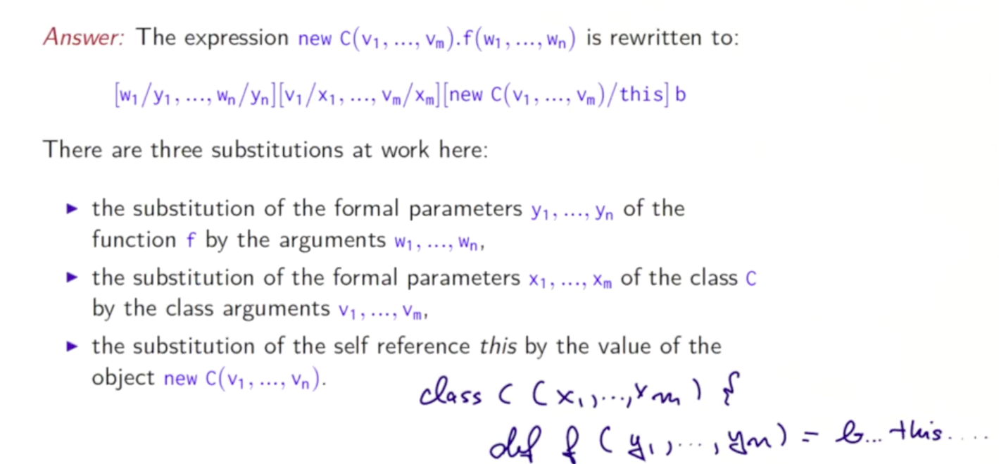

# 고차함수(High Order Function)

- **함수는 다른 함수의 매개변수가 될 수 있고, 반환값이 될 수 있음**
  - 함수형 언어는 함수를 퍼스트 클래스 시티즌으로 다룸
  - 프로그램을 더 유연하게 다룰 수 있게 해줌
  - 다른 함수들을 매개변수로 받거나 다른 함수들을 반환하는 함수를 고차함수라 부름


## 2.1 고차 함수

### 함수 타입

- 타입 `A => B` 타입 A를 인자로 받고 반환 결과가 타입 B임을 뜻함
  - e.g `Int => Int` 는 정수를 정수로 매핑한 함수

### 고차 함수의 합성

```scala
def sum(f: Int => Int, a: Int, b: Int): Int =
  if (a > b) 0
  else f(a) + sum(f, a + 1, b)

def sumInts(a: Int, b: Int) = sum(id, a, b) // sum(x => x, a, b)
def sumCubes(a: Int, b: Int) = sum(cube, a, b) // sum(x => x * x * x, a, b)
def sumFactorials(a: Int, b: Int) = sum(fact, a, b)

def id(x: Int): Int = x
def cube(x: Int): Int = x * x * x
def fact(x: Int): Int = if (x == 0) 1 else fact(x-1)
```

### 익명 함수

- 함수를 매개변수로 전달하는 것이 많은 작은 함수들을 생성할 수 있게 함
  - 가끔은 매개변수로 전달하는 함수를 `def`로 정의하는 것 자체가 귀찮을 수 있음
- 문자열 처럼 함수의 **리터럴** 을 이용하여 이름 없이도 인자로 넘겨줄 수 있음
- 이를 익명 함수(anonymous function)이라 함

```scala
(x: Int) => x * x * x
// (x: Int) parameter
// x * x * x body
```

- 익명 함수는 문법 설탕
  - 모든 익명 함수는 `def`키워드로 정의 가능

## 2.2 커링(Currying)

```scala
def sum(f: Int => Int): (Int, Int) => Int = {
  def sumF(a: Int, b: Int): Int =
    if (a > b) 0
    else f(a) + sumF(a + 1, b)
  sumF
}
```

- sum은 다른 함수를 반환하는 함수
- `sumF`는 주어진 함수 파라미터인 f를 적용하여 결과를 합해줌

```
def sumInts = sum(x => x)
def sumCubes = sum(x => x * x * x)
def sumFactorials = sum(fact)
```

이 함수들은 다른 함수와 같이 적용 가능함

```scala
sumCubes(1, 10) + sumFactorials(10, 20)
```

- 중간 함수를 생략 할 수 있음
  - `sum (cube) (1, 10)`
  - `sum(cube) == sumCubes`
  - `(sum(cube))(1, 10)`

### 다중 파라미터 리스트

- 함수를 반환하는 함수는 함수형 프로그래밍에서 매우 유용하므로, 스칼라에서 특별한 문법을 내장해놓음

```scala
def sum(f: Int => Int)(a: Int, b: Int): Int =
  if (a > b) 0 else f(a) + sum(f)(a + 1, b)
```


### 함수 타입

```scala
def sum(f: Int => Int)(a: Int, b: Int): Int = ...
// (Int => Int) => (Int, Int) => Int
```

- 함수 타입은 오른쪽으로 묶음
  - `Int => (Int => Int)`
- 예시

```scala
def product(f: Int => Int)(a: Int, b: Int): Int = {
  if (a > b) 1
  else f(a) * product(f)(a + 1, b)
}

def fact(n: Int): Int = {
  if (n == 0) 1
  else product(x => x)(1, n)
}
```

- 위의 함수를 일반화 해보자

```scala
def mapReduce(f: Int => Int, combine: (Int, Int) => Int, zero: Int)(a: Int, b:Int): Int =
  if (a > b) zero
  else combine(f(a), mapReduce(f, combine, zero)(a+1, b))

def product(f: Int => Int)(a: Int, b: Int): Int =
  mapReduce(f, (x, y) => x * y, 1)

def fact(n: Int): Int = {
  if (n == 0) 1
  else product(x => x)(1, n)
}
```

## 2.3 Finding Fixed Points


## 2.4 Scala Syntax Summary

### EBNF

- | : denotes an alternative
- [...] : 선택(선택지는 하나인데 그것을 0개 혹은 1개)
- {...} : 반복(0개 혹은 더 많이)
- (...) : 선택(여러가지 선택지중 하나를 고름)

### Types

- Type = SimpleType | FunctionType
- FunctionType = SimpleType => Type
- SimpleType = Ident
- Types = Type( '.' Type )

- type
  - `numeric type`: Int, Double, Byte, Char, Long ...
  - Boolean type
  - String type
  - function type `Int => Int, (Int, Int) => Int`

### Expression

- Expr = InfixExpr | FunctionExpr | if '(' Expr ')' Expr else Expr
- InfixExpr = PrefixExpr | InfixExpr Operator InfixExpr
- Operator = ident
- PrefixExpr = ['+' | '-' | '!' | '~'] SimpleExpr
- SimpleExpr = ident | literal | SimpleExpr '.' ident | Block
- FuncionExpr = Bindings '=>' Expr
- Bindings = ident [':' SimpleType] | '(' [Binding ('.' Binding)] ')'
- Block = '(' {Def ':'}  Expr ')'

### Expression(2)

- 식은 다음과 같음
  - 식별자: x, isGoodEnough
  - 리터럴: 0, 1.0, "abc"
  - 함수 적용: sqrt(x)
  - 연산자 적용: -x, y + x
  - 선택: math.abs
  - 조건식: if (x < 0) -x else x
  - 블록: { val x = math.abs(y); x * 2 }
  - 익명 함수: x => x + 1

### Definitions

- Def = FunDef | ValDef
- FunDef = def ident { '(' [Parameters] ')' } [':' Type] '=' Expr
- ValDef = val ident [':' Type] '=' Expr
- Parameter = ident 'x' [ '=>' ] Type
- Parameters = Parameter {'.' Parameter}

```scala
(x: Int) // call-by-value parameter
(y: => Double) // call-by-name parameter
```

## 2.5 함수와 데이터

- 실수를 다루는 데이터 타입을 만들어보자
- x/y => x(numerator) y(denominator)

```scala
class Rational(x: Int, y: Int) {
  def numer = x
  def denom = y
}
```

- `Rational`이라는 새로운 타입을 정의
- 이러한 타입의 요소를 생성하기 위한 생성자
- 스칼라에서는 타입과 값은 다른 네임스페이스에서 관리하므로 충돌이 없음(컨텍스트에 따라 다른 것을 지칭)

### 오브젝트

- 타입은 값의 집합임
- 클래스 형식에 속하는 값을 객체라고 함

### 메서드

- 데이터 추상화에 함수도 같이 패키징 할 수 있음
- 이러한 함수를 메서드라 함

## 2.6 More Fun With Rationals

### 데이터 추상화1

생성자에서 실수 데이터를 기약분수로 만들어주자

이는 오직 이 클래스에서만 사용되므로 `private`키워드를 사용

```scala
// version 1
class Rational(x: Int, y: Int) {
  private def gcd(a: Int, b: Int): Int =
    if (b == 0) a
    else gcd(b, a % b)
  private val g = gcd(x, y)
  def numer = x / g
  def denom = y / g
}

// numer과 denom이 자주 호출되지 않으면 유리
class Rational(x: Int, y: Int) {
  private def gcd(a: Int, b: Int): Int =
    if (b == 0) a
    else gcd(b, a % b)
  def numer = x / gcd(x, y)
  def denom = y / gcd(x, y)
}

// numer과 denom이 자주 호출되면 유리
class Rational(x: Int, y: Int) {
  private def gcd(a: Int, b: Int): Int =
    if (b == 0) a
    else gcd(b, a % b)
  val numer = x / gcd(x, y)
  val denom = y / gcd(x, y)
}
```

### 자기자신 참조

- `this`

### 우선 조건

- require
  - `require(조건, 메시지 내용)`
  - require내의 조건식이 false인 경우, `IllegalArgumentException`이 throw됨
  - 함수 호출자나 생성자에게 사전 조건을 적용
- assert
  - `assert(조건, 메시지 내용)`
  - `AssertionError`이 throw됨
  - 함수 자체의 코드를 확인하는데에 사용

### 생성자(Constructors)

- 스칼라에서는 암묵적으로 모든 클래스는 주 생성자를 갖고 있음
  - 그 클래스의 매개변수를 받음
  - 클래스의 몸체에 있는 모든 구문을 실행함

```scala
class Rational(x: Int, y: Int) {
  require(y != 0, "denominator should not be zero")

  def this(x: Int) = this(x, 1) // constructor

  private def gcd(a: Int, b: Int): Int =
    if (b == 0) a
    else gcd(b, a % b)
  def numer = x
  def denom = y

  def less(that: Rational) = numer * that.denom < that.numer * denom

  def max(that: Rational) = if(less(that)) that else this

  def add(that: Rational) =
    new Rational(
      numer * that.denom + that.numer * denom,
      denom * that.denom
    )

  def neg() = new Rational(
    -numer,
    denom
  )

  def sub(that: Rational) =
    add(that.neg)

  override def toString() = {
    val g = gcd(numer, denom)
    numer/g + "/" + denom/g
  }
}
```

## 2.7 평가와 연산자




- 대체 모델을 클래스로 확장
- `new C(e1, ... en)`은 어떻게 평가되는가?
  - `e1, ... en`은 일반 함수처럼 평가됨
  - `new C(e1, ... en)`은 이미 값임
- `new C(v1, ... vm).f(w1, ... wn)`은 어떻게 평가되는가?
  - 3가지 대체가 발생
  - 1 클래스 생성자에 관한 대체
  - 2 메서드 f의 인자에 관한 대체
  - 3 메서드 안의 `this`를 리시버(메서드 호출을 받는 것)로 대체


### 연산자(Operators)

스칼라에서는 클래스 단위의 추상화도 기본 타입처럼 연산자를 사용할 수 있음

#### 단계 1: infix 표기

어떠한 매개변수를 갖는 메서드도 infix표기가 가능하다.

```scala
r add s // r.add(s)
r less s // r.less(s)
r max s // r.max(s)
```

#### 단계 2: 식별자 형식 줄이기(Relaxed Identifiers)

연산자는 식별자 처럼 사용할 수 있음

- 식별자
  - Alphanumeric: 문자로 시작해서 문자나 숫자의 연속으로 나타나짐
  - Symbolic: 연산자 심볼로 시작해서(+ - * /), 다른 연산자 심볼들이 뒤따라옴
  - 언더스코어도 문자로 취급
  - Alphanumeric 식별자들은 언더 스코어로 끝날 수 있고 그 뒤에 다른 연산자 심볼들이 올 수 있음

### 실수를 위한 연산자

- 곱셈은 덧셈보다 우선
- 연산자의 우선순위는 첫 번째 문자에 의해서 결정됨(스칼라의 규칙)

```
(모든 문자들)
|
^
&
< >
= !
:
+ -
* / %
(다른 특수 문자들)
```

아래에 가면 갈 수록 우선순위가 높아지는 문자(JAVA, C와 같음)

- a + b ^? c ?^ d less a ==> b | c
  - ((a + b) ^? (c ?^ d)) less ((a ==> b) | c)

## 스칼라 숙제

```scala
package funsets


/**
 * 2. Purely Functional Sets.
 */
object FunSets {
  /**
   * We represent a set by its characteristic function, i.e.
   * its `contains` predicate.
   */
  type Set = Int => Boolean // characteristic function

  /**
   * Indicates whether a set contains a given element.
   */
  def contains(s: Set, elem: Int): Boolean = s(elem)

  /**
   * Returns the set of the one given element.
   */
  def singletonSet(elem: Int): Set =
    (elem2: Int) => elem2 == elem


  /**
   * Returns the union of the two given sets,
   * the sets of all elements that are in either `s` or `t`.
   */
  def union(s: Set, t: Set): Set =
    (elem: Int) => contains(s, elem) || contains(t, elem)

  /**
   * Returns the intersection of the two given sets,
   * the set of all elements that are both in `s` and `t`.
   */
  def intersect(s: Set, t: Set): Set =
    (elem: Int) => contains(s, elem) && contains(t, elem)

  /**
   * Returns the difference of the two given sets,
   * the set of all elements of `s` that are not in `t`.
   */
  def diff(s: Set, t: Set): Set =
    (elem: Int) => contains(s, elem) && !contains(t, elem)

  /**
   * Returns the subset of `s` for which `p` holds.
   */
  def filter(s: Set, p: Int => Boolean): Set =
    intersect(s, p)


  /**
   * The bounds for `forall` and `exists` are +/- 1000.
   */
  val bound = 1000

  /**
   * Returns whether all bounded integers within `s` satisfy `p`.
   */
  def forall(s: Set, p: Int => Boolean): Boolean = {
    def iter(a: Int): Boolean = {
      if (a > bound) true
      else if (contains(s, a) && !contains(filter(s, p), a)) false
      else iter(a+1)
    }
    iter(-bound)
  }

  /**
   * Returns whether there exists a bounded integer within `s`
   * that satisfies `p`.
   */
  def exists(s: Set, p: Int => Boolean): Boolean =
    !forall(s, (elem: Int) => !p(elem))

  /**
   * Returns a set transformed by applying `f` to each element of `s`.
   */
  def map(s: Set, f: Int => Int): Set = {
    def iter(ss: Set, a: Int): Set = {
      if (a > bound) ss
      else if (contains(s, a)) iter(union(ss, singletonSet(f(a))), a+1)
      else iter(ss, a+1)
    }
    iter((elem: Int) => false, -bound)
  }

  /**
   * Displays the contents of a set
   */
  def toString(s: Set): String = {
    val xs = for (i <- -bound to bound if contains(s, i)) yield i
    xs.mkString("{", ",", "}")
  }

  /**
   * Prints the contents of a set on the console.
   */
  def printSet(s: Set) {
    println(toString(s))
  }
}

```
