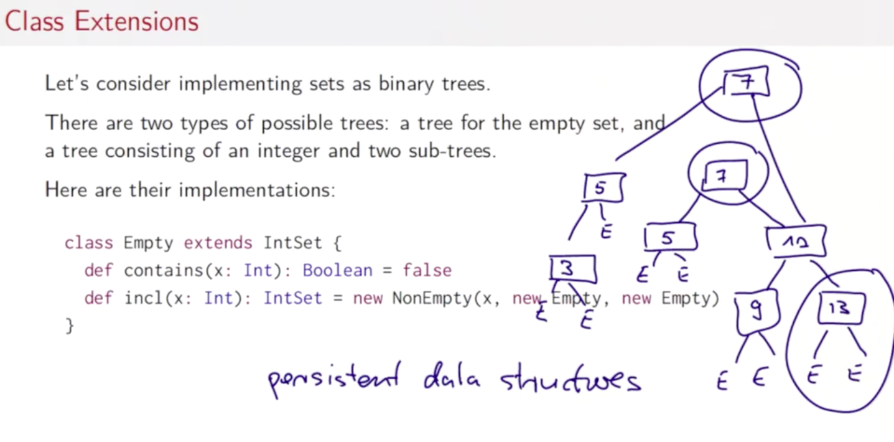
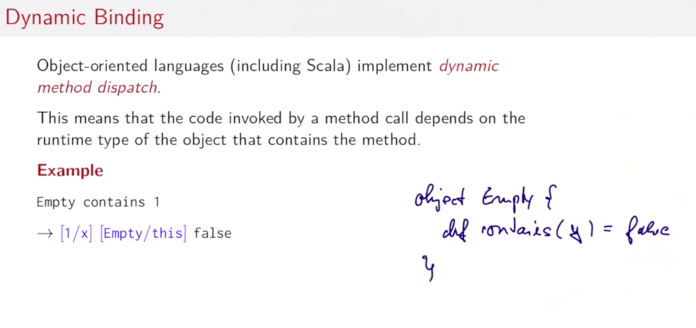
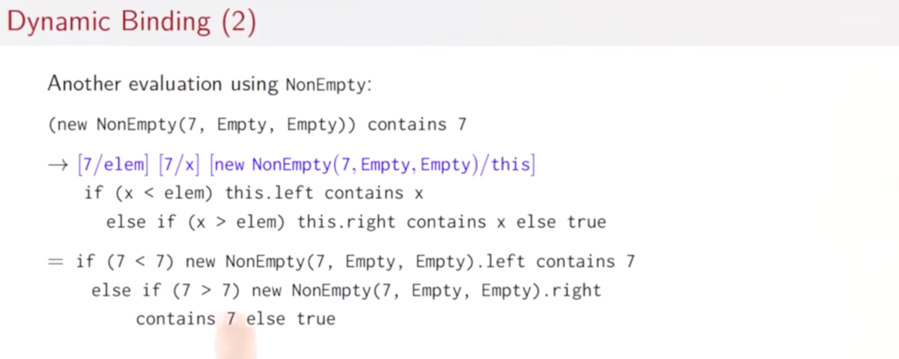
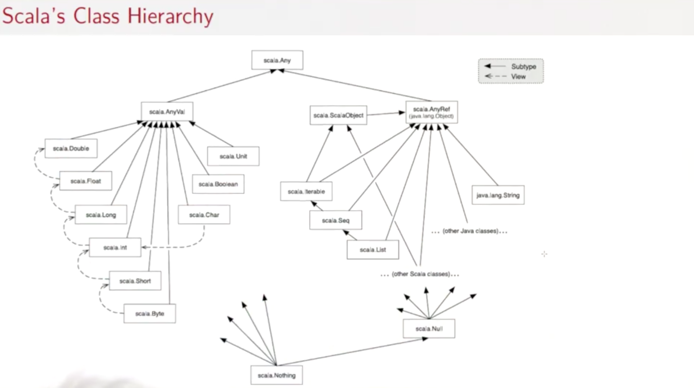
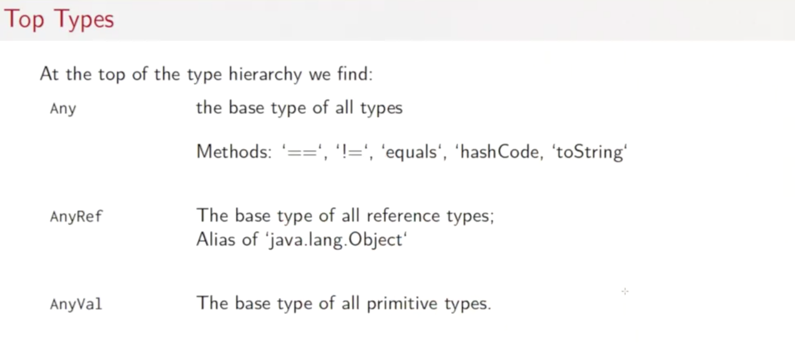
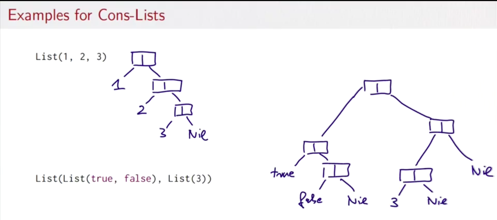

# Data and Abstraction

## 3.1 Class Hierarchies

- 평가 모델이 중요
- 실재 메서드는 해당 메서드의 리시버의 런타입 타입에 따라 달라짐(동적 바인딩)

### 추상 클래스

```scala
abstract class IntSet {
  def incl(x: Int): IntSet
  def contains(x: Int): Boolean
}
```

- 추상 클래스
  - 구현이 없는 멤버를 포함할 수 있음
  - 결국 어떠한 오브젝트도 추상 클래스로부터 생성 불가능(`new`키워드 사용 불가)

### 클래스 확장

- 집합을 구현을 이진트리로 한다고 생각하자
- 두가지의 가능한 트리의 형태가 존재
  - 빈 집합을 위한 트리
  - 정수로 구성된 트리와 그것의 두개의 서브트리

```scala
class Empty extends IntSet {
  def contains(x: Int): Boolean = false
  def incl(x: Int): IntSet = new NonEmpty(x, new Empty, new Empty)
}
```



- 영구 데이터 구조(Persistant data structure)
  - 변경할때도 데이터 구조의 예전 버전은 유지되고 없어지지 않음

```scala

abstract class IntSet {
  def contains(x: Int): Boolean
  def incl(x: Int): IntSet
}

class NonEmpty(elem: Int, left: IntSet, right: IntSet) extends IntSet {
  def contains(x: Int): Boolean =
    if (x < elem) left contains x
    else if (x > elem) right contains x
    else true

  def incl(x: Int): IntSet =
    if (x < elem) new NonEmpty(elem, left incl x, right)
    else if (x > elem) new NonEmpty(elem, left, right incl x)
    else this

  override def toString = "{" + left + elem + right + "}"
}

class Empty extends IntSet {
  def contains(x: Int): Boolean = false
  def incl(x: Int): IntSet = new NonEmpty(x, new Empty, new Empty)
  override def toString = "."
}

```

### 용어

- `Empty`와 `NonEmpty`는 둘다 `IntSet`을 상속한 것
  - 타입 `Empty` 와 `NonEmpty` 는 타입 `IntSet`을 따르게 됨
  - InSet타입의 오브젝트가 필요한 곳에 어디든지 `Empty`와 `NonEmpty`가 사용될 수 있음
- InSet은 Empty와 NonEmpty의 **수퍼 클래스임**
- Empty와 NonEmpty는 IntSet의 **서브 클래스**
- 스칼라에서는 유저가 정의한 클래스는 어떠한 다른 클래스를 상속함
  - 수퍼 클래스가 주어지지 않으면, 표준 클래스 자바의 패키지 java.lang안에 있는 `Object` 클래스(모든 자바 클래스의 루트 클래스)를 상속한다고 추정
  - 클래스 C의 직접적인 / 직접적이지 않은 수퍼클래스는 **C의 베이스 클래스** 라고 함
  - e.g NonEmpty의 베이스 클래스는 IntSet과 Object임

### 구현과 오버라이딩

- Empty와 NonEmpty클래스의 메서드 contains와 incl의 정의는 베이스 트레잇 IntSet에서의 추상 함수를 구현한 것임
- 오버라이딩을 사용해서 수퍼클래스에 현존하는 non-abstract 정의를 재정의 할 수 있음

### 오브젝트 정의

- IntSet의 예시에서는 하나의 empty IntSet만 사실상 필요함
- 이를 오브젝트 정의를 활용해서 더 효율적으로 나타낼 수 있음
- 이는 **싱글톤 오브젝트**
  - 다른 `Empty`라는 이름을 가진 오브젝트는 생성될 수 없음
  - 싱글톤 오브젝트는 값임
  - Empty는 자기자신을 평가

```scala
object Empty extends IntSet {
  def contains(x: Int): Boolean = false
  def incl(x: Int): IntSet = new NonEmpty(x, Empty, Empty)
}
```

### 프로그램

- 이제까지는 REPL로만 스칼라 코드를 실행시킴
- 독자적인 스칼라 애플리케이션을 만드는 것도 가능
  - 모든 그러한 애플리케이션은 main메서드를 갖고있는 오브젝트를 포함함

### 동적 바인딩(Dynamic Binding)





- 객체지향 언어들은 동적 메서드 호출 방식을 구현함
  - 그 메서드를 포함하고 있는 객체의 런타임 타입에 기반하여 해당 메서드에 관한 코드가 실행됨
  - **대체 모델에 기반해서 적용됨**
- 생각해볼 것
  - **동적 호출은 고차함수와 매우 유사**
  - Q 하나의 컨셉을 다른 컨셉으로 구현할 수 있는가?
    - 고차함수로 오브젝트를 구현할 수 있는가?
    - 오브젝트로 고차함수를 구현할 수 있는가?

## 3.2 클래스들이 구성되는 방식

```scala
package progfun.examples

object Hello { ... }
```

- 클래스와 오브젝트는 패키지안에서 구성됨
  - 패키지 안에 오브젝트나 클래스를 배치
- fully qualified name으로 Hello를 참조할 수 있음
  - 패키지이름 + 클래스(오브젝트)이름
  - `scala progfun.examples.Hello`로 Hello프로그램을 실행할 수 있음

프로그램을 가져오는 방법

```scala
import week3.Rational // 패키지내의 Rational을 가져옴 // 이름 임포트

import week3._ // 패키내의 모든것을 가져옴 / 와일드 카드 임포트

import week3.{Rational, Hello} // Rational Hello를 가져옴
```

- 어떠한 객체로부터로도 import를 사용해서 그 오브젝트의 멤버를 가져올 수 있음

### 자동 임포트

- 몇몇 엔티티는 자동적으로 스칼라프로그램에 임포트 된다.
  - `scala`패키지의 모든 멤버들
  - `java.lang`패키지의 모든 멤버들
  - `scala.Predef`싱글톤 오브젝트의 모든 멤버들
- e.g
  - Int => scala.Int
  - Boolean => scala.Boolean
  - Object => java.lang.Object
  - require => scala.Predef.require
  - assert => scala.Predef.assert
- Scaladoc에서 다른 표준 스칼라 라이브러리를 확인할 수 있음

### 트레잇

```scala
trait Planer {
  def height: Int
  def width: Int
  def surface = height * width
}
```

- 자바와 마찬가지로 스칼라에서는 하나의 수퍼클래스만 가질 수 있음
- 만일 하나의 클래스가 상속해야하는 여러가지 수퍼타입들이 존재하면?
- 트레잇 사용
  - 자바의 `interfaces`와 비슷하나, 필드를 갖을 수 있고, 구체적 메서드(구현이 된)를 갖을 수 있다는 점에서 더 강력함
  - 트레잇은 값 매개변수를 갖을 수 없음

```scala
class Square extends Shape with Planer with Movable ...
```





### Nothing 타입

- 스칼라 타입 계층의 바닥
- 모든 타입들의 서브타입임
- Nothing에는 값이 없음
- 용도
  - 비정상적인 종료
  - 빈 컬렉션의 표현

#### 예외

- `throw Exc`
- 예외 Exc와 함꼐 평가를 막음
- 이 식의 타입은 Nothing

### Null 타입

- 모든 참조 클래스 타입은 `null`을 값으로 갖고 있음
- null의 타입은 Null
- Null은 모든 오브젝트클래스를 상속하는 클래스의 서브타입
  - `AnyVal`의 서브타입들과는 호환할 수 없음

```scala
val x = null // x: Null
val y: String = null // y: String
val z: Int = null // error: type mismatch
```

```scala
if (true) 1 else false // AnyVal
```

## 3.3 Polymorphism

- 타입 매개변수화

### Cons-Lists



- 불변 연결 리스트
- 구성 요소
  - Nil
    - 빈 리스트
  - Cons
    - 구성 요소를 포함하는 장소와 그외 리스트의 나머지

### 스칼라에서의 Cons-Lists

```scala
package week4

trait IntList ...
class Cons(val head: Int, val tail: IntList) extends IntList ...
class Nil extends IntList ...
```

- 리스트는
  - 빈 리스트인 `new Nil`혹은
  - new Cons(x, xs)
    - head: x
    - tail: xs

### 값 매개변수

위의 Cons는 다음과 같음

```scala
class Cons(_head: Int, _tail: IntList) extends IntList {
  val head = _head
  val tail = _tail
}
```

### 타입 매개변수

- 위의 코드는 `Int`의 요소만 해당하게 너무 좁은 정의
- Double 리스트, ... 여러가지 타입에 대한 클래스 계층이 필요함
- 이를 타입 매개변수를 통해서 일반화 가능
- e.g
  - `[T]`

```scala
package week4

trait List[T]
class Cons[T](val head: T, val tail: List[T]) extends List[T]
class Nil[T] extends List[T]
```

### 제네릭 함수

- 함수 역시 타입 매개변수를 갖을 수 있음
- 하나의 요소를 갖는 리스트를 만드는 함수

```scala
def singleton[T](elem: T) = new Cons[T](elem, new Nil[T])

singleton[Int](1)
singleton[Boolean](true)
```

### 타입 추론

- 스칼라 컴파일러는 함수 호출의 인자값을 보고 보통 알맞은 타입 매개변수를 추론할 수 있음
- 그래서 대부분의 경우는 타입 매개변수는 생략해도 됨

```scala
singleton(1)
singleton(true)
```

### 타입과 평가

- 타입 매개변수는 스칼라에서 평가에 영향을 주지 않음
- 프로그램을 평가하기 전에 모든 타입 인자와 매개변수가 지워진다고 생각해도 됨
- 이는 타입 삭제라고도 함
  - Java Scala Haskell ML OCaml이 채용
  - c.f
    - C++ C# F#은 런타임에도 남음

### 폴리모피즘(다형성)

function type comes in many forms

- 함수는 다양한 타입의 매개변수에 적용될 수 있음
- 타입은 다양한 타입의 인스턴스를 갖을 수 있음
- 종류
  - **서브타이핑**
    - 서브 클래스의 인스턴스는 베이스 클래스로 넘겨질 수 있음
    - 전통적 OOP개념
  - **제네릭**
    - 함수나 클래스의 인스턴스들이 타입 매개변수화로 생성됨
    - 함수형 언어 특징

```scala

object Hello {
  def main(args: Array[String]): Unit = {
    val list1 = new Cons(1, new Nil)
    val list2 = new Cons(13, list1)
    val list3 = new Cons(2, list2)
    val list4 = new Cons(1, new Cons(13, new Cons(2, new Nil)))
    println(list3)
    println(list3.nth(1))
    println(list4)
    println(list4.nth(4)) // index out of bound exception
  }
}

trait List[T] {
  def isEmpty: Boolean
  def head: T
  def tail: List[T]
  def nth(n: Int): T
}

class Cons[T](val head: T, val tail: List[T]) extends List[T] {
  // already head, tail fields implemented
  // difference between def and eval is only initialization
  def isEmpty = false
  def nth(n: Int): T = {
    def nthHelper(n: Int, list: List[T]): T = {
      if (list.isEmpty) throw new IndexOutOfBoundsException()
      else if (n == 0) list.head
      else nthHelper(n-1, list.tail)
    }
    nthHelper(n, this)
  }
  override def toString: String = {
    def toStringHelper(list: List[T]): String = {
      if(list.tail.isEmpty) list.head.toString
      else list.head.toString + ", " + toStringHelper(list.tail)
    }
    toStringHelper(this)
  }
}

class Nil[T] extends List[T] {
  def isEmpty: Boolean = true
  def head: Nothing = throw new NoSuchElementException("Nil.head")
  def tail: Nothing = throw new NoSuchElementException("Nil.head")
  def nth(n: Int): Nothing = throw new IndexOutOfBoundsException()
  override def toString: String = "Nil"
}

```
