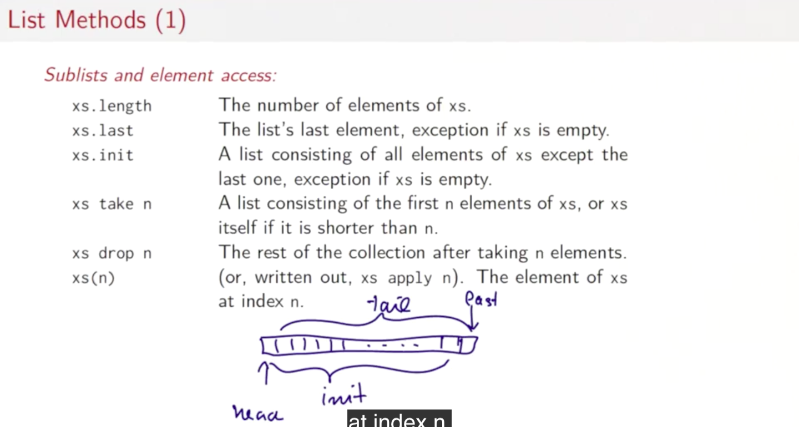
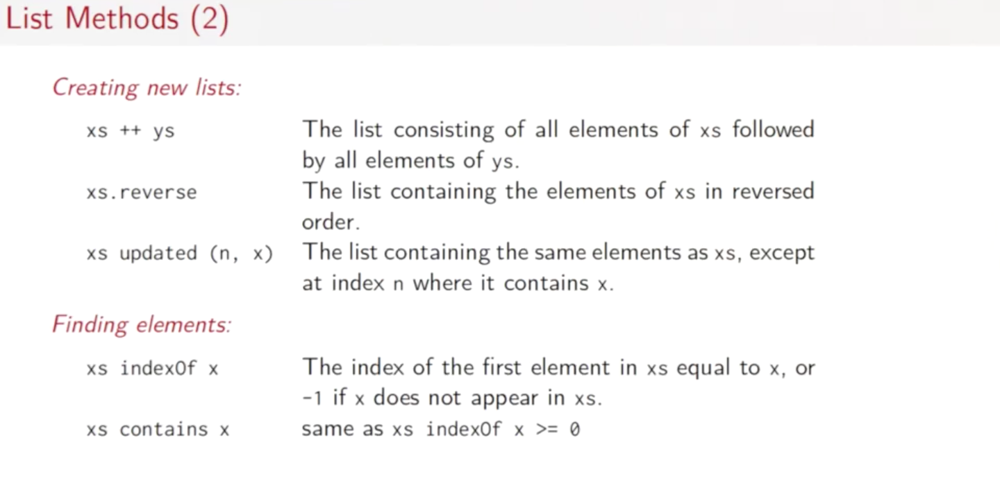
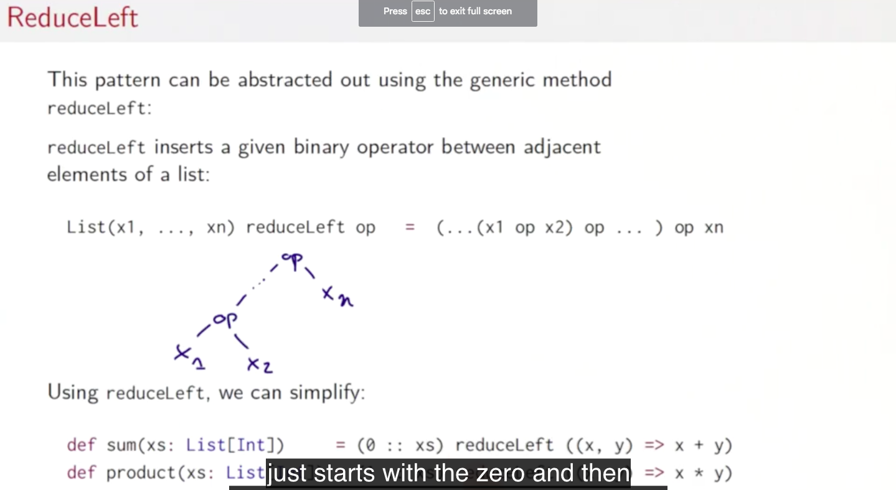
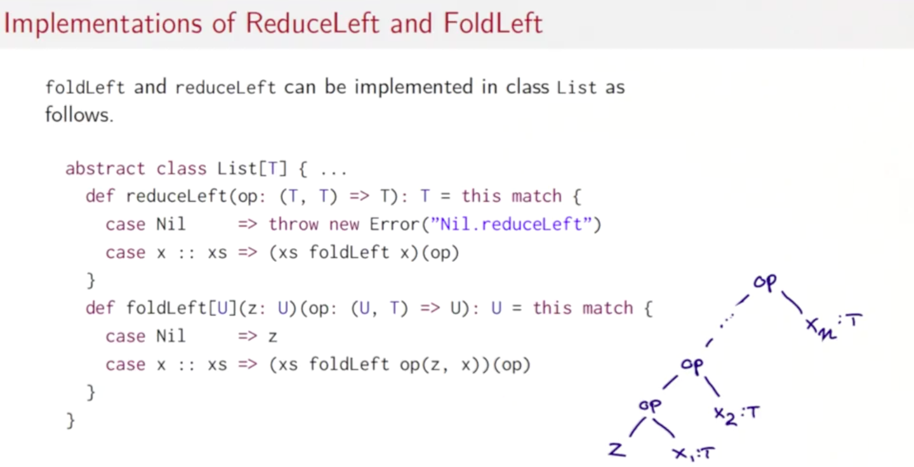
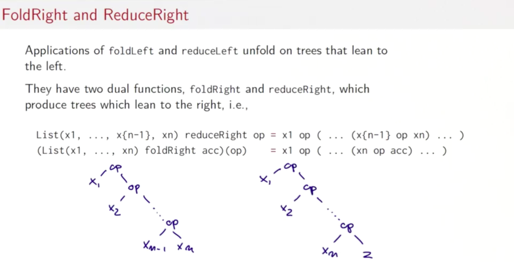

# Lists

- 목차
  - More Functions on Lists
  - Pairs and Tuples
  - Implicit Parameters
  - Higher-Order List Functions
  - Reduction of Lists
  - Reasoning About Concat
  - A Larger Equational Proof on Lists

## 5.1 More Functions on Lists

유용한 리스트 프로세싱을 알아보자.





### last의 구현

상수 시간의 효율적인 구현이가능할까?

```scala
def last[T](xs: List[T]): T = xs match {
  case List() => throw new Error("last of empty list")
  case List(x) => x
  case y :: ys => last(ys)
}
```

위의 구현은 `O(n)`

```scala
def init[T](xs: List[T]): List[T] = xs match {
  case List() => throw new Error("init of empty list")
  case List(x) => nil
  case y :: ys => y :: init(ys)
}
```

위의 구현은 `O(n)`

### concatenation의 구현

```scala
def concat[T](xs: List[T], ys: List[T]) = xs match {
  case List() => ys
  case z :: zs => z :: concat(zs, ys)
}
```

시간 복잡도 O(xs의 요소수)

### reverse의 구현

```scala
def reverse[T](xs: List[T]): List[T] = xs match {
  case Nil => xs
  case y :: ys => reverse(ys) ::: List(y)
}
```

- 시간 복잡도 O(xs^2)
- 더 나은방법은 나중에 확인

### removeAt의 구현

```scala
def removeAt[T](n: Int, xs: List[T]) = xs.take(n) ::: xs.drop(n+1)
```

### flatten의 구현

```scala
def flatten(xs: List[T]): List[T] = xs match {
  case Nil => Nil
  case y => y
  case List(y) => flatten(y)
  case y :: ys => flatten(y) :: flatten(ys)
}
```

## 5.2 Pairs and Tuples

### 리스트를 보다 빠르게 정렬하기

- 머지 소트 사용
  - 리스트를 두개의 부분 리스트로 나눔. 각각의 리스트는 원래 리스트의 절반의 요소를 포함
  - 두 부분 리스트를 소팅함
  - 두 부분 리스트를 하나의 리스트로 병합함

```scala
def msort(xs: List[Int]): List[Int] = {
  val n = xs.length / 2
  if (n == 0) xs
  else {
    def merge(xs: List[Int], ys: List[Int]): List[Int] = {
      if (xs.isEmpty) ys
      else if (ys.isEmpty) xs
      else if (xs.head < ys.head) xs.head :: merge(xs.tail, ys)
      else ys.head :: merge(xs, ys.tail)
    }

    def merge2(xs: List[Int], ys: List[Int]): List[Int] =
      xs match {
        case Nil => ys
        case x :: xtail =>
          ys match {
            case Nil => xs
            case y :: ytail =>
              if (x < y) x :: merge2(xtail, ys)
              else y :: merge2(xs, ytail)
          }
      }
    val (ys, zs) = xs splitAt n
    merge(
      msort(ys),
      msort(zs)
    )
  }
}
```

### SplitAt 함수

- 리스트에 대한 `splitAt` 마수는 두개의 서브리스트를 반환함
  - 주어진 인덱스 까지의 요소들
  - 주어진 인덱스 이상의 인덱스를 갖는 요소들
  - 이는 `pair`로 반환

### Pair와 Tuples

- 페어는 x와 y로 구성되며, `(x, y)`로 작성됨
- `val pair = ("answer", 42)` > `pair: (String, Int) = (answer, 42)`
- 패턴매칭으로 변수 할당 가능
  - `val (label, value) = pair`

### Tuple의 해석

- 튜플의 타입 `(T1, ... Tn)`은 매개변수화 된 타입 `scala.Tuplen[T1, ..., Tn]`과 같음
- 튜플 식 (e1, ..., en)은 다음과 같음
  - `scala.Tuplen(e1, ..., en)`
- 튜플 패턴 (p1, ..., pn)은 생성자 패턴과 동등함
  - `scala.Tuplen(p1, ..., pn)`

### Tuple class

```scala
case class Tuple2[T1, T2](_1: +T1, _2: +T2) {
  override def toString = "(" + _1 + "," + _2 + ")"
}
```

- 튜플의 필드는 _1, _2, ... 으로 접근할 수 있음
  - `val (label, value) = pair`도 가능하지만
  - `val label = pair._1` `val value = pair._2` 도 가능

#### msort의 merge 다시 정의하기

```scala
def merge3(xs: List[Int], ys: List[Int]): List[Int] =
  (xs, ys) match {
    case (Nil, yss) => ys
    case (expression, Nil) => xs
    case (x :: xss, y :: yss) => {
      if (x < y) x :: merge(xss, ys)
      else y :: merge(xs, yss)
    }
  }
```

아주 깔끔해졌다.

## 5.3 Implicit parameters

### 정렬 함수의 일반화

- 어떻게 msort를 매개변수화 해서 Int이외의 다른 타입에서도 소팅을 할 수 있도록 할 수 있을까?
  - `def msort[T](xs: List[T]): List[T] = `
  - 이는 `<`가 임의의 타입 T에 정의되지 않으므로 사용할 수 없음
- 필요한 비교 함수를 merge의 매개변수화 함

### 정렬의 매개변수화

- 가장 유연한 디자인은 `sort`함수를 다형적으로 만들고, 비교 연산을 추가 매개변수로 넘겨주는 것
  - 비교 함수를 마지막에 넣어주면 컴파일러가 타입 추론을 함.

```scala
def msort[T](xs: List[T])(lt: (T, T) => Boolean) = {
  ...
  merge(msort(fst)(lt), msort(snd)(lt))
}

def merge(xs: List[T], ys: List[T]) = (xs, ys) match {
  ...
  case (x :: xs1, y :: ys1) =>
    if (lt(x, y)) ...
    else ...
}
```

### Ordered를 이용한 매개변수화

- 표준 라이브러리로 정렬을 도와주는 `Ordering`이라는 것이 존재
  - `scala.math.Ordering[T]`
- 타입 T의 요소를 비교할 방법을 제공. 그러므로 `lt`연산을 직접 매개변수로 넘겨주는 대신 `Ordering`을 넘겨주면 됨

```scala
def msort[T](xs: List[T])(ord: Ordering) =
  def merge(xs: List[T], ys: List[T]) =
    ... if (ord.lt(x, y)) ...

  ... merge(msort(fst)(ord), msort(snd)(ord)) ...
```

### Implicit parameter

- `lt`나 `ord`값을 넘겨주는 것은 매우 귀찮음
- 이를 `implicit`매개변수로 만들어주는 것으로 해결 가능
  - 컴파일러가 type에 따라서 알아서 찾아줌

```scala
def msort[T](xs: List[T], ys: List[T])(implicit ord: Ordering) =
  def merge ...
```

### implicit 매개변수의 규칙

- 타입 T의 암묵적 매개변수를 받는 함수가 있다고 하면, 컴파일러는 암묵적 매개변수의 정의를 다음과 같이 찾기 시작함
  - `implicit` 키워드가 마크됨
  - 타입 `T`와 호환가능함
  - 함수 호출의 지점에서 접근 가능하거나, `T`의 컴페니언 오브젝트에 정의되어 있음
  - 만일, 하나라도 가장 특정한 정의가 있다면, 이를 implicit의 인자로 넘겨주고 그것이 없다면 에러를 냄

## 5.4 Higher-Order List Functions

### Recurring Patterns for Computations on Lists

- 리스트에 적용하는 함수는 유사한 구조를 갖고 있음
- 몇몇의 재귀 패턴을 확인 가능함
  - **map: 리스트의 각각의 요소를 특정한 방법으로 변화**
  - **filter: 어떠한 조건을 만족하는 모든 리스트의 요소들을 구함**
  - **reduce: 연산자를 사용해서 리스트의 요소들을 결합함**
- 함수형 언어들은 `고차 함수`를 사용해서 제네릭 함수를 작성할 수 있도록 함

### 리스트의 요소들에게 함수를 적용

```scala
def scaleList(xs: List[Double], factor: Double): List[Double] = xs match {
  case Nil => xs
  case y :: ys => y * factor :: scaleList(ys, factor)
}
```

#### Map으로 일반화

```scala
abstract class List[T] { ...
  def map[U](f: T => U): List[U] = this match {
    case Nil => this
    case x:: xs => f(x) :: xs.map(f)
  }
}
```

- 원래의 map은 보다 복잡함
  - 꼬리 재귀
  - 임의의 컬렉션에 전부 동작해야 함

```scala
def scaleList(xs: List[Double], factor: Double): List[Double] =
  xs map (x => x * factor)

def squareList(xs: List[Int]): List[Int] =
  xs map (x => x * x)
```

### Filtering

- 주어진 조건을 만족하는 모든 요소들로 구성되는 리스트를 반환

```scala
def posElems(xs: List[Int]): List[Int] = xs match {
  case Nil => xs
  case y :: ys => if (y > 0) y :: posElems(ys) else posElems(ys)
}
```

#### Filter로 일반화

```scala
abstract class List[T] {
  ...
  def filter(p: T => Boolean): List[T] = this match {
    case Nil => this
    case x :: xs => if (p(x)) x :: xs.filter(p) else xs.filter(p)
  }
}
```

```scala
def posElems(xs: List[Int]): List[Int] =
  xs filter (x => x > 0)
```

#### Filter의 변형

- `xs filterNot p`
  - p의 조건을 만족하지 않는 리스트의 요소들을 반환
- `xs partition p`
  - `(xs filter p, xs filterNot p)`와 같음
  - 한번의 traverse로 생성
- `xs takeWhile p`
  - p의 조건을 만족하는 가장 요소들을 처음부터 모음
- `xs dropWhile p`
  - p의 조건을 만족하는 처음 요소들을 제거한 뒤의 남은 리스트 xs의 요소
- `xs span p`
  - `(xs takeWhile p, xs dropWhile p)`

```scala
def pack[T](xs: List[T]): List[List[T]] = xs match {
  case Nil => Nil
  case x :: xss => {
    val (first, rest) = xs.span(y => y == x)
    first :: pack(rest)
  }
}

println(pack(List("a", "a", "a", "b", "c", "c", "a"))) // List(List(a, a, a), List(b), List(c, c), List(a))

def encode[T](xs: List[T]): List[(T, Int)] =
  pack(xs).map(l => (l.head, l.size))

println(encode(List("a", "a", "a", "b", "c", "c", "a"))) // List((a,3), (b,1), (c,2), (a,1))
```

## 5.5 Reduction of Lists

### Reduction of lists

- 리스트의 요소들을 연산자와 함께 결합함

```scala
def sum(xs: List[Int]): Int = xs match {
  case Nil => 0
  case y :: ys => y + sum(ys)
}
```

### Reduce Left



- 위의 패턴을 일반화
- 2항 연산자를 이용해서 값을 결합해 나감
  - `List(x1, x2 ... xn) reduceLeft op = (...(x1 op x2) op ...) op xn`

```scala
def sum(xs: List[Int]): Int = (0 :: xs) reduceLeft ((x, y) => x + y)
def product(xs: List[Int]): Int = (1 :: xs) reduceLeft ((x, y) => x * y)

def sum(xs: List[Int]): Int = (0 :: xs) reduceLeft (_ + _)
def product(xs: List[Int]): Int = (1 :: xs) reduceLeft (_ * _)
```

### FoldLeft

- reduceLeft보다 더 일반적인 함수
  - `accumulator`가 존재

```scala
def sum(xs: List[Int]) = (xs foldLeft 0)(_ + _)
def product(xs: List[Int]) = (xs foldLeft 1)(_ * _)
```

### ReduceLeft와 FoldLeft의 구현



- 연산의 흐름을 **트리로 나타낸 것이 주요**

```scala
abstract class List[T] {...
  // 타입 어노테이션을 주의하자
  def reduceLeft(op: (T, T) => T): T = this match {
    case Nil => throw new Error("Nil.reduceLeft")
    case x :: xs => (xs foldLeft x)(op)
  }

  def foldLeft[U](z: U)(op: (U, T) => U): U = this match {
    case Nil => z
    case x :: xs => (xs foldLeft op(z, x))(op) // op를 미리 평가
  }
}
```

### FoldRight / ReduceRight



- `foldLeft`와 `reduceLeft`는 왼쪽으로 치우친 트리
- `foldRight`와 `reduceRight`는 오른쪽으로 치우친 트리
  - `List(x1, ... xn) reduceRight op = x1 op( ... (x{n-1} op xn))`
  - `(List(x1, ..., xn) foldRight acc)(op)`

### FoldRight / ReduceRight의 구현

```scala
def reduceRight(op: (T, T) => T): T = this match {
  case Nil => throw new Error("Nil.reduceRight")
  case x :: Nil => x
  case x :: xs => op(x, xs.reduceRight(op))
}

def foldRight[U](z: U)(op: (T, U) => U): U = this match {
  case Nil => z
  case x :: xs => op(x, xs.foldRight(z)(op)) // op를 나중에 평가
}
```

### FoldLeft와 FoldRight의 차이

- associative와 commutative한 연산자에 관해서는 둘다 동일함
  - 효율성에는 차이가 있을 수 있음
- 하지만 가끔은, 둘중 오직 하나만 적절한 경우가 있음

#### 예제

```scala
def concat[T](xs: List[T], ys: List[T]): List[T] =
  (xs foldRight ys)(_ :: _)
```

이는 `foldRight`만 사용가능

```scala
def mapFun[T, U](xs: List[T], f: T => U): List[U] =
  (xs foldRight List[U]())(f(_) :: _)

def lengthFun[T](xs: List[T]): Int =
  (xs foldRight 0)((_, acc) => acc + 1)
```
