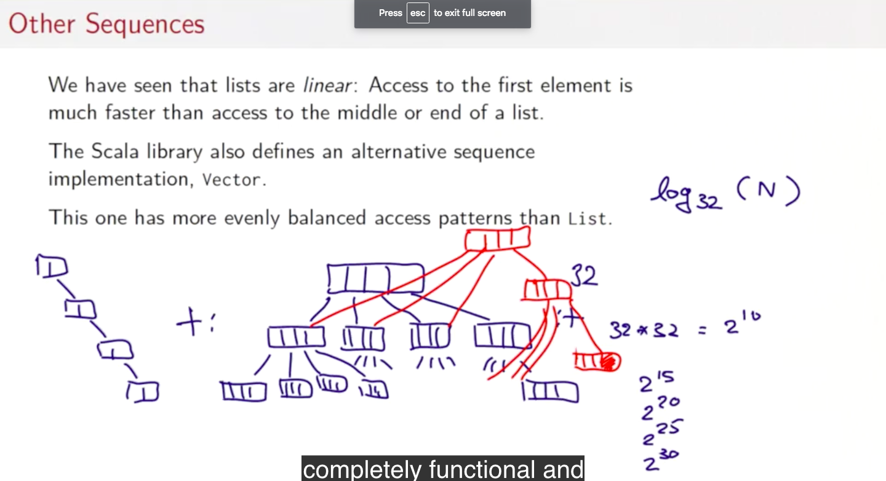
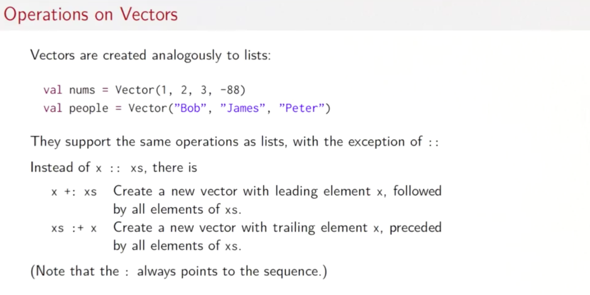
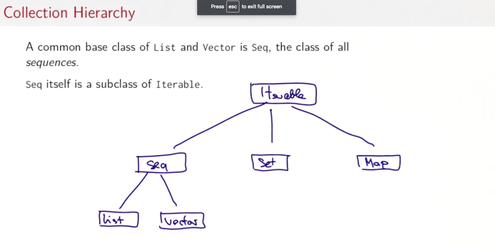

# Other collections

- 목차
  - Other collections
  - Combinatorial Search and For-Expression
  - Combinatorial Search Example
  - Maps
  - Putting the Pieces Together
  - Conclusion

## 다른 수열들(Sequences)

모두 변경 불가능

### vector



- 균형있는 접근 패턴(리스트는 head만 상수시간에 접근 가능)
- 매우 얕은 트리로 되어있음
  - 요소 수가 32개까지는 단순 배열
  - 32개 초과
    - 각각의 요소가 32의 크기를 갖는 단순 배열로 변경
  - 32*32개 초과
    - 2^15개의 요소를 갖는 단순 배열로 변경
  - 요소를 구함
    - O(log32(N))
  - 요소를 삽입
    - O(log32(N))
    - 변경이 들어가는 부분을 새로운 array로 만들어서 채우고, 그 변경의 영향을 받는 부분을 전부 새로 교체
- 왜 리스트를 그래도 사용하는가
  - head를 추출하는 경우, vector는 시간적 복잡도가 O(log32(N))이므로 더 시간이 걸림
  - tail을 추출하는 경우, vector는 훨씬 더 많은 시간적 복잡도가 걸림
  - map, fold, filter는 vector가 더 나음

#### vector에서의 연산들



- 리스트와 대체로 비슷함

### 컬렉션 계층



### 배열과 문자열

- 배여과 문자열은 Seq와 같은 연산들을 지원함. 또한, 언제든지 sequences로 바뀔 수 있도록 할 수 있음
  - 하지만 Seq의 서브 클래스로는 될 수 없다(자바에서 가져왔기 때문)

```scala
val xs: Array[Int] = Array(1, 2, 3)
xs map (x => 2 * x)

val ys: String = "Hello, World!"
ys filter (_.isUpper)
```

### Ranges

- 간단한 종류의 수열(sequence)
- 고르게 균형잡힌 정수를 표현함
  - to(상한 경계 포함), until,(상한 경계 미포함) by(간격 값)
- Ranges는 3개의 필드를 가진 단순 오브젝트임
  - lower bound
  - upper bound
  - step

```scala
val r: Range = 1 until 5 // 1, 2, 3, 4
val s: Range = 1 to 5 // 1,2,3,4,5
1 to 10 by 3 // 1,4,7,10
6 to 1 by -2 // 6,4,2
```

### 다양한 수열 연산자들

- xs exists p
- xs forall p
  - 모든 xs의 요소가 p(x)를 만족하는가
- xs zip ys
  - xs와 ys의 요소를 페어로 순서대로 나타냄
  - `(List zip String)`도 가능
- xs.unzip
  - 페어의 수열 xs를 두개의 수열로 분리(first, 나머지)
- xs.flapMap f
  - map한 뒤 결과들을 concat함
- xs.sum
- xs.product
- xs.max
  - Ordering이 반드시 존재해야 함
- xs.min

#### 에제

```scala
(1 to M) flatMap { x =>
  (1 to N) map { y =>
    (x, y)
  }
}
```

```scala
def scalarProduct(xs: Vector[Double], ys: Vector[Double]): Double =
  (xs zip ys).map(xy => xy._1 * xy._2).sum
```

**패턴 매칭 함수 값** 을 이용하면 더 아름답게 코드를 짤 수 있음

```scala
def scalarProduct(xs: Vector[Double], ys: Vector[Double]): Double =
  (xs zip ys).map{ case (x, y) => x * y }.sum
```

일반적으로 함수값

`{ case p1 => e1 ... case pn => en }`은 다음과 같다.

`x => x match { case p1 => e1 ... }`

```scala
def isPrime(n: Int): Boolean =
  if (n == 1) false
  else (2 to n-1) forall ((d) => n % d !== 0)
```
