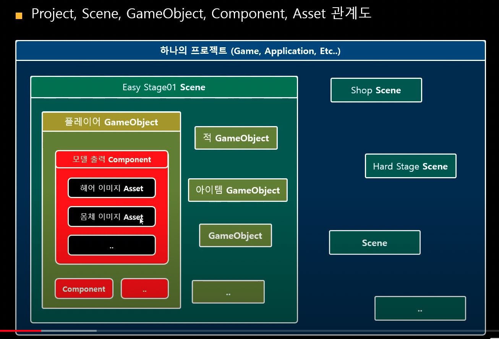
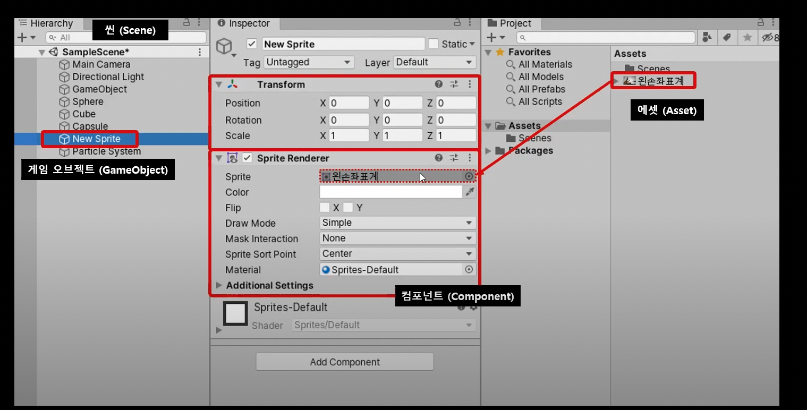
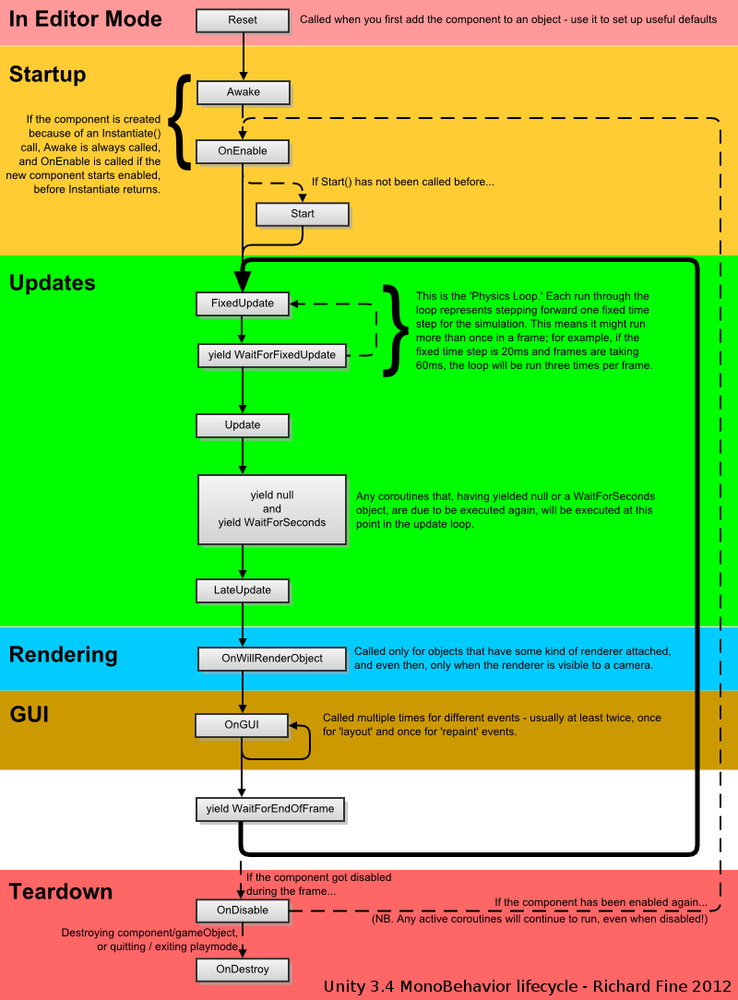

# 유니티

- TODOs
- 의문
- 유니티 느낀점
- 좋은 공부 방식
- Unity 기본 용어
  - 유니티 엔진
  - Project
  - Scene
  - GameObject
  - Component
  - Asset
  - Prefab
- Unity 패턴
  - 게임 오브젝트 사이의 커뮤니케이션 및 아키텍처
- Unity 기본 개념
  - 유니티 이벤트 함수
  - 코루틴
- Unity UI
  - Rect Transform
- Physics
  - Rigidbody 2D

## TODOs

- [Unity architecture](https://docs.unity3d.com/Manual/unity-architecture.html)

## 의문

- 여러개의 `Awake()`메서드가 있을경우, 어떤 게임 오브젝트의 `Awake()`가 먼저 실행되는가? 이것은 랜덤인가?
  - 그렇다고 한다
- GameObject의 컴포넌트끼리 어떤식으로 상호작용 하는게 바람직한것인가? 특히 Prefab을 사용하는 경우에는? 기획자에게 편한 UI를 제공하는 경우에는?
  - 유명한 디자인 패턴같은게 있을까?
- 해상도 이슈를 어떻게 해결하는게 가장깔끔한가?
  - 주 해상도에 맞추고, 나머지는 짤려도 중앙기준으로 정렬해서 자연스럽게?
- 일부의 component는 disable이 불가능한데? 왜 그렇지?
  - enable, disable은 유니티의 `MonoBehaviour`의 이벤트메서드(`Start`, `Awake`, `Update`, etc)만 disable하는 것임
    - 그러므로, 해당 메서드가 존재하지 않으면 disable도 불가능

## 유니티 느낀점

- OOP기반의 게임 엔진
  - DI
    - 각종 값들이나 Game Object, Component를 유니티 에디터에 드래그 앤 드롭으로 넣어줄 수 있음
  - IOC
    - 게임 컴포넌트 스크립트가 IOC의 형태
      - 라이프사이클에 따라 알아서 메시지를 보내주고, 오브젝트는 받은 메시지를 메서드에 따라서 알아서 실행함
- 이벤트 드리븐
  - 이벤트 메서드를 정의하여, 매 프레임 마다 오브젝트가 해야할 행동의 메시지를 받고 처리함
- 뷰와 로직의 분리
  - 뷰는 유니티 에디터에서 다룸
  - 로직은 유니티 스크립트에서 Component로 작성하고 뷰의 게임 오브젝트에 DI 시켜줌(composition)

## 좋은 공부 방식

- 간단한 게임 하나 만들면서 인터페이스 익숙해지고, 코드 작성해보기
- 유니티 기본 용어 정리하기
- 참고 사이트
  - [1 따라하면서 배우는 고박사의 유니티 하이퍼캐주얼게임 시리즈 01](https://www.inflearn.com/course/%EA%B3%A0%EB%B0%95%EC%82%AC-%ED%95%98%EC%9D%B4%ED%8D%BC%EC%BA%90%EC%A5%AC%EC%96%BC-1)
  - [2 Unity learn](https://learn.unity.com/)

## Unity 기본 용어

Project, Scene, GameObject, Component, Asset 관계도1

Project, Scene, GameObject, Component, Asset 관계도2

- 유니티 엔진
  - 제공하는 것
    - 화면에 2D, 3D이미지를 표현하는 것
    - 사운드를 재생하는 것
    - 물리 처리
- Project
  - 정의
    - 하나의 게임, 콘텐츠, 애플리케이션을 의미
- Scene
  - 정의
    - 게임의 장면이나 상태를 저장하는 단위
  - 특징
    - 거대한 게임을 씬 단위로 관리
      - 내부에는 Game Object가 존재
- GameObject
  - 정의
    - 씬에 배치되는 하나의 물체를 지칭하는 단위
  - 특징
    - 원하는 컴포넌트를 추가하여 다양한 오브젝트 제작 가능
    - e.g)
      - 적 오브젝트
      - 나무 오브젝트
      - 공격 효과음 오브젝트
      - 불 이펙트 오브젝트 등
  - 종류
    - 2D
      - Sprite
        - 게임 화면에 2D 이미지를 보이게 하는 게임 오브젝트
    - UI
      - 사용자가 게임과 상호작용 할 수 있는 GUI 오브젝트들
    - Camera
      - 플레이어가 게임 월드를 볼 수 있는 눈 역할
      - 컴포넌트
        - Camera 컴포넌트
          - 게임 월드를 볼 수 있는 눈 역할
          - Clear Flags
            - 오브젝트가 존재하지 않는 빈 배경을 어떻게 채울지 결정하는 요소
              - 2D 게임은 주로 Solid Color
              - 3D 게임은 주로 Skybox
          - Projection
            - 카메라의 시점을 나타내며, 2D와 3D 시점이 존재
          - Clipping Planes
            - 카메라가 오브젝트를 볼 수 있는 시야 거리
              - 시야가 늘어나서 그리는 오브젝트 수가 많아지면 성능에 영향을 미칠 수 있음
          - Viewport Rect
            - 카메라가 본 것을 회면에 출력하는 영역(min 0, max 1)
        - Audio Listener 컴포넌트
          - Audio Source 컴포넌트가 내는 소리르 듣는 역할
      - 특징
        - 씬에 최소 1개 이상 존재해야 함
    - Light
      - 현실세계의 빛 역할을 담당
      - 특징
        - 빛을 이용해 모델의 재질이나, 색상을 다양한 형태로 보여주는데 사용됨
    - 주의
      - 스크립트를 컴포넌트로 적용하기 위한 조건
        1. 스크립트 파일이름과 클래스 이름이 같아야 함
        2. 부모 클래스로 `MonoBehaviour`를 상속받아야 함
- Component
  - 정의
    - 게임 오브젝트에 부착할 수 있는 C# 스크립트 파일을 지칭하는 단위
    - 게임 오브젝트에 컴포넌트를 부착하여 여러 기능 부여
  - 종류
    - Renderer
      - Sprite renderer
        - 2D
      - Mesh renderer
        - 3D
    - Transform
      - 모든 게임 오브젝트가 갖는 컴포넌트
      - 위치/회전/크기를 제어
    - Audio Source
      - 사운드 에셋을 재생
    - Mesh Filter(3D)
      - 3차원 오브젝트의 외형
    - Mesh Renderer(2D)
      - 3차원 오브젝트의 표면
    - Box Collider
      - 게임 오브젝트의 충돌 범위 설정
  - 유니티에서 제공하지 않는 것들
    - 애셋 스토어에서 가져옴
    - 직접 만듬
- Asset
  - 정의
    - 프로젝트 내부에서 사용하는 모든 리소스를 지칭하는 단위
  - 예시
    - Audio, 3D Model, Animation, Texture, Script, Prefab, ...
- Prefab(프리팹)
  - 정의
    - Hierarchy View에 있는 게임 오브젝트를 파일 형태로 저장하는 단위
  - 특징
    - 주로 게임 중간에 생성되는 게임 오브젝트를 프리팹을 저장해두고 사용
  - 장점
    - 동일한 게임 오브젝트를 여러 Scene이나 게임 월드 특정 장소에 배치할 때, Project View에 저장되어 있는 프리팹을 Drag & Drop하여 배치 가능
    - 기획상의 변경이 있을 때, 프리팹 원본을 갱신하게 되면, 모든 씬에 복사되어 배치된 게임 오브젝트들도 원본과 동일하게 업데이트 됨

## Unity 패턴

### 게임 오브젝트 컴포넌트 사이의 커뮤니케이션 및 아키텍처

- 방식
  - `gameObject.GetComponent<...>(...)`
    - 장점
      - 간편하다
    - 단점
      - 다른 게임 오브젝트의 어떤 컴포넌트에 어떤 메서드가 있는지 알아야 하므로 tightly coupled된 코드를 작성할 수 밖에 없음
  - `gameObject.SendMessage(...)`
    - 장점
      - 게임 오브젝트 기반으로 게임오브젝트가 포함하는 컴포넌트들에게 일괄적으로 메시지 전송이 가능
    - 단점
      - 결국에는 다른 게임 오브젝트에서 메서드명을 알고 있어야 하고 그게 심지어 문자열
      - 게임 오브젝트에 많은 컴포넌트가 달려있을 수록 성능상 좋지 못함
    - c.f) [메시징 시스템](https://docs.unity3d.com/kr/current/Manual/MessagingSystem.html)
      - 개요
        - `gameObject.SendMessage(...)`의 개선
      - 장점
        - 게임 오브젝트 기반으로 게임오브젝트가 포함하는 컴포넌트들에게 일괄적으로 메시지 전송이 가능
  - `UnityEvents`
    - 장점
      - 이벤트 드리븐이므로, loosely coupled된 코드를 작성 가능
        - `Invoke()`까지만 하면 이벤트를 발생시키는 주체는 더이상 상관 안함
    - 단점
      - 프리펩에 심어두면, `Instantiate`할 때, 이벤트핸들러를 다시 설정해줘야 함
      - 이벤트 핸들러가 어떻게 설정되어있는지 스크립팅으로 추가하면 알기가 좀 애매함
        - 따라서, 게임 오브젝트 자체를 생성할 때, 이벤트 리스너등록을 알기쉽게 명시해둬야 할듯

## Unity 기본개념

### 유니티 이벤트 함수

Monobehaviour life cycle

- 오브젝트 초기화
  - `Awake()`
    - 현재 씬에서 게임 오브젝트가 활성화 되어 있을 때 1회 호출
      - 컴포넌트가 비활성화 상태여도, 게임 오브젝트가 활성화 되어 있으면 호출됨
    - 데이터 초기화 용도로 사용
  - `OnEnable()`
    - 컴포넌트가 비활성화 되었다가 활성화 될 때 마다 1회 호출
      - *이건 언제 사용되는 걸까?*
  - `Start()`
    - 현재 씬에서 게임오브젝트와 컴포넌트가 모두 활성화 되어있을 때 1회 호출
    - 데이터 초기화 용도로 사용
    - 첫 번째 업데이트 함수가 실행되기 직전에 호출
      - *이건 언제 사용되는 걸까?*
- 오브젝트 업데이트
  - `FixedUpdate()`
    - 프레임의 영향을 받지 않고, 일정한 간격으로 호출
      - 기본값이 0.02이며, 이는 1초에 50번 호출됨
  - `Update()`
    - 현재 씬이 실행된 후, 컴포넌트가 활성화되어 있을 때 매 프레임마다 호출
      - (FPS60 = `Update()`함수가 1초에 60번 호출됨)
  - `LateUpdate()`
    - 현재 씬에 존재하는 모든 게임오브젝트의 `Update()`함수가 1회 실행된 후 실행됨
- 오브젝트 파괴
  - `OnDisable()`
    - 컴포넌트가 활성화 되었다가 비활성화 될 때 마다 1회 호출(`OnEnable`과 반대)
  - `OnDestroy()`
    - 게임오브젝트가 파괴될 때 1회 호출
    - 씬이 변경되거나 게임이 종료될 때도 오브젝트가 파괴되기 때문에 호출됨
- 종료
  - `OnApplicationQuit()`
    - 게임이 종료될 때 1회 호출
      - *만약, 유저가 종료는 안하고, 그냥 다른 앱으로 넘어가면 어떻게 되는가?*
    - 유니티 에디터에서는 플레이 모드를 중지할 때 호출됨

### 코루틴

- 개요
  - 한 컴포넌트 내에서 Update함수와는 따로 동작하는 일시적인 서브 동작 구현
  - 다른 작업이 처리되는 것을 기다리는 기능 구현
- 예시
  - 스페이스를 누르면 플레이어가 공격했다고 가정하고, 공격하는 시간 동안에는 다시 공격하지 못하게 만드는 기능
  - ~한 서브 작업이 끝나고 다음작업으로 ~한 서브 작업을 하기
- API
  - `yield return null`
    - 한 프레임 동안 코루틴이 유니티로 실행 제어권을 넘겨줌
      - *그냥 return하면 어떻게 되는것일까?*
  - `yield return new WaitForEndOfFrame()`
    - 프레임이 끝날 때, 코루틴 내용을 재실행
  - `yield return new WaitUntil(() => speed > 5f)`
    - 해당 람다식이 false면 대기, true가 되면 다음 로직 실행
  - `yield return new WaitWhile(() => speed <= 5f)`
    - 해당 람다식이 true면 대기, false가 되면 다음 로직 실행
  - `StopAllCoroutines()`
    - 이 Behaviour에 있는 모든 코루틴을 중단
- 특징
  - 이벤트 함수에서는 `IEnumerator Start()`만 가능
    - 다른 이벤트 함수는 코루틴 대응 불가능
  - 게임 오브젝트가 비활성화시, 중지됨

## Unity UI

### Canvas

참고: https://ansohxxn.github.io/unity%20lesson%201/chapter10-1/

- 개요
  - 모든 UI 오브젝트들을 포함하는 게임 오브젝트
    - UI 요소들은 캔버스의 자식으로 있어야 함
    - Scene 내에서 UI요소들이 캔버스 위에 있어야 게임 화면에 보임
- 특징
  - World coordinate를 사용하는 것이 아니라, 유저의 게임 화면에 대응
    - 캔버스 1px = 유니티 게임 월드에서 1m
- Render Mode
  - Screen Space - Overlay
    - 화면 좌표계
    - 모든 3D 오브젝트 먼저 렌더하고, 나중에 UI요소들이 렌더됨
  - Screen Space - Camera
    - 화면 좌표계
    - 3D 좌표상에서의 위치값을 갖음
      - Renderer Camera로부터 Plane Distance 값만큼 떨어진 위치에 UI요소가 그려짐
        - 3D 오브젝트가 UI 요소 보다 앞에 오게 배치 가능
        - 파티클 효과를 UI앞에 배치하기 위함
  - World Space
    - world coordinate를 사용해서 UI요소를 3D오브젝트 취급
    - 이동 및 회전 가능
    - 증강현실 UI구현할 때 사용
- RectTransform + 앵커, 피벗, 포지션
  - 앵커
    - UI 요소의 캔버스 기준의 원점 위치를 정함
      - 0 ~ 1 사이의 값을 갖음
        - (0,0)이 캔버스의 왼쪽 하단, (1,1)이 캔버스의 오른쪽 상단의 원점
  - 피벗
    - UI 요소 내부의 기준점이 될 위치(위치, 크기, 회전 등등 변경)
      - 0 ~ 1 사이의 값을 갖음
        - (0,0)이 자기자신의 왼쪽 하단, (1,1)이 자기자신의 상단
    - 정해진 앵커를 어디에 놓을것인가?
      - 피봇을 (0.5,0.5)로 두면 자신의 가운데에 두는것
  - 포지션
    - 앵커와 피벗을 기준으로 결정한 실제 좌표(`PosX`, `PosY`)

### Rect Transform

- 개요
  - Unity에서 제공하는 UI를 위한 Transform
  - Transform을 상속하여 만든 컴포넌트
- 특징
  - `Canvas`게임 오브젝트가 Rect Transform으로 구성되어 있음
    - 하위 모든 UI는 Rect Transform을 기본으로 가짐
  - Transform vs Rect Transform
    - Anchors
    - Pivot
    - Edit Mode
  - 좌표계
    - (0,0)은 왼쪽 아래
- 옵션
  - Anchors
    - 개요
      - 부모 오브젝트로부터의 기준을 제어할 수 있는 옵션
    - 특징
      - `MIN(X, Y), MAX(X, Y)`를 통해서 부모 오브젝트로부터의 기준을 제어
        - stretch인 경우
          - 가로 스트레치인 경우
            - Pos X 대신 Left Right(padding), Height
          - 세로 스트레치인 경우
            - Pos Y 대신 Top Bottom(padding), Width
        - stretch가 아닌 경우
          - Pos X, Pos Y, Width, Height

## Physics

### Rigidbody 2D

- 개요
  - 오브젝트를 물리 엔진의 컨트롤 하에 두게 만듬
- 세팅
  - Body Type
    - 개요
      - 움직임(위치, 회전), 충돌에 관한 설정
        - 충돌은 오직 collider끼리만
    - 종류
      - Dynamic
        - 중력, 힘에 영향을 받음
        - 가장 인터렉티브한 body type
        - 연산량이 많음
        - transform 컴포넌트로 위치나 회전을 제어하지 말아야 함
          - 힘, 충돌, 중력으로 적용 가능
      - Kinematic
      - Static
