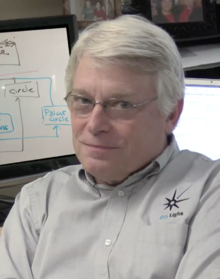

# 프로그래밍 계의 거장들

## 마틴 파울러(Martin Fowler)

마이크로 서비스 아키텍쳐, 이벤트 소싱 프로그래밍, 리팩토링, OOPSLA학파, 애자일

- [사이트](https://martinfowler.com/intro.html)

## 폴 그레이엄(Paul Graham)

해커, 리스퍼, 에세이스트. Y combinator창업자.

- [사이트](http://www.paulgraham.com/articles.html)

## 로버트 마틴

SOLID원칙, 클린 아키텍처, Code of Conduct, Agile, Clean Coders, Craftmanship

- [로버트 마틴(엉클 밥) - 위키피디아](https://en.wikipedia.org/wiki/Robert_C._Martin)

# 내가 좋아하는 프로그래머

## [사부](https://github.com/g6ling?tab=repositories)

내가 처음 프로그래밍을 시작했을 때 많은 도움을 주었고, 그로부터 몇 년이 지난 지금도 나에게 많은 영감과 자극을 주고, 세상에서 가장 편하게 프로그래밍에 대해서 이야기 할 수 있는 사람.

기업가 정신이란 무엇인가를 몸소 실천하는 사람.

앞으로도 잘 부탁혀 사부!

## [임백준  님](https://search.zdnet.co.kr/column.jsp?kwd=%EC%9E%84%EB%B0%B1%EC%A4%80&collection=column&area=0&term=0)

전 나는 프로그래머다 MC. 다양한 좋은 칼럼들을 많이 쓰셨고, 책도 많이 쓰셨다.

## [강규영 님](http://www.ecogwiki.com/%EC%84%B8%EC%83%81%EC%97%90_%EB%8C%80%ED%95%9C_%EB%91%90_%EA%B0%80%EC%A7%80_%EB%AF%BF%EC%9D%8C)

디자인, 데이터분석 등을 깊은 고찰과 함꼐 탐구하시는 기획 겸 프로그래머

- [인간을 프로그래밍 하기](https://www.youtube.com/watch?v=n3HgZjK4b8E) 에서도 좋은 말씀을 해주셨다.
- [모든 게임의 패턴, 구글 애널리틱스 파악할 수 있습니다](http://game.donga.com/79496/)
