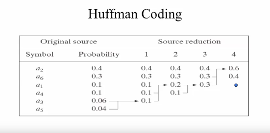

# Week2: Image and Video Compression

- 의문
- 용어 정리
- 개요

## 의문

## 용어 정리

## 2.1 The why and how of compression

### 왜 압축이 필요한가?

- 영화 한편(압축x)
  - 1000 x 1000 x 24(RGB) x 30(fps) x 60(1minute) x 120(2hour) / 8(바이트)
    - 648GB(?!)

### 압축이 가능한 이유?

- 색 낭비
  - 5개의 색으로 이미지를 나타낼 수 있는데, 굳이 8비트를 사용해야하나?
- 기하학적 동등성
  - 하나의 같은 색을 갖는 직선을 굳이 256으로 나타내기 보다는 128로 나타내는게 공간 절약
- 이미지 정보와 관계없는 데이터

### 다양한 이미지 압축 방식

다양한 image compression 방식

일반적인 image compression 방식

*위의 그림에 기반하면, JPEG이미지는 그 자체로는 단순 3채널 2차원 이미지 배열이 아닌것인가?*

- Encoder
  - 구성
    - Mapper
      - 이미지 배열을 받아서, compression하기 쉬운 형식으로 변환(map)
      - e.g)
        - 푸리에 변환
        - 코사인 변환
    - Quantizer
      - 색감의 값을 round해서 결정해줌
      - error가 생김
    - Symbol coder(information theory)
      - exploit the redundancy of the image using some pixel values more than others
- Decoder
  - 구성
    - Symbol decoder
    - Inverse mapper

JPEG의 image compression 방식

앞으로, JPEG의 압축 방식에 기반해서 내용을 설명할 것임

## 2.2 Huffman coding

이미지 압축의 기본 원리1

이미지 압축의 기본 원리2 with huffman coding

- 이미지 압축의 기본 원리
  - 몇몇 픽셀의 그레이값은 다른 픽셀의 그레이값보다 많이 나타남
    - 히스토그램으로 나타낼 수 있음
  - **많이 나타나는 중복된 그레이값을 짧은 코드로 매핑시켜서 압축시키고, 적게 나타나는 그레이값을 긴 코드로 매핑시켜서 압축**

### Huffman coding

Huffman coding의 예시1

Huffman coding의 예시2

- 특징
  - JPEG 압축방식 중 Symbol encoder에서 사용됨
  - prefix-free
    - 하나의 code가 중복되어서 해석될 여지가 없음
- 의문
  - *애초에 huffmancode로 압축을 하는것이 평균 이미지 길이가 최적으로 압축이 된다는 것을 어떻게 보장을 하는가?(계속해서 코드가 길어지므로, 오히려 비효율적일수도 있지 않은가?)*
    - *정보 엔트로피식(정확히 무슨 관계인지)*
      - `log`쪽 값이 우리가 사용할 code의 길이라고 생각할 수 있음
      - 즉, 정보 엔트로피 값 H는 그레이 스케일값의 평균 길이라고 생각할 수 있음

## 2.3 JPEG's 8x8 blocks - Construct nxn subimages

JPEG Image compression process - Construct nxn subimages

- 개요
  - JPEG에서는 이미지를 겹치지 않는 8x8 블록들로 나눔
    - 8x8 작은 이미지를 인코딩 함
    - *왜?!*
  - RGB 채널을 Y, Cb, Cr로 선형변환(가역)
    - Y
      - luminance(휘도) channel
      - 흑백

## 2.4 DCT(Discrete Cosine Transform) - Forward transform

JPEG Image compression process - Forward transform

MSE

- 왜 forward transform을 하는가?
  - 어떻게 압축을 행할 때, error를 측정할 수 있는가?
    - MSE(Mean Square Error)
    - ...
  - nxn 블록 이미지에서, 각 픽셀의 그레이 스케일 값중에 하나만 선택해야 한다면?
    - MSE의 값을 최소로 만들어주는 값을 선택하자!
    - 그 방법
      - *Kahunen-Loeve Transform*
        - 문제
          - 이미지가 있어야지 transform의 matrix coefficient를 알 수 있음 > 매우 느림
          - 그래서 fixed matrix coefficient를 갖는 Discrete Cosine Transform을 행함
      - DCT
        - 고정된 matrix coefficient를 갖고 있어서 어느정도 속도도 빠르면서, 나름 최적
        - 가역

DCT formula1

DCT formula2

