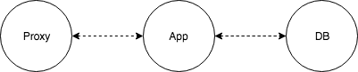
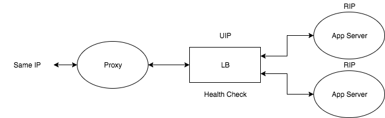
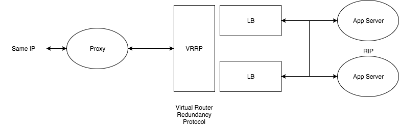

# 인프라란?

## 참고

Hatena Infra Special강의

## 인프라란?

- 상황에 따라서 다르다.
- ISP, Hosting, Web Service Provider등등.. 인프라 라는 말은 각자의 입장에서 전부 다른 것을 의미한다.

보통은

```
데이터센터 => 네트워크 => 물리 서버, OS => 가상 서버, OS => 미들웨어
```

와 같은 구조에서 웹서비스 제공자는 가상 서버, OS와 미들웨어 정도를 관리. 나머지는 위탁으로 맡기는 경우가 많음.

## 인프라 설계의 기본

- 가용성: 안정적으로 서비스를 언제든지 이용 가능하도록 한다.
- 성능: 서비스의 이용 속도가 고속이도록 한다.
- 계속성: 서비스의 특성에 따라서 장기간에 있어서도 이용 가능하게 한다.
- 비용: 낮은 코스트로 서비스를 운영할 수 있도록 한다.

그리고 위의 것들을 계속 `Monitoring`해야한다.

### 1. 가용성

- 장애가 발생해도 유저가 서비스를 이용할 수 있도록 해야한다.
  - 단일장애점을 배제한다(SPOF) => 다중화(冗長化/Redundancy)
  - 대신 이는 Cost와의 tradeoff
- 대량 트래픽에도 서비스 제공이 가능해야한다.
  - Scalability를 고려한 설계
  - 성능 고려

### 2. 성능

- 성능 향상은 UX의 향상이다.
  - 속도가 빠른것은 하나의 `기능`이다.
- 고속화 수단
  - Data Structure / Algorithm
  - Scale의 수단: Scale Up, Scale Out(다중화와는 다른 개념. 같은 기능과 역할의 기기를 여러 대 준비하여 처리를 분담. 시스템 전체 성능 향상)
- 처리 효율과 리소스 사용량
  - 보다 적은 리소스로 서비스를 제공 가능하게 한다.

### 3. 계속성

- 5 ~ 10년 서비스 제공 가능성
  - 10년간 방치해도 움직이는 서버는 없다.
- 기능과 성능이 너무 과하지도 않고, 부족하지도 않은 `심플한 운용`
  - 심플한 것이 OS등 대체하기 쉽다.
- 시스템 복잡도가 상승 => 기술부채가 상승 => 비용 상승

### 4. 저비용

- 비용에는 금전적인 비용과 인적비용이 있다.
  - 인적 비용은 보통 매우 비싸므로, 운영 작업을 효율화 하는 것이 필요하다.
  - 인적 비용이 너무 많이 증가하면 장기 운용에 차질이 생긴다.
  - 그러므로 때와 장소에 따라서 인적비용 대신에 금전적인 비용을 증가시킬 필요가 있다.

### 5. 모니터링

- 추측하지 말고 계측하라.
- 항상 성능을 주시하여, 무엇이 bottleneck인지 확인하라.
- 가용성이 항상 유지될 수 있도록 하라.
- 비용의 가시화(서버 대수, 트래픽량, 서비스 가시화)

**결국 위의 모든 요소를 만족시키는 서비스를 고려한 인프라를 설계해야한다.**

### 예시

블로그는 5~10년 이상 남는 서비스. 초기에는 계속성을 유지하는 것이 중요.

소셜게임은 릴리즈 초기에 많은 트래픽이 예상되고, 3년 정도 유지를 고려해야하며, 초기의 성능이 매우 중요하다.

## Web3층 아키텍쳐

결국 대부분의 웹 서비스 인프라는 웹 3층 아키텍쳐로 이루어져있고 그것에 +a 같은 느낌으로 서비스에 맞춰서 커스터마이징 한다.



위와 같이 나누는 이유

1. 부하분산, 가용성유지
2. 느슨한 결합(疎結化 / loosely coupled)
3. 기본적인 웹 어플리케이션의 Module化와 같음

### 전부 하나의 서버에서 관리하는 경우

### DB만 분리하는 경우

Proxy와 App은 동거해도 괜찮은가?

- C10K문제
  - 대량의 TCP연결 처리 => 자원 소비의 증가
- 보수성
  - 웹 서비스와 App Server는 Middleware등이 다르다.
  - 대수, 서버 자원의 조정, 유지보수 하기 쉽다.
- 상황에 따라서는 동거할 수 있으나, 기본적으로는 나누는 것이 원칙(책임을 분산시킨다)

## Web3층 아키텍쳐 + a

### 하나의 기능에 따른 컴퓨터 수

대체로 3대가 최소. 성능이나 다중화를 위함이다.

부하를 버틸 수 있는 컴퓨터 수 + 1

### Load Balancer

부하분산과 다중화를 실현하기 위한 방법.

방식

- DNS
- Ethernet IP 나누기
- TCP
- URL



**하지만 만약 LB가 에러가 난다면?**

VRRP를 이용한 다중화 실현.



하지만 모든 부분을 나누기만 하면 알기 힘들고 비용이 증가하므로, 상황에 따라서 합치는 경우도 분명 존재한다.

특히 서비스가 나누어져있을 때, 각각의 서비스마다 LB부터 Proxy App server, DB까지 전부 나눌 수 있지만 비용적인 관점에서는 LB와 Proxy는 두 서비스에 걸쳐서 사용하기도 한다(Hatena의 예)

### Worker나 Batch처리

예: Access Ranking을 내고싶을때

어플리케이션 서버에서 Access Ranking을 처리하는 것은 자원의 비효율적인 사용이 될 수 있으므로 `Batch Server`를 따로 만들어서 책임을 분리 시킬 수 있다.

### Cache Server

- Cache는 다양한 Layer에 존재한다.
  - CPU / HTTP / CDN 등..
  - 속도 향상, 부하감소, 트래픽 감소의 효과가 있음
- 성능(속도) 향상에 큰 도움이 되나, 시스템 로직이 복잡해진다.
  - 시스템 전체가 복잡화 된다. => 운용이나 개발의 비용이 상승한다.
- TPO에 따른 도입이 필요
  - e.g. 어떤 end point에서 어떠한 유저라도 같은 결과가 온다면 캐쉬를 적극적으로 이용해도 좋다.

Memory가 DB보다 빠르기 때문에 `Redis`나 `Memcache`와 같은 제품을 사용한다.

## 결론

인프라에서는 역할에 따른 책임의 분담 + 서비스의 특성을 고려한 복잡성을 생각하는것이 중요. 결국 코드의 모듈화와 같은 이치.

인프라 엔지니어는 `설계`라는 즐거움이 있다.

## 질문

Q) 앱 서버 배포시에 애러는 어떻게 확인하는가?

A) LB의 Health Check를 이용하는게 보통인데, 코드 레벨의 에러인경우에는 되도록 test에서 검출될 수 있도록 하는 편이다.

**설계에 정답은 없다. 선택에 대한 논리적인 이유 제시가 중요하다.**
