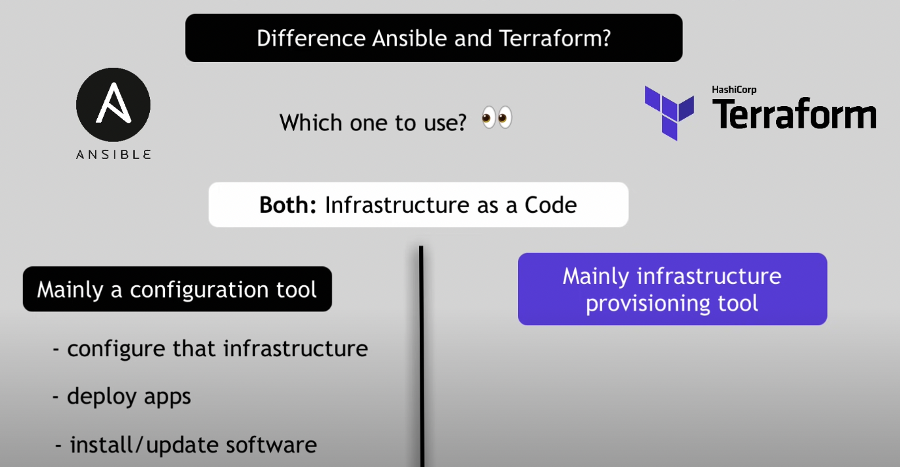

# Terraform

- 의문
- IaC
  - Terraform vs Ansible
- 개요
  - 동작 원리
  - 기본 개념
  - 3가지 형상
  - 명령어
- HCL
  - Data Source
  - 변수
  - 함수
  - 모듈

## 의문

## IaC(Infrastructure As Code)

- 개요

### Terraform vs Ansible

테라폼 vs 엔지블



- 테라폼
  - 인프라 스트럭처의 프로비저닝에 특화
- 엔지블
  - 인프라 스트럭처의 설정에 특화

## 개요

- 개요
  - 클라우드나 온프레미스 자원을 사람이 읽을 수 있는 설정 파일로 정의하는 IaC 도구
    - 버전 관리, 재사용, 공유 가능함(코드의 장점)
  - 다양한 컴포넌트 제어 가능
    - IaaS
      - compute, storage, networking
    - PaaS
      - Kubernetes / Lambda
    - SaaS
      - Data dog
      - CDN
      - Github Teams
- 특징
  - Immutable infrastructure 지향
    - 복잡도를 낮추고, 업그레이드를 쉽게 하기 위함
  - state file을 Source Of Truth로 지정
  - 선언형 설정
    - 리소스 의존 그래프를 생성함
  - 설정 표준화
    - 재사용가능한 설정을 module로 설정
    - 테라폼 레지스트리에서 사용가능하거나, 자기자신의 설정을 만들 수 있음
  - 협력
    - Terraform cloud를 이용해서 일관되고, 믿을 수 있는 환경을 만들고 안전한 접근을 가능하게 함

### 동작 원리

테라폼의 동작 원리


- 개요
  - Terraform Registry에 등록되어, 클라우드 플랫폼과 API를 통해서 리소스를 생성하고 관리하도록 함
    - 1700개 이상의 프로바이더가 존재(aws, azure, gcp, ...)
- 워크 플로우
  - Write
    - 리소스를 정의(여러 클라우드 프로바이더와 서비스에 걸쳐서 가능)
  - Plan
    - 인프라스트럭처를 생성할 실행 계획을 생성 / 제거
  - Apply
    - 올바른 순서대로 제안된 오퍼레이션을 진행

### 기본 개념

- resource
  - 실제로 생성할 일프라 자원
  - e.g) aws_security_group, aws_lb, aws_instance
- provider
  - 테라폼으로 정의할 infrastructure provider
  - e.g) aws, azure, gcp, ...
- output
  - 인프라를 프로비저닝 한 후에 생성된 자원을 output으로 추출 가능(state file)
- backend
  - terraform의 현재 상태를 저장할 공간
  - e.g) s3
- module
  - 공통적으로 활용할 수 있는 인프라 코드를 한 곳으로 모아서 정의하는 부분
- remote state
  - tfstate파일이 저장되어 있는 백엔드 정보를 명시하면, terraform이 백엔드에서 output 정보를 가져옴

### 3가지 형상

가장 중요한 것은 aws의 실제 인프라가 backend에 저장된 상태가 100% 일치하는 것

- local 코드
  - 현재 개발자가 작성 / 수정하고 있는 코드
- backend에 저장된 상태
  - 가장 최근에 배포한 테라폼 코드 형상
- aws 실제 인프라
  - 실제로 aws에 배포되어 있는 인프라

### 명령어

기존 인프라를 AWS에 배포한 상태에서 테라폼을 적용하고 싶으면, 모든 리소스를 terraform import로 옮겨야 함

실제 서비스를 내리는 것은 위험함

- `terraform init`
  - 개요
    - 지정한 backend에 상태 저장을 위한 `.tfstate`파일을 생성
      - `.tfstate`파일은 내가 `apply`를 적용한 시점의 상태
    - 가장 마지막에 적용한 테라폼 내역이 저장됨
- `terraform plan`
  - 개요
    - 정의한 코드가 어떤 인프라를 만들게 되는지 미리 예측 결과를 보여줌
    - plan에 에러가 없어도 실제 적용시 에러가 생길 수 있음
  - 주의
    - 형상에 변화를 주지 않음
- `terraform apply`
  - 개요
    - 인프라를 배포하기 위한 명령어
    - aws 상에 실제로 인프라가 생성되고 작업 결과가 backend의 `.tfstate`파일에 저장됨
  - 주의
    - 해당 결과는 local의 `.terraform`파일에도 저장됨
      - *그럼 어느쪽이 우선순위인지? git에 형상관리해도 되는지?*
- `terraform import`
  - 개요
    - AWS 인프라에 테라폼으로 관리되지 않은채로 배포된 리소스를 `terraform state`로 옮겨주는 작업
      - 즉 코드에서 resource블록으로 정의되지 않았던 리소스
      - 각 리소스별로 import하는 방법이 다르므로 참고해야 함
    - local의 `.terraform`에 해당 리소스의 상태 정보를 저장해줌
      - 코드 생성(x)
  - 주의
    - `apply`전까지는 백엔드에 저장되지 않음
    - import 이후에 plan을 하면 로컬에서 해당 코드가 없어서, 리소스가 삭제 또는 변경된다는 결과를 보여줌
      - 이 결과를 바탕으로 코드를 작성할 수 있음
- `terraform refresh` (deprecated)
  - 개요
    - 실제 형상을 테라폼 스테이트에 반영해줌
      - 즉, terraform state를 변경
    - 지금은 `terraform plan`, `terraform apply`를 하면 자동으로 적용됨
  - 주의
    - state를 업데이트하기전에 확인이 불가능해서 위험함

## HCL

### Data Source

데이터 소스 예시

```hcl
// 아래에서 참조한 data source를 사용
locals {
  eks_node_security_group_ids = concat(
    data.terraform_remote_state.eks_cluster_v4.outputs.node_security_group_ids,
  )
  eks_node_subnet_route_table_ids = [
    data.terraform_remote_state.eks_cluster_v4.outputs.node_route_table_id1,
    data.terraform_remote_state.eks_cluster_v4.outputs.node_route_table_id2,
  ]
}

// eks cluster v4 라는 tfstate 파일의 내용을 참조함
data "terraform_remote_state" "eks_cluster_v4" {
  backend = "s3"
  config = {
    bucket = "test-tokyo-vcnc-tf-remote-state"
    key    = "test.ap-northeast-1/eks-cluster-v4.tfstate"
    region = "ap-northeast-1"
  }
}
```

- 개요
  - 테라폼 코드 외부에 정의된 정보를 사용할 수 있도록 해줌
    - data 블록 내부가 쿼리임
- 특징
  - resource vs data source
    - resource
      - 테라폼이 리소스를 생성 / 업데이트 / 제거
    - data source
      - 테라폼이 오직 읽을 수만 있음
  - provider에 종속
  - 테라폼은 데이터 리소스를 planning phase에 읽으려고 함

### 변수

- 종류
  - input
    - 테라폼 모듈의 소스코드를 변경시키지 않고, 커스터마이징 가능하게 함
      - 재사용 가능하도록
  - output
    - child module
      - parent module에 리소스 속성을 노출
    - root module
      - `terraform apply`실행 이후에 output 변수를 프린트 가능
    - remote state를 사용할 경우, `terraform_remote_state` data source로 접근 가능
  - local
    - 선언된 모듈에서만 참조 가능한 변수
    - 변수가 재활용되고, 미래에 변화 가능성이 큰 경우 사용
- 타입
  - simple
    - `string`
    - `number`
    - `bool`
  - complex
    - `list()`
    - `set()`
    - `map()`
    - `object({ =, ... })`
    - `tuple([, ...])`
- 변수에 대한 값 할당 방식
  - `-var` 커맨드
    - e.g)
      - `terraform apply -var="image_id=ami-abc123"`
      - `terraform apply -var='image_id_list=["ami-abc123", "ami-def456"]'`
      - `terraform apply -var='image_id_map={"us-east-1":"ami-abc123","us-east-2":"ami-def456"}'`
  - `.tfvars` 파일에서 변수 선언
    - `terraform.tfvars` 변수 파일을 자동적으로 그냥 파싱
  - 환경 변수

### 함수

- 종류
  - Numeric
  - String
    - e.g) `join`, `split`
  - Collection
  - Encoding
  - Filesystem
  - Date and Time
  - Hash and Crypto
  - IP Network
  - Type Conversion

### 모듈

```hcl
// root module 예시
module "tada_web" {
  source = "../../../app/tada_web"

  assets_bucket_name           = "staging-tada-web-assets"
  github_actions_iam_user_name = "staging-tada-web-githubaction"
}

// child module 예시
variable "assets_bucket_name" {}
variable "github_actions_iam_user_name" {}
```

- 개요
  - 다수의 서로 사용되는 리소스를 위한 하나의 컨테이너
    - 물리적인 오브젝트를 직접 기술하는게 아니라, 아키텍처를 기술 할 수 있도록 함
  - `terraform plan`과 `terraform apply`를 실행하는 working directory에 있는 `.tf`파일들은 루트 모듈을 형성함
  - 해당 루트 모듈은 다른 모듈을 `call`할 수 있고, output 변수를 다른 모듈의 input 변수로 전달하여 함께 연결할 수 있음
    - `call`하는 모듈은 `module`블록에서 `source`로 path를 지정해주면 됨
- 구성
  - 루트 모듈(테라폼 모듈)
    - 모든 테라폼 설정이 적어도 하나는 갖고 있는 모듈
      - main working directory에 있는 `.tf`파일들로 구성
  - child 모듈
    - 테라폼의 모듈은 다른 모듈의 자원을 설정에 추가할 수 있는데, 추가된 다른 모듈을 child 모듈이라고 함
      - local의 경우 `source`로 path를 지정
  - published 모듈
    - 테라폼 레지스트리에 있는 public / private 레지시트리에 있는 모듈들
      - `source`로 uri를 지정
- 특징
  - 모듈 속의 변수는 캡슐화 되어있으나, output value는 모듈을 호출함으로써 참조 가능
