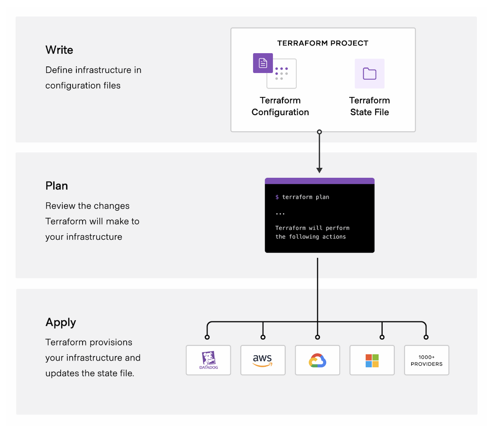

# Terraform

- 의문
- IaC
- 개요
  - 동작 원리

## 의문

## IaC(Infrastructure As Code)

- 개요

## 개요

- 개요
  - 클라우드나 온프레미스 자원을 사람이 읽을 수 있는 설정 파일로 정의하는 IaC 도구
    - 버전 관리, 재사용, 공유 가능함(코드의 장점)
  - 다양한 컴포넌트 제어 가능
    - IaaS
      - compute, storage, networking
    - PaaS
      - Kubernetes / Lambda
    - SaaS
      - Data dog
      - CDN
      - Github Teams
- 특징
  - Immutable infrastructure 지향
    - 복잡도를 낮추고, 업그레이드를 쉽게 하기 위함
  - state file을 Source Of Truth로 지정
  - 선언형 설정
    - 리소스 의존 그래프를 생성함
  - 설정 표준화
    - 재사용가능한 설정을 module로 설정
    - 테라폼 레지스트리에서 사용가능하거나, 자기자신의 설정을 만들 수 있음
  - 협력
    - Terraform cloud를 이용해서 일관되고, 믿을 수 있는 환경을 만들고 안전한 접근을 가능하게 함

### 동작 원리

테라폼의 동작 원리

- 개요
  - Terraform Registry에 등록되어, 클라우드 플랫폼과 API를 통해서 리소스를 생성하고 관리하도록 함
    - 1700개 이상의 프로바이더가 존재(aws, azure, gcp, ...)
- 워크 플로우
  - Write
    - 리소스를 정의(여러 클라우드 프로바이더와 서비스에 걸쳐서 가능)
  - Plan
    - 인프라스트럭처를 생성할 실행 계획을 생성 / 제거
  - Apply
    - 올바른 순서대로 제안된 오퍼레이션을 진행

### 기본 개념

- resource
  - 실제로 생성할 일프라 자원
  - e.g) aws_security_group, aws_lb, aws_instance
- provider
  - 테라폼으로 정의할 infrastructure provider
  - e.g) aws, azure, gcp, ...
- output
  - 인프라를 프로비저닝 한 후에 생성된 자원을 output으로 추출 가능(state file)
- backend
  - terraform의 현재 상태를 저장할 공간
  - e.g) s3
- module
  - 공통적으로 활용할 수 있는 인프라 코드를 한 곳으로 모아서 정의하는 부분
- remote state
  - tfstate파일이 저장되어 있는 백엔드 정보를 명시하면, terraform이 백엔드에서 output 정보를 가져옴

### 3가지 형상

가장 중요한 것은 aws의 실제 인프라가 backend에 저장된 상태가 100% 일치하는 것

- local 코드
  - 현재 개발자가 작성 / 수정하고 있는 코드
- backend에 저장된 상태
  - 가장 최근에 배포한 테라폼 코드 형상
- aws 실제 인프라
  - 실제로 aws에 배포되어 있는 인프라

### 테라폼 인프라 정의 흐름

기존 인프라를 AWS에 배포한 상태에서 테라폼을 적용하고 싶으면, 모든 리소스를 terraform import로 옮겨야 함

실제 서비스를 내리는 것은 위험함

- `terraform init`
  - 개요
    - 지정한 backend에 상태 저장을 위한 `.tfstate`파일을 생성
    - 가장 마지막에 적용한 테라폼 내역이 저장됨
- `terraform plan`
  - 개요
    - 정의한 코드가 어떤 인프라를 만들게 되는지 미리 예측 결과를 보여줌
    - plan에 에러가 없어도 실제 적용시 에러가 생길 수 있음
  - 주의
    - 형상에 변화를 주지 않음
- `terraform apply`
  - 개요
    - 인프라를 배포하기 위한 명령어
    - aws 상에 실제로 인프라가 생성되고 작업 결과가 backend의 `.tfstate`파일에 저장됨
  - 주의
    - 해당 결과는 local의 `.terraform`파일에도 저장됨
      - *그럼 어느쪽이 우선순위인지? git에 형상관리해도 되는지?*
- `terraform import`
  - 개요
    - AWS 인프라에 배포된 리소스를 `terraform state`로 옮겨주는 작업
    - local의 `.terraform`에 해당 리소스의 상태 정보를 저장해줌
      - 코드 생성(x)
  - 주의
    - `apply`전까지는 백엔드에 저장되지 않음
    - import 이후에 plan을 하면 로컬에서 해당 코드가 없어서, 리소스가 삭제 또는 변경된다는 결과를 보여줌
      - 이 결과를 바탕으로 코드를 작성할 수 있음
