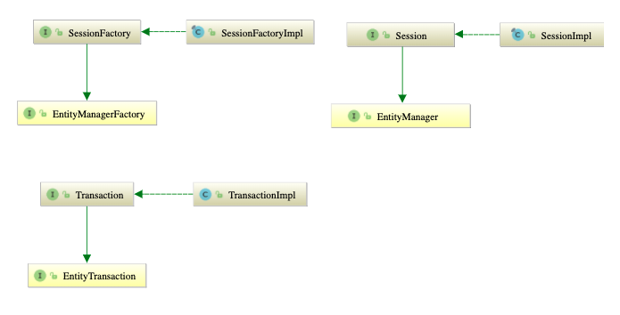

# Hibernate

- 의문
- 1] 개요

## 의문

## 1. 개요

Hibernate architecture

Hibernate and JPA diagram

- Hibernate
  - 정의
    - Java 환경의 ORM
    - JPA의 구현체이면서도, hibernate만의 구현도 포함됨
  - 구성 요소
    - SessionFactory(`org.hibernate.SessionFactory`)
      - 개요
        - 스레드 세이프이면서 불변의 애플리케이션 도메인 모델을 데이터베이스에 매핑하는 표현
      - JPA에서는
        - `EntityManagerFactory`라고 함
      - 특징
        - 생성이 매우 비쌈
          - 하나의 DB에 대해서 애플리케이션은 오직 하나의 `SessionFactory`만을 가져야 함
      - 기능
        - second level caches, connection pools, transaction system integrations
    - Session(`org.hibernate.Session`)
      - 개요
        - 싱글 스레드 이면서, 개념적으로 Unit of Work의 모델링
      - JPA에서는
        - `EntityManger`라고 함
      - 특징
        - JDBC를 래핑하고, `org.hibernate.Transaction`인스턴스의 팩토리로 사용됨
          - 기본적으로 repeatable read
    - Transaction(`org.hibernate.Transaction`)
      - 개요
        - 싱글 스레드, 개개의 물리적 트랜잭션 경계를 정하기 위해서 애플리케이션에 의해서 사용되는 오브젝트
      - JPA에서는
        - `EntityTransaction`
      - 특징
        - application으로 부터 JDBC나 JTA와 같은 트랜잭션 시스템을 분리하기 위함
  - 모듈
    - hibernate-core
      - ORM 기능과 API들 포함
    - hibernate-envers
      - *entity versioning 기능*
        - *???*
    - hibernate-spatial
      - Spatial/GIS 데이터 타입 서포트
    - hibernate-osgi
      - *OSGI 컨테이너 서포트*
    - hibernate-hikaricp
      - HikariCP 커넥션 풀링 라이브러리
    - hibernate-jcache,ehcache
      - 제2레벨 캐시 프로바이더
  - c.f) ORM
    - 정의
      - 오브젝트 모델 표현을 관계 데이터 모델 표현으로 매핑하는 기술
