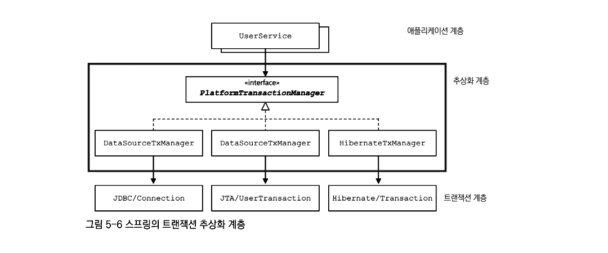

# 스프링 입문을 위한 자바 객체 지향의 원리와 이해

- 의문
- Ch1. 사람을 사랑한 기술
  - 기술의 발달사
  - Java
  - Java Spring
- Ch2. 자바와 절차적 / 구조적 프로그래밍
  - 자바 프로그램의 개발과 구동
  - 자바에 존재하는 절차적/구조적 프로그래밍의 유산
    - 메모리 구조
    - 실행과 내부 동작
- Ch3. 자바와 객체 지향
  - 객체 지향은 인간 지향
  - 객체 지향의 4대 특성
    - 추상화: 모델링
    - 상속: 재사용 + 확장
      - 인터페이스
      - 상속과 메모리
    - 다형성: 사용편의성
    - 캡슐화: 정보 은닉
  - 참조 변수의 복사
    - call by value & call by reference
- Ch4. 자바가 확장한 객체 지향
  - abstract
  - constructor
  - static 블록
  - final
  - instanceof
  - package
  - interface, implements
  - this, super
  - c.f) JVM에서의 객체 메서드의 호출과 메모리
- Ch5. 객체 지향 설계 5원칙
  - SOLID
    - SOC(Separation Of Concern)
- Ch6. 스프링이 사랑한 디자인 패턴
  - 디자인 패턴의 구성 요소
  - 어댑터 패턴
  - 프록시 패턴
  - 데코레이터 패턴
  - 싱글턴 패턴
  - 템플릿 메서드 패턴
  - 팩터리 메서드 패턴
  - 전략 패턴
  - 템플릿 콜백 패턴
  - 다른 패턴들
    - Front Controller 패턴
    - MVC 패턴
- Ch7. 스프링 삼각형과 설정 정보
  - IoC/DI - 제어의 역전/의존성 주입
  - AOP(Aspect Oriented Programming)
  - PSA
- 부록. 자바8 람다와 인터페이스의 변화

## 의문

- 오라클은 자바 언어와 VM에 대한 명세를 제공할 뿐이지, Oracle의 JVM등의 소프트웨어는 오픈 소스가 아니다
  - 그래서 어떻게 구현했는지는 모름
  - 명세: https://docs.oracle.com/javase/specs/index.html

## Ch1. 사람을 사랑한 기술

### 기술의 발달사

- 기계어
- 어셈블리어
  - 사람의 언어로 프로그래밍 가능
- C
  - One Source Multi Object Use Anywhere
- C++
  - C + OOP
- Java
  - Write Once Use Anywhere
  - OOP
- Java spring
  - 거대함 속의 단순함과 완벽함, 그리고 유연함
  - IoC/DI, AOP, PSA라는 객체 지향의 베스트 프랙티스만으로 아무리 거대한 프로그램이라도 쉽게 구현할 수 있음을 보여준 프레임워크

### Java

- 자바를 제대로 알려면 이해해야 할 것들
  - 객체 지향 4대 특성을 이해해야 함
    - 캡슐화
    - 상속
    - 추상화
    - 다형성
  - 또 알아야 할것
    - OOP 개념
    - 자바 언어의 문법
    - 자바가 OOP 개념을 구현한 방식

### Java Spring

- 개요
  - OOP 프레임 워크
- 자바 스프링을 제대로 알려면 이해해야 할 것들
  - 객체 지향
  - 프레임 워크
  - 스프링 삼각형
    - IoC/DI
    - AOP
    - PSA

## Ch2. 자바와 절차적 / 구조적 프로그래밍

### 자바 프로그램의 개발과 구동

- 현실세계 vs 자바세계
  - 소프트웨어 개발도구 - JDK
  - 운영체제 - JRE
  - 하드웨어(물리적 컴퓨터) - JVM
    - register가 아닌 stack기반의 머신
      - 그런데, android에서 네이티브로 사용하는 것은, 오라클의 JVM이 아니기도 하고, register기반이라고 함
- 자바 플랫폼
  - JDK
    - javac.exe(컴파일러) + JRE
  - JRE
    - java.exe(실행기, 인터프리터) + JVM

### 자바에 존재하는 절차적/구조적 프로그래밍의 유산

- 개요
  - goto대신 함수를 쓰자
    - goto는 실행 순서가 복잡해짐
    - 공유 사용에 문제가 쉽게 되는 전역 변수보다는 지역 변수 사용

자바코드 실행과 내부 동작 예시코드

```java
public class Start {
  public static void main(String[] args) {
    System.out.println("Hello OOP!!!");
  }
}
```

- 메모리 구조
  - Code
  - Data
    - Static
      - 클래스 멤버 변수
      - 해당 패키지 또는 클래스가 처음으로 사용될 때 로드 됨
    - Stack
      - 지역 변수
    - Heap
      - 객체 맴버 변수
- 실행과 내부 동작
  - 1] JRE는 프로그램안에 `main()`메서드가 있는지 확인
  - 2] JVM은 목적 파일을 받아 그 목적 파일을 실행
  - 3] 전처리 시작
    - `java.lang`패키지를 스태틱 영역에 가져다 놓음
    - import한 패키지를 스태틱 영역에 가져다 놓음
    - 프로그램상의 모든 클래스를 스태틱 영역에 가져다 놓음
  - 4] 스택에 `main()`메서드의 스택 프레임을 할당
  - 5] 인자를 저장할 변수 공간을 변수 공간에 할당
  - 6] `main()`코드 실행
- 참고
  - 블록을 만나면 스택 프레임이 시작됨
  - 스택 프레임의 구조
    - 반환값을 저장할 변수 공간이 제일 아래
    - 그다음 인자를 저장할 변수 공간
    - 그다음으로 메서드의 지역 변수
- Call by value
  - 개요
    - 메서드를 호출하면서 인자로 전달되는 것은 변수 자체가 아니라, 변수가 저장한 값만을 복제해서 전달하는 것
      - 포인터를 전달해주는 것이 아님
      - 자바는 포인터가 없다

## Ch3. 자바와 객체 지향

### 객체 지향은 인간 지향

- 우리가 왜 기계 종속적인 개발을 해야하는가?
  - 포인터?
- 세계는 객체로 되어있다
  - 사람이 현실을 인지하는 방식
  - 세계의 객체를 분류(class)하라

### 객체 지향의 4대 특성

- 객체 지향의 4대 특성(캡상추다)
  - 캡슐화
  - 상속
  - 추상화
  - 다형성
- 클래스와 객체 메타포
  - 클래스는 분류
    - 객체를 총칭하는 개념
    - e.g)사람
  - 객체는 실체
    - 세상에 존재하는 유일무이한 사물
    - e.g) 김연아
  - 참고
    - 따라서, 붕어빵 - 붕어빵틀 비유는 잘못된 것
      - class에서 instance가 생성된다는 마테포만 반영된 것이고, 모델링의 본질에 대해서는 반영되지 않은 메타포

### 추상화: 모델링

- 추상화는 모델링이다
  - 개요
    - 구체적인 것을 분해해서 관찰자가 관심 있는 특성만 가지고 재조합 하는 것
  - IT용어 버전
    - **구체적인 것을 분해해서 관심 영역(application context)에 있는 특성만 가지고 재조합하는것 = 모델링**
- 객체와 클래스, 컨텍스트, 모델
  - 객체
    - 유일무이한 사물
  - 클래스
    - 같은 특성을 지닌 여러 객체를 총칭하는 집합의 개념
  - 컨텍스트
    - 애플리케이션 경계
    - "내가 창조하려는 세상은 어떤 세상인가?"
      - 컨텍스트에 따라서, 클래스의 설계가 달라져야 함(이름이라던지, 범위라던지)
  - 모델
    - 실제 사물을 목적에 맞게 관심 있는 특성만 추출해서 표현하는 것
      - = 추상화를 통해서 실제 사물을 단순하게 묘사하는 것(추상화의 결과물)
    - 자바언어에서는 모델이 곧 클래스
- 객체지향과 클래스 설계와의 관계
  - 사람이라는 클래스를 설계
  - 사람 객체를 관찰해서 사람 객체가 가진 공통된 특성을 찾게 됨
    - 속성: 시력, 몸무게, 혈액형, 키, 나이, 직업, 취미, ...
    - 행동: 먹다, 자다, 일하다, 침 뱉다, 운전하다, 울다, ...
- 자바에서의 추상화
  - 개요
    - 추상화 = 모델링 = 자바의 class 키워드
  - 넓은 의미의 추상화
    - 상속을 통한 추상화, 구체화
    - 인터페이스를 통한 추상화
    - 다형성을 통한 추상화
- 추상화 하는 절차
  - 애플리케이션 경계 설정
  - 객체의 관찰
  - 클래스 설계
    - 추상화(관심 있는 특성만 뽑아오자)
  - 추상화의 결과물은 모델, 모델은 자바 언어에서는 클래스로 표현

  추상화와 메모리

  ```java
  package abstraction01;

  public class Mouse {
    public String name;
    public int age;
    public static int countOfTail;

    public void sing() {
      System.out.println(name + " 찍찍!!!");
    }
  }

  public class MouseDriver {
    public static void main(String[] args) {
      // stack frame에 mickey변수가 로컬 변수로 들어가고, 그 값으로는 Mouse클래스의 객체가 들어있는 메모리의 주소(포인터)
      // 생성된 Mouse객체는 힙 메모리에 들어감
      // **굳이 힙이 아니어도 되지 않은가? 어차피 모든 필드가 크기가 정해져있는데**
      // String때문에 안되는건가? 그건 아닌거 같은데
      Mouse mickey = new Mouse();

      // 포인터를 사용한 필드에 값 할당
      mickey.name = "미키";
      mickey.age = 85;
      mickey.countOfTail = 1;

      mickey.sing();

      // mickey 포인터의 값을 null로 함
      // 생성된 인스턴스의 reference count가 0이므로 gc가 수거해감
      mickey = null;
    }
  }
  ```

  - 클래스 멤버
    - 정적 속성
      - 개요
        - 일반적으로 해당 클래스의 모든 객체들이 같은 값을 가질 때 사용
        - static segment의 메모리 공간 확보
      - 예시
        - 사람 클래스의 인구
        - 고양이 클래스의 다리 개수
        - 스용차 클래스의 바퀴 개수
    - 정적 메서드
      - 개요
        - main() 메서드
        - 클래스의 인스턴스를 만들지 않고 사용하게 되는 유틸리티성 메서드
          - e.g) Math

### 상속: 재사용 + 확장

- 상속(확장)
  - 개요
    - **상위 클래스의 특성 재사용 + 확장 + is a kind of 관계 만족**
    - 분류의 세분화
      - 계층도나 조직도가 아닌, 분류도
    - 상위 클래스의 특성을 재사용하고, 거기에 더해 필요한 특성을 확장
      - 그래서 자바에서 inherit이 아닌, extends키워드를 사용
  - 필요 충분 조건
    - 하위 클래스는 상위 클래스다(LSP)
      - 이 명제를 반드시 만족해야함
      - e.g) 포유류는 동물이다, 고래는 포유류다, 고래는 동물이다
  - 상속받는 클래스 사이의 관계
    - A is a B
      - 오해의 소지가 생김
      - A는 하나의 B다
        - 하나의 B는 인스턴스?
    - A is a kind of B
      - 정확한 의미
      - A는 B의 한 분류다
  - 예시
    - 동물
      - 포유류(포유류는 동물의 특성을 확장하였다)
        - 고래, 박쥐
      - 조류
        - 참새, 펭귄
  - c.f) 이름짓기
    - 클래스
      - 분류스럽게
    - 객체 참조 변수명
      - 유일무이한 사물처럼 작명
        - `조류 bird = new 조류();`
          - x
        - `조류 aBird = new 조류();`
          - o
- 인터페이스
  - 개요
    - 구현 클래스 is able to 인터페이스
      - 구현 클래스는 인터페이스 할 수 있다
      - 고래는 헤엄칠 수 있다
  - e.g)
    - Serializable, Clonable, Comparable, Runnable
- 참고
  - 상위 클래스는 하위 클래스에게 물려줄 특서이 많을 수록 좋음(LSP)
  - 인터페이스는 구현을 강제할 메서드가 적을 수록 좋음(ISP)

상속과 T 메모리 예제 코드

```java
package inheritance03;

public class Animal {
  public String name;

  public void showName() {
    System.out.printf("hello %s", name);
  }
}

public class Penguin extends Animal {
  public String habitat;

  public void showHabitat() {
    System.out.printf("%s lives at %s", name, habitat);
  }
}

public class Driver {
  public static void main(String[] args) {
    // stack프레임에, pororo라는 포인터 변수가 할당되고,
    // 해당 포인터는 Penguin클래스의 인스턴스의 시작주소를 가리킴
    // 힙 영역에는 Penguin클래스의 인스턴스와 Animal클래스의 인스턴스, Object클래스의 인스턴스도 생성됨
    Penguin pororo = new Penguin();
    // 펭귄 한 마리가 태어나니 펭귄 역할을 하는 pororo라 이름 지었다

    pororo.name = "pororo";
    // pororo의 name을 pororo라 하자
    pororo.habitat = "south pole";
    // ...

    pororo.showName();
    // pororo야 네 이름을 보여다오
    pororo.showHabitat();
    // ...

    // stack프레임에, pingu라는 포인터 변수가 할당되고,
    // 해당 포인터는 **Animal클래스** 의 인스턴스의 시작주소를 가리킴
    // 힙 영역에는 Penguin클래스의 인스턴스와 Animal클래스의 인스턴스, Object클래스의 인스턴스도 생성됨
    Animal pingu = new Penguin();

    pingu.name = "pingu";
    // pingu.habitat = "EBS";

    pingu.showName();
    // pingu.showHabitat();

    //
    // Penguin happyfeet = new Animal();
  }
}
```

### 다형성: 사용편의성

- 다형성
  - 기본
    - 오버라이딩, 오버로딩
- 오버라이딩
  - 개요
    - 메서드 재정의
- 오버로딩
  - 개요
    - 메서드 중복 정의

### 캡슐화: 정보 은닉

- 접근 제어자
  - `private`, `default`, `protected`, `public`
    - 각 제어자의 은닉 범위를 정확히 파악하자

### 참조 변수의 복사

- Call By Value
  - 개요
    - 기본 자료형의 경우, 값이 복사되며, 두 변수는 서로에게 영향을 주지 않음
- Call By Reference
  - 개요
    - 참조 자료형의 경우, 포인터의 값(주소)이 복사, 두 변수는 별개이나, 같은 주소의 인스턴스를 참조하고 있다는 것이 같음

## Ch4. 자바가 확장한 객체 지향

- abstract
- constructor
- static 블록
- final
- instanceof
- package
- interface, implements
- this, super
- c.f) JVM에서의 객체 메서드의 호출과 메모리

### abstract

- 추상 클래스
  - 개요
    - 추상 메서드를 하나라도 갖고 있는 클래스
  - e.g)
    - 동물은 어떻게 울어야 하는것일까?
      - 울다의 메서드는 반드시 존재해야 하나, 구현하면 이상함

### constructor

- 생성자
  - 개요
    - 반환값이 없고, 클래스명과 같은 이름을 가진 메서드를 객체를 생성하는 메서드라 함
    - 오버로딩 가능

### 클래스 생성 시의 실행 블록 static 블록

예제 코드

```java
package staticBlock;

public class Driver05 {
  public static void main(String[] args) {
    System.out.println("main 메서드 시작!");
    System.out.println(Animal.age);

    // main 메서드 시작!
    // Animal class ready on!
    // 0
  }
}

class Animal {
  static int age = 0;

  static {
    System.out.println("Animal class ready on!");
  }
}
```

- static 블록
  - 개요
    - 클래스가 스태틱 영역에 배치될 때 실행되는 코드 블록
    - 오직 static 멤버만 접근 가능
      - 힙에 아무것도 없으므로 객체 멤버에 접근 불가능
  - 활용
    - *JUnit의 @BeforeClass annotation*

### final

- final
  - 개요
    - 클래스에 붙는 경우
      - 상속을 허락하지 않음
    - 변수에 붙는 경우
      - 변경 불가능한 상수
        - 정적 상수
          - 선언 시, static 블록 내부에서
        - 객체 상수
          - 선언 시, 객체 생성자, 인스턴스 블록에서
        - 지역 상수
          - 선언 시
    - 메서드에 붙는 경우
      - 오버라이딩 금지

### instanceof

- instanceof 연산자
  - 개요
    - 객체가 특정 클래스의 인스턴스인지 물어보는 연산자
      - 실제 객체의 타입에 의해 처리
    - 객체가 특정 인터페이스를 만족하는지도 물어봄
  - 특징
    - LSP를 어기는 코드에서 많이 나옴
      - 리팩토링을 고려해야할 수 있음

### package

- package
  - 개요
    - 이름공간을 만들어주는 역할을 함
  - e.g)
    - 마케팅에서의 customer, 개발팀에서의 customer를 구별하기 위함
      - 이름 충돌 방지

### interface, implements

```java
interface Speakable {
  double PI = 3.14159;
  final double absoluteZeroPoint = -275.15;

  void sayYes();
}

// 위의 Speakable과 같음
interface Speakable2 {
  public static final double PI = 3.14159;
  public static final double absoluteZeroPoint = -275.15;

  public abstract void sayYes();
}
```

- interface
  - 개요
    - public 추상 메서드와 public 정적 상수만 가질 수 있음
      - static final을 안붙여도 됨
      - *자바 8에서는 람다의 도입으로 변화가 생김*
- implements

### this, super

- this
  - 개요
    - 객체 멤버 메서드 내부에서 객체 자신을 지칭하는 키워드
  - 특징
    - 지역 변수와 속성(객체 변수, 정적 변수)의 이름이 같음 => 지역 변수 우선
    - 객체 변수와 이름이 같은 지역 변수가 있음 => 객체 변수를 사용하려면 this를 접두사로 사용
    - 정적 변수와 이름이 같은 지역 변수가 있음 => 정적 변수를 사용하려면 클래스명을 접두사로 사용
- super
  - 개요
    - 바로 위 상위 클래스의 인스턴스를 지칭

### c.f) JVM에서의 객체 메서드의 호출과 메모리

```java
package stack;

class 펭귄 {
  void test() {
    System.out.println("Test");
  }
}

public class Driver {
  public static void main(String[] args) {
    펭귄 뽀로로 = new 펭귄();

    뽀로로.test();
    // 사실은, JVM이 펭귄.test(뽀로로)와 같이 변경
    // 그 이유는, 모든 인스턴스가 힙 메모리에 메서드를 갖고 있으면 메모리 낭비가 너무 심함
  }
}
```

## Ch5. 객체 지향 설계 5원칙

- SOLID + Soc
  - SOLID
    - 개요
      - **객체 지향 언어를 이용해 객체 지향 프로그램을 올바르게 설계해 나가는 방법이나 원칙**
        - 객체 지향 4대 특성을 제대로 활용한 결과로 당연히 나타나는 것
      - **응집도(cohesion)는 높이고 결합도(coupling)는 낮추자**
        - 응집도
          - 하나의 모듈 내부에 존재하는 구성 요소들의 기능적 관련성
          - 하나의 역할, 독립성 높이기
            - 재활용, 기능의 수정, 유지보수 용이
        - 결합도
          - 모듈간의 상호 의존 정도
    - 내용
      - SRP(Single Responsibility Principle)
      - OCP(Open Closed Principle)
      - LSP(Liskov Substitution Principle)
      - ISP(Interface Segregation Principle)
      - DIP(Dependency Inversion Principle)
  - SOC(Separation Of Concern)
    - 개요
      - 관심사의 분리
- 추천 책
  - Head First Design Patterns
  - 토비의 스프링 3.1
  - 도메인 주도 설계란 무엇인가?
  - 도메인 주도 설계

### SRP

- 개요
  - 어떤 클래스를 변경해야 하는 이유는 오직 하나뿐이어야 함

```java
// no
class 강아지 {
  final static Boolean 수컷 = true;
  final static Boolean 암컷 = false;
  Boolean 성별;

  void 소변보다() {
    if (this.성별 == 수컷) {
      // 한쪽 다리르 들고 소변을 본다
    } else {
      // 뒷다리 두 개를 굽혀 앉은 자세로 소변을 본다
    }
  }
}

// ok
abstract class 강아지 {
  abstract void 소변보다()
}

class 수컷강아지 extends 강아지 {
  void 소변보다() {
    // 한쪽 다리를 들고 소변을 본다
  }
}

class 암컷강아지 extends 강아지 {
  void 소변보다() {
    // 뒷다리 두 개로 앉은 자세로 소변을 본다
  }
}}
```

### OCP

- 개요
  - **소프트웨어 엔티티(클래스, 모듈, 함수 등)는 자신의 확장에는 열려 있고, 주변의 변화에 대해서는 닫혀 있어야 함**
- 예시
  - JDBC, MyBatis, 하이버네이트
    - JDBC를 사용하는 클라이언트는 데이터베이스가 오라클에서 MySQL로 바뀌어도, Connection을 설정하는 부분 외에는 따로 수정 필요없음
      - 데이터베이스 교체는 자신의 확장에는 열려있다는 것
      - 데이터베이스를 교체해도 변경하지 않아도 되는것은 주변의 변화에는 닫혀 있어야 함
  - 자바 자체
    - 동작시키는 운영체제가 달라도, 코드는 수정없이 실행 가능
  - 편의점에서 손님의 구매행위는 직원이 달라진다고 해도 전혀 달라지지 않음
  - 스프링 프레임워크

### LSP

- 개요
  - 서브 타입은 언제나 자신의 수퍼(base) 타입으로 교체할 수 있어야 한다
    - 서브 클래스의 인스턴스는 수퍼 클래스 객체 참조 변수에 대입해 수퍼 클래스의 인스턴스 역할을 하는 데 문제가 없음
  - 계층이 아닌, 분류도
- 예시
  - 동물
    - 포유류
      - 고래
      - 박쥐
    - 조류
      - 참새
      - 펭귄
- c.f) 인터페이스의 경우
  - 구현 클래스 is able to 인터페이스
    - `AutoCloseable`, `Appendable`, `Clonable`, `Runnable`

### ISP

- 개요
  - 클라이언트는 자신이 사용하지 않는 메서드에 의존 관계를 맺으면 안 된다
    - 인터페이스를 통해 메서드를 외부에 제공할 떄는 최소한의 메서드만 제공
  - SRP와 같은 문제에 대한 두 가지 다른 해결책
    - 너무 많은 속성을 갖는 클래스
      - 클래스 분리 => SRP
      - 인터페이스 설정 => ISP

### DIP

- 개요
  - 고차원 모듈은 저차원 모듈에 의존하면 안 된다. 이 두 모듈 모두 다른 추상화된 것에 의존해야 함
  - 추상화된 것은 구체적인 것에 의존하면 안 된다. 구체적인 것이 추상화된 것에 의존해야 함
  - 자주 변경되는 구체클래스에 의존하지 마라
- 본질
  - 자신보다 변하기 쉬운것에 의존하지 않으므로써, 변화에 영향을 받지 않게 하는 것

## Ch6. 스프링이 사랑한 디자인 패턴

- OOP vs 요리
  - 4대 원칙 - 요리도구
  - 설계 원칙 - 요리도구 사용법
  - 디자인 패턴 - 레시피
- 스프링 프레임워크
  - = OOP 프레임워크
- 디자인 패턴의 구성
  - 상속(extends)
  - 인터페이스(interface/implements)
  - 합성(객체를 속성으로 이용)
- Spring이 사랑한 디자인 패턴
  - 어댑터 패턴
  - 프록시 패턴
  - 데코레이터 패턴
  - 싱글턴 패턴
  - 템플릿 메서드 패턴
  - 팩터리 메서드 패턴
  - 전략 패턴
  - 템플릿 콜백 패턴
  - 다른 패턴들
    - Front Controller 패턴
    - MVC 패턴

### 어댑터 패턴

*어댑터 패턴 다이어그램*

- 개요
  - 서로 다른 두 인터페이스 사이에 통신이 가능하게 하는 패턴
  - OCP를 활용한 설계 패턴
- 예시
  - JDBC(어댑터)
    - 다양한 데이터베이스 시스템을 공통의 인터페이스인 JDBC를 이용해 조작 가능
  - JRE(어댑터)
    - 다양한 OS를 공통의 인터페이스인 JRE를 이용해 자바 코드 실행 가능

### 프록시 패턴

*프록시 패턴 다이어그램*

- 개요
  - 제어 흐름을 조정하기 위한 목적으로 중간에 대리자를 두는 패턴
  - OCP + DIP

### 데코레이터 패턴

*데코레이터 패턴 다이어그램*

- 개요
  - 메서드 호출의 반환값에 변화를 주기 위해 중간에 장식자를 두는 패턴
  - 프록시 패턴 다이어그램과 같으나, 반환값에 장식을 함
  - OCP + DIP

### 싱글턴 패턴

```java
public class Singleton {
  static Singleton singletonObject;

  private Singleton() { };

  public static Singleton getInstance() {
    if (singletonObject == null) {
      singletonObject = new Singleton();
    }

    return singletonObject;
  }
}
```

- 개요
  - 인스턴스를 하나만 만들어 사용하기 위한 패턴
- 활용
  - 커넥션 풀, 스레드 풀, 디바이스 설정 객체
    - 인스턴스를 여러개 만들면 불필요한 자원을 사용하게되고, 프로그램이 예상치 못한 결과를 낳는 경우
- 제약
  - 읽기 전용 속성만 갖게 하고, 쓰기 가능 속성을 갖지 않게 하기
    - 공유 객체로 사용되므로, race condition이 생길 위험이 있음

### 템플릿 메서드 패턴

*템플릿 메서드 패턴 다이어그램*

- 개요
  - 상위 클래스의 견본 메서드에서 하위 클래스가 오버라이딩한 메서드를 호출하는 패턴
  - DIP

### 팩터리 메서드 패턴

*팩터리 메서드 패턴 다이어그램*

- 개요
  - 오버라이드된 메서드가 객체를 반환하는 패턴
  - DIP

### 전략 패턴

- 개요
  - 클라이언트가 전략을 생성해 전략을 실행할 컨텍스트에 주입하는 패턴
  - 템플릿 메서드 패턴과 유사
  - OCP + DIP
- 구성 요소
  - 전략 객체
    - 전략 메서드를 가진 객체
  - 컨텍스트
    - 전략 객체의 사용자 / 소비자
  - 클라이언트
    - 전략 객체의 공급자

### 템플릿 콜백 패턴

- 개요
  - 전략을 익명 내부 클래스로 구현한 전략 패턴
  - 전략 패턴과 동일하나, 전략을 익명 내부 클래스로 정의해서 사용
  - OCP + DIP
- 특징
  - 스프링에서는 DI에 적극 활용하고 있음

### 다른 패턴들

- Front Controller 패턴
- MVC 패턴

## Ch7. 스프링 삼각형과 설정 정보

- 스프링의 이해 = POJO(Plain Old Java Object)를 기반으로 한 스프링 삼각형
  - 스프링 3대 프로그래밍 모델
    - IoC/DI
    - AOP
    - PSA

### IoC/DI - 제어의 역전/의존성 주입

- 의존성 주입 방법
  - 스프링 없이 의존성 주입하기
    - 1 생성자를 통한 의존성 주입
    - 2 속성을 통한 의존성 주입
      - 런타임에 의존하는 컴포넌트를 교체하기 위함
        - 일반적으로는 생성자를 통한 의존성 주입으로 충분(의존성 잘 안바뀜)

XML 파일을 사용한 의존성 주입 예시 코드

```java
import org.stringframework.context.ApplicationContext;
import org.stringframework.context.support.ClassPathXmlApplicationContext;

public class Driver {
  public static void main(String[] args) {
    ApplicationContext = new ClassPathXmlApplicationContext("expert002/expert002.xml");

    Car car = context.getBean("car", Car.class);

    Tire tire = context.getBean("tire", Tire.class);

    car.setTire(tire);

    System.out.println(car.getTireBrand());
  }
}
```

- 스프링을 통한 의존성 주입
  - 1 XML 파일 사용
    - 장점
      - 재컴파일/재배포의 필요성이 없음
        - xml파일만 수정하면 됨
    - 1-2 XML에서 속성 주입
  - 2 `@Autowired`를 통한 속성 주입
    - 스프링 지원 어노테이션
  - 3 `@Resource`를 통한 속성 주입
    - 표준 자바지원 어노테이션

### AOP(Aspect Oriented Programming)

- 횡단 관심사
  - 개요
    - 다수의 모듈에 공통적으로 나타나는 부분
    - e.g) DB 커넥션과 실행에 관련된 try catch 로직
- AOP
  - 개요
    - 로직의 주입
  - 메서드의 라이프 사이클
    - Around
      - 메서드 전구역
    - Before
    - After
    - After returning
    - After throwing
  - 핵심
    - 인터페이스 기반
    - 프록시 기반
    - 런타임 기반
  - *용어*
    - *이해가 잘 안됨*
    - Aspect
    - Advisor
    - Advice
    - JoinPoint
    - Pointcut

### PSA(Portable Service Abstraction)

스프링의 트랜잭션 추상화 계층



- 개요
  - 일관성 있는 서비스 추상화
- 예시
  - JDBC
    - MySQL, MS-SQL를 어댑터 패턴을 활용해서 일관성 있는 인터페이스로 구현
  - OXM
  - `@Transactional`
    - JPA, JDBC 어느쪽을 사용해도 해당 어노테이션만 사용하면 트랜잭션 유지 가능
- 원리
  - `@Transactional`

```java
private PlatformTransactionManger transactionManager;

public constructor(PlatformTransactionManger transactionManager) { // 생성자
  this.transactionManager = transactionManager; // 해당 주입 instance의 변경으로 JPA, hibernate, JDBC로 쉽게 변경 가능.
}

public void method_name() throw Exception {
  TransactionStatus status = transactionManager.getTransaction(new DefaultTransactionDefinition());
  try {
    // 3. DB 쿼리 실행
    transactionManager.commit(status);
  } catch(Exception e) {
    transactionManager.rollback(status);
    throw e;
  }
}
```

## 부록. 자바8 람다와 인터페이스의 변화

### 1. 람다가 도입된 이유

- 빅 데이터 지원
- 병렬화 강화
- 컬렉션 강화
- 스트림 강화
  - parallelStream
- 함수형 프로그래밍 강화
- 람다 도입
- 인터페이스 변화
  - 함수형 인터페이스 도입

### 2. 람다란 무엇인가

람다 코드의 예시

```java
public class B003 {
  public static void main(String[] args) {
    // Runnable 타입으로 참조 변수 r을 만들고 있으므로, new Runnable()은 컴파일러가 알아낼 수 있음
    // public void run() 메서드가 단순하게 ()로 변경될 수 있는 이유는, Runnable 인터페이스가 가진 추상 메서드가 run() 단 하나이기 떄문
    Runnable r = () -> {
      System.out.println("Hello Lambda 3!!!");
    };

    r.run();
  }
}
```

- 개요
  - 코드 블록
    - 기존에는 메서드를 통해서만 구현이 가능했었음
- 함수형 인터페이스
  - 개요
    - 추상 메서드를 하나만 갖는 인터페이스
    - 함수형 인터페이스만을 람다식으로 변경 가능

### 3. 함수형 인터페이스

함수형 인터페이스의 예시

```java
import java.util.Arrays;

public class B013 {
  public static void main(String[] args) {
    Integer[] ages = { 20, 25, 18, 27, 30, 21, 17, 19, 34, 28 };

    // 선언적 프로그래밍
    Arrays.stream(ages)
      .filter(age -> age < 20) // Predicate 함수형 인터페이스를 인자로 제공
      .forEach(age -> System.out.format("Age %d!!! Can't enter\n", age)); // Comsumer 함수형 인터페이스를 인자로 제공
  }
}
```
