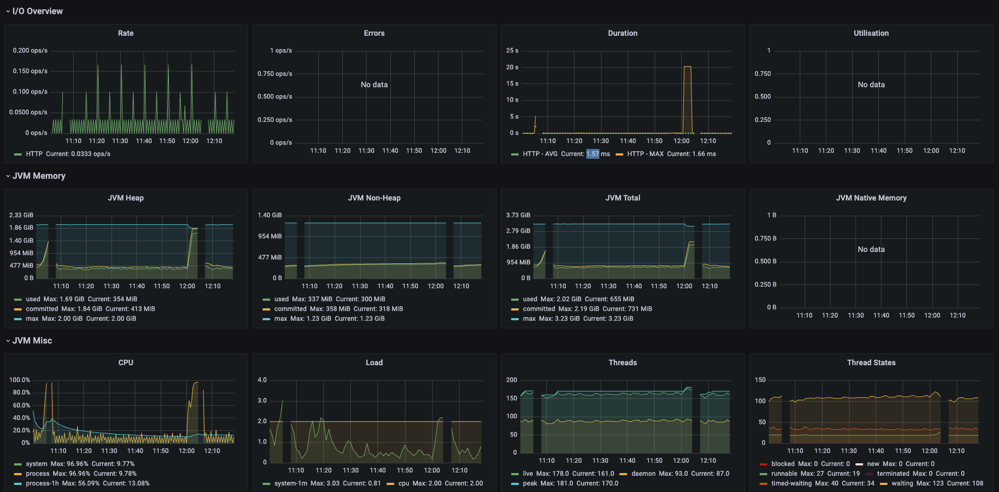
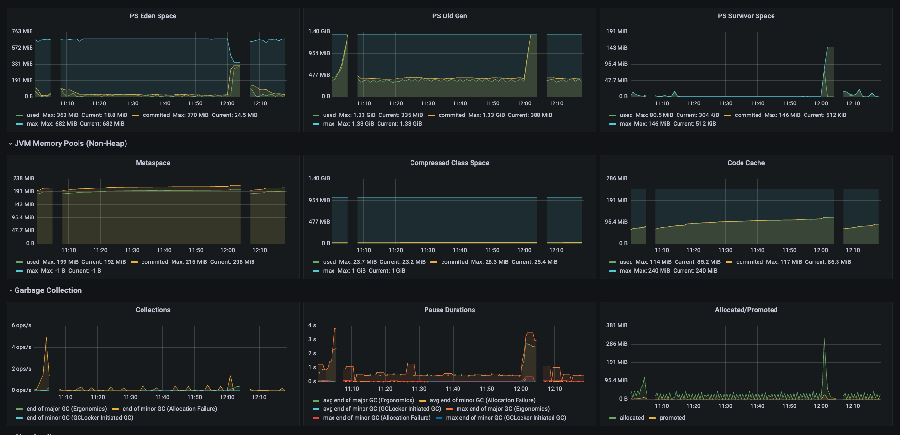
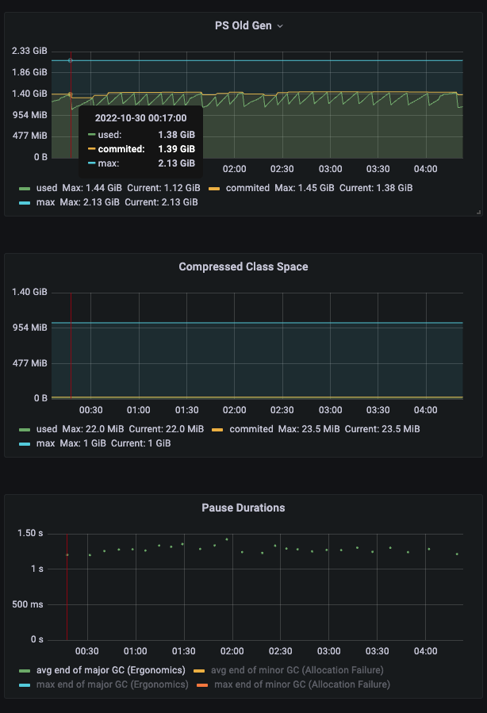
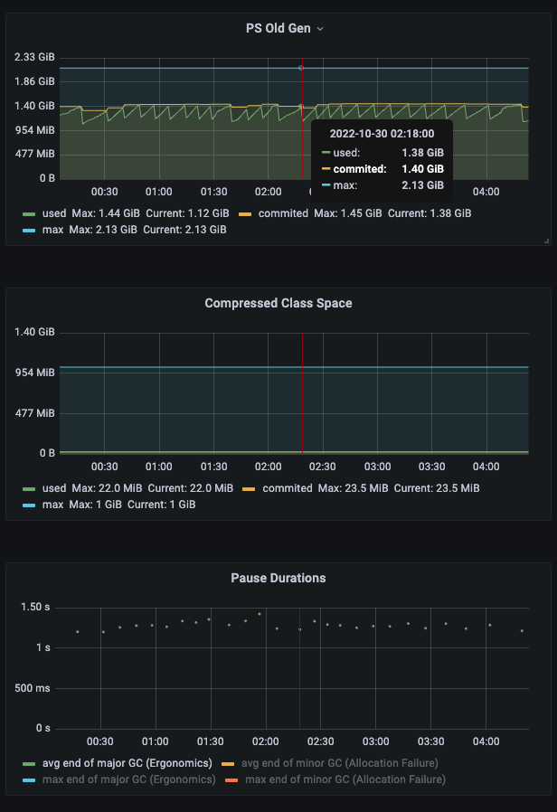
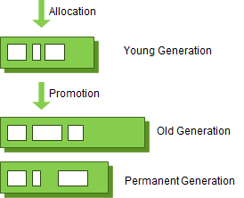
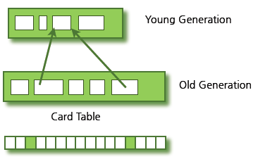
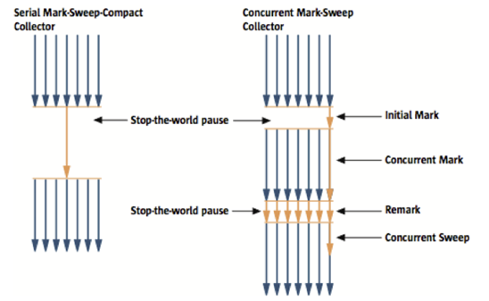
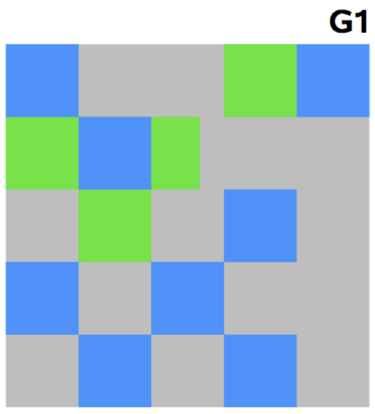

# Garbage Collection(GC)

- 의문
- 참고
  - 메모리 누수 및 full GC 예시
- 개요
- 영역
  - Young 영역의 구성(총 3개)
    - Eden
    - Survivor
  - Old Generation
  - Permanent Generation
- GC
  - 1 Serial GC
  - 2 Parallel(Throughput) GC
  - 3 Parallel Old GC(Parallel Compacting GC)
  - 4 CMS(Concurrent Mark & Sweep) GC
  - 5 G1(Garbage First) GC
- GC 모니터링 방법

## 의문

- GC는 어느 타이밍에 일어나는지?

## 참고

- 사이트
  - [Java GC](https://d2.naver.com/helloworld/1329)
  - [GC 모니터링 방법](https://d2.naver.com/helloworld/6043)
  - [권남](https://kwonnam.pe.kr/wiki/java/performance)
  - [G1 GC 적용과 JVM Upgrade](https://brunch.co.kr/@alden/45)
  - [GC Allocation Failures](https://technospace.medium.com/gc-allocation-failures-42c68e8e5e04)
- c.f) stop the world
  - GC를 실행하기 위해 JVM이 애플리케이션 실행을 멈추는 것
    - GC 스레드 제외 나머지 스레드 모두 작업을 멈춤
    - GC튜닝은 stop the world 시간을 줄이는 것
- GC duration
  - `= GC Pause Duration + GC Concurrent Duration`

### 메모리 누수 및 full GC 예시

메모리 누수 및 full gc가 일어난 경우 예시

### GC모니터링과 해석

GC 모니터링 예시

- 해석
  - old generation에서 committed된 메모리에서 메모리를 더 사용하려고 하면(정확히는 minor gc가 일어나서 old generation에 committed space에 꽉채워서 다 쓰면) major gc가 발생

## 개요

- 개요
  - 가비지 컬렉터의 전제 조건(weak generational hypothesis)
    - 대부분의 객체는 금방 접근 불가능 상태(unreachable - 즉 참조가 안되는 대상)가 된다
    - 오래된 객체에서 젊은 객체로의 참조는 아주 적게 존재한다
- *GC 동작방식?*
  - Young Generation 영역이 committed 수준까지 다 참(allocation failure)
  - Minor GC동작
  - 위의 GC에서 살아남은 오브젝트들은 Old Generation 영역으로 보내짐
  - 그래도 부족하면 더 많은 공간을 commit
  - minor GC를 실행해서 Old Generation 영역으로 보내진 오브젝트들까지 포함해서 Old Generation 영역이 committed 수준까지 다 참
  - Major(Full) GC동작
  - 그래도 부족하면 더 많은 공간을 commit
  - full GC 이후에도 힙 공간이 부족하면 `OutOfMemoryError: Java heap space`에러가 발생

## 영역

GC의 영역 계층

Card Table

- Young Generation 영역
  - 개요
    - 새롭게 생성한 객체의 대부분이 위치하는 영역
    - 대부분의 객체가 금방 접근 불가능 상태가 되기 때문에 매우 많은 객체가 Young 영역에 생성되었다가 사라짐
    - 이 영역에서 객체가 사라질때 Minor GC가 발생한다고 함
      - *minor gc도 stop the world인가?*
  - c.f) allocation failure
    - Young Generation 영역에 더이상 새 오브젝트를 생성할 공간이 없을때 발생
    - minor GC 트리거
- Old Generation 영역
  - 개요
    - 접근 불가능 상태로 되지 않아 Young 영역에서 살아남은 객체가 여기로 복사됨
    - 대부분 Young 영역보다 크게 할당하며, 크기가 큰 만큼 Young 영역보다 GC는 적게 발생함
    - 이 영역에서 객체가 사라질 떄 Major GC(Full GC)가 발생한다고 함
  - c.f) 카드 테이블
    - old 영역의 객체가 young 영역의 객체를 참조하는 경우의 정보를 갖는 512바이트 덩어리
    - Young 영역의 GC를 실행할 때, Old 영역의 모든 객체의 참조를 확인하지 않고, 이 카드 테이블만 뒤져서 GC 대상인지 식별함
      - *그럼 Young 영역의 오브젝트끼리 참조할 경우는 어떻게 GC에서 감지하고 처리하는지?*
- Permanent Generation 영역(Method Area라고도 함)
  - 개요
    - 객체나 *억류(intern)된 문자열* 정보를 저장하는 곳
    - Old 영역에서 살아남은 객체가 영원히 남아 있는 곳은 절대 아님
    - 이 영역에서도 GC가 발생할 수 있음
      - Major GC로 카운트

### Young 영역의 구성(총 3개)

- Eden 영역
  - 개요
    - 새로 생성한 대부분의 객체가 위치하는 곳
    - Eden 영역에서 GC가 한 번 발생한 후 살아남은 객체는 Survivor 영역중 하나로 이동
      - *발생하는 타이밍은?*
- Survivor 영역(2개)
  - 개요
    - Eden영역에서 GC가 발생하면 이미 살아남은 객체가 존재하는 Survivor 영역으로 계속 쌓임
    - 하나의 Survivor영역이 가득 차게 되면, 그 중에서 살아남은 객체를 다른 Survivor 영역으로 이동하고 가득 찬 Survivor 영역은 아무 데이터도 없는 상태가 됨
    - 위의 과정을 계속하다가 계속 살아남아 있는 객체가 Old 영역으로 이동
  - 주의
    - Survivor 영역 중 하나는 반드시 비어있어야 함

## Old 영역에 대한 GC

- 개요
  - 데이터가 가득 차면 GC를 실행

---

1. Serial GC
2. Parallel GC
3. Parallel Old GC
4. CMS GC
5. G1 GC

### 1. Serial GC

- (`-XX:+UserSerialGC`)
- 개요
  - Young영역
    - *앞에서 설명한 방식* 사용(?)
  - Old영역
    - mark-sweep-compact
      - Old영역에 살아있는 객체를 식별(Mark)
      - 힙의 앞부분부터 확인하여 살아있는 것만 남김(Sweep)
      - 각 객체들이 연속되게 쌓이도록 힙의 가장 앞 부분부터 채우기(Compaction)
- 특징
  - 메모리와 CPU가 부족할때 유리함

### 2. Parallel(Throughput) GC

- (`-XX:+UseParallelGC`)
- 개요
  - Serial GC의 멀티 스레드 버전
- 특징
  - 메모리와 CPU가 넉넉할때 유리함

### 3. Parallel Old GC(Parallel Compacting GC)

- (`-XX:+UseParallelOldGC`)
- 개요
  - Parallel GC와 비교하여 Old 영역의 GC 알고리즘만 다름
  - mark-summary-compaction
    - summary
      - GC를 수행한 영역에 대해서 별도로 살아있는 객체를 식별
- 특징
  - *???*

### 4. CMS(Concurrent Mark & Sweep) GC

CMS GC와 Serial GC의 비교

- (`-XX:+UseConcMarkSweepGC`)
- 개요
  - mark-sweep-compaction에서 concurrent하게 mark와 sweep을 진행
- 순서
  - initial mark
    - 클래스 로더에서 가장 가까운 객체 중 살아있는 객체만 찾음(stop the world가 매우 짧음)
  - concurrent mark
    - initial mark에서 살아있다고 확인한 객체에서 참조하는 객체들을 따라가면서 확인(스레드 실행중에 발생)
  - remark
    - concurrent mark 단계에서 새로 추가되거나 참조가 끊긴 객체를 확인
  - concurrent sweep
    - 쓰레기 정리
- 특징
  - 장점
    - stop-the-world시간이 매우 짧음 = low latency gc
  - 단점
    - 다른 GC 방식보다 메모리와 CPU를 많이 사용함
    - Compaction 단계가 기본적으로 제공되지 않음
      - 조각난 메모리가 많아서 Compaction작업을 실행하면 다른 GC 방식의 stop-the-world보다 더 길어짐
      - 따라서 Compaction이 얼마나 자주, 오래 수행되는지 확인 필요

### 5. G1(Garbage First) GC

G1 GC

- (`-XX:+UseG1GC`)
- 개요
  - *바둑판의 각 영역에 객체를 할당하고 GC를 실행. 해당 영역이 꽉 차면 다른 영역에서 객체를 할당하고 GC 실행*
- 특징
  - 장점
    - 성능적으로 가장 빠름
    - Old GC로 인한 Stop-The-World 문제를 해결하는데에 도움을 줌
  - 단점

## GC 모니터링 방법

- 개요
  - JVM이 어떻게 GC를 수행하고 있는지 알아내는 과정
    - Young 영역에 있는 오브젝트를 Old 영역으로 언제 얼마나 이동했는지
    - stop-the-world가 언제 일어나고 얼마동안 일어났는지 등의 정보
  - JVM이 효율적으로 GC를 수행하는지 파악하고, 추가적인 GC 튜닝 작업이 필요한지 확인하기 위함

### 모니터링 방법

- jstat
  - 개요
    - HotSpot JVM에 있는 모니터링 도구
    - `jstat stat , S1C, S0U`
- visualVM + visualGC

## GC 튜닝

- 개요
- 목적
  - Old 영역으로 넘어가는 객체의 수를 최소화
    - G1 GC제외
    - New 영역 크기 조절
  - Full GC 시간 줄이기
    - Old 영역의 크기 '잘' 설정하기
      - 너무 줄이면
        - OutOfMemoryError가 발생 혹은 Full GC 횟수 늘어남
      - 너무 크면
        - Full GC 횟수는 줄어들지만, 실행 시간이 늘어남
- 원칙
  - AB테스트
    - 두대 이상의 서버에 GC옵션을 다르게 적용해서 비교해보고, 옵션을 추가한 서버의 성능이나 GC 시간이 개선된 때에만 옵션을 추가하는 것
- 주의
  - GC를 적게 하려면 객체 생성을 줄이는 작업이 선행되어야 함(String대신 StringBuilder, StringBuffer를 사용)
    - 그래도 큰 용량의 XML과 JSON을 파싱할 경우 엄청나게 큰 임시 메모리를 사용하긴 해야 함
    - GC 튜닝은 최후의 수단

### GC 성능을 결정하는 옵션

- 메모리 크기 옵션
  - 힙 영역의 크기
  - New 영역의 크기
