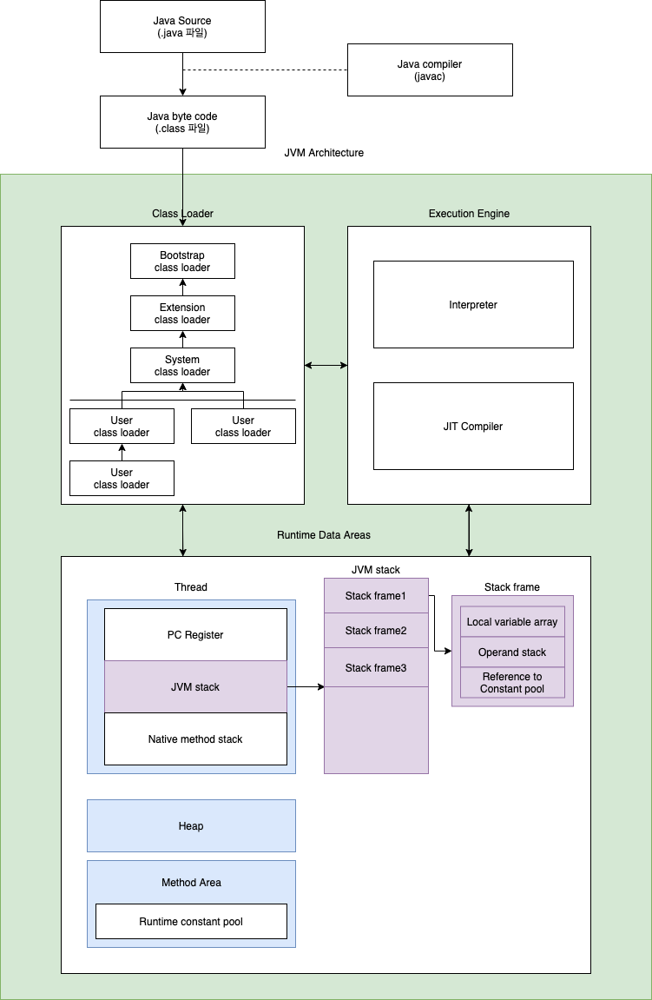
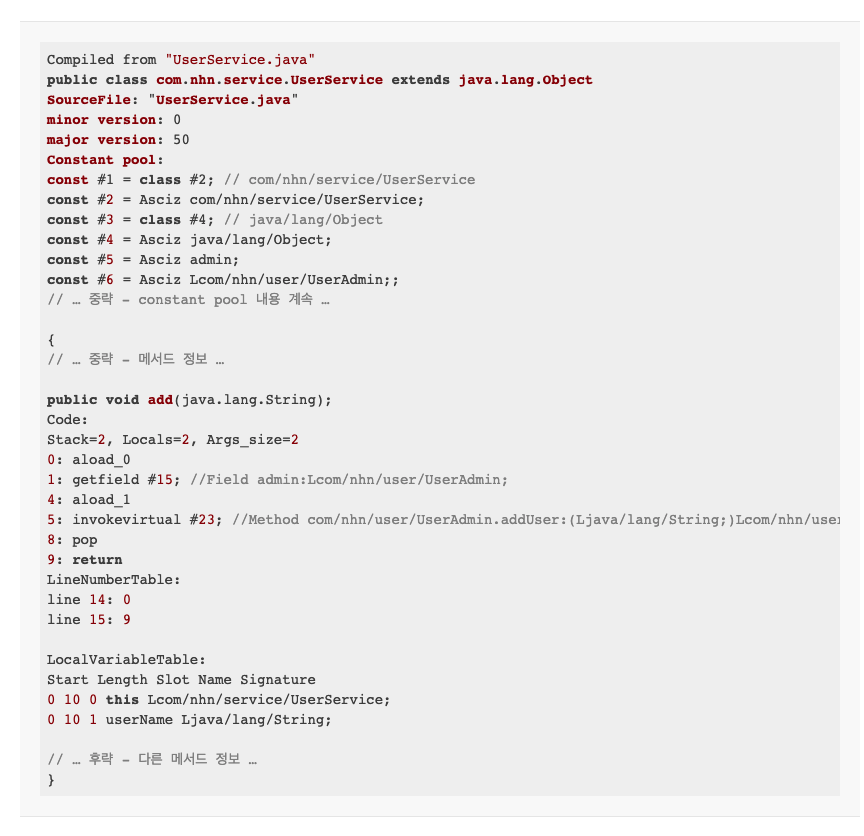
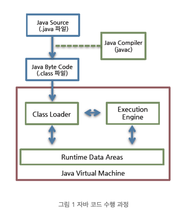
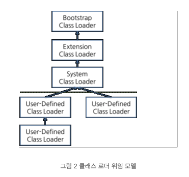
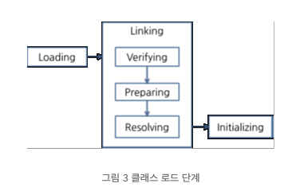
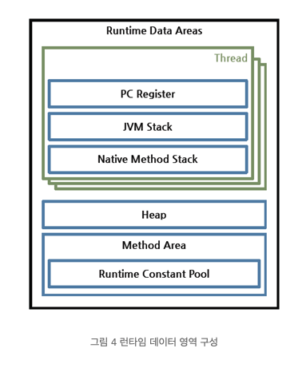
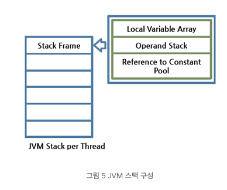

# JVM Internal

- 의문
- 개요
  - JRE
    - JVM
    - Java API
- 가상 머신
- 자바 바이트코드
- 클래스 파일
  - 포맷
- JVM 구조
- 런타임 데이터 영역
- 실행 엔진
- The Java Virtual Machine Specification, Java SE 7 Edition

## 의문

- *애초에 왜 자바 클래스로더가 한개가 아니고 여러개인가?*

## 개요

JVM 전체 아키텍처



- JRE
  - JVM
    - 자바 애플리케이션을 클래스 로더를 통해 읽어 들여서, Java API와 함꼐 실행
      - JVM 명세를 따르면, JVM을 개발하여 사용 가능
  - Java API
    - 자바를 사용하여 쉽게 애플리케이션을 구현할 수 있도록 한 클래스 라이브러리의 집합
    - e.g)
      - 입출력, 화면 구성, 이미지, 네트워크 등

## 가상 머신

- 정의
  - 프로그램을 실행하기 위해 물리적 머신과 유사한 머신을 소프트웨어로 구현한 것
    - WORA(Write Once Run Anywhere)를 구현하기 위함
- JVM
  - 개요
    - 자바 바이트코드를 실행하는 실행기
- JVM의 특징
  - 스택 기반
    - 전통적인 컴퓨터 아키텍처에서 레지스터 기반으로 동작하는데에 비해, 스택기반으로 동작
  - 심볼릭 레퍼런스
    - primitive data type을 제외한 모든 타입(클래스와 인터페이스) 명시적인 메모리 주소 기반의 레퍼런스가 아님
  - 가비지 컬렉션
    - 클래스 인스턴스는 사용자 코드에 의해 명시적으로 생성되고, 가비지 컬렉션에 의해 자동으로 파괴됨
  - 기본 자료형을 명확하게 정의하여 플랫폼 독립성 보장
    - C/C++ 등의 전통적인 언어는 플랫폼에 따라서 `int` 형의 크기가 변함
  - 네트워크 바이트 오더(빅 엔디안)
    - 자바 클래스 파일은 네트워크 바이트 오더를 사용
- JVM 검증
  - 오라클의 TCK(Technology Compatibility Kit)를 통과해야 JVM으로 이름 붙일 수 있음

## 자바 바이트코드

- 개요
  - 자바 코드를 배포하는 가장 작은 단위
- 자바 바이트 코드 명령어
  - OpCode
    - 1바이트의 바이트 번호로 표기(최대 256개)
  - Operand

## 클래스 파일

- 개요
  - JVM에서 실행될 수 있는 자바 바이트 코드를 포함하는 파일
  - 원본 파일이 하나 이상의 클래스를 포함하는 경우, 각각 별도의 클래스 파일이 생성
    - *클래스 내부의 클래스의 경우?*

### 포맷

클래스 파일 포맷 골격

```
ClassFile {
  u4 magic;
  u2 minor_version;
  u2 major_version;
  u2 constant_pool_count;
  cp_info constant_pool[constant_pool_count-1];
  u2 access_flags;
  u2 this_class;
  u2 super_class;
  u2 interfaces_count;
  u2 interfaces[interfaces_count];
  u2 fields_count;
  field_info fields[fields_count];
  u2 methods_count;
  method_info methods[methods_count];
  u2 attributes_count;
  attribute_info attributes[attributes_count];
}
```

UserService.class의 원본 코드

```java
public void add(String userName) {
  admin.addUser(userName);
}
```

실제 컴파일된 UserService.class의 역어셈블링



- magic
- minor_version, major_version
- *constant_pool_count, constant_pool[]*
  - *런타임 상수 풀 영역에 들어갈 정보?*
- access_flags
  - 클래스의 modifier 정보
    - `public`, `final`, `abstract` 나 인터페이스 여부
- this_class, super_class
  - `this`, `super`에 해당하는 클래스들에 대한 constant_pool 내의 인덱스
- interfaces_count, interfaces[]
  - 클래스가 구현한 인터페이스의 개수와, 각 인터페이스에 대한 constant_pool 내의 인덱스
- fields_count, fields[]
  - 클래스의 필드 개수와 필드 정보
  - 필드 정보
    - 필드 이름, 타입 정보, modifier, constant_pool에서의 인덱스
- methods_count, methods[]
  - 클래스의 메서드 개수와 메서드 정보
  - 메서드 정보
    - 메서드 이름, 파라미터 타입과 개수, 반환 타입, modifier, constant_pool에서의 인덱스, 메서드 자체의 실행 코드, 예외 정보
- *attributes_count, attributes[]*

## JVM 구조

JVM의 아키텍처



- 클래스 로더
  - 컴파일된 자바 바이트 코드를 런타임 데이터 영역에 로드
- 실행 엔진
  - 자바 바이트코드 실행

### *클래스 로더*

클래스 로더 위임 모델



*애초에 왜 클래스 로더가 여러개가 있는거지?*

- 개요
  - 자바는 런타임에 클래스를 처음 참조할 때 로드하고 링크함(동적 로드)
    - *처음 참조가 정확히 언제?*
- 특징
  - 계층 구조
    - 클래스 로더끼리 부모-자식 관계를 이루어 계층 구조로 생성
    - 최상위 클래스 로더는 부트스트랩 클래스로더
  - 위임 모델
    - 계층 구조를 바탕으로 클래스 로더끼리 로드를 위임하는 구조로 동작
    - 클래스를 로드할 때, 먼저 상위 클래스로더를 확인하여 상위 클래스 로더에 있다면 해당 클래스 사용하고, 없다면 로드를 요청받은 클래스 로더가 클래스를 로드
  - 가시성 제한
    - 하위 클래스 로더 -> 상위 클래스 로더의 클래스 찾기 가능
    - 상위 클래스 로더 -> 하위 클래스 로더의 클래스 찾기 불가능
  - 언로드 불가
    - 클래스 로더는 클래스를 로드할 수는 있지만, 언로드는 불가
    - 언로드 대신, 현재 클래스 로더를 삭제하고 아예 새로운 클래스 로더를 생성하는 방법을 사용할 수 있음
- 클래스 로더들
  - 부트스트랩 클래스 로더
    - JVM 기동시에 생성
    - Object클래스 들을 비롯하여 자바 API들을 로드
    - 자바가 아니라 네이티브 코드로 구현
  - 익스텐션 클래스 로더
    - 기본 자바 API를 제외한 확장 클래스들을 로드
      - 보안 등
  - 시스템 클래스 로더
    - *애플리케이션의 클래스들을 로드*
      - `$CLASSPATH`내의 클래스들을 로드
  - 사용자 정의 클래스 로더
    - *애플리케이션 사용자가 직접 코드 상에서 생성해서 사용하는 클래스 로더*
    - 웹 애플리케이션 서버와 같은 프레임워크는 웹 애플리케이션들, 엔터프라이즈 애플리케이션들이 서로 독립적으로 동작하게 하기 위해 사용자 정의 클래스 로더를 사용함
      - 독립성 보장
    - WAS클래스 로더 구조는 WAS 벤더마다 조금씩 다른 형태의 계층 구조 사용

클래스 로드 단계



- 동작
  - 1] 로드
    - 클래스를 파일에서 가져와서 JVM의 메모리에 로드
  - 2] 검증
    - 읽어 들인 클래스가 자바 언어 명세 및 JVM 명세에 명시된 대로 잘 구성되어 있는지 검증
      - 가장 복잡하고 시간이 많이 걸림
  - 3] 준비
    - 클래스가 필요로 하는 메모리를 할당하고, 클래스에서 정의된 필드, 메서드, 인터페이스들을 나타내는 데이터 구조를 준비
      - *클래스 관련 정보는 static 메모리 영역에 할당되는데, 어떻게 동적으로 할당할 수 있는가?*
  - 4] 분석
    - *클래스 상수 풀 내 모든 심볼릭 레퍼런스를 다이렉트 레퍼런스로 변경한다*
  - 5] 초기화
    - 클래스 변수들을 적절한 값으로 초기화

## 런타임 데이터 영역

런타임 데이터 영역



JVM 스택 아키텍처



- 개요
  - JVM이라는 프로그램이 운영체제 위에서 실행되면서 할당받는 메모리 영역
- 구성
  - 스레드 영역
    - **PC 레지스터**
      - 개요
        - 현재 수행중인 JVM 명령의 주소를 갖음
    - **JVM 스택**
      - 개요
        - 각 스레드마다 하나씩 존재
        - 스레드가 시작될 때 생성됨
        - stack frame이라는 구조체를 저장하는 스택
        - **오직 JVM 스택에 스택 프레임을 push하고 pop하는 동작만 수행**
        - 예외 발생시 스택 프레임 표현
      - 구성
        - 스택 프레임
          - 개요
            - 메서드가 수행될 떄 마다 스택 프레임이 생성되어 해당 스레드의 JVM 스택에 추가되고, 메서드가 종료되면 스택 프레임이 제거됨
          - 구성
            - 지역 변수 배열
              - 0부터 시작하는 인덱스를 가진 배열
                - 0: this 레퍼런스
                - 1~: 메서드에 전달된 파라미터들이 저장되며, 메서드 파라미터 이후에는 메서드의 지역 변수들이 저장됨
            - 피연산자 스택
              - **메서드의 실제 작업 공간**
              - 각 메서드는 피연산자 스택과 지역 변수 배열 사이에서 데이터 교환, 다른 메서드 호출 결과를 push하거나 pop함
              - 피연산자 스택 공간이 얼마나 필요한지는 컴파일할 때 결정 가능
    - **네이티브 메서드 스택**
      - 자바 외의 언어로 작성된 네이티브 코드를 위한 스택
      - JNI(Java Native Interface)를 통해 호출하는 C/C++등의 코드를 수행하기 위한 스택
        - 언어에 맞게, C스택이나 C++의 스택이 생성됨
  - 그 외
    - 메서드 영역
      - 모든 스레드가 공유하는 영역으로, JVM이 시작될 때 생성됨
      - JVM이 읽어 들인 각각의 클래스, 인터페이스에 대한 런타임 상수 풀, 필드와 메서드 정보, Static 변수, 메서드의 바이트코드 등을 보관
      - JVM 벤더마다 다양한 형태로 구현 가능
        - 가비지 컬렉션은 JVM 벤더의 선택 사항
        - *이 영역에 가비지 컬렉션이 필요한가?*
      - 구성
        - 런타임 상수 풀
          - 클래스 파일 포맷에서 constant_pool 테이블에 해당하는 영역
          - JVM 동작에서 가장 핵심적인 역할을 수행하는 곳
          - **각 클래스와 인터페이스의 상수 뿐 아니라, 메서드와 필드에 대한 모든 레퍼런스까지 담고 있는 테이블**
    - 힙
      - 인스턴스 또는 객체를 저장하는 공간으로 가비지 컬렉션 대상
      - JVM 성능 등의 이슈에서 가장 많이 언급되는 공간
      - 힙 구성 방식이나, 가비지 컬렉션 방법은 JVM 벤더 재량

역어셈블된 바이트코드 해석

```java
public void add(java.lang.String);
Code:
0: aload_0
1: getfield #15; //Field admin:Lcom/nhn/user/UserAdmin;
4: aload_1
5: invokevirtual #23; //Method com/nhn/user/UserAdmin.addUser:(Ljava/lang/String;)Lcom/nhn/user/User;
8: pop
9: return
```

- 특징
  - x86 아키텍처의 어셈블리코드와는 다르게, OpCode라는 형식은 유사하지만, 피연산자에 레지스터 이름이나 메모리 주소나 오프셋은 쓰지 않음
    - JVM은 스택 사용
    - 자체적으로 메모리를 관리하므로, 실제 메모리 주소 대신 15, 23같은 인덱스 번호 사용
      - 인덱스 번호는 상수 풀의 인덱스
      - JVM은 각 클래스마다 상수 풀을 생성하여, 실제 대상의 레퍼런스를 보관
- 해석
  - `aload_0`
    - 지역 변수 배열의 0번 인덱스 내용(this)을 피연산자 스택에 추가
  - `getfield #15`
    - 현재 클래스 상수 풀에서 15번 인덱스 내용을 피연산자 스택에 추가
    - `UserAdmin admin`필드가 추가
  - `aload_1`
    - 지역 변수 배열의 1번 인덱스 내용을 피연산자 스택에 추가
    - `String userName`의 레퍼런스가 추가
  - `invokevirtual #23`
    - 현재 클래스 상수 풀에서 23번 인덱스 내용에 해당하는 메서드 호출
    - 호출이 완료되면 그 반환값을 피연산자 스택에 추가함
  - `pop`
    - `invokevirtual`로 호출한 결과 반환값을 스택에서 꺼냄
  - `return`
    - 메서드 완료

## 실행 엔진

- 개요
  - 클래스 로더를 통해 JVM내의 런타임 데이터 영역에 배치된 바이트코드는 실행 엔진에 의해 실행됨
  - 자바 바이트코드를 명령어 단위로 읽어서 실행
- 실행 엔진 구성
  - **인터프리터**
    - 바이트코드 명령어를 하나씩 읽어서 해석하고 실행
    - 인터프리팅 결과의 실행은 느림
  - **JIT(Just-In-Time)**
    - 인터프리터 방식으로 실행하다가 적절한 시점에 바이트코드 전체를 컴파일하여 네이티브 코드로 변경 > 후에 네이티브 코드를 실행(캐싱)
      - JVM 내부에서 해당 메서드가 얼마나 자주 수행되는지 체크 / 일정 정도를 넘을 때에만 컴파일 수행
    - 벤더마다 다름
      - 오라클
        - 핫스팟 컴파일러
      - IBM
        - JIT + AOT 컴파일러

## The Java Virtual Machine Specification, Java SE 7 Edition

- SE7에 다양한 문법과 특성을 추가했으나, JVM의 변화는 그리 많지 않음
  - SW 7의 새로운 기능들도 자바 컴파일러가 처리함
