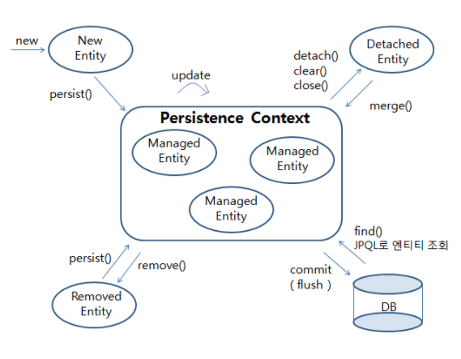
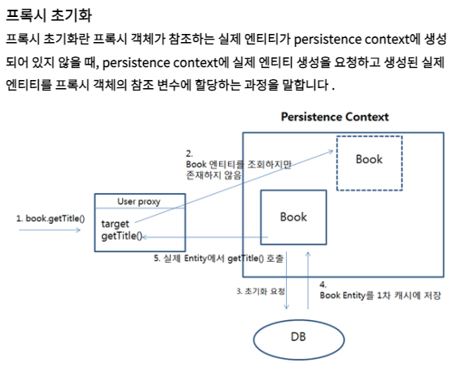

# JPA

- 각종 기술
- Javakrta Persistence API(JPA)
- 1. Entities
- 2. Entity Operations
  - 2.1 EntityManager
    - Persistence Context

## 각종 기술

- JDBC
  - DB에 접근할 수 있도록 Java에서 제공하는 API
  - 모든 persistence framework는 jdbc API를 사용
- JPA
  - 자바 ORM 기술에 대한 API 표준 명세, Java에서 제공하는 API
  - 사용자가 원하는 JPA 구현체를 선택해서 사용 가능
    - Hibernate, ...
- Hibernate
  - JPA의 구현체 중 하나
  - JDBC API를 당연하게도 사용
  - HQL(Hibernate Query Language)라고 불리는 매우 강력한 쿼리 언어 포함
- Mybatis
  - SQL Mapper

## Jakarta Persistence API(JPA)

- 개요
  - 자바 ORM 기술에 대한 API 표준 명세, Java에서 제공하는 API
  - 원래는 Java Persistence API였음
- 특징
  - 모든 API가 `javax.*`패키지에서 `jakarta.*`패키지로 이동됨
    - 이름 자체가 `javax` -> `jakarta`로 변경
- 설명 대상
  - Entities
  - Entity Operations
    - EntityManager
    - Entity Instance's Life Cycle
    - Persistence Context Lifetime and Synchronization Type
    - Locking and Concurrency
    - Entity Listeners and Callback Methods
    - Bean Validation
    - Entity Graphs
  - Query Language
  - Metamodel API
  - Criteria API
  - Entity Managers and Persistence Contexts
  - Entity Packaging
  - Container and Provider Contracts for Deployment and Bootstraping
  - Metadata Annotations
  - Metadata for Object/Relational Mapping
  - XML Object/Relational Mapping Descriptor

## 1. Entities

## 2. Entity Operations

- EntityManager API와 Query API의 사용법을 나타냄

### 2.1 EntityManager

```java
package jakarta.persistence;

import java.util.Map;
import java.util.List;
import jakarta.persistence.metamodel.Metamodel;
import jakarta.persistence.criteria.CriteriaBuilder;
import jakarta.persistence.criteria.CriteriaQuery;
import jakarta.persistence.criteria.CriteriaUpdate;
import jakarta.persistence.criteria.CriteriaDelete;

public interface EntityManager {
    // Make an instance managed and persistent.
    public void persist(Object entity);

    // Merge the state of the given entity into the current persistence context.
    public <T> T merge(T entity);

    public void remove(Object entity);

    public <T> T find(Class<T> entityClass, Object primaryKey);
    public <T> T find(Class<T> entityClass, Object primaryKey,
                      Map<String, Object> properties);
    public <T> T find(Class<T> entityClass, Object primaryKey,
                      LockModeType lockMode);
    public <T> T find(Class<T> entityClass, Object primaryKey,
                      LockModeType lockMode,
                      Map<String, Object> properties);
    public <T> T getReference(Class<T> entityClass,
                                  Object primaryKey);

    public void flush();

    public void setFlushMode(FlushModeType flushMode);
    public FlushModeType getFlushMode();

    public void lock(Object entity, LockModeType lockMode);
    public void lock(Object entity, LockModeType lockMode,
                     Map<String, Object> properties);
    public void refresh(Object entity);
    public void refresh(Object entity,
                            Map<String, Object> properties);
    public void refresh(Object entity, LockModeType lockMode);
    public void refresh(Object entity, LockModeType lockMode,
                        Map<String, Object> properties);

    public void clear();

    public void detach(Object entity);

    public boolean contains(Object entity);

    public LockModeType getLockMode(Object entity);

    public void setProperty(String propertyName, Object value);

    public Map<String, Object> getProperties();

    public Query createQuery(String qlString);
    public <T> TypedQuery<T> createQuery(CriteriaQuery<T> criteriaQuery);
    public Query createQuery(CriteriaUpdate updateQuery);
    public Query createQuery(CriteriaDelete deleteQuery);
    public <T> TypedQuery<T> createQuery(String qlString, Class<T> resultClass);

    public Query createNamedQuery(String name);
    public <T> TypedQuery<T> createNamedQuery(String name, Class<T> resultClass);
    public Query createNativeQuery(String sqlString);
    public Query createNativeQuery(String sqlString, Class resultClass);
    public Query createNativeQuery(String sqlString, String resultSetMapping);

    public StoredProcedureQuery createNamedStoredProcedureQuery(String name);

    public StoredProcedureQuery createStoredProcedureQuery(String procedureName);
    public StoredProcedureQuery createStoredProcedureQuery(
               String procedureName, Class... resultClasses);
    public StoredProcedureQuery createStoredProcedureQuery(
              String procedureName, String... resultSetMappings);

    public void joinTransaction();
    public boolean isJoinedToTransaction();

    public <T> T unwrap(Class<T> cls);

    public Object getDelegate();

    public void close();
    public boolean isOpen();

    public EntityTransaction getTransaction();
    public EntityManagerFactory getEntityManagerFactory();

    public CriteriaBuilder getCriteriaBuilder();

    public Metamodel getMetamodel();

    public <T> EntityGraph<T> createEntityGraph(Class<T> rootType);

    public EntityGraph<?> createEntityGraph(String graphName);

    public EntityGraph<?> getEntityGraph(String graphName);

    public <T> List<EntityGraph<? super T>> getEntityGraphs(Class<T> entityClass);

}
```

- 개요
  - EntityManger 인스턴스는 persistence context와 상호작용하게 하는 인터페이스
    - entity manager를 다루는 것은 사실은, persistence context를 다루는 것과 같음
  - EntityManager API는 persistent entity 인스턴스들을 생성하고 제거하는데에, 쿼리하는데에 사용됨
- 특징
  - 버퍼링, 캐싱 등의 이점
- 관련 개념
  - persistence context
    - 개요
      - 엔티티 인스턴스들의 집합이고, 임의의 영속 엔티티 아이덴티티에 대해서 유일한 엔티티 인스턴스가 존재함
      - persistence context 내부에서, 엔티티 인스턴스들과 그것들의 라이프 사이클이 관리됨
        - 다뤄지는 엔티티에 행해지는 모든 변화를 트래킹
        - 트랜잭션 동안 변화가 생기면, 엔티티가 dirty로 마킹되고, 트랜잭션이 끝나면 변화가 persistent storage에 플러시 됨
      - first-level cache이며, 이곳에서 모든 엔티티들이 데이터베이스로부터 가져와지거나, 데이터베이스로 저장됨
  - persistence unit
    - 개요
      - 주어진 EntityManager인스턴스에 의해서 관리될 수 있는 엔티티의 집합은 하나의 persistence unit으로 정의됨
      - persistence unit은 애플리케이션에 의해서 그룹화되거나, 관련지어지는 모든 클래스들의 집합을 정의하며, 단일 데이터베이스 매핑에 같은 장소에 위치시켜야 함
- Transaction Commit
  - 트랜잭션 스코프의 persistence context의 managed 엔티티들은 detached됨
    - extended persistence context의 managed 엔티티들은 그대로 managed임
- Persistence context lifetime
  - **TRANSACTION**
    - 트랜잭션이 커밋되면, 모든 managed 엔티티들이 detached상태가 됨
    - entity 매니저와 활성화된 트랜잭션을 자동적으로 join함
  - **EXTENDED**
    - extended persistence context가 EntityManager 인스턴스가 생성되고 닫힐때까지 존재함
    - 트랜잭션이 커밋되어도, 여전히 managed 엔티티들이 managed상태로 존재
    - 애플리케이션이 persistence context의 생명주기를 관리함

#### Persistence Context

JPA persistence context diagram



Persistence context와 지연 로딩



- 개요
  - 엔티티 매니저로 `persist()`, `find()`하면, 엔티티 매니저가 엔티티를 영속성 컨텍스트에 보관하고 관리 함
- 엔티티 생명 주기
  - 비영속(new)
    - persistence contex와 관련이 없는 상태(DB와 관련이 없는 순수한 객체 상태)
      - `Member member = new Member();`
  - 영속(managed)
    - 엔티티 매니저가 관리하는 persistence context에 엔티티가 저장된 상태
      - `em.persist(member)` or `em.find(member.class, 1)`
  - 준영속(detached)
    - persistence context에 저장되었다가 분리된 상태, 즉 엔티티 매니저가 관리하지 않는 상태
      - `em.detach(userA)`
        - 특정 엔티티만 분리
      - `em.clear()`
        - persistence context를 초기화
      - `em.close()`
        - persistence context를 종료
    - 특징
      - **persistence context의 바깥쪽에서 여전히 살아는 있으나, 해당 state는 DB state와 싱크되었다는 보장이 없음**
        - `LAZY`로 fetch하는 필드는 접근 불가
  - removed
    - 트랜잭션 커밋시에 제거될 엔티티 인스턴스
- 특징
  - **`@Id`필드를 이용하여 엔티티를 식별**
  - **write buffer기능 존재**
    - `flush()`시에 쿼리 DB에 반영
    - `commit()`시에 트랜잭션 커밋
    - 웹에서는 `@Transactional` 어노테이션을 추가하여 해결
      - 메서드 종료 시, 엔티티 매니저가 `commit()`메서드 실행
  - **1차 캐시, 동일성 보장, 변경 감지, 지연 로딩**
    - 1차 캐시
      - 개요
        - 일종의 Map
          - key는 @Id로 지정한 식별자, value는 엔티티 인스턴스
        - `persist()` or `find()`메서드를 호출하면 엔티티가 managed 상태가 되면서, persistence context의 1차 캐시에 저장됨
          - `find()`시에, 1차 캐시에 찾는 엔티티가 없으면 DB에 SELECT쿼리를 수행하여 엔티티를 가져온 후, persistence context의 캐시에 저장하여 managed상태로 만듬
            - *그럼 자연스럽게 REPEATABLE READ가 되는거 아닌가? 어떻게 READ COMMITTED로 바꾸지?*
    - 동일성 보장
      - 1차 캐시에 있는 엔티티를 조회하면 항상 동일한 객체 반환
    - 변경 감지
      - managed 상태에 있는 엔티티에 대해서, setter를 이용해서 필드 값을 수정하면, flush 시점에서 스냅샷과 현재 엔티티의 상태를 비교(dirty checking)하여, 변경되었다면 UPDATE 쿼리를 실행
        - **모든 필드에 대해서 업데이트가 이루어짐**
          - 어떤 값이 변경되던, 쿼리가 고정됨
            - UPDATE 쿼리 재사용 가능
          - `@DynamicUpdate`어노테이션을 추가하면 UPDATE되는 필드에 대해서만 UPDATE수행
    - flush
      - persistence context의 변경 내용을 DB에 동기화 하는 작업
      - **동작**
        - 변경 감지를 통해 수정된 엔티티 찾음
        - 수정된 엔티티가 있으면, UPDATE 쿼리를 persistence context에 있는 SQL 저장소에 등록
        - 쓰기 지연 SQL 저장소의 쿼리를 모두 DB에 보냄으로써 동기화 함
      - flush 호출 타이밍
        - 엔티티 매니저가 직접 호출
        - 트랜잭션이 commit()호출할 때 자동으로 호출
        - **JPQL 쿼리 실행 전에 자동으로 호출**
