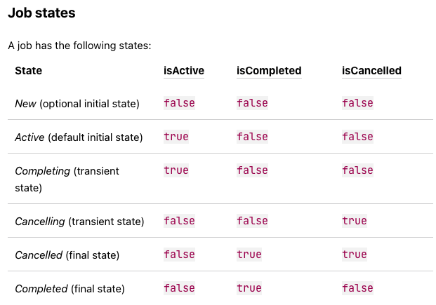

# Kotlin Coroutine

- 의문
- 용어 설명
  - structured concurrency
  - suspending function
  - coroutine scope
  - scope builder
  - coroutine builder
  - coroutine context
- 개요
  - 코루틴이란
    - 정의
    - 구성
- 원리
- 개요
  - Coroutine Context
  - Coroutine Builder
  - 중단했다가 재개하는 방법
  - 실행 흐름 예시

## 의문

**스레드는 비싸기 때문에, 최대한 스레드를 효율적으로 사용하기 위해서 코루틴을 사용한다.**

- *코루틴에서 `delay`를 사용하는 경우, 특정시간이 지났는지는 어떻게 파악하지? 이벤트 루프를 사용하는건가?*
- 코루틴 빌더는 현재 빌더가 호출된 코루틴 스코프의 컨텍스트를 자연스럽게 받아오는가?
  - 그렇다
- SupervisorJob, cancellation 전파에 관하여 아직 이해가 잘 안됨
  - `CoroutineScope(getDefaultCoroutineContext() + SupervisorJob())`이것의 효과는?
  - Job은 코루틴의 라이프 사이클을 다루는 오브젝트이다. 즉 코루틴 하나마다 각자의 job이 있다고 이해를 해야 한다.
  - 결국 현재의 코루틴스코프의 코루틴이 SupervisorJob이라는 것은, 자신의 스코프내의 자신의 잡과 연결된 자식 코루틴이 에러를 propagate할때만 그것을 **부모 코루틴으로 전파시키지 않는 의미** 가 있는 것이다.

## 용어 설명

- 전체 용어 및 관계
- structured concurrency
- suspending function
- coroutine scope
- scope builder
- coroutine builder
- coroutine context

### 전체 용어 및 관계

- structured concurrency
  - 개요
    - 코루틴 스코프가 코루틴의 실행과 라이프 사이클을 관리하는 방식
      - 새 코루틴은 특정 코루틴 스코프에서만 시작될 수 있음(라이프사이클 제한)
      - 코루틴의 무엇인가가 잘못되었거나, 유저가 동작을 철회하면 child 코루틴이 자동적으로 캔슬됨
    - 구현 방법
      - job을 통한 구현
- coroutine scope
  - 개요
    - 코루틴 인스턴스를 실행 및 관리하는 스코프
      - 관리 정책은 context로 나타나있음
    - 코루틴은 코루틴 스코프에서만 실행됨
      - 코루틴의 라이프 타임을 제한함
      - lost, leak 방지 / error가 잘 도달할 수 있게 함
    - **서로 다른 코루틴들의 parent-child 관계의 매니징을 책임짐**
      - 부모코루틴은 자식 코루틴을 기다림
      - 자식이 에러가 나면, 자식의 자식과 부모에게 에러가전달되고, 부모는 또다시 자식과 부모로 에러 전달
    - **라이프 사이클을 갖는 오브젝트가 있을 때, 해당 오브젝트와 관련되는 다양한 코루틴이 동작할때, 오브젝트의 행동이 취소되면, 모든 코루틴들이 취소되어야 함**
      - 메모리 릭을 막자
      - e.g) 웹 서버 프레임워크 리퀘스트 컨텍스트 오브젝트
  - 종류
    - 커스텀 코루틴 스코프 생성
      - `CoroutineScope`
    - 코루틴 스코프 빌더
      - `coroutineScope`, `supervisorScope`
      - `withContext`
- coroutine builder
  - 개요
    - coroutine scope의 확장 함수이며, 코루틴을 생성하는 방식
    - 코루틴 스코프의 컨텍스트를 상속해서 중단도 전파함
  - 종류
    - `launch`
    - `async`

### structured concurrency

- 개요
  - 코루틴 스코프가, 코루틴의 실행과 라이프사이클을 관리하는 방식
- 특징
  - 새 코루틴들은 특정 코루틴 스코프에서만 시작될 수 있음
    - 스코프 내의 코루틴의 라이프 타임을 제한함
    - lost, leak 방지 / error가 잘 도달할 수 있게 함
    - 외부 스코프는 children 코루틴들이 끝날때까지 끝낼 수 없음
  - **무엇인가 잘못되거나, 유저가 동작을 철회하면 child 코루틴이 자동적으로 캔슬됨**

### suspending function

- 개요
  - 코루틴 인스턴스가 될 수 있는 non-preemptive yield 가능한 서브루틴의 일반화
  - 내부적으로 다른 suspending function을 실행해서 코루틴 인스턴스를 suspend할 수 있음
- 특징
  - 이 suspending function을 실행만한다고 코루틴 인스턴스가 생성되는건 아님
    - 코루틴은 coroutine builder와 함께 생성해야 함
    - 즉, **코루틴 인스턴스는 Job이 동반되어야 함**

### coroutine scope

라이프 사이클을 갖는 오브젝트의 코루틴 스코프 예시(e.g 웹 서버 프레임워크의 리퀘스트 컨텍스트)

```
class Activity {
    private val mainScope = MainScope()

    fun destroy() {
        mainScope.cancel()
    }

    fun doSomething() {
        // launch ten coroutines for a demo, each working for a different time
        repeat(10) { i ->
            mainScope.launch {
                delay((i + 1) * 200L) // variable delay 200ms, 400ms, ... etc
                println("Coroutine $i is done")
            }
        }
    }
}

val activity = Activity()
activity.doSomething() // run test function
println("Launched coroutines")
delay(500L) // delay for half a second
println("Destroying activity!")
activity.destroy() // cancels all coroutines
delay(1000) // visually confirm that they don't work

// Launched coroutines
// Coroutine 0 is done
// Coroutine 1 is done
// Destroying activity!
```

- 개요
  - 코루틴 인스턴스를 실행 및 관리하는 스코프
    - 관리 정책은 context로 나타나있음
  - 코루틴은 코루틴 스코프에서만 실행됨
    - 코루틴의 라이프 타임을 제한함
    - lost, leak 방지 / error가 잘 도달할 수 있게 함
  - **서로 다른 코루틴들의 parent-child 관계의 매니징을 책임짐**
    - 부모코루틴은 자식 코루틴을 기다림
    - 자식이 에러가 나면, 자식의 자식과 부모에게 에러가전달되고, 부모는 또다시 자식과 부모로 에러 전달
  - **라이프 사이클을 갖는 오브젝트가 있을 때, 해당 오브젝트와 관련되는 다양한 코루틴이 동작할때, 오브젝트의 행동이 취소되면, 모든 코루틴들이 취소되어야 함**
    - 메모리 릭을 막자
    - e.g) 웹 서버 프레임워크 리퀘스트 컨텍스트 오브젝트
- 특징
  - 인터페이스인데, coroutineContext를 래핑하였음
    - 해당 스코프에 있는 child coroutine을 cancel할 수 있게 함
  - 반드시 블록과 관련된 개념은 아님
    - e.g) `scope.launch(...)`
  - scope가 정의될 때, supervisor job을 넘겨주지 않으면, child coroutine에서 에러가 났을경우, 에러가 parent job으로 propagate되어서, 다시 parent job은 child coroutine으로 에러를 전파함
  - job이외의 코루틴 컨텍스트의 요소들은 child coroutine scope로 상속됨
    - **job은 그 자체가 상속이 되는게 아니라, 상속 '관계'가 생성되는 것(structured concurrency)** 그래서 child coroutine을 빌더를 통해 생성할 시에 따로 job을 생성하거나 하면 안 됨
- 커스터마이징
  - `CoroutineScope()` or `MainScope()`를 사용해서 생성되어야 함
    - `CoroutineScope()`
      - `Dispatchers.Default`를 사용
    - `MainScope()`
      - `Dispatchers.Main`을 사용
  - 또한, 런칭된 코루틴이 필요없을때에는 `CoroutineScope.cancel()` extension으로 캔슬헤야 함
- Best practices
  - 스코프의 이름을 명시적으로 사용하는 것이 좋음
    - e.g) `viewModelScope.launch()`
  - 적절한 라이프타임에 맞춰서 코루틴 스코프를 정의하고 사용해야 함
    - `GlobalScope`에서 실행되는 코루틴들의 라이프 타임의 경우에는, application의 life-time과 동치이며, 글로벌 스코프의 모든 코루틴들은 서로 독립(즉, **Job 계층이 만들어지지 않음**)
      - `GlobalScope.async`, `GlobalScope.launch`도 가능
- c.f) child coroutine

### scope builder

```kotlin
suspend fun main() {
    withContext(Dispatchers.IO) {
        doWorld()
    }
}

suspend fun doWorld() {
    coroutineScope {
        println(coroutineContext)
        launch {
	        println(coroutineContext)
            delay(2000L)
            println("World 2")
            println(Thread.currentThread().getId())
        }
        launch {
	        println(coroutineContext)
            delay(1000L)
            println("World 1")
            println(Thread.currentThread().getId())
        }
        println("Hello")
        println(Thread.currentThread().getId())
    }
}

// 출력 결과(항상 고정된건 아님)
// [ScopeCoroutine{Active}@506b5e81, Dispatchers.IO]
// [CoroutineId(1), "coroutine#1":StandaloneCoroutine{Active}@e6950a8, Dispatchers.IO]
// Hello
// 10
// [CoroutineId(2), "coroutine#2":StandaloneCoroutine{Active}@5d8ca77b, Dispatchers.IO]
// World 1
// 15
// World 2
// 15
```

- 개요
  - coroutine builder를 통하지 않더라도 커스텀 scope만을 `coroutineScope`빌더를 사용해서 만들 수 있음
    - **커스텀 scope는 coroutine scope를 만들고, 모든 children이 끝날 때 까지 끝나지 않음**
      - 즉, 라이프 사이클을 그런식으로 정의한것
- 특징
  - suspend가 호출이 되는 outer scope의 child scope가 됨
    - context를 outer scope로부터 상속받음
      - Job도 상속받나?
        - **Job은 값을 그대로 상속받는게 아니고, 상속 관계가 된다**
- 종류
  - `runBlocking`
    - 현재 스레드를 기다리면서 블로킹함
    - regular function
  - `coroutineScope`
    - 코루틴 인스턴스를 suspend하고 스레드를 다른 코루틴 인스턴스로 양보
    - suspending function
  - `supervisorScope`
    - coroutineScope + `SupervisorJob`

### coroutine builder

```kotlin
fun CoroutineScope.launch(
    context: CoroutineContext = EmptyCoroutineContext,
    start: CoroutineStart = CoroutineStart.DEFAULT,
    block: suspend CoroutineScope.() -> Unit
): Job

fun <T> CoroutineScope.async(
    context: CoroutineContext = EmptyCoroutineContext,
    start: CoroutineStart = CoroutineStart.DEFAULT,
    block: suspend CoroutineScope.() -> T
): Deferred<T>
```

- 개요
  - launch
    - 현재 스레드를 블로킹하지 않고, 코루틴을 새로 시작하고 Job으로 코루틴의 레퍼런스를 반환
      - 코루틴은 job이 취소되면 최소됨
  - async
    - 코루틴을 생성하고, future result를 Deferred라는 구현으로 반환
      - deferred가 취소되면 취소됨
  - GlobalScope를 제외하고는 structured concurrency가 적용됨
  - 코루틴 컨텍스트는 `CoroutineScope`으로부터 상속됨
  - Job의 상속 관계를 생성함, 즉, 코루틴 인스턴스가 생성되는 것임
  - 그 자체가 코루틴 스코프를 생성함
- 특징
  - 코루틴 빌더에 `start = CoroutineStart.LAZY`와 같이 LAZY하게 코루틴을 시작할 수도 있음

#### Structured concurrency with async

```kotlin
suspend fun concurrentSum(): Int = coroutineScope {
    val one = async { doSomethingUsefulOne() }
    val two = async { doSomethingUsefulTwo() }
    one.await() + two.await()
}

val time = measureTimeMillis {
    println("The answer is ${concurrentSum()}")
}
println("Completed in $time ms")

// The answer is 42
// Completed in 1038 ms
```

- concurrentSum 내부에서 exception이 던져지면, 모든 child coroutine은 cancel됨

```kotlin
fun main() = runBlocking<Unit> {
    try {
        failedConcurrentSum()
    } catch(e: ArithmeticException) {
        println("Computation failed with ArithmeticException")
    }
}

suspend fun failedConcurrentSum(): Int = coroutineScope {
    val one = async<Int> {
        try {
            delay(Long.MAX_VALUE) // Emulates very long computation
            42
        } finally {
            println("First child was cancelled")
        }
    }
    val two = async<Int> {
        println("Second child throws an exception")
        throw ArithmeticException()
    }
    one.await() + two.await()
}

// Second child throws an exception
// First child was cancelled
// Computation failed with ArithmeticException
```

- cancellation은 코루틴 계층을 타고 propagated됨

### coroutine context

```kotlin
suspend fun main() {
    printThreadId(1)

    // withContext에서는 SupervisorJob()은 무시된다
    // withContext로 인한 coroutine scope가 child coroutine이 끝날때 까지 외부 로직을 suspend시킨다
    withContext(Dispatchers.IO + SupervisorJob()) {
        printThreadId(2)
        async { printThreadId(3, 1); throw Exception("Hoho") }
        async { printThreadId(4, 2) }
        async { printThreadId(5, 1) }
        async { for (i in 0..1_000_000) { if(i == 1_000_000) printThreadId(1000, null) } }
        async { for (i in 0..1_000_000) { if(i == 1_000_000) printThreadId(1001, null) } }
    }
    //    1: 1
    //    2: 15
    //    1000: 21
    //    1001: 20
    //    5: 21
    //    3: 20
    //    Exception in thread "main" java.lang.Exception: Hoho
    //    at coroutine_test.app.AppKt$main$2$1.invokeSuspend(App.kt:28)
    //    at kotlin.coroutines.jvm.internal.BaseContinuationImpl.resumeWith(ContinuationImpl.kt:33)
    //    at kotlinx.coroutines.DispatchedTask.run(DispatchedTask.kt:106)
    //    at kotlinx.coroutines.internal.LimitedDispatcher.run(LimitedDispatcher.kt:42)
    //    at kotlinx.coroutines.scheduling.TaskImpl.run(Tasks.kt:95)
    //    at kotlinx.coroutines.scheduling.CoroutineScheduler.runSafely(CoroutineScheduler.kt:570)
    //    at kotlinx.coroutines.scheduling.CoroutineScheduler$Worker.executeTask(CoroutineScheduler.kt:750)
    //    at kotlinx.coroutines.scheduling.CoroutineScheduler$Worker.runWorker(CoroutineScheduler.kt:677)
    //    at kotlinx.coroutines.scheduling.CoroutineScheduler$Worker.run(CoroutineScheduler.kt:664)

    coroutineScope {
        printThreadId(2)
        async { printThreadId(3, 1); throw Exception("Hoho") }
        async { printThreadId(4, 2) }
        async { printThreadId(5, 1) }
        async { for (i in 0..1_000_000) { if(i == 1_000_000) printThreadId(1000, null) } }
        async { for (i in 0..1_000_000) { if(i == 1_000_000) printThreadId(1001, null) } }
    }
    //    1: 1
    //    2: 1
    //    1000: 18
    //    1001: 19
    //    3: 19
    //    5: 18
    //    Exception in thread "main" java.lang.Exception: Hoho
    //    at coroutine_test.app.AppKt$main$2$1.invokeSuspend(App.kt:37)
    //    at kotlin.coroutines.jvm.internal.BaseContinuationImpl.resumeWith(ContinuationImpl.kt:33)
    //    at kotlinx.coroutines.DispatchedTask.run(DispatchedTask.kt:106)
    //    at kotlinx.coroutines.scheduling.CoroutineScheduler.runSafely(CoroutineScheduler.kt:570)
    //    at kotlinx.coroutines.scheduling.CoroutineScheduler$Worker.executeTask(CoroutineScheduler.kt:750)
    //    at kotlinx.coroutines.scheduling.CoroutineScheduler$Worker.runWorker(CoroutineScheduler.kt:677)
    //    at kotlinx.coroutines.scheduling.CoroutineScheduler$Worker.run(CoroutineScheduler.kt:664)

    // child coroutine의 job을 바꾸어 job 계층 구조에서 에러나는 job을 제외시켰다(이런식으로 하는것은 실제 코드에서는 비추)
    coroutineScope {
        printThreadId(2)
        async(Job()) { printThreadId(3, 1); throw Exception("Hoho") }
        async { printThreadId(4, 2) }
        async { printThreadId(5, 1) }
        async { for (i in 0..1_000_000) { if(i == 1_000_000) printThreadId(1000, null) } }
        async { for (i in 0..1_000_000) { if(i == 1_000_000) printThreadId(1001, null) } }
    }
    //    1: 1
    //    2: 1
    //    1000: 18
    //    1001: 19
    //    3: 19
    //    5: 18
    //    4: 19

    // coroutine scope
    // 인자가 없으면 CoroutineScope는 job을 따로 생성
    val cs = CoroutineScope(Dispatchers.IO + Job())
    cs.async { printThreadId(2, 1); throw Exception("exception") }
    cs.async { printThreadId(3, 3) }
    cs.async { printThreadId(4, 2) }
    delay(4000)
    printThreadId(7)
    //    1: 1
    //    2: 17
    //    7: 20
}

suspend fun printThreadId(signature: Int, delaySecond: Long? = null) {
    if (delaySecond != null) {
        delay(delaySecond * 1000)
    }
    println("$signature: ${Thread.currentThread().id}")
}
```

coroutine job state



```
wait children
+-----+ start  +--------+ complete   +-------------+  finish  +-----------+
| New | -----> | Active | ---------> | Completing  | -------> | Completed |
+-----+        +--------+            +-------------+          +-----------+
|  cancel / fail       |
|     +----------------+
|     |
V     V
+------------+                           finish  +-----------+
| Cancelling | --------------------------------> | Cancelled |
+------------+                                   +-----------+

```

- 개요
  - **코루틴 스코프 내의 코루틴의 행동을 정의하는 요소들의 컬렉션**
    - 코루틴 빌더의 구현에 사용됨
- 특징
  - `+`로 컨택스트 끼리 결합할 수 있음
    - `(Dispatchers.Main + CoroutineName("context")) + (Dispatchers.IO)`
  - 코루틴은 실행되는 coroutine scope의 context를 상속받음
    - 새로운 코루틴의 job은 부모 코루틴 job의 자식이 됨
    - **부모 job 오버라이딩 가능**
      - `GlobalScope.launch()`와 같이 다른 스코프가 명시적으로 되어있는 경우
      - 명시적으로 다른 `Job`오브젝트를 새 코루틴의 컨텍스트로 넘겨주는 경우
  - 스레드 로컬 데이터는 `asContextElement` extension을 사용해서 코루틴에게 넘겨줄 수 있음
    - e.g) `val job = launch(Dispatchers.Default + threadLocal.asContextElement(value = "launch")) { ... }`
      - launch라는 값을 코루틴이 실행되는 스레드의 thread local로 등록
    - 주의
      - thread-local의 값이 변화해도, 새로운 값이 coroutine caller로 propagate되지 않음
- 분류
  - **Dispatcher**
    - 개요
      - 코루틴을 어떤 스레드에서 동작시킬지 관리
    - 종류
      - 코틀린에서 기본적으로 제공하는 디스패쳐
        - `Dispatchers.Main`
          - 메인 스레드에서 코루틴을 실행하는 디스패처
          - UI와 상호작용을 하는 작업을 실행하기 위해서만 사용해야 함
        - `Dispatchers.Default`
          - `Dispatchers.IO`와 같은 스레드 풀 공유
          - CPU 코어에 개수가 제한되어 있음(CPU intensive work할때 유용)
        - `Dispatchers.IO`
          - `Dispatchers.Default`와 같은 스레드 풀 공유
          - default로 64개의 스레드 존재
        - `Dispatchers.Unconfined`
      - 커스텀
        - `Executor.asCoroutineDispatcher()`
  - **Job**
    - 코루틴의 라이프 사이클을 다루고, 취소할 수 있음
    - **parent-child 계층 구조**
      - parent의 cancel은 모든 child job들에게 재귀적으로 취소해감
      - `CancellationException`을 제외한 child의 exception으로 인한 failure는 parent job을 cancel하고, 결과적으로 모든 다른 child job을 취소함
        - 이는 SupervisorJob으로 커스터마이징 가능
      - **job을 만약, `launch`나 `async`시에 메서드 인자로서 넘겨주면(e.g `launch(Job()) { ... }`), 해당 launch는 부모 job과는 독립적으로 됨 그러므로 이는 좋지 못한 패턴**
    - c.f) SupervisorJob
      - 이는 오직 부여된 코루틴 스코프에만 적용되고, child에는 recursive하게 적용되지 않음
    - *c.f) `withContext(SupervisorJob()) { ... }`는, block속 ...를 실행하는 코루틴에 SupervisorJob으로 설정하고, block scope는 그냥 Job을 생성해서 동작시킴*
  - **Coroutine Name**
    - 코루틴의 이름(디거빙하기 편함)
  - **CoroutineExceptionHandler**
    - 캐치되지 않은 익셉션을 다룸

### coroutine dispatcher

- 개요
  - 해당 코루틴이 실행할때에 사용하는 스레드(타입)를 결정해줌
- 특정
  - 특정 스레드에서만 동작하게 하거나, 스레드 풀에서 동작하게하거나, unconfined하게 함
  - unconfined vs confined
    - unconfined
      - 특정 스레드나 스레드풀에 한정되지 않은 코루틴 디스패처
        - e.g) Unconfined
    - confined
      - 특정 스레드나 스레드풀에 한정된 코루틴 디스패처
        - e.g) IO, Default
- 종류
  - `Dispatchers.Unconfined`
    - 코루틴을 caller 스레드에서 시작시키지만, 첫번째 suspension point까지만 실행시킴
    - *After suspension it resumes the coroutine in the thread that is fully determined by the suspending function that was invoked*
      - 즉, `resume`을 실행하는 어떤 스레드라도 실행 가능
  - `Dispatchers.Default`
    - CPU Bound default thread pool
  - `newSingleThreadContext("...")`
    - 코루틴을 실행할 새로운 스레드를 생성
      - 알아서 release도 해줘야 함

## 개요

### 코루틴이란

- 정의
  - non-preemptive multitasking 을 위한 subroutine의 일반화 버전의 컴퓨터 프로그램 컴포넌트
- 구성
  - Suspend function
    - 언제든지 멈추고 재개할 수 있는 함수
      - Stack Pointer, Variables이 있어야 함
  - CoroutineScope
    - 개요
      - **해당 스코프가 생성한 모든 코루틴을 추적**
        - `scope.cancel()`하면 어느때나 진행중인 작업들 멈추게 할 수 있음
      - 앱의 특정 레이어에 CoroutineScope를 생성해야지만 코루틴들의 라이프사이클을 조절하거나 코루틴을 시작할 수 있음
        - `val scope = CoroutineScope(Dispatchers.Default)`
    - 그럼 scope가 Global인거랑 Coroutine인거랑 차이는 뭐지?
      - 일반적인 coroutine scope의 경우, structured concurrency가 적용되어서, child 코루틴들이 다 끝나야지 스코프도 끝남, 그리고 각 코루틴은 그냥 Job인 경우 서로 영향을 받을 수 있음
      - Global scope의 경우, 라이프 사이클이 application과 맞춰져있고, 각 코루틴들은 서로 독립적임
  - `withContext(context) { ... }`
    - 주어진 context로 suspending 블록을 호출하는데에 사용
  - CoroutineScheduler
    - 개요
      - JVM 구현에서 디폴트로 사용되는 스레드 풀
      - 알아서 가장 효율적으로 워커에게 코루틴을 넘겨줌
    - 특징
      - `Dispatchers.Default`, `Dispatchers.IO`는 같은 스레드 풀
- 메타포
  - Stack Pointer, Variables
- 용도
  - cooperative tasks
  - *exceptions*
  - event loops(이벤트 루프를 코루틴에서 돌리고, 이벤트를 받으면 메인 함수로 이벤트와 함께 컨트롤을 돌림. 메인 작업이 끝나면 다시 이벤트 루프 코루틴에서 돌림)
  - iterators(특정 iterable의 하나의 원소들을 가져오면서 동작을 수행하고 그 수행이 끝나면 다음 원소로 넘어감)
  - infinite lists and pipes
    - infinite list의 데이터를 한번에 다 가져오는 것은 무한하므로 불가능한데, iterator에서 했던 것 처럼, 일부의 원소를 하나씩 coroutine에서 가져오도록 하고, 그것을 가지고 main 에서 작업을 하고 다시 coroutine에서 가져오도록 하는 방식으로 프로그램을 돌릴 수 있음
      - e.g) 개미수열의 예시

## 원리

suspend 함수와 direct style함수의 코드 비교

```kotlin
// direct style의 함수

fun postItem(item: Item) {
    val token = requestToken()
    val post = createPost(token, item)
    processPost(post)
}

// suspend 함수
suspend fun postItem(item: Item) {
    val token = requestToken() // continuation
    val post = createPost(token, item) // continuation
    processPost(post) // continuation
}

// Continuation인터페이스 (callback과 본질적으로 같음)
interface Continuation<in T> {
  val context: CoroutineContext
  fun resume(value: T)
  fun resumeWithException(exception: Throwable)
}
```

suspend 함수의 컴파일러로 인한 CPS Transformation(State Machine을 사용함)

```kotlin
// suspend 함수
suspend fun postItem(item: Item) {
    val token = requestToken() // continuation
    val post = createPost(token, item) // continuation
    processPost(post) // continuation
}

// 1. Labels
// 컴파일러가 switch 코드(아래는 수도코드)로 변경
suspend fun postItem(item: Item) {
    val sm = object : CoroutineImpl { ... }
    switch (sm.label) {
      case 0:
        val token = requestToken()
      case 1:
        val post = createPost(token, item)
      case 2:
        processPost(post)
    }
}

// 2. State & Callback
// 컴파일러가 switch 코드(아래는 수도코드)로 변경
suspend fun postItem(item: Item) {
    val sm = object : CoroutineImpl {
      fun resume(...) {
        // callback으로 다시 멈췄던 곳에서 시작할 수 있도록 함
        // 그럼, 이 콜백을 등록하고 실행하는 이벤트 루프가 필요하겠네?!
        postItem(null, this)
      }
    }
    switch (sm.label) {
      case 0:
        sm.item = item
        sm.label = 1
        // State Machine as Continuation
        val token = requestToken(sm)
      case 1:
        val post = createPost(token, item, sm)
      case 2:
        processPost(post)
    }
}

// 3. Restore state
suspend fun postItem(item: Item) {
    val sm = object : CoroutineImpl {
      fun resume(...) {
        // callback으로 다시 멈췄던 곳에서 시작할 수 있도록 함
        // 그럼, 이 콜백을 등록하고 실행하는 이벤트 루프가 필요하겠네?!
        postItem(null, this)
      }
    }
    switch (sm.label) {
      case 0:
        sm.item = item
        sm.label = 1
        // State Machine as Continuation
        val token = requestToken(sm)
      case 1:
        val item = sm.item
        val token = sm.result as Token
        sm.lavel = 2
        val post = createPost(token, item, sm)
      case 2:
        processPost(post)
    }
}
```

- 대전제
  - 모든 asynchronous 라이브러리들(futures, ...)은 callback 기반임
    - 다만 그것을 어떻게 이쁘게 추상화했는지가 각 라이브러리의 포인트
    - 그렇기 때문에 어떤 라이브러리던, 코틀린 코루틴에 편입가능(jdk8, guava, nio, reactor, rx1, rx2)
- 컴파일
  - 컴파일러가 suspend funtion을 State Machine을 사용하여 CPS Transformation시킴
    - e.g) `suspend fun createPost(token: Token, item: Item): Post {...}`
      - => `Object createPost(Token token, Item item, Continuation<Post> cont) { ... }`
        - 여기있는 `Continuation<Post>`가 callback임(CPS(Continuation Passing Style))
- 런타임
  - 모든 suspension마다 다음을 수행
    - state(local variables)를 저장
    - 레이블 저장
    - restore state(sm에 있는 필요한 로컬 변수 꺼내옴)
    - suspended function을 callback과 함께 호출(`sm.resume`)
- 장점
  - State Machine으로 상태 관리하므로, 콜백이 클로저를 계속 생성하는데에 반해 클로저를 재사용하므로 효율적
  - 코드가 읽기 쉬움
    - `suspend`키워드로 어디서 I/O를 기다리는지 쉽게 파악 가능
  - 기존 async 라이브러리 쉽게 코루틴으로 편입 가능(jdk8, guava, nio, reactor, rx1, rx2)
    - 모두 콜백 기반이기 때문에 가능

### Coroutine Context

ContinuationInterceptor

```kotlin
interface ContinuationInterceptor : CoroutineContext.Element {
    companion object Key : CoroutineContext.Key<ContinuationInterceptor>

    fun <T> interceptContinuation(continuation: Continuation<T>): Continuation<T> {
        // continuation의 커스텀 래핑이 가능함
        ...
    }
}
```

DispatchedContinuation

```kotlin
class DispatchedContinuation<in T>(
    val dispatcher: CoroutineDispatcher,
    val continuation: Continuation<T>
): Continuation<T> by continuation {
    override fun resume(value: T) {
        // 다른 스레드 / 스레드풀에 실행을 디스패칭
        dispatcher.dispatch(context, DispatchTask(...))
    }
}
```

- 질문
  - 코루틴이 suspend function을 resume할때, 다른 스레드(e.g UI 스레드)에서 할 수 있도록 하기 위해서는 어떻게 해야할까?
    - `Continuation Interceptor`
- Coroutine Context
  - 개요
    - map
      - job, interceptor 등을 가지고 있음
- `Continuation Interceptor`
  - 개요
    - context의 일부, map of elements
  - 특징
    - continuation의 커스텀 래핑이 가능함
- `DispatchedContinuation`
  - 개요
    - Continuation의 wrapper
      - resume전에 다른 스레드로 dispatching 가능

## 개요

```kotlin
fun main() = runBlocking { // this: CoroutineScope
    launch { // launch a new coroutine and continue
        delay(1000L) // non-blocking delay for 1 second (default time unit is ms)
        println("World!") // print after delay
    }
    println("Hello") // main coroutine continues while a previous one is delayed
}
// Hello
// World!

fun main() = runBlocking { // this: CoroutineScope
    launch { doWorld() }
    println("Hello")
}

// this is your first suspending function
suspend fun doWorld() {
    delay(1000L)
    println("World!")
}
```

- 정의
  - suspendable computation의 하나의 인스턴스
  - c.f) 위키피디아 정의
    - non-preemptive multitaking을 하기 위한 subroutine의 일반화
- 특징
  - 스레드의 개념에 종속되지 않음
    - **한 스레드에서 작업 후 suspend되었다가 다른 스레드에서 재개할 수 있음**
  - `kotlinx.coroutines`에 코루틴을 위한 다양한 라이브러리가 준비
- 구성 요소
  - `runBlocking { }`
    - 코루틴과 관계없는 `fun main()`과 `runBlocking`의 블록 내부에 있는 코루틴들을 이어주는 코루틴 빌더
      - 코루틴 스코프의 생성
    - 해당 코드가 실행되는 스레드가 내부의 코루틴이 전부 완료되기 전까지 스레드가 블로킹됨
      - 바람직한 것은 아님
  - `launch { }`
    - *코루틴 빌더* 이며, concurrent하게 블록 내부의 코드로 새 코루틴을 독립적으로 동작하게 시작함
      - `new Thread()`와 유사한 개념
    - CoroutineScope에서만 name이 선언되어 있음
    - c.f) `Async`
      - Launch는 Job을 반환
      - Async는 Deffered를 반환
        - Deffered는 Job을 상속한 클래스이고, 타입 파라미터를 통해 코루틴의 Return Value를 받을 수 있음
  - `delay()`
    - 특정 시간동안 코루틴을 suspend하고, 해당 스레드를 블로킹하지 않으며, 다른 코루틴들이 동작하고 주어진 스레드를 사용할 수 있게 하는 suspending function
- Suspending function
  - 개요
    - 코루틴 내부에서 실행가능한 함수
  - 특징
    - 다른 suspending function을 사용하여, 코루틴의 실행을 중지할 수 있음

### Coroutine Context

- Job
  - 개요
    - 코루틴의 상태 정보를 들고 있음
      - active
      - completed
      - cancelled
    - job을 이용해 아직 끝나지 않은 job을 취소시키거나, join하거나 await가능
- Dispatcher
  - 개요
    - coroutine을 처리하기 위해 스레드에 할당하는 처리자
      - *이벤트 루프?*
  - Dispatcher Value
    - `null`
      - 부모의 Context를 상속받아 그대로 사용
    - `Dispatchers.Unconfine`
      - 백그라운드 스레드 풀을 공유
    - `Dispatchers.Default`
      - `Default Thread Pool`을 이용
    - `newSingleThreadContext` or `newFixedThreadPoolContext`
      - 코루틴 실행을 위한 스레드 풀을 별도로 만들어 사용
- Scope
  - 개요
    - *Scope내에서 컨텍스트간의 컨텍스트 요소와 cancellation 전파 전략을 담당하는 역할*

### Coroutine Builder

- 개요
  - `coroutineScope` 빌더를 사용해서 자신만의 scope를 생성할 수 있음
      - *자신만의라는 말의 의미는?*
  - 코루틴을 생성

### 중단했다가 재개하는 방법

코루틴의 컴파일

```kotlin
suspend fun plusOne(initial: Int) : Int {
  val one = 1
  var result = initial

  result += one

  return result
}

// 위의 함수가 컴파일 되면 아래와 같음

// state.label을 이용해 어디까지 실행되었는지 구분 가능하다

fun plusOne(initial: Int, countinuation: Countination) : Int {
  val state = continuation as empty ?: CoroutineImpl {…}
  switch(state.label) {
    case 0:
      state.label = 1
      val one = 1
      sm.one = one
      …
    case 1:
      val one = sm.one
      var result = initial
    case 2:
      result += one
    case 3:
      return result
  }
}
```

- 상태를 가지고 있으면 됨
  - Caller
  - PC
  - Stack
- 위 코드는 CPS 변환을 활용해서 코드를 생성

### 실행 흐름 예시

```kotlin
runBlocking {
  launch {
      println("1")
      yield()
      println("3")
      yield()
      println("5")
  }

  launch {
    println("2")
    yield()
    println("4")
    yield()
    println("6")
  }

  println("end")
}

// runBlocking 은 Coroutine Context이다. 외부의 스레드로부터 차단. (서로 간섭을 할 수 없다.)
// runblocking 된 스레드가 parent context(scope)가 되어 launch 한 2개의 코루틴을 commonPool에서 실행시킨다.
// thread 는 1개.
// 첫번째 코루틴 생성, (아직 실행 안됨- 스레드가 1개밖에 없기 때문이다. main 스레드가 양보하지 않았기 때문)
// 두번째 코루틴 생성,
// print end
// 첫번째 코루틴이 실행되고 양보를 하면 dispatcher가 다음걸 어떤걸 실행할지 결정한다.
// 두번째 코루틴이 실행되고 반복한다.
```
