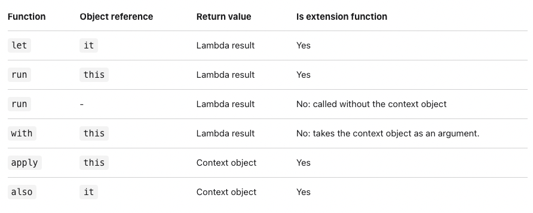

# Scoping Functions

- 개요

## 개요

Scoping function 예시



Scoping function의 종류

```kotlin
inline fun <T, R> with(receiver: T, block: T.() -> R): R {
    return receiver.block()
}
inline fun <T> T.also(block: (T) -> Unit): T {
    block(this)
    return this
}
inline fun <T> T.apply(block: T.() -> Unit): T {
    block()
    return this
}
inline fun <T, R> T.let(block: (T) -> R): R {
    return block(this)
}
inline fun <T, R> T.run(block: T.() -> R): R {
    return block()
}
```

Scoping function의 대표 예시

```kotlin
// also
val numbers = mutableListOf("one", "two", "three")
numbers
    .also { println("The list elements before adding new one: $it") }
    .add("four")

// apply
val adam = Person("Adam").apply {
    age = 32
    city = "London"
}
println(adam)

// run
val service = MultiportService("https://example.kotlinlang.org", 80)

val result = service.run {
    port = 8080
    query(prepareRequest() + " to port $port")
}

// with
val numbers = mutableListOf("one", "two", "three")
with(numbers) {
    println("'with' is called with argument $this")
    println("It contains $size elements")
}

// let1: call chain에서 하나 이상의 함수를 사용할때
val numbers = mutableListOf("one", "two", "three", "four", "five")
numbers.map { it.length }.filter { it > 3 }.let {
    println(it)
    // and more function calls if needed
}

// let2: non-null값일때에만 코드를 실행하기 위해서
val str: String? = "Hello"
//processNonNullString(str)       // compilation error: str can be null
val length = str?.let {
    println("let() called on $it")
    processNonNullString(it)      // OK: 'it' is not null inside '?.let { }'
    it.length
}

// let3: 변수의 스코프를 제한하기 위해서
val numbers = listOf("one", "two", "three", "four")
val modifiedFirstItem = numbers.first().let { firstItem ->
    println("The first item of the list is '$firstItem'")
    if (firstItem.length >= 5) firstItem else "!" + firstItem + "!"
}.uppercase()
println("First item after modifications: '$modifiedFirstItem'")
```

- 구성 요소
  - receiver(수신 객체)
  - lambda(수신 객체 지정 람다)
- 종류 구분법
  - 수신 객체가 어떤식으로 전달 되는지
  - scoping function에 전달된 수신객체가 수신 객체 람다에 어떤 형식으로 전달될것인지
  - scoping function의 최종적인 반환 값이 무엇인지
- 종류
  - 리턴이 receiver
    - `also`
      - receiver를 채널링해서 receiver를 이용한 부작용 실행
    - `apply`
      - receiver의 프로퍼티를 직접 수정하는 등(configure)
  - 리턴이 블록 결과
    - `run`
      - object initialization과 컴퓨테이션을 동시에 할때 유용
    - `with`
      - lambda result없이 컨텍스트 오브젝트를 가지고 함수를 호출할때 유용
    - `let`
      - call chain에서 하나 이상의 함수를 사용할때
      - non-null값일때에만 코드를 실행하기 위해서
      - 변수의 스코프를 제한하기 위해서
