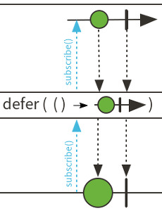
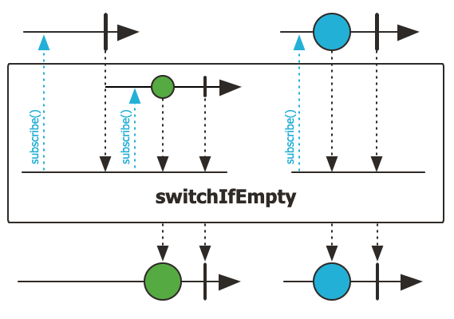
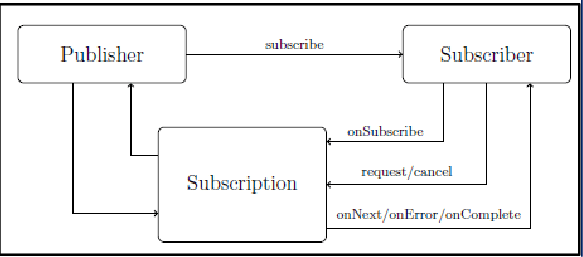

# Reactor

- 의문
- 실전 예제
  - Mono.just vs Mono.defer vs Mono.fromCallable
  - Mono.defer & Mono.switchIfEmpty
- 잘 사용하는 오퍼레이터와 의미
  - block
- 1] Reactive Programming의 소개
  - 1.2 Asynchronicity to the Rescue?
- 2] Reactive Streams의 특징
- 3] Reactor Core Features
  - 3.1 Flux: an Asynchronous Sequence of 0-N Items
  - 3.2 Mono: an Asynchronous 0-1 Result
  - 3.3 Flux, Mono의 간단한 사용 예시
  - 3.4 sequence를 프로그래밍 방식으로 생성하기(generate, create, push)
- 8] Advanced Features and Concepts
  - 8.2 Hot Versus Cold

## 의문

- reactor가 비동기적이라는 것의 의미는, publisher와 이어진 파이프라인이 다른 작업의 영향없이 병렬적으로 실행된다는 것인가?
  - *비동기의 의미?*

## 실전 예제

### Mono.just vs Mono.defer vs Mono.fromCallable

- `Mono.just`
  - instantiation time(eager)에 값을 emit하는 모노를 반환
- `Mono.defer`
  - Mono supplier를 파라미터로 받아서 subscription time(lazy)에 값을 emit하는 모노를 반환
    - 즉, 블록내의 반환값이 모노여야 함
- `Mono.fromCallable`
  - Callable supplier(블록)을 받아서 subscription time(lazy)에 값을 emit하는 모노를 반환

### Mono.defer & Mono.switchIfEmpty

Mono.defer 마블 다이어그램



Mono.switchIfEmpty 마블 다이어그램



Mono.defer와 Mono.switchIfEmpty

```java
...
.switchIfEmpty(Mono.defer{
  // 외부에서 subscribe가 행해졌을때, 처음으로 값을 emit함
  // cold publisher화
})
```

- `Mono.defer { supplier }`
  - defer의 바깥에서 subscribe가 발생한 이후에, defer 내부에서 supplier에 다시 한 번 subscribe
  - 즉, 바깥에서 subscribe할 때에 비로소 supplier에서 값을 emit함
    - 이와 반대로, `Mono.just`는 값을 바로 emit함
- `Mono.switchIfEmpty`
  - 모노가 데이터가 없이 끝난경우, 별도의 모노로 fallback함

## 잘 사용하는 오퍼레이터와 의미

### 에러 처리 관련

- `onErrorResume`
  -

### Synchronization 관련

- `block`
  - this Mono를 구독하고, next 시그널이 수신될 때 까지 무기한 블로킹을 함
  - Mono가 empty로 끝나면, null을 반환하고, 값이 있으면 그 값을 반환
  - 주의
    - reactor 스케줄러가 관리하는 non-blocking 스레드에서 실행되면, 에러가 남

## 1. Reactive Programming의 소개

Reactive Streams 등장인물간 관계도



Reactive Streams 등장인물: Publisher, Subscriber, Subscription, Processor

```java
public interface Publisher<T> {
    public void subscribe(Subscriber<? super T> s);
}

public interface Subscriber<T> {
    public void onSubscribe(Subscription s);
    public void onNext(T t);
    public void onError(Throwable t);
    public void onComplete();
}

public interface Subscription {
    public void request(long n);
    public void cancel();
}

public interface Processor<T, R> extends Subscriber<T>, Publisher<R> {
}
```

- Reactive programming
  - 개요
    - 데이터 스트림 + 비동기 + Observer패턴
      - 프로그래밍 패러다임
  - 특징
    - OOP에서 Observer 디자인 패턴의 확장
      - iterator는 pull-based
      - reactive streams는 push-based
    - publisher / subscriber
    - push된 값은 선언적으로 표현됨
    - signaling
      - publisher(or subscription?)의 새 값 push
        - `onNext`
      - publisher의 에러 시그널링
        - `onError`
      - publisher의 완료 시그널링
        - `onComplete`
- Reactive Streams
  - 개요
    - JVM위의 reactive 라이브러리들을 위한 **인터페이스와 상호작용의 룰의 집합** 을 정의하는 스펙
      - 해당 인터페이스는 Java9에서 `Flow`클래스로 통합됨
  - 등장인물
    - `Publisher`
    - `Subscriber`
    - `Subscription`
    - `Processor`
- Reactor
  - 개요
    - Reactive Programming 패러다임의 구현체
      - Reactive Streams의 구현체

### 1.2 Asynchronicity to the Rescue?

```java
// reactor version
userService.getFavorites(userId)
           .flatMap(favoriteService::getDetails)
           .switchIfEmpty(suggestionService.getSuggestions())
           .take(5)
           .publishOn(UiUtils.uiThreadScheduler())
           .subscribe(uiList::show, UiUtils::errorPopup);

// callback hell equivalent to reactor version
userService.getFavorites(userId, new Callback<List<String>>() {
  public void onSuccess(List<String> list) {
    if (list.isEmpty()) {
      suggestionService.getSuggestions(new Callback<List<Favorite>>() {
        public void onSuccess(List<Favorite> list) {
          UiUtils.submitOnUiThread(() -> {
            list.stream()
                .limit(5)
                .forEach(uiList::show);
            });
        }

        public void onError(Throwable error) {
          UiUtils.errorPopup(error);
        }
      });
    } else {
      list.stream()
          .limit(5)
          .forEach(favId -> favoriteService.getDetails(favId,
            new Callback<Favorite>() {
              public void onSuccess(Favorite details) {
                UiUtils.submitOnUiThread(() -> uiList.show(details));
              }

              public void onError(Throwable error) {
                UiUtils.errorPopup(error);
              }
            }
          ));
    }
  }

  public void onError(Throwable error) {
    UiUtils.errorPopup(error);
  }
});
```

- JVM에서의 async 코드 생성 방법
  - callbacks
    - callback으로 result가 사용가능할 때 작업을 처리
  - futures
    - async 메서드는 `Future<T>`를 즉시 반환함
    - 비동기 프로세스가 T값을 계산하지만, `Future`오브젝트가 해당 값의 접근을 래핑함
      - 값은 바로는 접근 못함
      - 값은 접근 가능할때 가져올 수 있음

## 2. Reactive Streams의 특징

- JVM위의 classic async 접근 방식을 다음과 같은 추가적인 측면에 집중해서 단점을 해결하려 함
  - **Composability / Readability**
  - **Data as a flow**
    - rich voca of operators
      - 사실 오퍼레이터는 Reactive Streams spec에 포함되지 않으나, reactive library들은 다양한 오퍼레이터 지원
    - source(publisher) to consumer(subscriber)
      - publisher로부터 시작된 데이터가 subscriber에서 그 프로세스를 끝냄
  - **subscribe 하기전까지 아무일도 일어나지 않음**
    - subscribing을 하면서 전체 체인에서의 데이터 흐름을 시작하게 함
      - subscriber가 publisher로 하나의 요청 시그널을 보내면서 내부적으로 동작하게 함
  - **Backpressure**
    - consumer가 producer에게 rate of emission이 너무 높다고 신호를 보낼 수 있음
    - subscriber의 모드(push-pull hybrid)
      - unbounded mode
        - publisher가 실현가능한 가장 빠른 속도로 데이터를 push하도록 함
      - request mechanism
        - publisher에게 요청을 보내서 n개의 요소를 가공할 준비가 되었다고 알려주면, 그만큼만 보냄
  - **concurrency-agnostic한 high level but high value 추상화**
  - **Hot vs Cold**
    - Cold sequence
      - 각각의 Subscriber마다 새로 시작
    - Hot sequence
      - late subscriber들은 subscribe한 이후의 시그널을 수신함
        - 몇몇 reactive streams는 캐시해서 과거의 이벤트를 리플레이가능
      - subscriber가 없어도 이벤트를 방출할 수 있음

## 3. Reactor Core Features

- reactor-core
  - 개요
    - Reactive Streams 스펙에 초점을 맞추는 reactive library (자바8 타겟)
    - Publisher를 구현하는 합성가능한 리액티브 타입을 소개하면서, `Flux`, `Mono`와 같은 rich voca도 제공
  - `Flux` object
    - 개요
      - 0..N 아이템의 리액티브 시퀀스를 나타냄
  - `Mono` object
    - 개요
      - (0..1) 결과를 나타냄

### 3.1 Flux: an Asynchronous Sequence of 0-N Items

Flux diagram


- `Flux<T>`
  - 개요
    - 비동기 sequence of 0 to N items를 발산하는 나타내는 표준 `Publisher<T>`
      - 선택적으로 completion signal 혹은 error에 의해서 제거됨
      - 이러한 시그널은 다운스트림 Subscriber의 `onNext`, `onComplete`, `onError`메서드 호출로 변환됨
  - 특징
    - Flux의 operator 처리 중간에 에러가 나도, 이는 전체 흐름의 에러가 아니라, 에러가 난 흐름의 `onError`에서 처리함

### 3.2 Mono: an Asynchronous 0-1 Result

Mono diagram


- `Mono<T>`
  - 개요
    - `onNext`를 통해서 최대 1개의 아이템을 발산하는 특수 특수한 `Publisher<T>`
      - `omComplete`시그널과 함께 제거되거나, `onError`시그널과 함께 제거됨(실패한 Mono)
  - 특징
    - 대부분의 `Mono`구현들은 `onNext`를 호출한 뒤에, `onComplete`를 즉시 호출할 것으로 기대됨
    - *`onNext`와 `onError`의 조합은 명시적으로 금지됨*
      - *그럼 에러 캐치는 어떻게 하나?*
    - 몇몇 연산자는 Mono를 Flux로 변환함
      - `Mono#concatWith(Publisher)`
      - c.f) `Mono#then(Mono)`는 또 다른 Mono를 반환

### 3.3 Flux, Mono의 간단한 사용 예시

Factory method를 사용하여 Flux, Mono 생성

```java
Flux<String> seq1 = Flux.just("foo", "bar", "foobar");

List<String> iterable = Arrays.asList("foo", "bar", "foobar");
Flux<String> seq2 = Flux.fromIterable(iterable);

Mono<String> noData = Mono.empty();

Mono<String> data = Mono.just("foo");

Flux<Integer> numbersFromFiveToSeven = Flux.range(5,3);
```

subscribe method의 활용 예시

```java
// Lambda로 subscriber 생성하기
Flux<Integer> ints = Flux.range(1,4);

ints.subscribe(i -> System.out.println(i), // onNext시에 호출: 각각의 생성된 값과 함께 무엇인가를 행함
  error -> System.err.println("Error " + error), // onError시에 호출: 에러에 대한 반응
  () -> System.out.println("Done"), // onComplete시에 호출: sequence가 성공적으로 끝난 경우에, 코드를 실행
  sub -> sub.request(10) // onSubscribe시에 호출: 10개까지의 source의 요소를 원한다고 전달
);

// BaseSubscriber로 Lambda 대체하기
Flux.range(1, 10)
  .doOnRequest(r -> System.out.println("request of " + r))
  .subscribe(new BaseSubscriber<Integer>() {

    @Override
    public void hookOnSubscribe(Subscription subscription) {
      // demand for one full buffer
      request(1);
    }

    @Override
    public void hookOnNext(Integer integer) {
      System.out.println("Cancelling after having received " + integer);
      cancel();
    }
  })
// request of 1
// Cancelling after having received 1
```

- downstream request를 수정하는 연산자의 다른 카테고리
  - *메서드 의미가 이해가 잘 안됨*
  - `buffer(N)`
  - `prefetch`
  - `limitRate(N)`
    - 최대 N request가 업스트림으로 전파됨

### 3.4 sequence를 프로그래밍 방식으로 생성하기(generate, create, push)

publisher의 프로그래밍 방식 생성 예시: `Flux.generate`

```java
// Synchronous
Flux<String> flux = Flux.generate(
  () -> 0, // initial state
  (state, sink) -> {
    sink.next("3 x " + state + " = " + 3*state); // what to emit(sink)
    if (state == 10) sink.complete(); // when to stop
    return state + 1; // return new state
  },
  (state) -> System.out.println("state: " + state)); // state: 11 (last state value), close db connection과 같은 행동 하면 좋은 장소
```

publisher의 프로그래밍 방식 생성 예시: `Flux.create`

```java
Flux <String> bridge = Flux.create(sink -> {
  myEventProcessor.register(
    new MyEventListener<String>() {
      public void onDataChunk(List<String> chunk) {
        for (String s : chunk) {
          sink.next(s);
        }
      }

      public void processComplete() {
        sink.complete();
      }
    }
  );
});
```

publisher의 프로그래밍 방식 생성 예시: `Flux.push`

```java
Flux<String> bridge = Flux.push(sink -> {
    myEventProcessor.register(
      new SingleThreadEventListener<String>() {

        public void onDataChunk(List<String> chunk) {
          for(String s : chunk) {
            sink.next(s);
          }
        }

        public void processComplete() {
            sink.complete();
        }

        public void processError(Throwable e) {
            sink.error(e);
        }
    });
});
```

hybrid push/pull model

```java
Flux<String> bridge = Flux.create(sink -> {
    myMessageProcessor.register(
      new MyMessageListener<String>() {

        public void onMessage(List<String> messages) {
          for(String s : messages) {
            sink.next(s);
          }
        }
    });
    sink.onRequest(n -> {
        List<String> messages = myMessageProcessor.getHistory(n);
        for(String s : messages) {
           sink.next(s);
        }
    });
});
```

cleaning up after `push()`, `create()`

```java
Flux<String> bridge = Flux.create(sink -> {
    sink.onRequest(n -> channel.poll(n))
        .onCancel(() -> channel.cancel()) // cancel signal only
        .onDispose(() -> channel.close()) // complete, error, or cancel signals
    });
```

- 개요
  - Publisher인 `Flux`, `Mono`를 프로그래밍 방식으로 관련 이벤트인 `onNext`, `onError`, `onComplete`를 정의해서 생성하기
    - sink event를 트리거링 하기 위한 메서드들
- sink의 종류
  - `Flux.generate`
    - 동기 + 싱글스레딩
  - `Flux.create`
    - 비동기 + 멀티스레딩
      - 멀티스레드로부터 매 round마다 다수의 emission 가능
      - OverflowStrategy로 비동기 API들을 bridge할 수 있고, backpressure를 제어 가능
        - IGNORE
          - backpressure를 무시함
        - ERROR
          - downstream이 처리를 못하면, IllegalStateException 에러를 시그널링함
        - DROP
          - downstream이 처리를 못하면, 들어오는 시그널을 드랍함
        - LATEST
          - *downstream이 upstream으로부터 최신 시그널만 받도록 함*
        - BUFFER(default)
          - downstream이 처리를 못하면, 버퍼링함
          - OutOfMemoryError가 생길 위험 존재
  - `Flux.push`
    - 비동기 + 싱글스레딩
      - create와 유사하나, 하나의 producing thread만 next, complete, error를 호출 가능

### 3.5 Threading and Schedulers

- 개요
  - 기본적으로, Reactor는 concurrency와는 독립적
    - 하지만, 라이브러리차원에서 concurrency를 지원
- Scheduler
  - 개요
    - 실행 모델(type)과 실행이 일어나는 장소를 결정
    - `ExecutorService`와 유사하게 스케쥴링 역할을 담당
  - static methods
    - `Schedulers.immediate()`
      - Runnable이 현재 스레드에서 바로 실행됨
        - 사실상 스케쥴러가 아무 역할도 안함
    - `Schedulers.single()`
      - 다수의 호출을 처리하는 하나의 재사용 가능한 스레드
    - `Schedulers.newSingle()`
      - 매 호출당 스레드 할당
    - `Schedulers.elastic()`
      - 사용하지 말자(스레드 개수 제한이 없음)
    - `Schedulers.boundedElastic()`
      - 워커 풀을 생성해서 idle인 워커를 재사용함
      - 너무 오랫동안 idle인 워커 풀을 dispose함
      - 스레드 개수 제한이 존재
        - default
          - CPU코어 x 10
      - blocking 처리를 다룰 때 좋음
    - `Schedulers.parallel()`
      - 병렬 처리를 위하여 최적화된 워커 풀 사용
      - CPU 코어만큼만 워커 생성

## 8. Advanced Features and Concepts

### 8.2 Hot Versus Cold

- 개요
  - publisher의 두 종류
    - cold
      - 각 subscription마다 새로 데이터를 생성함
        - subscription이 없으면 데이터 생성도 없음
    - hot
      - subscription과 상관없이 바로 데이터를 emit할 수 있음
        - subscriber는 subscribe이후에 새로 emit된 요소들만 볼 수 있음
      - 예시
        - `just`
          - 어셈블리 타임에 캡쳐된 값을 나중에 구독하는 모든 subscriber에게 emit함
  - 변환
    - hot -> cold
      - `defer`이용
        - HTTP 리퀘스트를 subscription time에 하도록 연기
        - 각 새로운 구독마다 별도의 네트워크 요청을 함
    - cold -> hot
      - `share`, `replay`이용
