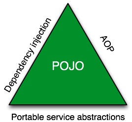

# Spring

- 의문
- 개요
  - 스프링의 배경
  - 스프링의 정의
  - 스프링의 특징
- Bean

## 의문

## 개요

### 스프링의 배경

스프링 트라이앵글

- 배경
  - 복잡도를 다루자
- 복잡도의 분류
  - 기술적인 복잡도
    - 기술의 접근 방식이 특정 환경에 종속적
    - 서비스 추상화로 해결함(Portable Service Abstraction)
  - 도메인의 복잡도
    - 기술적인 처리를 담당하는 코드가 성격이 다른 코드에 섞여서 등장
    - AOP로 해결(Aspect Oriented Programming)
      - *왜, Aspect일까?*
    - 도메인 로직은 오직, POJO와 강력한 자바의 OOP로 해결해보자!
    - c.f) DDD, Layered Architecture
  - 위의 두 복잡돌르 해결하기 위한 추상화, AOP는 DI가 있어야 해결 가능

### 스프링의 정의

- 정의
  - 자바 엔터프라이즈 개발을 편하게 해주는 오픈소스 경량급 애플리케이션 프레임워크

### 스프링의 특징

- 비침투적
  - 기술의 적용 사실이 코드에 직접 반영되지 않음
  - 기술과 도메인 로직의 분리

## Bean

- 개요
  - Spring IoC 컨테이너가 관리하는 자바 객체
  - `ApplicationContext.getBean()`으로 얻어질 수 있는 객체
- 등록 방법
  - 1 Component Scanning
    - `@SpringBootApplication`
      - `@ComponentScan`
        - 어디서부터 컴포넌트를 찾아볼 것인지 알려줌
        - `@Component`애노테이션 or `@Component`애노테이션을 사용하는 다른 애노테이션이 붙은 클래스를 찾음
  - 빈 설정파일에 직접 빈을 등록
    - 2 자바 설정 파일
      - 클래스에 `@Configuration`애노테이션을 붙이고, 그 안에 `@Bean` 애노테이션을 사용해서 직접 빈을 정의
        - 환경변수에 따라서, 다른 빈을 주입할 때에 사용
          - `@Configuration`애노테이션 자체도 `@Component`를 사용하므로, `@ComponentScan`의 스캔 대상이 되고, 그에 따라 빈 설정파일이 읽힐 때, 그 안에 정의된 빈들이 IoC 컨테이너에 등록됨
    - 3 XML
      - 요즘은 잘 사용하지 않음
