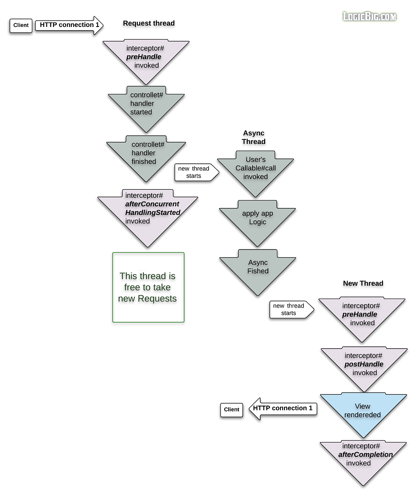

# Spring Interceptor

- 의문
- 개요
  - Async interceptor

## 의문

## 개요

### Async interceptor

- Request 스레드
  - `preHandle`
    - ServletRequest#getDispatcherType() call is "REQUEST"
  - controller handler started
  - controller handler finished
  - `afterConcurrentHandlingStarted` (이미 async thread에서 callback이 실행된 상태)
    - thread-bound 속성을 클린업하는 태스크를 행하는 타이밍
- Async 스레드
  - Callable call invoked
  - apply app logic
  - async finished
- New 스레드
  - `preHandle`
    - ServletRequest#getDispatcherType() call is "ASYNC"
  - `postHandle`
  - `View rendered`
    - 여기서 client로 HTTP response보냄
  - `afterCompletion`

위의 다이어그램에서 `@Transactional`어노테이션은 스레드 바운드의 속성을 갖으므로, Request 스레드에서는 실행이 되는데,
Async 스레드나, New 스레드에서는 실행되지 않음
그래서 suspend function이 아닌, Deferred로 사용하라고 하는것임
