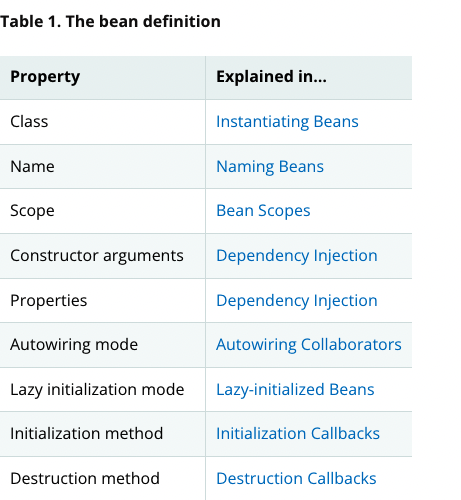

# Spring IOC

- 의문
- 개요

## 의문

## 개요

- Bean
  - 개요
    - 스프링 IoC 컨테이너에의해서 관리되는 애플리케이션의 로직을 담당하는 오브젝트
  - 특징
    - IoC 컨테이너에 의해서 관리되고, 조합되고, 이니셜라이징되는 오브젝트
      - 이런 특징이 없으면 그냥 하나의 오브젝트에 불과
    - 빈과 빈들의 의존 관계는 컨테이너가 사용하는 configuration metadata에 의해서 반영됨
- DI
  - 개요
    - 컨테이너가 dependency들을 주입하여 bean을 생성
  - 스프링
    - `org.springframework.beans`, `org.springframework.context` 패키지가 스프링 프레임워크의 IoC 컨테이너
- 스프링 IoC 컨테이너의 종류
  - `BeanFactory`
    - `BeanFactory`인터페이스가 어떤 타입의 오브젝트도 configuration할 수 있는 매커니즘 갖고 있음
  - `ApplicationContext`
    - `ApplicationContext`는 `BeanFactory`의 sub-interface(`BeanFactory`기능 + 엔터프라이스 특정 기능추가)
      - *스프링 AOP* 기능과 쉬운 연동
      - *Message resource handling*
      - *Event publication*
      - Application-layer specific한 context가 추가됨

### 컨테이너 개요

스프링 IoC 컨테이너(POJO는 클래스를 나타냄)

- `org.springframework.context.ApplicationContext` 인터페이스
  - 개요
    - 스프링 IoC 컨테이너를 나타내고, 빈들의 시작, configure, 조합을 담당
      - 조합법은 configuration metadata로부터 주입받음
      - XML, java annotation, java code
    - configuration metadata
      - 애플리케이션을 구성하는 오브젝트를 나타냄
      - 오브젝트간의 상호 의존관계를 나타냄
  - 특징
    - 스프링이 기본적으로 제공하는 `ApplicationContext`의 구현체
      - `ClassPathXmlApplicationContext`
      - `FileSystemXmlApplicationContext`

### Bean 개요

BeanDefinition의 내용

- 개요
  - 스프링 IoC 컨테이너가 관리하는 애플리케이션의 로직을 담당하는 오브젝트
  - IoC 컨테이너가 configuration metadata로부터 생성함
    - 컨테이너 내부에서는 `BeanDefinition`오브젝트로 나타나짐
- 특징
  - Bean metadata와 수동으로 추가되는 singleton instance는 가능한 빨리 등록되어야 함
  - 런타임에 등록하는 것은 지원은 되지만, 문제가 생길 여지가 존재
- 참고)
  - `ApplicationContext`는 컨테이너 외부에서 생성된 존재하는 오브젝트를 등록할 수 있도록 함
    - ApplicationContext의 구현체에서 `getBeanFactory()`를 호출하고 나온 `DefaultListableBeanFactory`에서 `registerSingleton(..)` or `registerBeanDefinition(..)`으로 등록 가능
- Bean
  - 특징
    - 런타임 타입을 결정하기가 까다로움 metadata definition은 첫 클래스 참조만 확인해주고, 나중에 `FactoryBean`의 메서드를 통해서 결합될 수 있기때문
      - 그래서 `BeanFactory.getType`을 사용하길 권장
      - 위의 모든 내용을 고려하고, `BeanFactory.getBean`의 반환 오브젝트 타입을 나타내줌
  - 라이프 사이클
    - **Instantiating**
      - IoC 컨테이너가 configuration metadata(프로그램 내부적으로는 `BeanDefinition`)를 보고 오브젝트를 생성하는 것
      - nested class도 생성가능
        - `SomeThing`클래스 내부에 `OtherThing`이라는 nested static class가 있는 경우
      - DI를 사용해서 bean 생성(POJO)
        - IoC이기도 함
          - bean자체가 본인의 dependency를 알고있는게 아니라, 외부로부터 주입받으므로
        - 종류
          - Constructor-based
            - constructor 호출
            - static factory method 호출
          - Setter-based
            - `lateinit var`를 사용한 경우
          - Consturctor-based, Setter-based 둘다 `BeanDefinition`에서 의존을 configure할 수 있음
        - Consturctor-based vs Setter-based
          - 일반적으로 constructor based를 선호함
            - 컴포넌트를 immutable하게 하고, 의존하는것들이 null이 아닌것임을 보장함
            - client가 해당 컴포넌트를 사용할때, 항상 fully-initialized된 것을 보장
          - setter-based를 사용하는 경우
            - optional dependency의 경우
      - bean이 생성되는 시점(`Bean Scope`)
        - pre-instantiated
          - 컨테이너 생성시
        - requested
          - 필요할 경우
      - Dependency Resolution Process
        - `ApplicationContext`가 생성되고, configuration metadata(XML or java code or annotations)와 함께 initialized됨
        - 각각의 bean에 대해서, dependency가 프로퍼티, constructor arguments, static-factory method의 arguments로 표현됨
        - 이러한 dependency들이 생성시 bean에 제공됨
          - 각 프로퍼티나 constructor argument가 value이거나 컨테이너에 들어있는 다른 bean의 참조일 수 있음
            - value의 경우, 지정한 format으로 스프링에서 알아서 변환(`int`, `long`, `String`, `boolean`)
