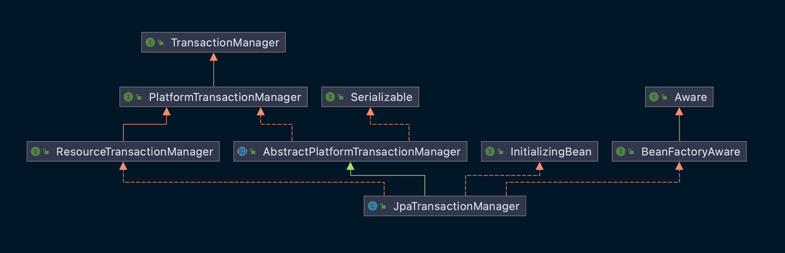

# Spring data-jpa

- 의문
- TransactionManager
- Annotations
  - Transactional

## 의문

## TransactionManager

*어디까지가 스프링에서 해주고, 어디까지가 jpa가 해주는건지 명확화 하면 좋을듯*

JPA transaction manager

- `TransactionManager`
  - 개요
    - spring transaction manager 의 최상위 인터페이스(아무 동작 없음)
    - spring에서 하나의 트랜잭션의 생성, 커밋, 롤백과 같은 라이프사이클을 관리하기위한 매니저
- `PlatformTransactionManager`
  - 개요
    - spring의 imperative transaction 인프라에서의 중심이 되는 인터페이스
    - 직접 사용하는 용도가 아니라, `TransactionTemplate`나 `AOP`를 이용해서 사용
    - 이걸 직접 구현하기 보다는 `AbstractPlatformTransactionManager`클래스가 미리 propagation behaviour와 synchronization handling을 구현했으니 그걸 상속받아서 구현하는걸 추천
  - API
    - `TransactionStatus getTransaction(@Nullable TransactionDefinition definition)`
    - `void commit(TransactionStatus status) throws TransactionException;`
    - `void rollback(TransactionStatus status) throws TransactionException;`
- `AbstractPlatformTransactionManager`
  - 개요
    - spring의 표준 트랜잭션 워크플로우를 구현한 추상 베이스 클래스
      - `PlatformTransactionManager`의 구현체
  - 다루는 워크 플로우
    - 현재 트랜잭션 존재 여부 확인
    - 적절한 propagation 행동을 적용
    - 트랜잭션을 중지시키거나 재개함
    - 커밋시 rollback-only 플래그 확인
      - rollback-only 플래그는 트랜잭션 내부에서 런타임 에러가 발생했을시에 설정됨
    - 롤백시 적절한 수정을 적용
    - 등록된 synchronization callback들을 트리거함
      - c.f) transaction synchronization
        - 트랜잭션 완료시에 호출되는 콜백들을 등록하는 매커니즘
        - 트랜잭션 내에서 열려 있는 리소스를 트랜잭션 완료 시간에 닫기 위해서 등록
- `ResourceTransactionManager`
  - 개요
    - `PlatformTransactionManager`를 확장한 인터페이스로, 하나의 네이티브 리소스 트랜잭션 매니저를 지칭
      - 하나의 단일 DB(리소스)를 지칭
      - c.f) JTA transaction manager는 복수개의 트랜잭션 리소스를 다루는 XA트랜잭션을 사용
- `JpaTransactionManager`
  - 개요
    - 단일 JPA EntityManagerFactory를 위한 PlatformTransactionManager의 구현체
    - 해당 factory의 JPA EntityManager를 스레드로 바인딩함
      - factory당 하나의 thread-bound EntityManager를 가능하게 함
      - => persistenceContext도 스레드 바운드하게 됨

### 회사에서는 TransactionManager를 어떻게 사용하고 있는가?

## Annotations

### Transactional

- 개요
  - 하나의 메서드나 클래스 트랜잭션 속성을 부여
- 특징
  - 클래스 레벨로 어노테이션이 된 경우
    - 클래스와 서브클래스의 모든 메서드에 적용
    - 조상 메서드에 적용하려면, 재선언해줘야 함
  - `RuntimeException`이나 `Error`가 발생했을 경우 롤백이 됨
    - checked exception의 경우에는 롤백하지 않음
  - `PlatformTransactionManager`에 의해서 thread-bound로 관리됨
    - 해당 트랜젝션을 현재 **실행중인 스레드 내에서** 모든 데이터 접근 연산들에게 노출함
      - 그렇기 때문에 컨트롤러에서 `suspend function`과 `Transactional`을 같이 사용하지 못함
        - 중간에 디스패쳐에 의해서 스레드가 변경될 수 있으므로
- 속성
  - `TransactionDefinition`
    - 개요
      - spring-compliant transaction 속성을 나타내는 인터페이스
        - propagation
        - isolation level
    - propagation 속성
      - `PROPAGATION_REQUIRED`
        - 디폴트 속성
        - 부모 트랜잭션 그대로 사용 / 부모 트랜잭션 없으면 새로 만듬
      - `PROPAGATION_REQUIRES_NEW`
        - 부모 트랜잭션 있으면 해당 부모 트랜잭션 중지시키고 새 트랜잭션 생성 / 부모 트랜잭션 없으면 새로 만듬
      - `PROPAGATION_SUPPORTS`
        - 부모 트랜잭션 그대로 사용 / 부모 트랜잭션 없으면 트랜잭션 없이 동작
        - *이건 어따가 씀?*
      - `PROPAGATION_MANDATORY`
        - 부모 트랜잭션 그대로 사용 / 부모 트랜잭션 없으면 exception 발생
      - ... 일단 이렇게만 알아두자
- c.f) Transaction
- c.f) `PlatformTransactionManager`
- c.f) `ReactiveTransactionManager`
  - 개요
    - 같은 리액티브 파이프라인속에서 같은 리액터 컨텍스트 내부에서 데이터 접근이 실행되어야 만 함
