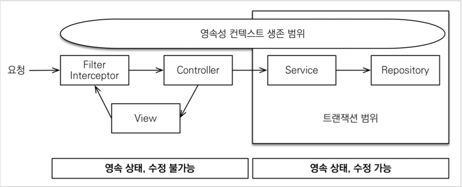
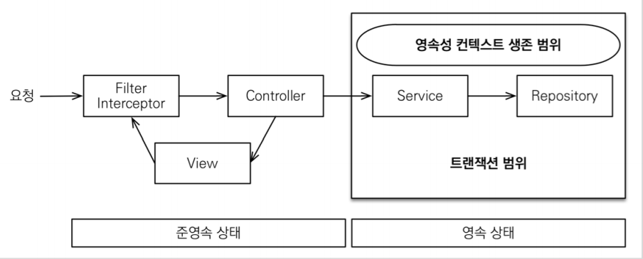

# Spring data-jpa

- 의문
- Entity
- TransactionManager
- Annotations
  - Transactional
- OSIV(Open Session In View)

## 의문

## Entity

엔티티 코드 예시

```kotlin
@Entity
class User(
    @get:Id
    @get:GeneratedValue(generator = "id")
    @get:GenericGenerator(
        name = "id",
        strategy = IdGenerators.LongString,
        parameters = [
            Parameter(name = IdGenerators.Params.PREFIX, value = IdPrefix.user),
        ],
    )
    @get:Column(length = 16, nullable = false)
    var id: String? = null,

    @get:Column(length = 128, nullable = false)
    var code: String,

    @get:OneToOne(fetch = FetchType.LAZY)
    @get:JoinColumn(name = "user_setting_id", nullable = false)
    var setting: UserSetting,

    @get:Column(nullable = false)
    var createdAt: Instant,

    @get:Column(nullable = false)
    var lastAccessedAt: Instant
)

//

@Entity
class UserSetting(
    @get:Id
    @get:GeneratedValue(strategy = GenerationType.IDENTITY)
    var id: Long? = null,

    @get:OneToOne(fetch = FetchType.LAZY, mappedBy = "setting")
    var user: User? = null,

    @get:Column(name = "is_background_music_on", nullable = false)
    var isBackgroundMusicOn: Boolean,

    @get:Column(nullable = false)
    var updatedAt: Instant
) {
    companion object {
        fun createDefault(now: Instant): UserSetting {
            return UserSetting(
                isBackgroundMusicOn = true,
                updatedAt = now,
            )
        }
    }
}
```

- 위 코드 해석
  - `@Entity`
    - JPA에서 해당 클래스가 Entity임을 나타내는 어노테이션
  - `@GeneratedValue(generator = "id")` & `@get:GenericGenerator(...)`
    - `IdGenerators.LongString` 패키지로 정의된 ID generator를 id라는 generator로 정의하고, 해당 id라는 generator를 엔티티의 ID generator로 사용함
  - `@get:OneToOne(fetch = FetchType.LAZY)` & `@JoinColumn`
    - 외래키를 갖는 관계의 주인으로, Join을 할 시에는 해당 외래키로 join함
  - `@get:OneToOne(fetch = FetchType.LAZY, mappedBy = "setting")`
    - 외래키가 없는 관계의 주인이 아님
    - 주인 entity의 setting property에 매핑됨

## TransactionManager

*어디까지가 스프링에서 해주고, 어디까지가 jpa가 해주는건지 명확화 하면 좋을듯*

JPA transaction manager


- `TransactionManager`
  - 개요
    - spring transaction manager 의 최상위 인터페이스(아무 동작 없음)
    - spring에서 하나의 트랜잭션의 생성, 커밋, 롤백과 같은 라이프사이클을 관리하기위한 매니저
- `PlatformTransactionManager`
  - 개요
    - spring의 imperative transaction 인프라에서의 중심이 되는 인터페이스
    - 직접 사용하는 용도가 아니라, `TransactionTemplate`나 `AOP`를 이용해서 사용
    - 이걸 직접 구현하기 보다는 `AbstractPlatformTransactionManager`클래스가 미리 propagation behaviour와 synchronization handling을 구현했으니 그걸 상속받아서 구현하는걸 추천
  - API
    - `TransactionStatus getTransaction(@Nullable TransactionDefinition definition)`
    - `void commit(TransactionStatus status) throws TransactionException;`
    - `void rollback(TransactionStatus status) throws TransactionException;`
- `AbstractPlatformTransactionManager`
  - 개요
    - spring의 표준 트랜잭션 워크플로우를 구현한 추상 베이스 클래스
      - `PlatformTransactionManager`의 구현체
  - 다루는 워크 플로우
    - 현재 트랜잭션 존재 여부 확인
    - 적절한 propagation 행동을 적용
    - 트랜잭션을 중지시키거나 재개함
    - 커밋시 rollback-only 플래그 확인
      - rollback-only 플래그는 트랜잭션 내부에서 런타임 에러가 발생했을시에 설정됨
    - 롤백시 적절한 수정을 적용
    - 등록된 synchronization callback들을 트리거함
      - c.f) transaction synchronization
        - 트랜잭션 완료시에 호출되는 콜백들을 등록하는 매커니즘
        - 트랜잭션 내에서 열려 있는 리소스를 트랜잭션 완료 시간에 닫기 위해서 등록
- `ResourceTransactionManager`
  - 개요
    - `PlatformTransactionManager`를 확장한 인터페이스로, 하나의 네이티브 리소스 트랜잭션 매니저를 지칭
      - 하나의 단일 DB(리소스)를 지칭
      - c.f) JTA transaction manager는 복수개의 트랜잭션 리소스를 다루는 XA트랜잭션을 사용
- `JpaTransactionManager`
  - 개요
    - 단일 JPA EntityManagerFactory를 위한 PlatformTransactionManager의 구현체
    - 해당 factory의 JPA EntityManager를 스레드로 바인딩함
      - factory당 하나의 thread-bound EntityManager를 가능하게 함
      - => persistenceContext도 스레드 바운드하게 됨

### 회사에서는 TransactionManager를 어떻게 사용하고 있는가?

## Annotations

### Transactional

- 개요
  - 하나의 메서드나 클래스 트랜잭션 속성을 부여
- 특징
  - 클래스 레벨로 어노테이션이 된 경우
    - 클래스와 서브클래스의 모든 메서드에 적용
    - 조상 메서드에 적용하려면, 재선언해줘야 함
  - `RuntimeException`이나 `Error`가 발생했을 경우 롤백이 됨
    - checked exception의 경우에는 롤백하지 않음
  - `PlatformTransactionManager`에 의해서 thread-bound로 관리됨
    - 해당 트랜젝션을 현재 **실행중인 스레드 내에서** 모든 데이터 접근 연산들에게 노출함
      - 그렇기 때문에 컨트롤러에서 `suspend function`과 `Transactional`을 같이 사용하지 못함
        - 중간에 디스패쳐에 의해서 스레드가 변경될 수 있으므로
- 속성
  - `TransactionDefinition`
    - 개요
      - spring-compliant transaction 속성을 나타내는 인터페이스
        - propagation
        - isolation level
    - propagation 속성
      - `PROPAGATION_REQUIRED`
        - 디폴트 속성
        - 부모 트랜잭션 그대로 사용 / 부모 트랜잭션 없으면 새로 만듬
      - `PROPAGATION_REQUIRES_NEW`
        - 부모 트랜잭션 있으면 해당 부모 트랜잭션 중지시키고 새 트랜잭션 생성 / 부모 트랜잭션 없으면 새로 만듬
      - `PROPAGATION_SUPPORTS`
        - 부모 트랜잭션 그대로 사용 / 부모 트랜잭션 없으면 트랜잭션 없이 동작
        - *이건 어따가 씀?*
      - `PROPAGATION_MANDATORY`
        - 부모 트랜잭션 그대로 사용 / 부모 트랜잭션 없으면 exception 발생
      - ... 일단 이렇게만 알아두자
- c.f) Transaction
- c.f) `PlatformTransactionManager`
- c.f) `ReactiveTransactionManager`
  - 개요
    - 같은 리액티브 파이프라인속에서 같은 리액터 컨텍스트 내부에서 데이터 접근이 실행되어야 만 함

## OSIV(Open Session In View)

OSIV ON



OSIV OFF



- 개요
  - spring jpa에서 영속성 컨텍스트(세션)와 데이터베이스 커넥션을 뷰까지 열어두는 기능
    - 트랜잭션이 아님!
    - 뷰까지 영속성 컨텍스트가 살아있으면, 지연 로딩 사용 가능
  - 사용자의 요청 시점에서 영속성 컨텍스트가 생성되고, 트랜잭션은 사용될때 생성됨, 추후에 트랜잭션이 끝나도 응답이 끝날때까지 영속성 컨텍스트가 유지
    - 트랜잭션이 없어도 읽기는 가능한데 이는 Nontransactional Read임
- 동작
  - 클라이언트의 요청이 들어오면 서블릿 필터나, 스프링 인터셉터에서 영속성 컨텍스트를 생성한다. 단 이 시점에서 트랜잭션은 시작하지 않는다.
  - 서비스 계층에서 @Transeactional로 트랜잭션을 시작할 때 1번에서 미리 생성해둔 영속성 컨텍스트를 찾아와서 트랜잭션을 시작한다.
  - 서비스 계층이 끝나면 트랜잭션을 커밋하고 영속성 컨텍스트를 플러시한다. 이 시점에 트랜잭션은 끝내지만 영속성 컨텍스트는 종료되지 않는다.
  - 컨트롤러와 뷰까지 영속성 컨텍스트가 유지되므로 조회한 엔티티는 영속 상태를 유지한다.
  - 서블릿 필터나, 스프링 인터셉터로 요청이 돌아오면 영속성 컨텍스트를 종료한다. 이때 플러시를 호출하지 않고 바로 종료한다.
- 단점
  - 오랫동안 데이터베이스 커넥션 리소스를 사용함(영속성 컨텍스트가 종료될 때까지 계속 커넥션을 유지)
    - 그럼 OSVI가 꺼진 상태에서 트랜잭션을 커밋하면 커넥션을 유지하지 않는것인가?
      - 그렇다
  - 같은 영속성 컨텍스트를 여러 트랜잭션이 공유하게 될 수 있음
- c.f) OSIV가 꺼져있을 경우
  - 트랜잭션 종료시, 영속성 컨텍스트를 닫고, 데이터베이스 커넥션도 반환함
    - 커넥션 리소스를 낭비하지 않음
