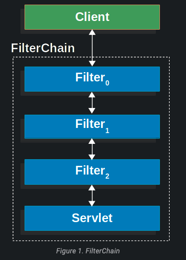
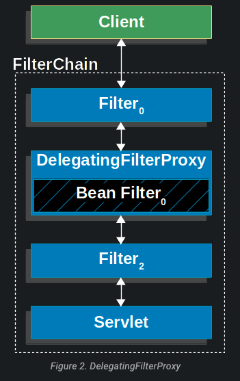
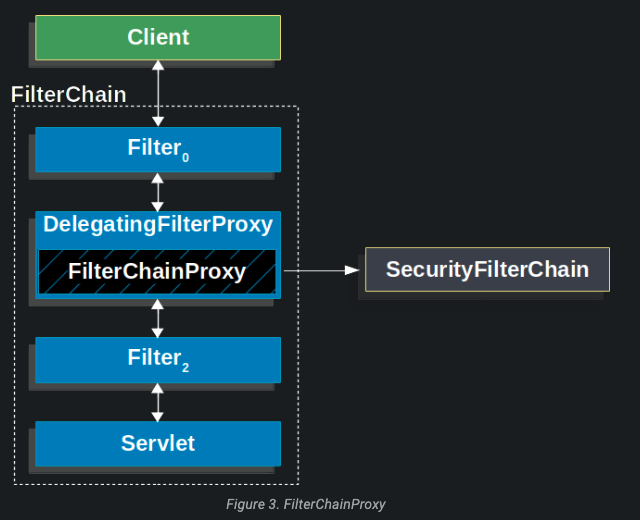
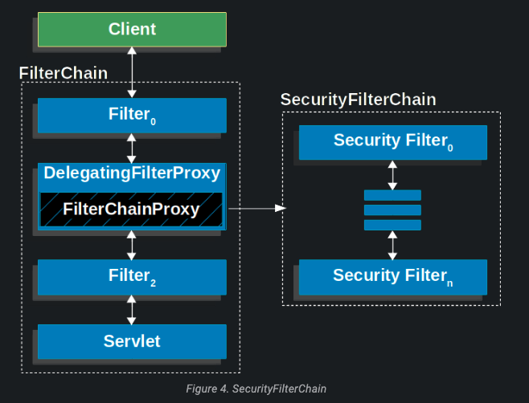
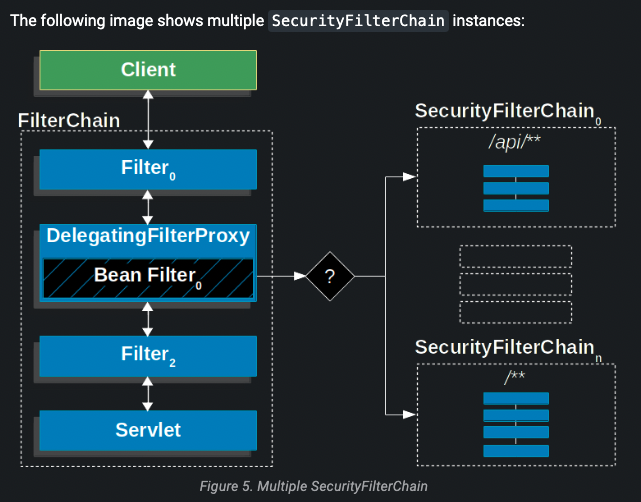
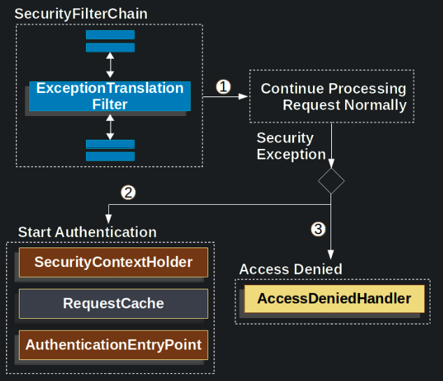
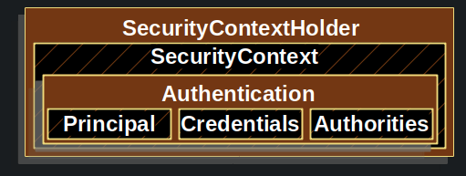

# Spring Security

- 의문
- Servlet 개요
  - DelegatingFilterProxy
  - FilterChainProxy
  - SecurityFilterChain
  - Security Exception Handling
- Authentication

## 의문

## Servlet 개요

Servlet filter chain



필터 코드 예시

```kotlin
fun doFilter(request: ServletRequest, response: ServletResponse, chain: FilterChain) {
    // do something before the rest of the application
    chain.doFilter(request, response) // invoke the rest of the application
    // do something after the rest of the application
}
```

- 개요
  - Servlet Filter Chain 기반

### DelegatingFilterProxy

DelegatingFilterProxy의 구조



DelegatingFilterProxy 코드 예시

```kotlin
fun doFilter(request: ServletRequest, response: ServletResponse, chain: FilterChain) {
	// Lazily get Filter that was registered as a Spring Bean
	// For the example in DelegatingFilterProxy delegate is an instance of Bean Filter0
	val delegate: Filter = getFilterBean(someBeanName)
	// delegate work to the Spring Bean
	delegate.doFilter(request, response)
}
```

- 개요
  - Servlet컨테이너의 라이프 사이클과 Spring의 `ApplicationContext`를 이어주는 브릿지 필터
    - 기존 Servlet 컨테이너는 Spring-defined Bean은 알지 못하나, `DelegatingFilterProxy`를 등록하면, 모든 일을 `Filter`를 구현하는 Spring Bean으로 delegate할 수 있음
    - Filter bean 인스턴스의 look up을 딜레이해서, Spring Bean이 전부 initialize되기 전에 미리 servlet 필터로 등록 가능

### FilterChainProxy

FilterChainProxy의 구조



- 개요
  - 특수한 `Filter`로 `SecurityFilterChain`을 통해서 많은 `Filter`인스턴스를 delegating가능
    - `FilterChainProxy`자체는 Bean이므로, `DelegatingFilterProxy`로 래핑되어있음

### SecurityFilterChain

SecurityFilterChain의 구조



Multiple SecurityFilterChain의 구조



- 개요
  - `SecurityFilterChain`은 `FilterChainProxy`가 어떤 Spring Security `Filter`인스턴스들을 현재 리퀘스트에서 호출해야하는지 정하는데에 사용됨
    - `SecurityFilterChain`에 있는 `Securiy Filters`는 일반적으로 Bean이나, `FilterChainProxy`에 등록됨
- 특징
  - 디버깅 포인트를 `FilterChainProxy`로 지정하면, 쉽게 디버그 할 수 있음
  - `Filter`는 특정 URL에만 기반해서 호출되나, `FilterChainProxy`는 `HttpServletRequest`의 어떤것이든 기반해서 호출 가능
  - Multiple SecurityFilterChain도 가능함
    - `FilterChainProxy`가 어떤 `SecurityFilterChain`을 호출해야하는지 결정함
  - 자체적으로 제공하는 Security Filter가 존재함
    - e.g)
      - `CorsFilter`
      - `CsrfFilter`
      - `BearerTokenAuthenticationFilter`

### Security Exception Handling

Security Exception Handling 구조



위 구조의 대략적인 코드 구성

```java
try {
	filterChain.doFilter(request, response);
} catch (AccessDeniedException | AuthenticationException ex) {
	if (!authenticated || ex instanceof AuthenticationException) {
		startAuthentication();
	} else {
		accessDenied();
	}
}
```

- 개요
  - `ExceptionTranslationFilter`는 `AccessDeniedException`과 `AuthenticationException`을 HTTP response로 변환함
    - `ExceptionTranslationFilter`는 `FilterChainProxy`에 `Security Filters`중 하나로 등록됨

## Authentication

- `SecurityContextHolder`
  - authenticated된 사람에 대한 정보를 저장하는 곳
- `SecurityContext`
  - 현재 authenticated된 유저의 `Authentication`을 갖고 있으며, `SecurityContextHolder`로부터 얻을 수 있음
- `Authentication`
  - `AuthenticationManager`에 인증하기 위한 자격을 입력값으로 보내주거나, `SecurityContext`에서 현재 사용자를 제공하기 위함 `AuthenticationManager`에 대한 입력이 될 수 있음
- `GrantedAuthority`
  - `Authentication`주체에 대해서 부여된 권한
- `AuthenticationManager`
  - Spring Security의 필터들이 authentication을 어떻게 할것인가를 정의한 API
- `ProviderManager`
  - `AuthenticationManager`의 가장 일반적인 구현
- `AuthenticationProvider`
  - `ProviderManager`에 의해서 특정 타입의 인증을 실행하기 위해서 사용됨
- `RequestCrednetials with AuthenticationEntryPoint`
  - 클라이언트로부터 credential을 요청하기 위해서 사용됨
    - e.g) 로그인 페이지로 리다이렉트, `WWW-Authenticate` response를 반환하는 등
- `AbstractAuthenticationProcessingFilter`
  - 인증을 위해서 사용되는 기본 `Filter`

### SecurityContextHolder

SecurityContextHolder의 구조



- 특징
  - default는 `ThreadLocal`을 사용
    - 매 리퀘스트가 끝날때마다 `FilterChainProxy`가 `SecurityContext`가 언제나 clear되도록 해줌
    - `MODE_GLOBAL`, `MODE_INHERITABLETHREADLOCAL`, `MODE_THREADLOCAL(default)`등이 있음

### Authentication

- 개요
  - 두가지 목적
    - `AuthenticationManager`의 input으로, 주어진 credentials로 authenticate를 진행
      - 이 시나리오로 진행될경우, `isAuthenticated()`는 false를 반환
    - 현재 authenticated된 user를 반환
  - 포함되는 오브젝트
    - `principal`
      - 유저가 누군지를 식별
      - username/password를 사용하여 인증할 경우, 일반적으로 `UserDetails`의 인스턴스가 됨
    - `credentials`
      - 주로 password인 경우가 많음
    - `authorities`
      - 유저가 받은 하이레벨 권한이며, `GrantedAuthority`의 인스턴스
      - e.g)
        - roles, scopes

### GrantedAuthority
