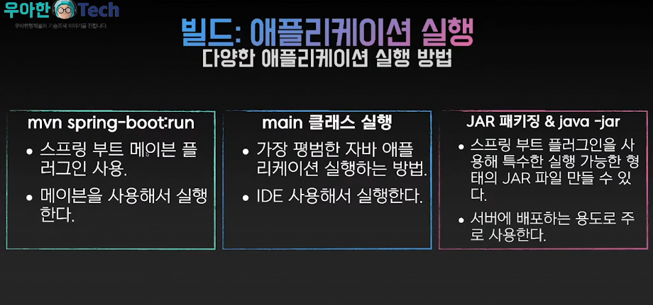

# Spring Boot

- 의문
- 개요

## 의문

- JAR(Java ARchive)
- WAR(Web application ARchive)

## 개요

- 개요
  - 스프링을 손쉽게 쓰기 위해 제공해주는 툴
  - c.f) 스프링
    - 자바 엔터프라이즈 애플리케이션 개발을 편리하게 하기위해 개발된 툴
- 스프링 부트가 다루는 영역
  - 애플리케이션 개발 관련 거의 모든 영역
    - 빌드
      - 프로젝트 생성
      - 의존성 관리
      - 애플리케이션 패키징 및 실행
    - 코딩
      - 개발 툴 제공
      - 자동 설정
      - 외부 설정
    - 배포 및 관리
      - 도커 이미지 생성
      - Actuator
      - 스프링 부트 어드민

### 스프링 부트 빌드

- 스프링 부트 버전
  - GA
    - stable버전
  - M4
    - 배포는 됐는데, 아직 stable은 아님
  - SNAPSHOT
    - 개발중
- 프로젝트 메타데이터
  - group, artifact, version의 조합으로 구분 가능
- 스프링 부트에서 알아서 특정 라이브러리의 적절한 버전을 지정 가능(`dependency-management`)

### 애플리케이션 실행

빌드: 애플리케이션 실행

- `gradlew`
- main 클래스 실행
- JAR 패키징 & java -jar
  - JAR 패키징
    - `gradle bootjar`
      - build 폴더가 생김
  - 실행(예시)
    - `java -jar demo-0.0.1-SNAPSHOT.jar`
